# Machine-Level Programming — Intro, Architecture & The Compilation Pipeline
*(Based on Lecture Transcript 1)*

---

## 1. Overview

This is the foundational lecture. It covers:

1. Why processors stopped just getting "faster" and started getting **more parallel**.
2. **ISA vs. Microarchitecture** — the contract vs. the implementation.
3. The **programmer's view** of a processor (registers, memory, ALU).
4. The full **pipeline from C source → running program**: preprocessor → compiler → assembler → linker.
5. **Static vs. dynamic linking**.
6. Basic **x86 registers** and the **move** instruction.

---

## 2. Why Processors Went Parallel (History in 30 Seconds)

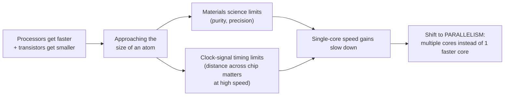

| Old strategy | New strategy |
|---|---|
| Make **one core** faster and faster each generation | Add **more cores**, each independently clocked |
| More transistors → higher single-thread speed | More transistors → more parallel units |
| High energy cost as speed increases | Better performance-per-watt (critical for phones/laptops) |

> **Moore's Law** (paraphrased, not exact): transistor density roughly doubles every ~18–24 months. It used to describe *raw speed* gains; today it's more about *parallelism* gains.

---

## 3. ISA vs. Microarchitecture

This distinction is one of the most important ideas in the whole course.

| | Instruction Set Architecture (ISA) | Microarchitecture |
|---|---|---|
| What it is | The **programmer-visible contract**: instructions, registers, memory model | The actual **hardware implementation** of that contract |
| Who sees it | Software / programmer | Chip designers |
| Can it change without breaking programs? | No — changing it breaks compatibility | **Yes** — cache size, core count, pipeline depth can all change |
| Example difference | `add`, `mov`, `jmp` instructions always behave the same | Cache size/speed may differ chip to chip → **performance** differs, but **correctness never changes** |

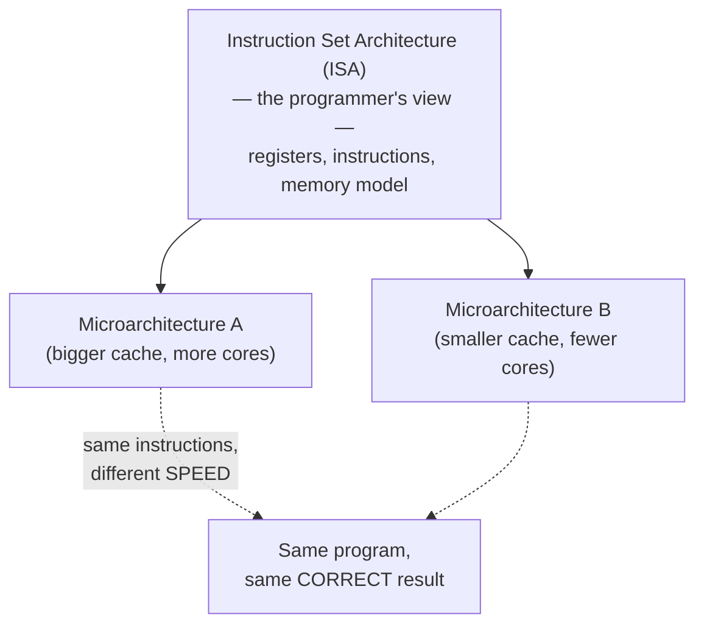

---

## 4. The Programmer's View of a Processor

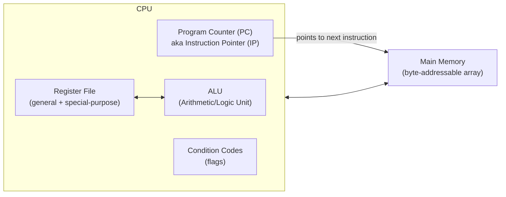

| Component | Role |
|---|---|
| **Registers** | Hardware "variables" — small, extremely fast storage, operate at CPU speed |
| **Program Counter (PC)** / Instruction Pointer (Intel: `IP`) | Special register pointing to the *next* instruction to execute |
| **Condition codes / flags** | Bits set as side effects of arithmetic (used for branching) |
| **Register file** | The full collection of registers |
| **Main memory** | Byte-addressable array; an address is just an integer offset |

### 4.1 What Lives in Memory

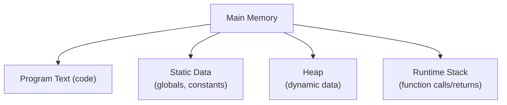

---

## 5. From C Source to Running Program: The Full Pipeline

This is the single most important diagram in the intro lecture.

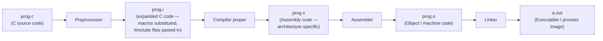

### 5.1 What Each Stage Actually Does

| Stage | Input | Output | Job |
|---|---|---|---|
| **Preprocessor** | `.c` (raw C) | `.c`-like text (still C) | Expands `#define` macros, handles `#if`/`#ifdef`, pastes in `#include`s — pure text substitution, still human-readable |
| **Compiler proper** | Preprocessed C | Assembly (`.s`) | Translates **high-level constructs** (`for`, `while`, function calls) into **architecture-specific instructions** |
| **Assembler** | Assembly (`.s`) | Object code (`.o`) | Simple **table lookup**: turns mnemonic names (`mov`, `%eax`) into their numeric binary encodings |
| **Linker** | One or more `.o` files (+ libraries) | Executable | **Combines** multiple object files into one memory layout; resolves all symbol references |

> **Key insight:** the compiler is the *only* stage that does the "hard" translation from high-level to low-level. Everything after that (assembler, linker) is comparatively mechanical.

### 5.2 Why C Is "Portable" but Assembly Is Not

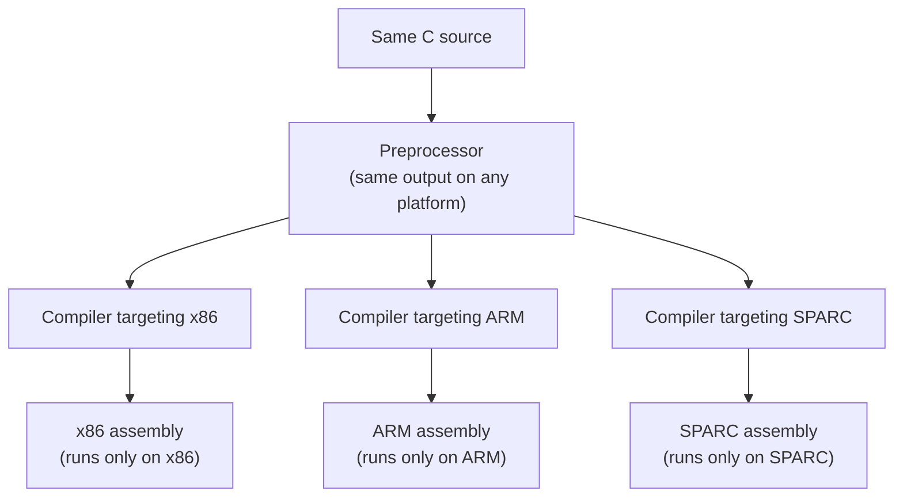

The **compiler** is where architecture-specific targeting happens — everything before it is still portable C.

### 5.3 Assembly ⇄ Machine Code: A Reversible Table Lookup

Assembly and machine code represent **exactly the same information** — just in different notations.

| | Machine code | Assembly |
|---|---|---|
| Representation | Pure binary (numbers) | Human-readable mnemonics (`mov`, `add`) and register names |
| Expressiveness | Identical | Identical |
| Conversion | Table lookup (number → name) | Table lookup (name → number) |
| Reversible? | **Yes**, both directions (it's just a lookup table) | Same |

> ⚠️ You **cannot** reliably go from assembly back to the original C. That translation (C → assembly) is lossy — the compiler's higher-level structure (loops, named variables) is gone by the time you have assembly. Sometimes you can *guess* the original C by intuition, but there's no general reverse tool.

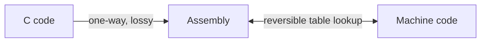

---

## 6. Static Linking: Combining Object Files

A real program is usually made of **several `.c` files** (e.g., a linked-list library, a BST library, server code), each compiled independently into its own `.o` file.

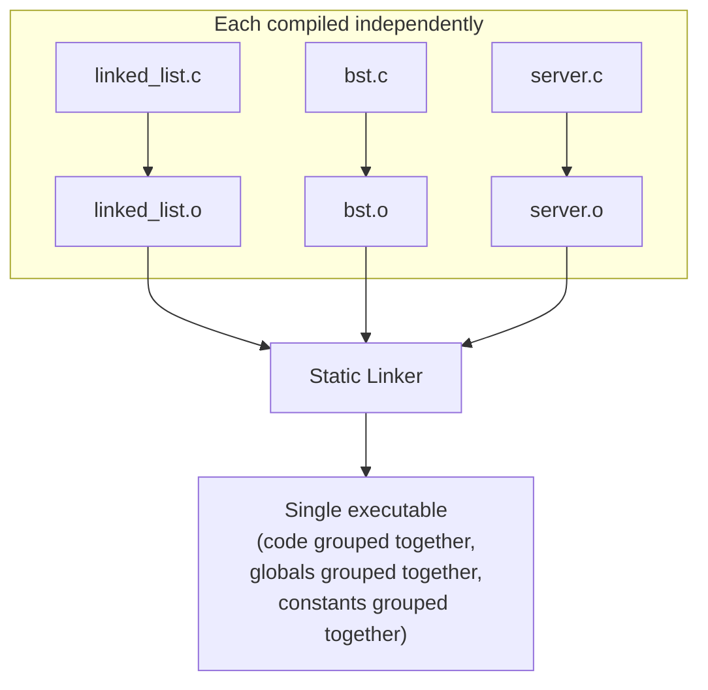

The linker's job: take object files (each compiled as if it "owned" all of memory) and **lay them out together** — code with code, globals with globals, constants with constants — then **resolve every symbol** (function/variable name) to a real address.

> If any symbol is left unresolved at static-link time, there is **no way to fix it later** — linking must fully resolve every reference.

---

## 7. Static vs. Dynamic Linking

### 7.1 The Motivating Problem

Consider `printf`, `read`, `write` — nearly every program on a system calls them.

> If 200 programs are running on a Unix server, do we really want **200 separate copies** of `printf` sitting in memory? That's wasteful.

### 7.2 The Two Approaches

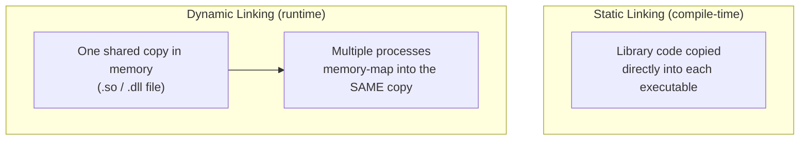

| Aspect | Static Linking | Dynamic Linking |
|---|---|---|
| When resolved | Compile time | Runtime (lazy / late binding) |
| File extension | `.a` (archive) | `.so` (shared object, Linux) / `.dll` (Windows) |
| Memory efficiency | One copy per program (wasteful if many programs share a lib) | **One shared copy** in memory for all processes |
| Executable size | Larger | Smaller |
| Bug fixes | Must recompile/relink your program | Automatically picked up next run (once the shared lib updates) |
| Dependency risk | None — self-contained | **Yes** — if the right shared library version isn't present, the program won't run |
| Speed | **Faster startup** (already linked) | Slightly slower (must resolve at runtime) |
| GCC flag | `-static` | Default behavior |

> **Trade-off in one sentence:** static linking trades flexibility for speed and self-containment; dynamic linking trades a small runtime cost and a dependency risk for shared memory savings and easy bug-fix propagation.

### 7.3 How Dynamic Linking Actually Works (Mechanism)

At compile time, every function call that will be dynamically linked is replaced with a call to the **dynamic linker** instead of the real function.

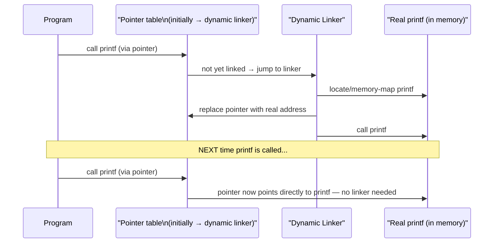

> This is why the **first** call to a dynamically-linked function is slightly slower than subsequent calls — it pays the one-time cost of resolving and patching the pointer.

### 7.4 Static Library vs Shared Object — File Types

| File extension | Meaning | Example |
|---|---|---|
| `.o` | Object file (single compilation unit, machine code) | `foo.o` |
| `.a` | **Archive** — a bunch of `.o` files packaged with a table of contents | `/usr/lib/libc.a` |
| `.so` | **Shared object** — dynamically linkable library | `/usr/lib/libc.so` |
| `.s` | Assembly (historically called "source" — see note below) | `foo.s` |

> **Why `.s` for assembly?** Historical artifact. Long ago, people wrote assembly *by hand* — there was no compiler, only an assembler. That hand-written assembly was literally the "source" fed to the assembler, hence `.s`. Today, assembly is an **intermediate representation** generated by the compiler — not something we typically write by hand — but the naming convention stuck.

---

## 8. Compiling with GCC — Flags Used in Lecture

| Flag | Meaning |
|---|---|
| `-O1` (capital O + number) | Optimization level (0 = none, higher = more aggressive) |
| `-S` (capital S) | Stop after generating assembly (`.s` file) — historically meant "source" |
| `-static` | Force static linking |

```bash
gcc -O1 -S code.c -o code.s
```

### 8.1 Effect of Optimization Level on Readability

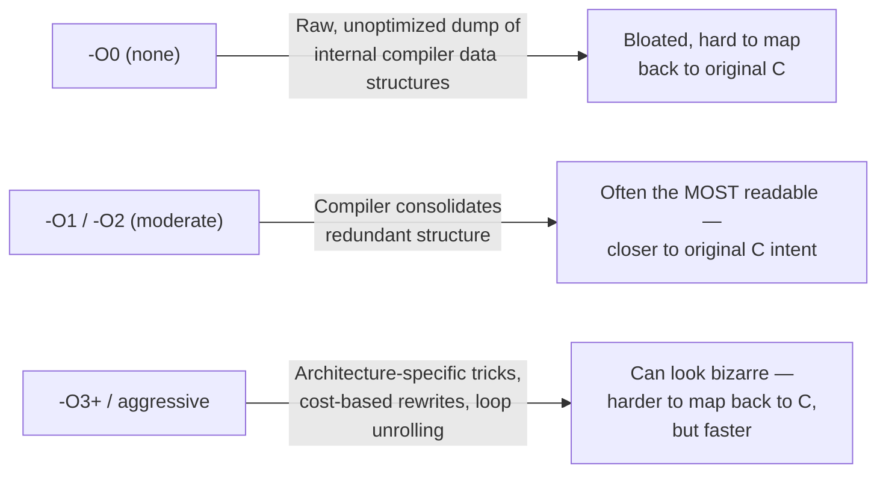

> Counter-intuitively, **unoptimized (`-O0`) code is often the ugliest** to read — because the compiler dumps its raw internal data structures with no cleanup. Turning optimization up a little often makes code *more* readable (closer to your mental model) before very high optimization levels start applying obscure, architecture-specific rules that make it harder to trace again.

---

## 9. Basic x86 (32-bit) Registers

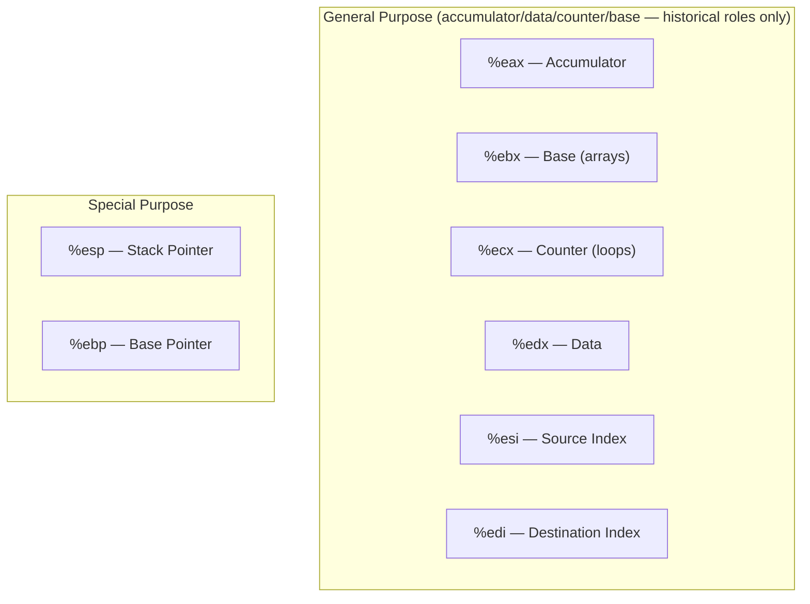

> ⚠️ **Modern compilers ignore the historical naming convention** (accumulator/base/counter/data) entirely. They treat `eax`–`edx`, `esi`, `edi` as fully general-purpose and allocate them however is most efficient for the specific code. Only `%esp`/`%ebp` remain truly special (stack management) in 32-bit code.

### 9.1 The `mov` Instruction — Load/Store

The `mov` instruction moves data between registers and memory (but **never memory-to-memory** directly — only one operand can be a memory address).

| Direction | Allowed? |
|---|---|
| Register → Register | ✅ |
| Register → Memory | ✅ |
| Memory → Register | ✅ |
| Memory → Memory | ❌ (must go through a register) |

```asm
mov  %eax, %ebx     ; register to register
mov  %eax, (%ebx)   ; register to memory
mov  (%ebx), %eax   ; memory to register
; mov (%eax), (%ebx)  ← ILLEGAL, no such instruction
```

### 9.2 GCC vs. Intel Operand Order

Two completely different documentation conventions exist for the *same* underlying instructions:

| Convention | Order | Used by |
|---|---|---|
| **AT&T / GCC / GAS** | `mov source, destination` | GCC, GNU assembler (portable across many architectures) |
| **Intel** | `mov destination, source` | Intel's own reference manuals |

> These produce **identical object code** — it's purely a documentation/notation difference, like writing "First Last" vs. "Last, First" for a name. If you Google an x86 reference card, make sure you know which convention it uses.

---

## 10. Load-Store Programming Model

Because registers are **much** faster than memory (even cached memory), the ideal pattern is:

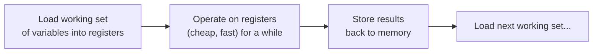

> **Anti-pattern:** load → operate → store *immediately, repeatedly* for every single operation. This wastes the load/store cost by not amortizing it across multiple operations. The goal is to keep a useful "working set" of variables in registers as long as possible.

If there aren't enough registers for all the variables in play, the compiler must **spill** — temporarily store a register's value back to memory to free it up for something else (register pressure).

---

## 11. Quick Reference Cheat-Sheet

| Concept | One-liner |
|---|---|
| Why parallelism now | Single-core speed hit physical/materials limits |
| ISA | Programmer-visible contract (instructions, registers) |
| Microarchitecture | Hidden implementation (cache size, core count) — can vary without breaking correctness |
| Preprocessor | Text substitution only; C in, C out |
| Compiler | High-level C → architecture-specific assembly |
| Assembler | Assembly ⇄ machine code (table lookup, reversible) |
| Linker | Combines object files, resolves all symbols |
| C → assembly | One-way, lossy translation |
| Static linking | Library code copied in at compile time; larger but self-contained, faster |
| Dynamic linking | Shared library loaded once, mapped into many processes; smaller, but dependency risk |
| `.o` / `.a` / `.so` | Object file / static archive / shared object |
| `mov` | Load/store; never memory-to-memory |
| AT&T vs Intel syntax | `source,dest` vs `dest,source` — same object code either way |
| Load-store model | Load a working set into registers, operate, then store — amortize the memory cost |

---

## 12. Study Tip (from the lecture)

Print out old exams, hole-punch them, and organize by **problem type** in a binder — then you can flip straight to a category and drill it repeatedly rather than cramming close to the exam.
