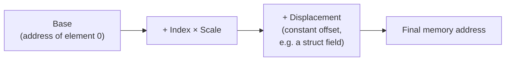
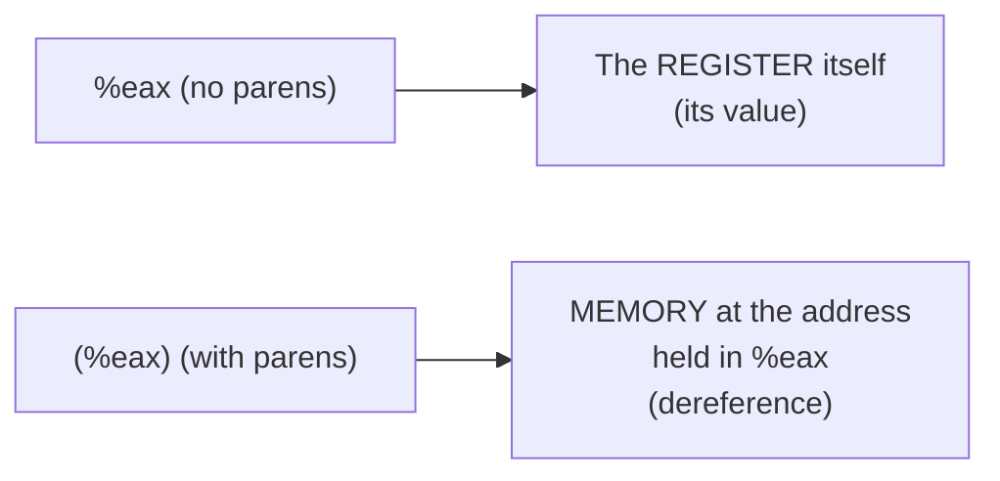
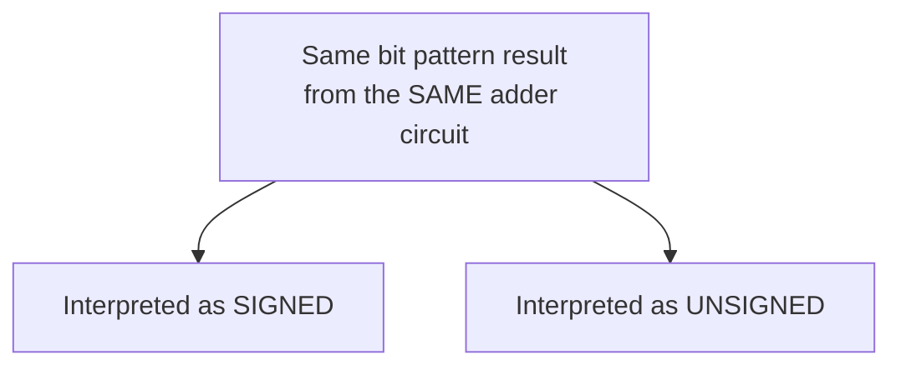
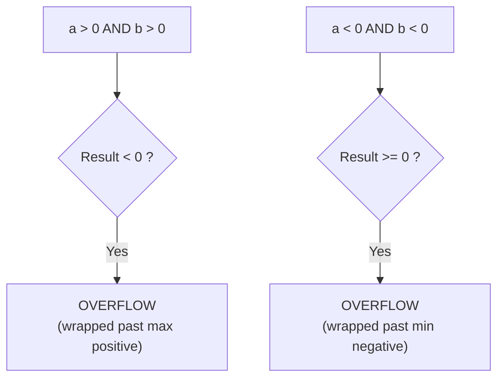
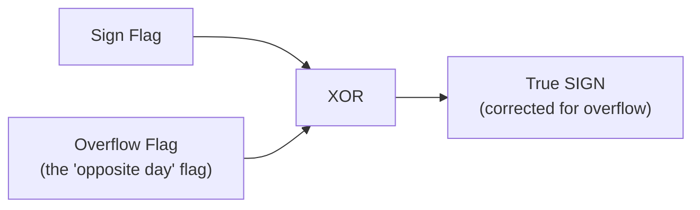
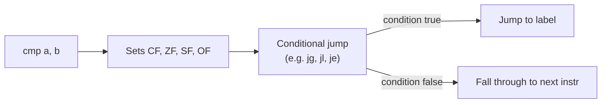
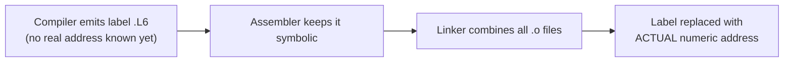
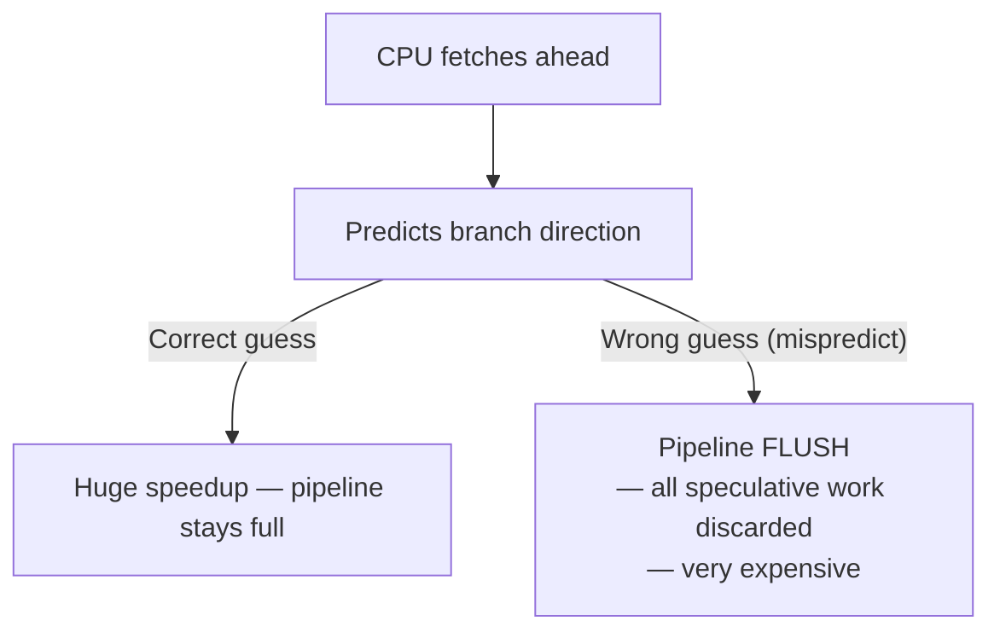
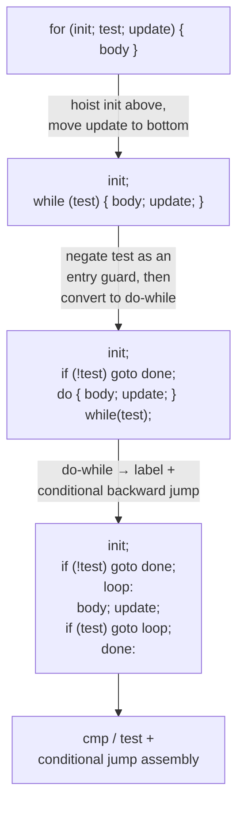
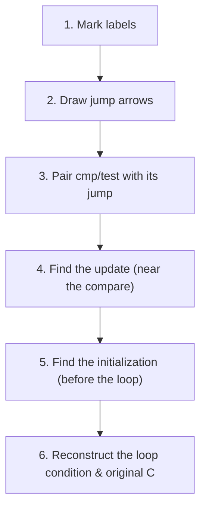

# Machine-Level Programming — Addressing Modes, Flags, Conditionals & Loops
*(Based on Lecture Transcript 2)*

---

## 1. Overview

This lecture drills into the details that make reading real x86 assembly possible:

1. The general **memory addressing formula**: `base + index × scale + displacement`.
2. The `lea` (Load Effective Address) instruction.
3. **Arithmetic instructions** and why signed/unsigned use the *same* hardware.
4. **Condition code flags** (carry, zero, sign, overflow) and the `set`/`cmov`/`jump` instructions built on them.
5. How **if/while/for/do-while** all compile down to the same `cmp` + conditional-jump pattern.

---

## 2. The General Memory Addressing Formula

Every memory reference in x86 can be described with **four components**:

```
address = Base + Index × Scale + Displacement
```

Think of it like indexing into an array:



| Component | Meaning | Default if omitted |
|---|---|---|
| **Base** | Starting address (e.g. array base, or a variable's address) | — |
| **Index** | Which element (like an array subscript) | 0 |
| **Scale** | Size of each element (1, 2, 4, or 8 bytes) | 1 |
| **Displacement** | Constant offset (e.g. struct field offset) | 0 |

### 2.1 Syntax Shorthand Table

| You see... | Means... |
|---|---|
| `(%eax)` | Base = `%eax`, index=0, scale=1, disp=0 → just `*eax` |
| `4(%eax)` | Base=`%eax`, disp=4 |
| `(%eax,%ebx)` | Base=`%eax`, Index=`%ebx`, scale=1 (assumed) |
| `(%eax,%ebx,4)` | Base=`%eax`, Index=`%ebx`, Scale=4 |
| `8(,%ebx,4)` | No base (=0), Index=`%ebx`, Scale=4, disp=8 |
| `(,%ebx,4)` | Base=0, Index=`%ebx`, Scale=4, disp=0 |

> **Rule of thumb for parsing:** if you see **one value**, it's the base (index=0). If you see **two values**, they're base and index (scale=1). If you're **missing the first** value but keep the comma, the remaining two are index and scale (base=0).

### 2.2 Register vs. Memory Reference — The Parentheses Rule



---

## 3. LEA — Load Effective Address

`lea` is one of the most misunderstood instructions:

> **`lea` does NOT load anything from memory, and it doesn't compute "an address" in any magical sense.** It simply evaluates the formula `Base + Index×Scale + Displacement` as **pure arithmetic** and stores the *result* — no memory access happens at all.

```asm
leal (%eax,%ebx,4), %ecx   ; ecx = eax + ebx*4   (just math!)
```

| Property | `lea` | Real arithmetic (`add`, `sub`, etc.) |
|---|---|---|
| Touches memory? | No — pure computation | Depends on operands |
| Sets condition flags? | **No** | **Yes** |
| Common use | Computing addresses ahead of time; also used as a "free" multiply/add trick | General math |

### 3.1 Why Compilers (Ab)use `lea` for Plain Math

Because `lea` can compute `base + index*scale + disp` in **one instruction**, compilers sometimes use it to implement expressions like `x + 4*y` even when no memory access is involved — simply because it's cheaper than a separate multiply + add.

```c
int silly(int x, int y) {
    return x + 48 * y;
}
```
Since `48 = 16 × 3 = 2^4 × 3`, the compiler can decompose this into:
```asm
; edx = y
leal (%edx,%edx,2), %eax   ; eax = y + 2y = 3y
sall $4, %eax               ; eax = 3y << 4 = 3y*16 = 48y
addl %ecx, %eax              ; eax = 48y + x   (ecx held x)
```
> This looks bizarre at first glance, but it's the compiler picking the **lowest-cost sequence** from its internal cost model — not "showing off," just optimizing.

---

## 4. Arithmetic & Logic Instructions

| Instruction | Operation |
|---|---|
| `add` | Addition |
| `sub` | Subtraction |
| `imul` | Signed/integer multiply |
| `sal` / `sar` | Shift arithmetic left / right |
| `shl` / `shr` | Shift logical left / right |
| `xor` | Exclusive or |
| `and` | Bitwise and |
| `or` | Bitwise or |
| `inc` / `dec` | Increment / decrement |
| `neg` | Negate (arithmetic negation, **not** the same as `not`!) |
| `not` | Bitwise complement (flip every bit) |

> ⚠️ **Common confusion:** `neg` (arithmetic negative, `-x`) vs. `not` (bitwise complement, `~x`) — these are *different instructions* that people often conflate.

### 4.1 One Adder for Both Signed and Unsigned — Why?

There is **no separate signed-add vs. unsigned-add instruction**. Thanks to **two's complement** representation, the same binary adder circuit produces the correct bit pattern whether you *interpret* the result as signed or unsigned.



### 4.2 `cmp` and `test` — Instructions That Only Set Flags

| Instruction | Behaves like... | But... |
|---|---|---|
| `cmp a, b` | `sub` (computes `b - a`) | **Does not store the result** — only sets flags |
| `test a, b` | `and` (computes `a & b`) | **Does not store the result** — only sets flags |

These exist purely to **set condition codes** for a subsequent conditional jump or `set`/`cmov` instruction, without clobbering any register.

---

## 5. Condition Code Flags

Set as **side effects** of arithmetic instructions (but *not* by `lea`, since it's not classified as arithmetic):

| Flag | Name | Set when... |
|---|---|---|
| `CF` | Carry Flag | Unsigned overflow — a carry/borrow out of the most significant bit |
| `ZF` | Zero Flag | Result is exactly zero |
| `SF` | Sign Flag | Result's most-significant bit is 1 (i.e., negative if interpreted as signed) |
| `OF` | Overflow Flag | **Signed** two's-complement overflow occurred |

### 5.1 Overflow Flag Logic (Reasoned, Not Memorized)



> Two positives should never sum to a negative; two negatives should never sum to something ≥ 0. If either happens, you've hit two's-complement overflow.

### 5.2 `SETcc` — Extracting a Flag into a Register

Flags alone are only useful for jumping. To actually **store** a true/false result (e.g., for `int result = (x > y);`), use a `set` instruction — these only write the **low-order byte** of a register.

| Instruction | Sets low byte to 1 if... |
|---|---|
| `sete` / `setne` | Equal / Not equal (`ZF`) |
| `sets` / `setns` | Sign flag set / not set |
| `setg` (greater, signed) | `~(SF ^ OF) & ~ZF` |
| `setge` (greater-or-equal, signed) | `~(SF ^ OF)` |
| `setl` (less, signed) | `SF ^ OF` |
| `setle` (less-or-equal, signed) | `(SF ^ OF)` `\|` `ZF` |
| `seta` (above, unsigned) | `~CF & ~ZF` |
| `setb` (below, unsigned) | `CF` |

### 5.3 Why `setg` Uses `SF XOR OF`



> The **overflow flag effectively means "the sign flag is lying."** If overflow occurred, the *true* sign is the opposite of what `SF` reports. XOR-ing `SF` with `OF` gives the *corrected* sign — which is exactly what a signed comparison needs. The "greater than" tests then also exclude the zero case (`~ZF`) to distinguish `>` from `>=`.

### 5.4 `SETcc` writes only 1 byte — must zero-extend

```asm
cmp   %edx, %eax        ; compare
setg  %al                ; al = 1 or 0   (only low byte written!)
movzbl %al, %eax          ; zero-extend al into full eax — REQUIRED,
                          ; because setg does NOT touch the upper bytes
```

> If you forget the `movzbl`, the upper 3 bytes of `%eax` retain **whatever garbage was there before** — a classic subtle bug source.

### 5.5 32-bit vs 64-bit: `movzbl` Still Matters

| Instruction | Bytes affected |
|---|---|
| `movzbl %al, %eax` | Zero-extends 1 byte → 32-bit register, **and** in 64-bit mode this also zeroes the upper 32 bits of the full 64-bit register (a special x86-64 rule for 32-bit-writing instructions) |
| `movzbq %al, %rax` | Zero-extends 1 byte directly into a full 64-bit register |

> This asymmetry exists so that legacy 32-bit code keeps working correctly on 64-bit machines — 32-bit-writing instructions implicitly zero the top half of the 64-bit register, but *byte*-writing instructions (`setg %al`) do **not** touch anything beyond that single byte.

---

## 6. Conditional Jumps

`jmp` is the assembly-level `goto` — it resets the instruction pointer.

| Instruction | Jumps if... |
|---|---|
| `jmp` | Unconditional |
| `je` / `jne` | Equal / Not equal |
| `js` / `jns` | Negative / Non-negative |
| `jg` / `jge` | Greater / Greater-or-equal (signed) |
| `jl` / `jle` | Less / Less-or-equal (signed) |
| `ja` / `jb` | Above / Below (unsigned) |



### 6.1 Labels Are Placeholders — Resolved at Link Time

```asm
.L6:
    ; ... loop body ...
    cmp  %edx, %eax
    jne  .L6
```

At the point the compiler emits assembly, **no real addresses exist yet** — multiple `.c` files haven't been laid out in memory together. Labels (`.L6`, `.L7`, function names) are symbolic placeholders that the **linker** replaces with real addresses once everything is assembled and combined.



---

## 7. Conditional Moves (`cmov`)

### 7.1 Why Modern CPUs Prefer Avoiding Branches

Modern **superscalar** processors execute many instructions **in flight, out of order**, and **speculatively** — they guess which way a branch will go and start executing that path before it's confirmed.



A **conditional move** sidesteps this entirely: both possible results are computed unconditionally, and the CPU just *picks* one — no branch, no misprediction risk.

```asm
; result = (x > y) ? x : y
mov   %edx, %eax     ; eax = y   (default/pre-computed guess)
cmp   %eax, %ecx      ; compare x and y
cmovg %ecx, %eax       ; if x > y, overwrite eax with x
```

### 7.2 The Danger: `cmov` Requires Side-Effect-Free Branches

Since **both** paths are computed regardless of the condition, `cmov` is only safe when neither path has a side effect that would be wrong to execute unconditionally.

```c
// UNSAFE for cmov — would dereference NULL unconditionally!
int safe_deref(int *p) {
    return p ? *p : 0;
}

// UNSAFE for cmov — x *= 7 always executes if implemented naively!
if (x > 0) {
    x = x * 7;
}
```

| Safe for `cmov`? | Example |
|---|---|
| ✅ Yes | `max = (x > y) ? x : y;` — pure value selection, no side effects |
| ❌ No | Pointer dereference guarded by a null check |
| ❌ No | An assignment with side effects that must not happen unconditionally |
| ❌ No | A branch containing a large/expensive computation you don't want to do speculatively |

### 7.3 Ternary Operator (`?:`) → Assembly

```c
result = test ? then_expr : else_expr;
```
```asm
; negate test → if FALSE, jump to else
testl  %eax, %eax
je     .Lelse
movl   then_val, %eax   ; then case
jmp    .Ldone
.Lelse:
movl   else_val, %eax   ; else case
.Ldone:
```

> The test is **negated** before branching because it's easier to test for the single specific case "is it zero" than to enumerate all "non-zero" possibilities.

---

## 8. Loop Translation Chain

All C loop forms are compiled through a **common intermediate goto-form** before becoming assembly. Understanding this chain lets you decode *any* loop in assembly by reversing the steps.



### 8.1 Do-While (Simplest Case — No Initial Guard Needed)

A `do-while` loop always executes the body **at least once**, so it needs no entry guard:

```c
do { body; } while (test);
```
```
loop:
    body
    if (test) goto loop;
```
```asm
.Lloop:
    ; body
    cmp   ...
    jne   .Lloop      ; loop back if test is still true
```

### 8.2 While Loop → Do-While (Requires Negated Guard)

A `while` loop might execute **zero** times, so it must be guarded:

```c
while (test) { body; }
```
transforms to:
```c
if (!test) goto done;
do { body; } while (test);
done:
```

### 8.3 For Loop → While Loop

```c
for (init; test; update) { body; }
```
is just sugar for:
```c
init;
while (test) {
    body;
    update;
}
```

### 8.4 Full Worked Example

```c
for (i = 0; i < n; i++) {
    body;
}
```

**Step-by-step transformation:**
```c
// Step 1: extract for-loop parts
i = 0;                          // init hoisted above
// test: i < n
// update: i++    (moved to bottom of body)

// Step 2: while-loop form
i = 0;
while (i < n) {
    body;
    i++;
}

// Step 3: guarded do-while form
i = 0;
if (!(i < n)) goto done;
do {
    body;
    i++;
} while (i < n);
done:

// Step 4: goto/label form
i = 0;
if (i >= n) goto done;
loop:
    body;
    i++;
    if (i < n) goto loop;
done:
```

> **Compiler smarts:** if the compiler can *prove* the initial guard is always true (e.g., `i = 0` and `n` is always positive so `0 < n` trivially), it can **optimize away the initial check entirely** — since it's the one setting `i = 0`, it knows the guard will never fail.

### 8.5 Why the Update Goes to the *Bottom*, Not Duplicated at Top

Some students propose testing at both the top and bottom. The actual reason compilers put the test **only at the bottom** (after transformation to do-while form) is **performance**: jumping *backward* to loop again disrupts instruction prefetching less than re-testing and jumping *forward* first — it keeps the CPU's speculative fetch pipeline working smoothly.

---

## 9. Reading Unfamiliar Assembly — A Practical Method

From the lecture's practical advice:

1. **Mark all labels** — they're landmarks.
2. **Draw arrows** from every jump to its target label.
3. **Box each `cmp`/`test` together with the conditional jump** that follows it — they're a pair.
4. Work from **the end backward**: the last operation before a compare is often the loop's **increment/update**.
5. Identify **what's being initialized** before the loop starts (usually a counter register).
6. Reconstruct: *what condition causes the loop to continue or stop, and what makes progress toward stopping?*



---

## 10. Quick Reference Cheat-Sheet

| Concept | One-liner |
|---|---|
| Addressing formula | `base + index×scale + displacement` |
| `lea` | Pure arithmetic on an address expression — no memory access, no flags set |
| `cmp` / `test` | Like `sub`/`and` but only set flags, don't store the result |
| `CF` | Unsigned overflow (carry out of MSB) |
| `ZF` | Result is zero |
| `SF` | Result is negative (MSB = 1) |
| `OF` | Signed two's-complement overflow — "the sign flag is lying" |
| `setg` etc. | Extract a flag combo into the low byte of a register |
| `movzbl` | Required after `set` instructions to zero-extend beyond the single byte written |
| `cmov` | Branch-free select; unsafe for anything with side effects |
| Loop chain | `for` → `while` → guarded `do-while` → `goto` form → assembly |
| `do-while` | No entry guard needed — always runs ≥1 time |
| `while`/`for` | Need a negated entry guard before becoming a `do-while` |
| Reading assembly | Label landmarks + jump arrows + pair cmp with its jump + read update near the compare |

---

## 11. Bonus: Two-Register Comparison Sanity Check

When you see:
```asm
cmp  %edx, %eax   ; computes eax - edx (AT&T: second operand minus first? verify per convention)
```
Always double-check the **operand order convention** (AT&T source,dest vs Intel dest,source) before reasoning about which value is subtracted from which — getting this backwards is one of the most common assembly-reading mistakes.
