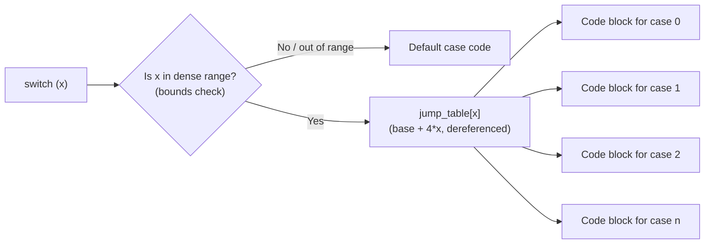
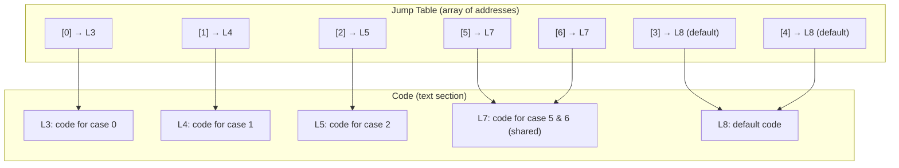
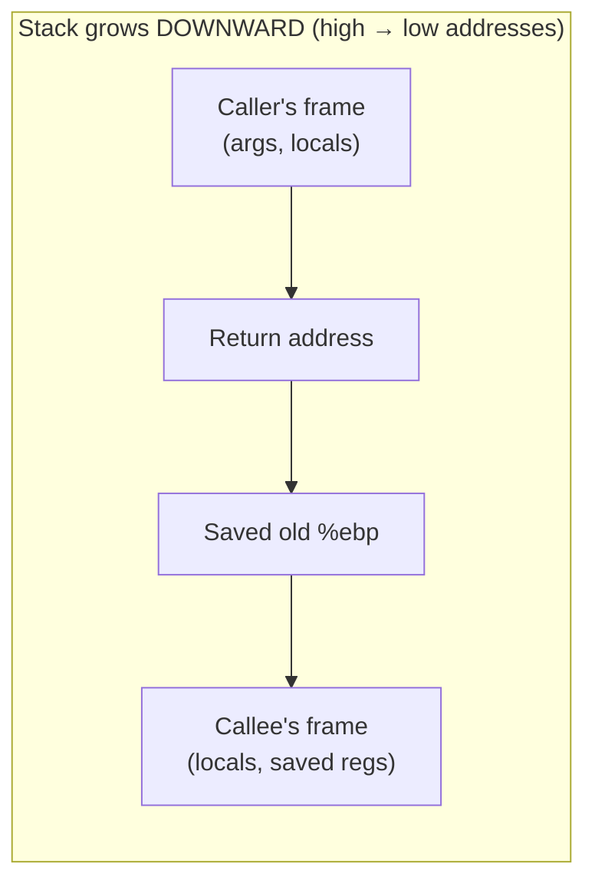
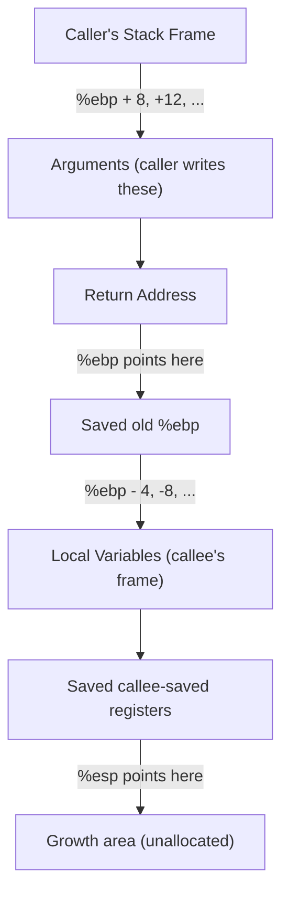
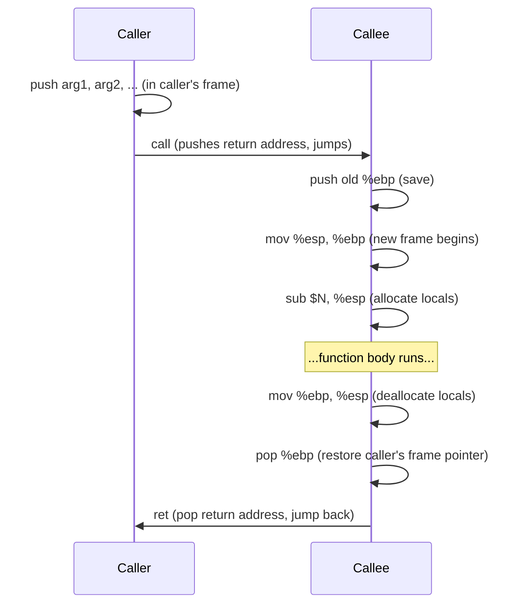
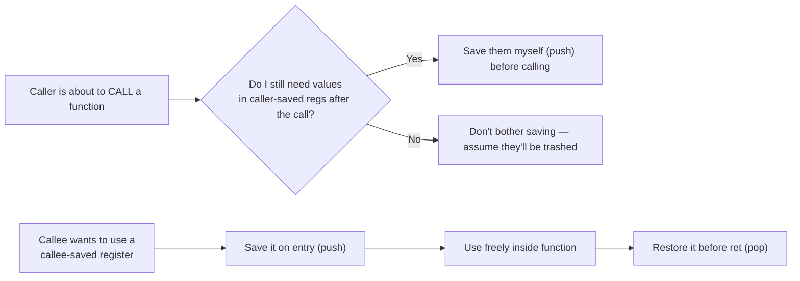
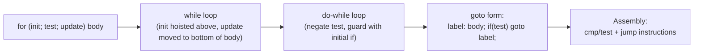

# Machine-Level Programming — Switch Statements & Stack Discipline
*(Based on Lecture Transcript 3)*

---

## 1. Overview

This lecture covers two big topics:

1. How the compiler translates **`switch` statements** into assembly (if-chains vs. **jump tables**).
2. How **function calls** actually work at the assembly level — the **stack discipline**, calling convention, caller/callee-saved registers, and why recursion is "nothing special."

---

## 2. Switch Statements → Assembly

A `switch` statement can be implemented by the compiler in **two different ways**, depending on how the `case` values are distributed.

| Strategy | When used | How it works | Time complexity |
|---|---|---|---|
| **If-chain (decision tree)** | Cases are **sparse** (e.g., 5, 1000, 6423) | Compiler emits a sequence of `cmp` + conditional jumps, just like nested `if` statements | O(n) — worst case checks every case |
| **Jump table** | Cases are **dense** (e.g., 0,1,2,3,4,5,6, small gaps allowed) | Compiler builds an array of code addresses; the switch variable is used directly as an **array index** | O(1) — one dereference + one jump |

> 🔑 **Key requirement:** switch only works on **integer types** (char, short, int, long...) — which is exactly what lets the compiler treat the value as an array index.

### 2.1 Why dense cases can become an array index

```
case 0 → jump_table[0]
case 1 → jump_table[1]
case 2 → jump_table[2]
...
```
If cases don't start at 0 (e.g., start at 5000), the compiler simply **subtracts a bias**:
```c
index = switch_var - 5000;
goto *jump_table[index];
```

### 2.2 Jump Table Mechanics



The jump table itself is **data**, not code — it lives in the read-only data section:



### 2.3 Assembly Skeleton

```asm
; assume x is in %eax
cmpl  $6, %eax        ; compare x to highest dense case
ja    .Ldefault        ; if x > 6 (unsigned), jump straight to default
jmp   *.LjumpTable(,%eax,4)   ; goto jump_table[x]   (base + 4*index)

.LjumpTable:
    .long .Lcase0
    .long .Lcase1
    .long .Lcase2
    .long .Ldefault   ; case 3 missing → default
    .long .Ldefault   ; case 4 missing → default
    .long .Lcase5
    .long .Lcase5     ; case 6 shares code with case 5
```

> Note: `ja` (jump above) is an **unsigned** comparison — this cleverly also catches negative numbers, since a negative int viewed as unsigned is huge, so it correctly falls into the "out of range → default" bucket.

### 2.4 Fall-Through: Switch Is NOT a Decision Tree!

A very common misconception: people think of `switch` as a tree of independent branches. In reality:

> **The switch statement is a `goto` into the middle of a straight-line block of code.** Once execution lands anywhere inside the switch, it keeps running **every subsequent statement** until it hits a `break` or the end of the switch — regardless of case labels in between.

```c
switch (x) {
    case 5:
    case 6:              // falls through — no code between 5 and 6
        w = y / z;        // executed for case 2 only (see note below)
    case 3:
        w += z;            // executed for case 2 AND case 3
        break;
    default:
        ...
}
```

This is why the compiler sometimes generates code that **jumps into the middle of a block** rather than duplicating code — it has correctly modeled the fall-through semantics.

### 2.5 If-chain vs Jump Table — Comparison

| Aspect | If-chain | Jump table |
|---|---|---|
| Best for | Sparse cases | Dense cases |
| Memory cost | Low (no table) | Higher (array of pointers) |
| Speed | O(number of cases checked) | O(1) |
| Compiler decision | Cost-based heuristic (time vs. space trade-off) | Same |
| Can compiler use a hash table instead? | No — not a standard compiler optimization | No |
| Mixed sparse+dense regions | Compiler *can* combine: if-chain for sparse tails, jump table for the dense middle | — |

---

## 3. The Stack Discipline & Function Calls

### 3.1 Core idea

> **Recursion is not special.** Every function call — recursive or not — uses exactly the same stack-frame mechanism.

Each function call **pushes** a stack frame; each return **pops** it. The stack frame contains what's needed to run the function and safely return control.



### 3.2 Base Pointer (%ebp) & Stack Pointer (%esp)

| Register | Role |
|---|---|
| `%ebp` (Base Pointer) | High-address boundary of current frame — the line between **my frame** and **my caller's frame** |
| `%esp` (Stack Pointer) | Low-address boundary — the line between **my frame** and unallocated (growth) space |



### 3.3 Why the layout must be this way (reasoned, not memorized)

1. **Arguments must be in the caller's frame** — the caller is the only one who knows what values to pass.
2. **Return address must also be in the caller's frame**, and must be written **after** the arguments — otherwise the callee's arguments would overwrite the return address logic.
3. **Stack-frame setup (locals) must be done by the callee** — only the callee knows how many local variables/registers it needs (a function might need zero stack space at all!).



### 3.4 Standard Function Prologue / Epilogue (32-bit x86)

```asm
function_name:
    push   %ebp          ; save caller's base pointer
    mov    %esp, %ebp     ; establish new frame
    sub    $N, %esp       ; allocate space for locals (if needed)

    ; ... function body ...

    mov    %ebp, %esp     ; deallocate locals
    pop    %ebp           ; restore caller's base pointer
    ret                    ; pop return address, jump there
```

- `call` is really a macro for: **push return address; jump to function**.
- `ret` is really: **pop address; jump to it**.

### 3.5 Caller-Saved vs. Callee-Saved Registers

Because there is only **one** physical register file shared by every function, a convention is needed so functions don't clobber each other's data.

| | Caller-Saved Registers | Callee-Saved Registers |
|---|---|---|
| Also called | "Caller-owned" | "Callee-owned" |
| Who must save them before use? | The **caller**, before calling — if it still needs the values afterward | The **callee**, before using them — and must restore before returning |
| Analogy | "My stuff — anyone can trash it, so I protect it myself before lending my desk" | "Borrowing your roommate's stuff — you must put it back exactly as found" |
| Rule of thumb | If you're the *caller* and you care about a value in one of these registers surviving the call, save it yourself first | If you're the *callee* and you want to use one of these, save it on entry, restore it before `ret` |



### 3.6 Example: `swap` Function (32-bit)

```c
void swap(int *xp, int *yp) {
    int t0 = *xp;
    int t1 = *yp;
    *xp = t1;
    *yp = t0;
}
```

```asm
; xp at %ebp+8, yp at %ebp+12
mov  8(%ebp), %edx    ; edx = xp
mov  12(%ebp), %ecx   ; ecx = yp
mov  (%edx), %ebx     ; ebx = *xp  (= x)
mov  (%ecx), %eax     ; eax = *yp  (= y)
mov  %eax, (%edx)     ; *xp = y
mov  %ebx, (%ecx)     ; *yp = x
```

### 3.7 Why returning a pointer to a local variable is dangerous

```c
int *danger() {
    int local = 42;
    return &local;   // BUG: local lives in this frame, which is popped on return!
}
```
The moment the function returns, `%esp`/`%ebp` reset, and that memory is considered **free** — the next function call can (and will, eventually) overwrite it. This is the root cause of a classic class of **stack-based memory bugs** (and the basis of buffer-overflow exploits, mentioned later in the lecture).

### 3.8 Conditional Moves vs. Branches (Performance)

Modern superscalar CPUs execute many instructions **in flight** and predict branches. A mispredicted branch is expensive (pipeline flush). Conditional moves (`cmov`) avoid this by computing both possible results and just *selecting* one — no branching required.

```c
// ternary: result = (x > y) ? x : y;
```
```asm
mov   %edx, %eax      ; eax = y (default guess)
cmp   %eax, some_x     ; compare
cmovg some_x, %eax     ; if x > y, overwrite eax with x
```

⚠️ **Caution:** conditional moves only work safely for **side-effect-free** expressions. You cannot use them to guard a pointer dereference:

```c
// UNSAFE to implement with cmov:
int safe_deref(int *p) {
    return p ? *p : 0;   // must NOT speculatively dereference p!
}
```
If both branches were computed unconditionally (as `cmov` requires), a null pointer would be dereferenced regardless of the guard — causing a segfault even when `p == NULL`.

### 3.9 Loops as Gotos

All C loop forms (`while`, `do-while`, `for`) get converted to the **same underlying goto form** before becoming assembly.



**Transformation chain:**

```c
// 1. for-loop
for (i = 0; i < n; i++) { body; }

// 2. → while-loop (init hoisted, update moved to bottom)
i = 0;
while (i < n) { body; i++; }

// 3. → do-while (guarded by negated test)
i = 0;
if (i < n) {
    do { body; i++; } while (i < n);
}

// 4. → goto form
i = 0;
if (!(i < n)) goto done;
loop:
    body;
    i++;
    if (i < n) goto loop;
done:
```

---

## 4. Quick Reference Cheat-Sheet

| Concept | One-liner |
|---|---|
| Switch → if-chain | Used when cases are sparse |
| Switch → jump table | Used when cases are dense; O(1) dispatch |
| Jump table entries | Addresses (labels resolved at link time), stored as data |
| `%ebp` | Boundary between my frame and caller's frame |
| `%esp` | Boundary between my frame and free space |
| Args & return address | Always in the **caller's** frame |
| Local vars & saved regs | Always in the **callee's** frame |
| Caller-saved regs | Caller must save before calling if it needs them after |
| Callee-saved regs | Callee must save on entry, restore before `ret` |
| Recursion | Uses identical mechanism to non-recursive calls — nothing special |
| `cmov` | Avoids branch misprediction, but unsafe for side-effecting/guarded expressions |

---

## 5. Study Tips (from the lecture)

- Print old exams, sort by problem type, and practice repeatedly.
- When reading unfamiliar assembly: **circle labels, draw arrows** for jumps/compares — don't just read passively.
- Understand the stack-frame diagram by *reasoning* through it (who needs to know what, and when) rather than pure memorization — it'll stick better and you can reconstruct it years later.
