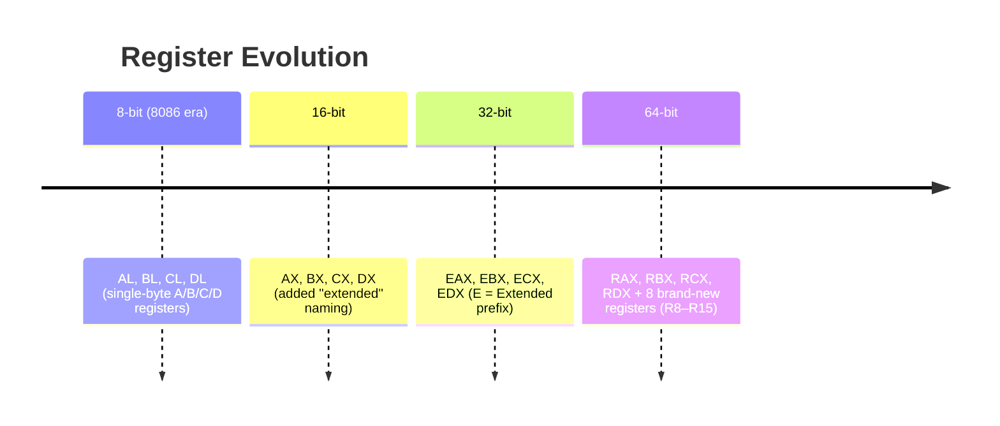
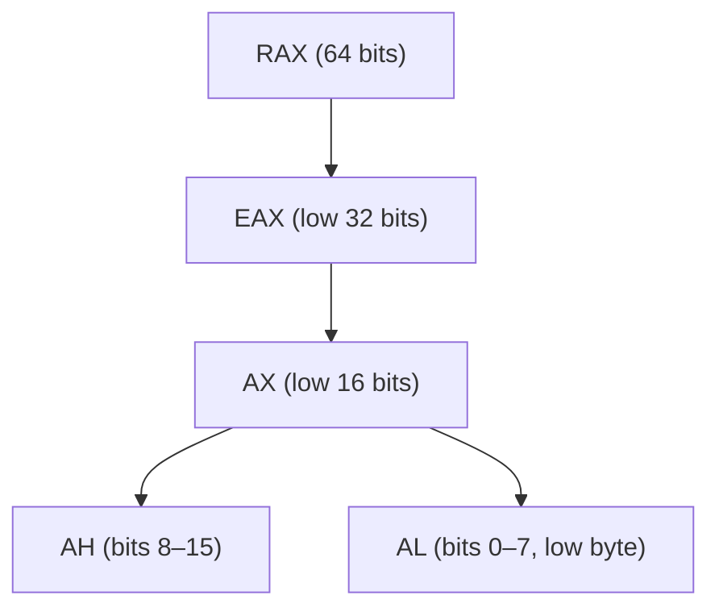
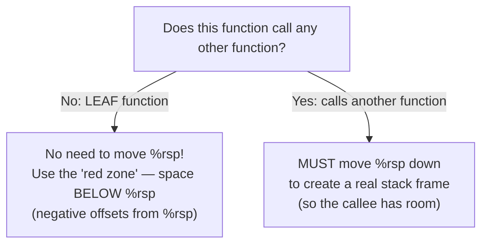
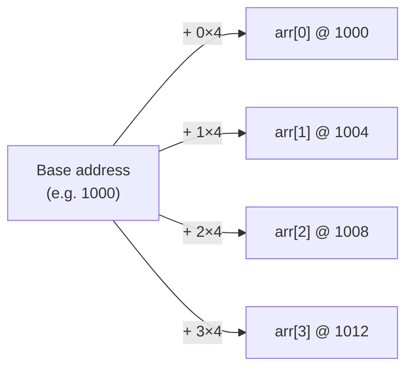
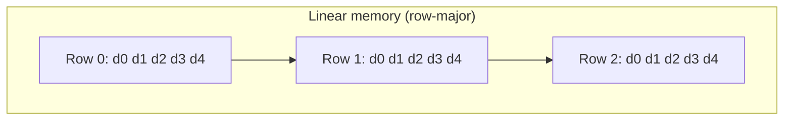
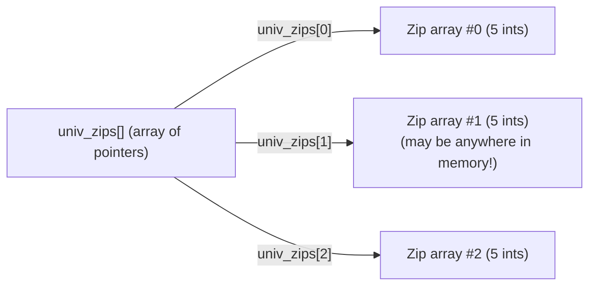
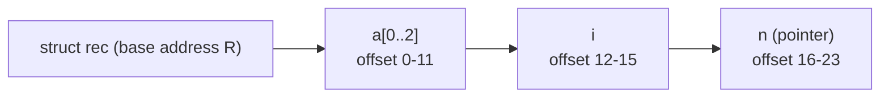
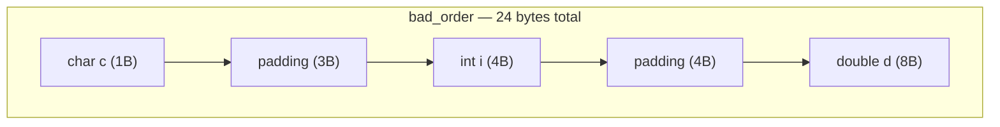
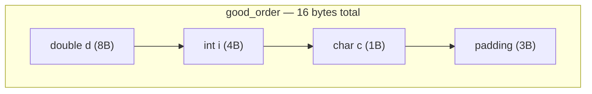

# Machine-Level Programming — x86-64 Architecture, Arrays & Structs
*(Based on Lecture Transcript 4)*

---

## 1. Overview

This lecture explains the **generational leap from 32-bit to 64-bit x86**, and then dives into how the compiler lays out **arrays**, **arrays of arrays**, **multi-dimensional arrays**, and **structs** in memory — including **alignment and padding** rules.

---

## 2. The 32-bit → 64-bit Generational Change

The move to 64 bits wasn't *just* about wider numbers — several architectural changes rode along with it.



### 2.1 What Changed Simultaneously in the 64-bit Generation

| Change | Why it matters |
|---|---|
| Register width: 32→64 bits | Bigger numbers, wider pointers |
| **8 new general-purpose registers** (R8–R15) | Not a "necessary" side effect of width — a deliberate generational upgrade → far less register spilling |
| `%ebp` becomes a **general-purpose register** | Old convention (base pointer + stack pointer both special) is dropped for new code |
| **Arguments passed in registers** (up to 6) instead of the stack | Registers are much faster than memory → big performance win |
| New calling convention | Function calls need far fewer stack operations |

> Old assembly-by-hand convention (going back to the 1978 8086) used registers by *name-based role*: A = accumulator, B = base (arrays), C = counter (loops), D = data. **Modern compilers ignore this convention entirely** — they treat all general-purpose registers the same and optimize register allocation for the specific code.

### 2.2 Register Naming Across Generations (Comparison Table)

| 8-bit | 16-bit | 32-bit | 64-bit | Historical role |
|---|---|---|---|---|
| AL | AX | EAX | RAX | Accumulator |
| BL | BX | EBX | RBX | Base (array addressing) |
| CL | CX | ECX | RCX | Counter (loops) |
| DL | DX | EDX | RDX | Data |
| — | SI | ESI | RSI | Source index |
| — | DI | EDI | RDI | Destination index |
| — | SP | ESP | RSP | Stack pointer (still special) |
| — | BP | EBP | RBP | Base pointer (special in 32-bit, general-purpose in 64-bit!) |
| — | — | — | R8–R15 | New in 64-bit, no historical role |

### 2.3 Sub-Register Views (still valid in 64-bit)


⚠️ There is **no way to name byte 3** of a 32-bit register directly — you must shift right and mask.

---

## 3. New Calling Convention: Register-Passed Arguments

### 3.1 The Six Argument Registers (x86-64 System V convention)

| Argument # | Register |
|---|---|
| 1st | `%rdi` |
| 2nd | `%rsi` |
| 3rd | `%rdx` |
| 4th | `%rcx` |
| 5th | `%r8` |
| 6th | `%r9` |
| 7th+ | Pushed on the stack (rare — how many functions have 7+ args?) |

### 3.2 `swap` — 32-bit vs 64-bit Side-by-Side

**32-bit (stack-based):**
```asm
mov  8(%ebp), %edx     ; edx = xp   (loaded from stack)
mov  12(%ebp), %ecx    ; ecx = yp   (loaded from stack)
mov  (%edx), %ebx
mov  (%ecx), %eax
mov  %eax, (%edx)
mov  %ebx, (%ecx)
```

**64-bit (register-based) — much cleaner:**
```c
void swap(long *xp, long *yp) {
    long t0 = *xp;
    long t1 = *yp;
    *xp = t1;
    *yp = t0;
}
```
```asm
; xp already in %rdi, yp already in %rsi — no loads needed!
mov  (%rdi), %rax     ; rax = *xp
mov  (%rsi), %rdx     ; rdx = *yp
mov  %rdx, (%rdi)     ; *xp = t1
mov  %rax, (%rsi)     ; *yp = t0
```

| | 32-bit | 64-bit |
|---|---|---|
| Args location | Stack (must load with `mov N(%ebp), reg`) | Registers (already there, zero-cost access) |
| Instructions needed just to *fetch* args | 2 extra `mov`s | 0 |
| Speed | Slower (memory access) | Faster (register speed) |

---

## 4. Leaf Functions & the "Red Zone"



- A **leaf function** never calls another function, so it can never be "surprised" by needing extra frame space beneath it.
- The compiler can therefore skip `sub $N, %rsp` / `add $N, %rsp` entirely and just address memory **below** the current `%rsp` — this scratch space is nicknamed the **"red zone"**.
- The moment a function makes a call, the stack pointer *must* be adjusted, since the callee needs its own frame.

```asm
; Leaf function using the red zone — no sub/add on %rsp at all
swap:
    mov  -8(%rsp), %rax    ; local var stored BELOW %rsp (the "red zone")
    ...
    ret
```

```asm
; Non-leaf function — must move %rsp to make room before calling
outer_func:
    push  %rbx              ; save callee-saved register
    sub   $16, %rsp          ; allocate real stack frame
    ...
    call  helper_func         ; safe: helper has its own frame below
    ...
    add   $16, %rsp
    pop   %rbx
    ret
```

Here is the complete picture of how the **Red Zone**, **Leaf Functions**, and **ABI rules** work together, consolidated into one clear breakdown:

---

### 1. What is a Leaf Function?

In programming, call graphs look like trees:

* **Non-Leaf Functions** call other functions (they have children).
* **Leaf Functions** are at the very bottom of the tree—they do their job, return a result, and **never call another function**.

### 2. The Normal Cost vs. The Red Zone Shortcut

* **Normal Function:** Must execute `sub $N, %rsp` to move the stack pointer down, creating a safe stack frame for local variables so incoming function calls don't overwrite them. Then it must clean up with `add $N, %rsp` before returning.
* **Leaf Function Optimization:** Because a leaf function is guaranteed **never to call another function**, it doesn't need to worry about a child function smashing its stack space.

Instead of moving `%rsp`, the compiler uses negative offsets (like `-8(%rsp)`) to read and write local variables in the empty scratch space sitting **directly below the current stack pointer**.

### 3. What is the Red Zone?

The **Red Zone** is a 128-byte zone of memory located immediately below `%rsp`.

* **The Catch:** If you tried to use negative offsets below `%esp` in old **32-bit x86** systems, your program would crash or get corrupted. Why? Because asynchronous hardware interrupts (like a mouse click or timer tick) would instantly pause your code and push interrupt data onto the stack right at `%rsp`, smashing your local variables.
* **The 64-bit System V ABI Solution:** The 64-bit Linux/Unix ABI introduced a strict rulebook handshake between the compiler and the operating system kernel:
1. **The Compiler** promises: *"I won't move `%rsp`, and I'll use the 128 bytes below it for fast leaf-function storage."*
2. **The OS Kernel** promises: *"Got it. If a hardware interrupt happens, my interrupt handlers will skip past those 128 bytes so I never overwrite your data."*


### Summary

The Red Zone is an ABI-backed performance optimization. It allows 64-bit leaf functions to completely skip stack pointer math (`sub`/`add`), safely storing temporary values in the 128-byte buffer below `%rsp` because the operating system guarantees its interrupt handlers will never touch that space.

---

## 5. Arrays in Memory

### 5.1 The Core Formula

For any array, the address of element `i` is:

```
address(arr[i]) = base_address + i * sizeof(element_type)
```

This is why array access is **O(1)** — it's pure arithmetic, no traversal needed.



### 5.2 Pointer Arithmetic — The Scaling Trap

```c
int Val[5] = {1, 5, 2, 1, 3};
```

| Expression | Meaning | Equivalent |
|---|---|---|
| `Val` | Array decays to its address (an **r-value**, can't be assigned to) | — |
| `&Val` | Same address, `&` has **no effect** on array names | `Val` |
| `Val + 1` | Address + 1 × `sizeof(int)` = address + 4 | NOT address+1 byte! |
| `Val[2]` | `*(Val + 2)` | dereference of (base + 2×4) |
| `&Val[2]` | `Val + 2` (cancels the dereference) | just the address |

> ⚠️ L-values vs R-values: `x = 5;` → `x` is an l-value (can appear on left), `5` is an r-value only. An array variable is like a constant pointer — it's an r-value; you can read it but never reassign it.

### 5.3 2D Arrays: Row-Major Layout

A true 2D array (e.g., `int zip[NUM][DIGITS]`) is stored as **contiguous rows**, one after another ("row-major order").



**Address formula:**
```
address(arr[row][col]) = base + (row * COLS + col) * sizeof(element)
```

```asm
; equivalent to: base + row*columns_per_row*elem_size + col*elem_size
```

- Walking **across a row** = sequential memory access (cache-friendly).
- Walking **down a column** = jump by `COLS * sizeof(element)` bytes each step (cache-unfriendly).

### 5.4 Array of Arrays (Array of Pointers) — Looks Similar, Works Differently!

```c
int *univ_zips[3];   // array of POINTERS to separate int arrays
```



| | True 2D array | Array of arrays (pointers) |
|---|---|---|
| Syntax to access | `arr[row][col]` (identical!) | `arr[row][col]` (identical!) |
| Memory layout | One contiguous block | Rows can be scattered anywhere |
| Memory accesses needed | **1** (pure arithmetic) | **2** (fetch pointer, THEN compute+fetch element) |
| Rows must be equal size? | Yes | **No — supports jagged arrays** |
| Example allocation | `int arr[3][5];` | `malloc`'d separately per row |

**Assembly difference:**
```asm
; TRUE 2D array — 1 memory access
mov   base(,%eax,20), %ecx    ; ecx = row*20 + base   (20 = 5 cols * 4 bytes)
mov   (%ecx,%edx,4), %eax     ; then add col*4 and dereference

; ARRAY OF POINTERS — 2 memory accesses
mov   univ_zips(,%eax,4), %edx  ; 1st access: get the row pointer
mov   (%edx,%ecx,4), %eax        ; 2nd access: use pointer + col offset
```

---

## 6. Structs in Memory

Structs have **no special hardware support** — the processor doesn't know what a "struct" is. The compiler just lays fields out **contiguously, in declaration order**, and computes offsets.

```c
struct rec {
    int a[3];       // offset 0
    int i;          // offset 12
    struct rec *n;  // offset 16
};
```



**Access formula:** `address(field) = base + fixed_offset`

```asm
; r->i   where r is in %edx
mov  12(%edx), %eax    ; i is always at offset 12

; r->a[1]
mov  4(%edx), %eax     ; offset 0 (start of a) + 1*4

; walking a linked list: r = r->n
mov  16(%edx), %edx    ; n is at offset 16
```

> The **field order in memory always matches declaration order** — this is required by the C standard. The compiler may add **padding between/after fields**, but it will never reorder them.

---

## 7. Alignment & Padding

### 7.1 The General Rule

> A data type of size **N bytes** must be stored at a memory address that is a **multiple of N**.

| Type size | Must be aligned to |
|---|---|
| 1 byte (char) | any address |
| 2 bytes (short) | multiple of 2 |
| 4 bytes (int, float) | multiple of 4 |
| 8 bytes (long, double, pointer) | multiple of 8 |

**Why?** Simpler hardware design → faster processors (fewer transistors needed to handle "in-between" byte positions).

### 7.2 Padding Example

```c
struct bad_order {
    char  c;      // 1 byte  @ offset 0
    // 3 bytes padding — int needs 4-byte alignment
    int   i;      // 4 bytes @ offset 4
    // 4 bytes padding — double needs 8-byte alignment
    double d;     // 8 bytes @ offset 12→16
};
// Total size: 24 bytes (lots of padding!)

struct good_order {
    double d;     // 8 bytes @ offset 0
    int    i;     // 4 bytes @ offset 8
    char   c;     // 1 byte  @ offset 12
    // 3 bytes padding at the END (for array alignment — see below)
};
// Total size: 16 bytes (much less padding!)
```




### 7.3 The "Trailing Padding" Rule

Even the **last field** can get padding — because the compiler must guarantee that if you make an **array of structs**, the *second* element's first field is still properly aligned.

> **Rule of thumb:** the overall struct alignment = alignment of its **largest member**. Padding is only ever added at the *end*, never before the first field, so that `struct_base_address == address_of_first_field` always holds.

### 7.4 Comparison: Field Ordering Strategy

| Strategy | Space efficiency | Readability | When worth it |
|---|---|---|---|
| Declare fields in original logical order | May waste space to padding | Best readability | Small structs, few instances |
| Reorder fields **largest → smallest** | Minimizes padding | Can obscure logical grouping | Large arrays of the same struct — real memory savings |

### 7.5 Array-of-Struct Access

```
address(arr[i]) = base + i * sizeof(struct)      ; get to element i
address(arr[i].field) = address(arr[i]) + field_offset   ; then add field offset
```
No magic — it's the array formula and the struct-offset formula, composed.

---

## 8. Quick Reference Cheat-Sheet

| Concept | One-liner |
|---|---|
| 64-bit registers | RAX-RDX + RSI/RDI/RSP/RBP + 8 new (R8-R15) |
| `%rbp` in 64-bit | No longer special — general purpose register |
| First 6 args | Passed in `rdi, rsi, rdx, rcx, r8, r9` |
| 7th+ args | Still go on the stack |
| Leaf function | Can use the "red zone" — skip moving `%rsp` |
| Array access | `base + i * sizeof(type)` — O(1) |
| 2D array (true) | Row-major; 1 memory access |
| Array of arrays | Looks the same in C syntax; 2 memory accesses; supports jagged rows |
| Struct layout | Fields in declared order, offsets fixed at compile time |
| Alignment rule | N-byte type → address must be multiple of N |
| Struct padding | Only ever inserted between/after fields, never before the first |
| Best practice | Use `sizeof()` — never hardcode struct sizes |

---

## 9. Practical Debugging Tip

Always use `sizeof(struct_name)` in code rather than manually computing struct sizes — padding rules can change across architectures/compilers, and hardcoded "magic numbers" will silently break when recompiled on a new target.
