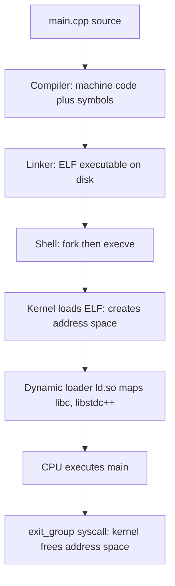
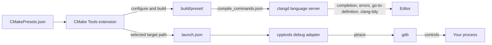
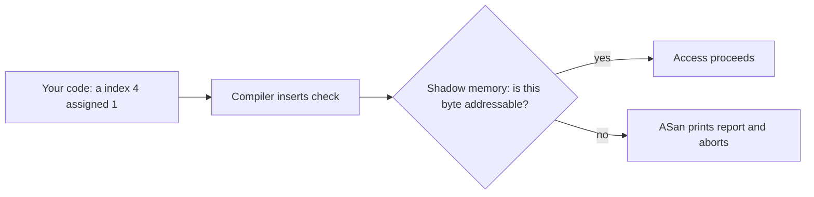
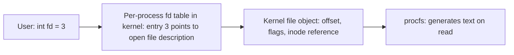

# Debugging Wizard — Phase 0, Chapter 1
# Project Setup, Tooling, and Safety (VS Code, CMake, Sanitizers, RAII)

> **How to use this note**
> 1. Read the short concept at the start of each step.
> 2. Answer the 🧠 THINK / 🔬 PREDICT questions **on paper first**.
> 3. Only then open the **✅ Solution** block.
> 4. Run the experiment and record **your** numbers. If reality disagrees with your prediction, that is the most valuable moment in the chapter.
> 5. Ask me follow-up questions any time. Questions and answers go in the **Clarification Log** at the end.
>
> **About "reference data" boxes.** Some steps include results I measured while testing this repo. They came from a *different machine* (a sandbox with GCC 13, not your Acer with GCC 15). They show what to expect in shape, not in exact numbers. Your numbers are the ones that matter.
>
> **Read this note in VS Code** with the *Markdown Preview Mermaid Support* extension (already in the repo's recommended extensions) so the diagrams render. Collapsible solution blocks work in the built-in preview.

> **All code is in this note.** Every file is listed in full in **[Appendix A](#appendix-a--complete-code-file-by-file)** (A.0 tells you how to create the folders). Steps show the important parts inline and point to the full listing.

---

## 0. Chapter Overview

### 0.1 What You Will Learn

By the end of this chapter you can:

- **Explain** the path from source file to ELF file to running process.
- **Configure** VS Code with clangd, CMake Tools, and gdb, and use them to complete a build → diagnose → debug cycle.
- **Build** one repo reproducibly with CMake presets (Debug, RelWithDebInfo, sanitizers).
- **Predict and measure** VSZ vs RSS growth for a leaking program.
- **Identify** a leak, heap overflow, use-after-free, and signed overflow with ASan, LSan, UBSan, and Valgrind.
- **Implement** an RAII file-descriptor wrapper (`dw::Fd`) and **test** it.
- **Measure** the runtime and memory cost of sanitizers, changing one variable at a time.

### 0.2 Prerequisites

Ubuntu (native), GCC, CMake, and:

```bash
sudo apt install build-essential cmake gdb strace valgrind git \
                 clangd clang-format clang-tidy
```

If `clangd` is not found, run `apt search clangd`; on some releases the package is versioned (for example `clangd-20`).

### 0.3 Why This Matters to Debugging Wizard

Debugging Wizard is a **long-running** program that will diagnose other programs. A leak of 4 KB per sample at 10 samples per second costs about 140 MB per hour. A tool that becomes the problem it diagnoses is worthless. This chapter builds the workshop: a reproducible build, an editor that finds mistakes early, and safety nets that catch what remains.

### 0.4 Step Map

| Step | Focus |
|------|-------|
| 1.1 | Source → ELF → process |
| 1.2 | Your machine and the repository |
| 1.3 | CMake and presets |
| 1.4 | VS Code as a professional C++ environment |
| 1.5 | First program: observe it with `strace` and `/proc/self` |
| 1.6 | The leak experiment: VSZ vs RSS |
| 1.7 | Sanitizers: how they work |
| 1.8 | Break it: the bug zoo |
| 1.9 | RAII: the forgotten `close()` and `dw::Fd` |
| 1.10 | Measure the cost of sanitizers |
| 1.11 | Explain-it-back, knowledge check, completion |

### 0.5 Project Conventions (apply to every chapter)

| Convention | Rule |
|------------|------|
| Code lives in the note | Every chapter note is self-contained: complete code in the note or its appendix, no archives. |
| Predict before you run | Write the prediction first, then run, then compare. |
| **Scripts vs C++** | **Shell is fine for short glue**: starting a process in the background, `ulimit`, `watch`, one-off `strace`/`valgrind` runs, a quick loop. **Benchmarking and measurement are always C++**: anything that produces a number we report (`run_measure`, `observe_pid`, and later the collectors) is written in C++, so its own overhead is visible to the same tools and results are reproducible from the repo. No benchmark scripts. |
| Change one variable | Isolate one change per experiment, and repeat runs to see the spread. |
| Record the machine | Keep `docs/environment.md` current next to every result. |

---

## Step 1.1 — From Source to Running Process



**How to read this diagram:**

| Element | Meaning |
|---------|---------|
| Compiler → Linker | User-space tools that turn text into instructions and stitch pieces together. No kernel involvement yet. |
| ELF on disk | A file with **segments** (code, data) and headers describing how to map them. It is not a process. |
| `fork` + `execve` | The **shell initiates** this. `execve` asks the kernel to replace the process image with the new program. |
| Kernel loads ELF | Creates **virtual memory mappings** (`mm_struct`, VMAs). Mostly nothing is copied into RAM yet. Pages load lazily on first access (page faults). |
| `ld.so` | For dynamically linked binaries, the kernel also maps the loader named in the ELF's `PT_INTERP`, which then maps shared libraries. |
| CPU executes | The MMU translates virtual addresses through page tables the kernel built. |
| `exit_group` | The process ends and the kernel tears down its address space and closes leftover file descriptors. |

**Where blocking and latency can appear:** disk reads on first page fault (cold cache), library loading, and page faults on every first touch of memory.

**How to observe each stage:** `readelf -h`, `strace`, `/proc/<pid>/maps`, `/proc/<pid>/status`.

### 🧠 THINK

1. The compiler accepted your program. What did it verify, and what did it *not* verify?
2. When `execve` finishes, is the whole executable already in RAM? Why or why not?
3. If your program never calls `free()`, who reclaims its memory when it exits? How does that change for a program that runs six hours?

<details>
<summary>✅ Solution</summary>

1. It verified **syntax, types, and declarations**. It did not verify *runtime behavior*: pointer validity at the moment of use, whether every allocation is freed, whether an index is in range, or whether arithmetic overflows. Those are properties of a specific execution, not of the source text.
2. No. The kernel creates **mappings**, not copies. Pages are faulted in from the page cache or disk on demand. That is why a large binary starts quickly and why RSS is smaller than the size of the binary plus libraries.
3. At exit the **kernel** reclaims all of the process's memory regardless of leaks, so leaks are harmless in a 10 ms program. A long-running tool never exits, so only the program itself can return memory. That is why leaks matter so much for Debugging Wizard.

</details>

---

## Step 1.2 — Your Machine and the Repository

### Your environment (recorded from your terminal)

| Item | Value |
|------|-------|
| Machine | Acer Aspire A715-75G |
| OS | Ubuntu (native) |
| Kernel | `7.0.0-31-generic` |
| Compiler | g++ (Ubuntu 15.2.0-16ubuntu1) 15.2.0 |
| CMake | 4.2.3 |
| Architecture | x86_64 |

A note from your terminal: GCC takes long options with **two** dashes. `g++ -version` failed with "unrecognized command-line option", while `g++ --version` worked.

### 🧪 EXPERIMENT: complete the hardware record

Benchmarks are only interpretable next to the machine that produced them. Run these and paste the results into `docs/environment.md`:

```bash
lscpu | grep -E 'Model name|^CPU\(s\)|Thread|L1d|L2|L3'
free -h
lsblk -d -o NAME,ROTA,SIZE,MODEL
cat /proc/sys/kernel/perf_event_paranoid
```

### 🧠 THINK

1. Why record the kernel version and CPU model alongside every measurement?
2. `lsblk` shows a `ROTA` column (1 = spinning disk, 0 = SSD). Why will this matter in Phase 5?
3. `perf_event_paranoid` controls who may use hardware counters. Which future phase depends on it?

<details>
<summary>✅ Solution</summary>

1. Results depend on the CPU (cache sizes, core count, frequency scaling), the kernel (which `/proc` fields exist, scheduler behavior), and the compiler version. A number without its environment cannot be compared or reproduced.
2. Disk latency and throughput differ by orders of magnitude between spinning disks, SATA SSDs, and NVMe. Our disk metrics and workloads must be interpreted against the device.
3. **Phase 7** (`perf_event_open` and hardware counters). Higher values restrict unprivileged use, and we will learn to read and adjust that setting safely when we get there.

</details>

### The repository (one repo, not chapter folders)

```
debugging-wizard/
├── CMakeLists.txt          # top-level build description
├── CMakePresets.json       # named configurations: debug, asan, rel, asan-rel
├── include/dw/             # public headers of the real tool (fd.hpp lives here)
├── src/                    # the real tool (empty until code has earned its place)
├── lab/                    # throwaway experiments and deliberately broken programs
├── tests/                  # automated checks (ctest)
├── bench/                  # recorded benchmark results
├── docs/
│   ├── environment.md      # your machine record
│   └── notes/phase-0-ch1.md  # this note (later: phase-0-ch2.md, ...)
└── .vscode/                # editor configuration (see Step 1.4)
```

### 🧠 THINK

Why separate `lab/` from `src/`?

<details>
<summary>✅ Solution</summary>

`lab/` holds experiments where **broken code is the point**: leaks, overflows, naive readers. Mixing that with the real tool invites shipping a deliberate bug. `src/` receives code only after it has been measured and tested, which enforces your master document's rule that complexity must be earned. A nice side effect: the git history shows *why* each piece of `src/` exists, because the naive version sits in `lab/`.

</details>

### First build

📄 **Create the files first:** follow Appendix A.0, then A.1 to A.20.

```bash
cd debugging-wizard
git init && git add -A && git commit -m "Phase 0 chapter 1: repo skeleton"
cmake --preset debug
cmake --build --preset debug -j
ctest --preset debug
```

---

## Step 1.3 — CMake and Presets

### Concept

CMake is a **build-system generator**: it reads a description of targets and options and generates the actual build files (Makefiles here). Reproducibility comes from **presets**, which give each configuration a name and its own build directory.

| Preset | Build type | Sanitizers | Used for |
|--------|-----------|------------|----------|
| `debug` | `-O0 -g` | off | gdb, Valgrind, plain-run comparisons |
| `asan` | `-O0 -g` | ASan + UBSan (LSan comes with ASan) | catching bugs |
| `rel` | `-O2 -g` | off | benchmarks |
| `asan-rel` | `-O2 -g` | ASan + UBSan | measuring sanitizer cost |

Each preset builds into `build/<preset>/`, so all four coexist and you can compare binaries side by side.

📄 **Full files:** Appendix A.1 (`CMakeLists.txt`), A.2 (`CMakePresets.json`), A.3 (`lab/CMakeLists.txt`), A.4 (`tests/CMakeLists.txt`).

The heart of the top-level `CMakeLists.txt` is one **interface target** that carries flags to every executable:

```cmake
add_library(dw_options INTERFACE)
target_include_directories(dw_options INTERFACE ${PROJECT_SOURCE_DIR}/include)
target_compile_options(dw_options INTERFACE -Wall -Wextra -Wpedantic -Wshadow)

if(DW_SANITIZE)
  target_compile_options(dw_options INTERFACE -fsanitize=address,undefined -fno-omit-frame-pointer)
  target_link_options(dw_options INTERFACE -fsanitize=address,undefined)
endif()
```

Every executable then says `target_link_libraries(name PRIVATE dw_options)` and inherits the same rules.

> **Honesty note.** The C++ sources were compiled and run with these exact flags while preparing this note, but the sandbox I used had no CMake, so the CMake files themselves were not executed. Your first `cmake --preset debug` is their real test. Paste any error to me.

### 🧠 THINK

1. What is the difference between `-O0 -g` and `-O2`? Which do you want for debugging and which for benchmarking?
2. Why do sanitizer flags appear in **both** compile and link options?
3. Why use one build directory per preset instead of reconfiguring one directory?
4. Why put shared flags in one `dw_options` target instead of repeating them per executable?

<details>
<summary>✅ Solution</summary>

1. `-O0 -g` keeps code close to your source: variables live in memory, nothing is inlined, and both gdb and sanitizer reports map cleanly to lines. `-O2` inlines, reorders, and eliminates code, which is what real performance looks like. Debug timings are misleading for benchmarks, and optimized code is confusing to step through. `-O2 -g` (`RelWithDebInfo`) gives realistic speed and still readable reports.
2. Compile flags tell the compiler to **insert checks** around memory accesses. Link flags pull in the sanitizer **runtime library** (which replaces `malloc`/`free` and implements the checks). One without the other gives a link error or no checking.
3. Switching flags in one directory forces full rebuilds and risks stale objects with mixed instrumentation. Separate directories guarantee each binary was built the way its directory name says, and let you keep four configurations at once.
4. One place to change means no drift between executables. If `fd_test` were compiled without `-Wshadow` while `bugs` had it, "the warnings are clean" would mean different things in different places.

</details>

---

## Step 1.4 — VS Code as a Professional C++ Environment

### The decision

Visual Studio itself does not exist on Linux. The three serious options:

| Option | Code intelligence | Strengths | Trade-offs |
|--------|-------------------|-----------|------------|
| **VS Code + clangd + CMake Tools + gdb** (recommended, configured in this repo) | clangd (LLVM) reads `compile_commands.json`, so it sees the *exact* flags of every file | Fast, accurate, live `clang-tidy` diagnostics, free, lightweight, works over SSH | You assemble it from extensions (this repo does that for you) |
| VS Code + Microsoft C/C++ (cpptools) alone | Microsoft's IntelliSense engine | Closest to the "Visual Studio feel", easy start | Less accurate on complex CMake and template code, no `clang-tidy` integration |
| **CLion** (JetBrains) | Own engine, deep CMake integration | Best all-in-one C++ IDE, strong refactoring and debugger UI | Heavier; check JetBrains' current licence terms for non-commercial use |

**Recommendation:** VS Code with clangd as the language engine and the Microsoft C/C++ extension used **only as the gdb debugger front end**. This is what many professional C++ developers on Linux run, and everything is already configured in `.vscode/`. If you later want a heavier IDE, CLion opens the same CMake project without changes.

### How the pieces fit



**How to read this diagram:**

| Arrow | Meaning |
|-------|---------|
| Presets → CMake Tools | You pick a preset in the status bar. The extension runs `cmake --preset ...` for you. |
| Build → clangd | CMake writes `compile_commands.json` listing the exact compiler command for each file. clangd parses your code with those flags. |
| clangd → Editor | Live diagnostics, completion, hover types, go-to-definition. This replaces "IntelliSense". |
| CMake Tools → launch.json | `${command:cmake.launchTargetPath}` resolves to the executable currently selected in the status bar. |
| Debug adapter → gdb → process | gdb controls your process through the `ptrace` system call. |

### Setup

📄 **Full files:** Appendix A.15 (`settings.json`), A.16 (`launch.json`), A.17 (`extensions.json`), A.18 (`.clang-format`), A.19 (`.clang-tidy`).

Install VS Code from Microsoft's official `.deb` or apt repository, or with `sudo snap install code --classic`. Then:

```bash
cd ~/debugging-wizard
code .
```

VS Code will offer the **recommended extensions** from `.vscode/extensions.json`: accept them. Or install by hand:

```bash
code --install-extension ms-vscode.cmake-tools
code --install-extension llvm-vs-code-extensions.vscode-clangd
code --install-extension ms-vscode.cpptools
code --install-extension bierner.markdown-mermaid
```

Then:

1. **Command Palette** (`Ctrl+Shift+P`) → `CMake: Select Configure Preset` → `debug`. The extension configures the project and writes `compile_commands.json` into the repo root.
2. Open `lab/bugs.cpp`. Hover over a variable, press `F12` on a function (go to definition), `Shift+F12` (find references), `F2` (rename symbol). This is your IntelliSense.
3. Build with the status-bar **Build** button (or `CMake: Build` in the palette).
4. In the status bar choose the launch target `bugs`, then press `F5` and choose **gdb: selected target + args** (edit its `args` to `uaf`).

Debug keys: `F9` toggle breakpoint, `F10` step over, `F11` step into, `Shift+F11` step out, `F5` continue.

### 🧪 EXPERIMENT: your first debugging session

1. Set a breakpoint on the `std::printf("uaf: ...")` line in `use_after_free()`.
2. Run under the debugger (`args: ["uaf"]`).
3. When it stops, look at the **Variables** pane for `a`, then step over the print.

### 🔬 PREDICT

Before stepping: what value will `a[0]` show after `delete[] a`? We assigned `7` earlier.

<details>
<summary>✅ Solution</summary>

**Not reliably 7.** `delete[]` returns the block to glibc's allocator, which writes its own bookkeeping (free-list pointers) into the first bytes of the freed block. So `a[0]` usually shows a **garbage-looking number** rather than 7. In a plain (unsanitized) test run of this repo it printed `1439461497`. Your value will differ.

The lesson is the reason use-after-free is dangerous: the program neither crashes nor prints the value you wrote. It silently reads allocator internals. In Step 1.8 ASan catches this at the exact read instruction.

(This corrects the earlier version of this note, which said it "usually prints 7". Testing disproved that. Predictions are hypotheses, including mine.)

</details>

### 🧠 THINK

1. Why does the project use **two** C++ extensions (clangd and cpptools), and why is cpptools' IntelliSense disabled in `settings.json`?
2. How does a debugger stop a running program at a line of source code? What does the CPU do?
3. Earlier you saw `LeakSanitizer does not work under ptrace (strace, gdb, etc)`. Why would ptrace matter to a leak checker?

<details>
<summary>✅ Solution</summary>

1. clangd does the *language* work (parsing, completion, diagnostics) and cpptools provides the *debug adapter* that talks to gdb. Two engines analyzing the same file would produce duplicate or conflicting suggestions and errors, so cpptools' engine is disabled and only its debugger is used.
2. gdb attaches with `ptrace`, then overwrites the first byte of the target instruction with a special one-byte trap instruction (`int3`, opcode `0xCC`). When the CPU executes it, it raises a breakpoint exception. The kernel turns that into a `SIGTRAP` delivered to the traced process, which stops and notifies gdb. gdb restores the original byte, lets you inspect state, and resumes. Breakpoints are literally a modified instruction in memory.
3. LSan's exit-time scan itself uses `ptrace` to freeze the process's threads while it reads their stacks and registers. A process can have only **one** tracer at a time, so if gdb or strace already holds it, LSan cannot. When debugging a sanitizer build, run with `ASAN_OPTIONS=detect_leaks=0` and keep ASan's memory-error checks.

</details>

### Troubleshooting

| Symptom | Likely cause and fix |
|---------|---------------------|
| Red squiggles everywhere or "file not found" for our headers | No `compile_commands.json` yet: run `CMake: Configure` first, then `clangd: Restart language server`. |
| Bogus errors inside standard headers | clangd is older than GCC 15's libstdc++. Try a newer `clangd` package, or send me the error text and we will add a clang-based preset. |
| F5 says the program does not exist | Build first, and check the launch target in the status bar. |
| Two sets of completions | cpptools IntelliSense is still enabled. Check `.vscode/settings.json` was loaded (open the folder itself, not a parent directory). |

---

## Step 1.5 — First Program: Observe It

`lab/hello.cpp` (📄 Appendix A.6):

```cpp
#include <cstdio>
#include <unistd.h>

int main() {
    std::printf("hello from pid %d\n", static_cast<int>(getpid()));
    return 0;
}
```

```bash
./build/debug/lab/hello
strace -c ./build/debug/lab/hello        # summary of syscalls
strace ./build/debug/lab/hello 2>&1 | head -40
```

### 🔬 PREDICT

1. Roughly how many system calls: 1, about 5, or dozens?
2. Which syscall actually prints to the terminal?
3. Which syscall ends the process?

<details>
<summary>✅ Solution</summary>

1. **Dozens** (the exact number depends on your libc and loader). The program has one `printf`, but startup involves `execve`, the dynamic loader opening and mapping libraries (`openat`, `mmap`, `read`, `close`, `mprotect`), thread-local storage setup, and heap initialization (`brk`).
2. `write(1, "hello from pid ...", n)`. `printf` fills a user-space buffer. On a terminal (line-buffered) the newline triggers the flush. When stdout is redirected to a file or pipe it is fully buffered and `write` happens at exit.
3. `exit_group(0)`.

**Lesson:** one C++ statement is far removed from the syscalls it causes. When we sample `/proc` 1,000 times a second in Phase 1, syscalls are where the CPU cost hides.

</details>

### 🧪 EXPERIMENT: `/proc/self`

```bash
grep -E 'Name|Pid|VmSize|VmRSS' /proc/self/status
```


`VmSize` is the total size of virtual mappings; `VmRSS` counts pages resident in RAM. The kernel formats them as text **at the moment of each `read()`**. Nothing is stored in a file.

### 🧠 THINK

Why does `grep ... /proc/self/status` report the name and PID of `grep`, not your shell?

<details>
<summary>✅ Solution</summary>

`/proc/self` is a special link the kernel resolves to the PID of **the process doing the lookup**. The reader is `grep`, so you see `grep`'s own status. This is how Debugging Wizard will later observe itself (Phase 1, self-observation).

</details>

---

## Step 1.6 — The Leak Experiment: VSZ vs RSS

📄 **Full files:** Appendix A.7 (`leak_bounded.cpp`) and A.13 (`observe_pid.cpp`).

`lab/leak_bounded.cpp` allocates 1 MB per second, touches one byte of each block, and never frees. It is bounded so it exits normally (LSan only reports at exit).

```cpp
for (int i = 0; i < iterations; ++i) {
    char* p = static_cast<char*>(std::malloc(1024 * 1024));  // 1 MB
    if (!p) { return 1; }
    p[0] = 'x';                                              // touch one byte
    ...
    sleep(1);
    // deliberately never freed
}
```

### Observe it with our own C++ tool

For a one-off you could watch `/proc` with shell one-liners. But reading `/proc/PID/status` is *exactly* the job Debugging Wizard exists to do, so we write the observer in C++ from the start. `lab/observe_pid.cpp` (Appendix A.13) is the first seed of the real tool. Start the leaker in the background and point the observer at it:

```bash
./build/debug/lab/leak_bounded 60 > /dev/null &
./build/debug/lab/observe_pid $! 6 5000      # pid, samples, interval in milliseconds
```

`$!` is the PID of the most recent background job. The columns are elapsed seconds, `VmSize`, `VmRSS`, and the number of open descriptors.

> **Why C++ here, when shell is fine for short things?** By our convention (0.5), shell is for short glue, but *measurement* code is C++. (1) Reading `/proc/PID/status` is exactly the job Debugging Wizard exists to do, so writing it is practice. (2) A script hides the mechanism: `awk`, `grep`, and `sleep` each start a process, and those extra processes and syscalls are precisely the overhead we will later want to measure. (3) A C++ observer can be put under our own microscope with `strace`, ASan, and `run_measure`. Shell remains the right tool for *running* OS tools (`strace`, `valgrind`, `ulimit`, `watch`), which we invoke rather than write.

### 🧠 THINK (about `observe_pid`)

1. It sleeps with `clock_nanosleep(CLOCK_MONOTONIC, TIMER_ABSTIME, ...)` toward an **absolute deadline** that grows by exactly one interval each sample. Why not just call `sleep(5)` in a loop?
2. It reads `/proc/PID/status` with a **single** `read()` into an 8 KB buffer. What could go wrong with that?
3. How would you find out what `observe_pid` itself costs?

<details>
<summary>✅ Solution</summary>

1. `sleep(5)` waits five seconds *after* the work of each sample, so every iteration takes `work + 5 s` and the sample times drift later and later. With an absolute deadline, the wait shrinks by however long the work took, so errors do not accumulate. Also, a signal can interrupt the sleep (`EINTR`), which is why the loop resumes waiting for the same deadline. Drift and jitter are the subject of Phase 1 Chapter 8.
2. `read()` is allowed to return fewer bytes than exist, the file could be larger than the buffer, the content can change between reads, and the process can exit between `open` and `read`. For a 1-2 KB file a single read works in practice, but a tool meant to run for hours must loop until end-of-file and handle every failure. We do that properly in Chapters 2 and 3.
3. Measure it from outside with `strace -c ./build/debug/lab/observe_pid $PID 5 1000` (count syscalls per sample) and with `run_measure` (Step 1.10). Putting our own tools under the microscope is the self-observation habit of the whole project.

</details>

### 🔬 PREDICT (the original four questions)

1. Will the compiler warn about the leak with `-Wall -Wextra`?
2. Which grows, **VSZ** or **RSS**, and roughly how fast?
3. We touch only one byte of each 1 MB block. Does that change your answer to question 2?
4. Who first notices the leak: the compiler, the kernel, or nobody?

<details>
<summary>✅ Solution</summary>

1. **No.** Standard warnings do not track ownership across loop iterations. Overwriting a pointer is legal C++. (GCC's `-fanalyzer` may flag some cases but is not reliable for C++.)
2. **VSZ grows by roughly 1 MB per second.**
3. **Yes, this is the key insight.** A 1 MB `malloc` exceeds glibc's mmap threshold (128 KB by default), so it becomes a fresh anonymous `mmap`. The kernel reserves the *address range* immediately but supplies **physical pages lazily, on first touch**. Writing `p[0]` faults in one 4 KB page (glibc's chunk header shares that page). So **RSS grows only about 4 KB per second**, roughly 250 times slower than VSZ.
4. **Nobody**, until memory is exhausted or the process exits. The compiler cannot see it and the kernel does not judge. The kernel only reacts when memory runs out (reclaim, then the OOM killer). LSan reports at **exit**, so the original infinite-loop version would report nothing if killed with Ctrl-C.

</details>

> **📊 Reference data (sandbox, different machine).** Sampling every 2 seconds gave `VmSize` +2,056 kB per interval (**1,028 kB per second**) and `VmRSS` +8 kB per interval (**4 kB per second**). Why 1,028 kB rather than 1,024? The request is 1 MiB plus a 16-byte glibc header, and `mmap` rounds up to whole 4 KB pages, adding one extra page.

### 👀 OBSERVE (fill in with your numbers)

```
t=0s   VmSize: ______ kB   VmRSS: ______ kB
t=10s  VmSize: ______ kB   VmRSS: ______ kB
VmSize growth/s: ______      VmRSS growth/s: ______
```

### 🤔 EXPLAIN

If Debugging Wizard watched only **RSS**, how long would this leak take to look alarming? What would it miss by watching only VSZ?

<details>
<summary>✅ Solution</summary>

At 4 KB/s, RSS grows about 14 MB per hour and can hide for a long time. VSZ at about 1 MB/s (3.6 GB per hour) is loud, but VSZ alone misleads too: healthy programs reserve huge address ranges (thread stacks, mapped files, allocator arenas) without using them. A good detector tracks **several signals** (VSZ, RSS, mapping count, page faults) and their **trend**. This is the seed of Phase 3.

</details>

---

## Step 1.7 — Sanitizers: How They Work

| Tool | Catches | Mechanism | Typical cost |
|------|---------|-----------|--------------|
| **ASan** | heap/stack/global overflow, use-after-free, double free | Compiler instruments loads/stores to check **shadow memory** (1 shadow byte per 8 bytes). `malloc` is replaced to add **redzones** around blocks and a **quarantine** that delays reuse of freed blocks. | 1.5-3x time; memory highly workload dependent (see Step 1.10) |
| **LSan** | leaks | At **exit**, scans globals, stacks, registers for pointers to heap blocks. Unreachable blocks are leaks. On by default with ASan on Linux x86_64. | small until exit |
| **UBSan** | signed overflow, bad shifts, null deref, misalignment | Compiler inserts explicit checks at operations that could be undefined behavior. | low to moderate |
| **Valgrind** | invalid access, leaks, uninitialized reads | Runs your **unmodified** binary in a CPU emulator that tracks every byte. | 10-50x slower |

```bash
cmake --preset asan
cmake --build --preset asan -j
```



**How to read this diagram:** the compiler rewrites each memory access into "check, then access." The check consults a shadow map the runtime maintains. Redzones poison the bytes just past an allocation, so an off-by-one lands in a poisoned byte and is caught.

### 🧠 THINK

1. Why can't we simply leave ASan on in production?
2. LSan reports at exit. What does that imply for a program that never exits normally?
3. Why can ASan and Valgrind not be combined on one binary?

<details>
<summary>✅ Solution</summary>

1. Every memory access gets a check and every allocation is padded and quarantined, which costs CPU and RAM. A diagnostic tool that multiplies its own footprint perturbs the system it observes. Sanitizers belong in development and CI. Debugging Wizard's *production* safety comes from design (RAII, bounded buffers) plus self-observation.
2. A daemon killed by a signal never reaches the exit-time scan. To test with LSan, give the program a clean shutdown path or run a bounded workload, as `leak_bounded` does.
3. Both take over memory allocation and track memory at a low level: ASan replaces `malloc` and maps a huge shadow region, Valgrind emulates the CPU. They conflict, so use the plain `debug` preset for Valgrind.

</details>

**Troubleshooting:** if ASan aborts at startup with a message about an unexpected memory mapping, that is a known interaction between some kernel address-space randomization settings and older sanitizer runtimes. Paste the message to me and we will diagnose it rather than guess.

---

## Step 1.8 — Break It: The Bug Zoo

📄 **Full file:** Appendix A.8.

`lab/bugs.cpp` contains four deliberate bugs selected by argument: `leak`, `overflow` (write one past a heap array), `uaf` (read freed memory), `ub` (signed integer overflow).

```bash
cmake --build --preset debug -j && cmake --build --preset asan -j

for b in leak overflow uaf ub; do echo "== ASan: $b =="; ./build/asan/lab/bugs $b; done
for b in leak overflow uaf ub; do echo "== plain: $b =="; ./build/debug/lab/bugs $b; done
for b in leak overflow uaf ub; do echo "== valgrind: $b =="; valgrind --leak-check=full ./build/debug/lab/bugs $b; done
```

### 🔬 PREDICT

Fill in before running (does each tool detect the bug, and what do you expect it to say?):

| Bug | Plain run | ASan/LSan/UBSan | Valgrind |
|-----|-----------|-----------------|----------|
| leak | ? | ? | ? |
| overflow | ? | ? | ? |
| use-after-free | ? | ? | ? |
| signed overflow | ? | ? | ? |

<details>
<summary>✅ Solution</summary>

| Bug | Plain run | ASan/LSan/UBSan | Valgrind |
|-----|-----------|-----------------|----------|
| leak | runs silently | LSan at exit: `detected memory leaks`, `Direct leak of 100 byte(s)` with the allocation stack | `definitely lost: 100 bytes in 1 blocks` |
| overflow | **appears to work** (prints 1) | ASan: `heap-buffer-overflow`, `WRITE of size 4` | `Invalid write of size 4` |
| use-after-free | runs, but prints **garbage** (allocator metadata, not your 7) | ASan: `heap-use-after-free`, `READ of size 4`, plus where it was freed | `Invalid read of size 4` |
| signed overflow | prints the wrapped value | UBSan: `runtime error: signed integer overflow: 2147483647 + 1 cannot be represented in type 'int'` | **not detected**: Valgrind sees an ordinary add instruction and knows nothing of C++ rules |

> **📊 Reference data.** The ASan/UBSan and plain columns above were observed in a real run while testing this repo (report headlines are exact). **Valgrind was not available in my sandbox**, so that column reflects its typical output. Confirm the wording on your machine and tell me if it differs.

**Lessons:**
- Memory bugs often **appear to work**. "It ran correctly" is not evidence of correctness.
- Tools see different layers: Valgrind sees *machine-level memory validity*, UBSan sees *language-level undefined behavior*.
- An ASan report gives **what** (bug type), **where** (the access), and **who allocated or freed** the memory. Read all three sections.

</details>

### ⚠️ BREAK IT

Change `a[4] = 1;` to `a[100] = 1;`. Predict whether ASan still catches it, then run.

<details>
<summary>✅ Solution</summary>

Often yes if the access lands in a poisoned redzone, but jumping **far** past an allocation can skip the redzone and land in other valid memory. ASan is strong, not a proof of correctness, and its redzones are finite. This is why tests, warnings, and RAII design work together with sanitizers.

</details>

---

## Step 1.9 — RAII: The Forgotten `close()`

**RAII (Resource Acquisition Is Initialization):** tie a resource's lifetime to an object's lifetime. Acquire in the constructor, release in the destructor. The compiler guarantees the destructor runs when the object leaves scope, including on early `return` and during exception unwinding.

### The broken version

📄 **Full files:** Appendix A.9 (`fd_leak.cpp`), A.10 (`fd_raii.cpp`), A.5 (`fd.hpp`), A.12 (`fd_test.cpp`).

`lab/fd_leak.cpp` opens `/proc/meminfo` in a loop and never closes it. Run it with a **lowered descriptor limit** so it fails quickly, and watch from a second terminal:

```bash
# terminal 1
(ulimit -n 64; ./build/debug/lab/fd_leak)

# terminal 2
watch -n1 'ls /proc/$(pgrep -n fd_leak)/fd | wc -l'
```

### 🔬 PREDICT

1. What happens to the fd count over time?
2. At roughly which iteration does `open` fail, and with what error?
3. Will ASan or LSan detect this bug?

<details>
<summary>✅ Solution</summary>

1. It rises by one per iteration (about 10 per second, since we sleep 0.1 s).
2. Descriptors 0, 1, 2 are already used (stdin, stdout, stderr), so with a limit of 64 the loop can open 61 files and fails at iteration **61** with `Too many open files` (`EMFILE`).
3. **No.** ASan and LSan track **heap memory**. A file descriptor is a small integer indexing a kernel table, so no leaked heap block exists. This is a whole category of leak that memory sanitizers cannot see, and only observation (`/proc/PID/fd`) or design (RAII) catches it. Debugging Wizard will monitor fd growth for this reason (Phase 2).

</details>

> **📊 Reference data.** With `ulimit -n 64` the program failed at exactly iteration 61, and the fd count was 18 at about 1.5 s and 48 at about 4.5 s, matching roughly 10 per second. One extra observation from the same testing: when I ran the **ASan build** with all descriptors exhausted, LeakSanitizer itself crashed with a fatal error at exit, while the same build with the same low limit but *unexhausted* descriptors reported leaks normally. A plausible explanation is that the leak checker needs descriptors of its own, but I did not prove the mechanism. The takeaway is safe either way: **when a resource is exhausted, the diagnostic tools can fail too**, a point that matters for Debugging Wizard's failure handling.

### Where the state lives



**How to read this diagram:** the integer in your program is just an index. The real state (file offset, flags) is in the kernel. Forgetting `close()` leaks a kernel table slot and a kernel object, and none of it shows up in your heap.

### The fix: `include/dw/fd.hpp`

```cpp
namespace dw {

class Fd {
public:
    Fd() noexcept = default;
    explicit Fd(int fd) noexcept : fd_(fd) {}
    ~Fd() { reset(); }

    Fd(const Fd&) = delete;             // two owners would double-close
    Fd& operator=(const Fd&) = delete;

    Fd(Fd&& other) noexcept : fd_(other.release()) {}
    Fd& operator=(Fd&& other) noexcept {
        if (this != &other) { reset(other.release()); }
        return *this;
    }

    int get() const noexcept { return fd_; }
    bool valid() const noexcept { return fd_ >= 0; }

    int release() noexcept { int f = fd_; fd_ = -1; return f; }
    void reset(int fd = -1) noexcept {
        if (fd_ >= 0) { ::close(fd_); }
        fd_ = fd;
    }

private:
    int fd_ = -1;
};

}  // namespace dw
```

`lab/fd_raii.cpp` opens and closes `/proc/meminfo` 100,000 times using `dw::Fd`, and `tests/fd_test.cpp` checks the class's behavior. Run:

```bash
./build/debug/lab/fd_raii
ctest --preset debug
ctest --preset asan
```

### 🧠 THINK (line by line)

1. Why is the copy constructor `= delete`? What breaks if we remove it?
2. Why does the move constructor call `other.release()`?
3. What is `fd_ = -1` protecting against?
4. Does the destructor run if `main` returns early? If an exception is thrown?
5. In `fd_test.cpp`, why do we test with `fcntl(fd, F_GETFD)` after the scope ends?

<details>
<summary>✅ Solution</summary>

1. The default copy would give two `Fd` objects the same integer, and both destructors would call `close()`. The second `close` hits a number that may **already belong to a different file** opened in the meantime: a nasty, intermittent bug. Deleting copy makes ownership **unique** and turns the mistake into a compile error.
2. After a move, the source must stop owning the descriptor. `release()` returns the fd and sets the source's `fd_` to -1, so the source's destructor does nothing. Ownership transfers exactly once.
3. -1 means "not owning anything." It lets destructors and `reset()` tell "no resource" from a real descriptor, and makes a moved-from object safe to destroy.
4. **Yes to both.** Destructors of locals run on every scope exit: normal end, `return`, and stack unwinding. Manual `close()` calls are easy to skip on some path, and the compiler will never remind you.
5. `F_GETFD` on a closed descriptor fails with `EBADF`. It is a direct, kernel-level way to ask "is this descriptor still open?", so the test checks the *kernel's* state rather than trusting our own bookkeeping.

**Small detail:** the destructor ignores `close()`'s return value. That is acceptable for read-only files. For files we *write*, `close()` can report deferred write errors, which we handle in Chapter 4 (error handling).

</details>

---

## Step 1.10 — Measure: What Does Instrumentation Cost?

Never claim "sanitizers make it 2x slower" without measuring on **your** machine and **your** workload.

📄 **Full files:** Appendix A.11 (`bench.cpp`) and A.14 (`run_measure.cpp`).

`lab/bench.cpp` is an allocation-heavy workload (200 rounds of 20,000 small vectors). To measure it we use `lab/run_measure.cpp`, our own mini `/usr/bin/time`. It performs the *parent's* half of the process lifecycle from Step 1.1: `fork` a child, `execvp` the command inside it, then `wait4`, which blocks until the child exits and returns the kernel's own accounting of that child (`rusage`): CPU time, peak RSS, and page faults.

```bash
cmake --preset rel      && cmake --build --preset rel -j
cmake --preset asan-rel && cmake --build --preset asan-rel -j

./build/rel/lab/run_measure -n 5 -- ./build/rel/lab/bench
./build/rel/lab/run_measure -n 5 -- ./build/asan-rel/lab/bench
```

The same measuring tool runs both, so only the measured program differs, and both use `-O2 -g`. Each run prints `wall`, `user`, and `sys` time, `maxrss`, minor and major page faults, and the exit code. The last line gives min, median, and max wall time.

### 🧠 THINK (about `run_measure`)

1. Why does the parent call `fflush(stdout)` before `fork()`?
2. Why is `wait4` a better source than starting a stopwatch and reading `/proc/PID/status` afterward?
3. `ru_maxrss` is a **peak**, not the value at exit. Why does that matter for a leak-detecting tool?

<details>
<summary>✅ Solution</summary>

1. Buffered `stdio` text lives in *user-space* memory, and `fork` copies it into the child. If the child later flushed its copy, the output would be duplicated. Here the child `exec`s (the buffer is discarded), but flushing first is the safe habit and keeps output ordered.
2. Once a process exits, its `/proc/PID` entry disappears, so there is nothing left to read. The kernel keeps the accounting until the parent collects it, and `wait4` hands it over. (This "exited but not yet collected" state is what a *zombie* process is, which we meet in Phase 2.)
3. A peak shows the highest point reached even if it lasted milliseconds. A sampler that looks once per second can miss such a spike entirely. That is exactly the polling-versus-events problem of Phase 9, and the reason the kernel keeps high-water marks such as `VmHWM`.

</details>

### 🔬 PREDICT

| Config | Wall time | Max RSS | Minor page faults |
|--------|-----------|---------|-------------------|
| plain (`rel`) | ? | ? | ? |
| ASan+UBSan (`asan-rel`) | ?x plain | ?x plain | more or fewer? |

<details>
<summary>✅ Solution: what the reference run showed</summary>

> **📊 Reference data (sandbox, GCC 13, `run_measure -n 3`).**
> | Config | Wall (median) | user / sys CPU | Max RSS | Minor page faults |
> |--------|---------------|----------------|---------|-------------------|
> | plain `-O2` | 0.56 s | about 0.29 / 0.27 s | 9.25 MB | about 259,000 |
> | ASan+UBSan `-O2` | 2.13 s (**3.8x**) | about 1.9 / 0.2 s | 383.5 MB (**41x**) | about 115,000 |

Time was in the expected 2-4x range, but memory was **far above the "2-3x" folklore**. Why?

**Hypothesis 1: ASan's quarantine.** To catch use-after-free, ASan does not reuse freed blocks right away. It holds up to a fixed budget (256 MB by default) of freed memory, and our workload frees millions of small blocks.

**Experiment (one variable changed):**

```bash
ASAN_OPTIONS=quarantine_size_mb=1 ./build/rel/lab/run_measure -n 5 -- ./build/asan-rel/lab/bench
```

| Quarantine | Wall time | user / sys CPU | Max RSS | Minor page faults |
|------------|-----------|----------------|---------|-------------------|
| default (256 MB) | 2.09-2.13 s | about 1.9 / 0.2 s | 383.5 MB | about 115,000 |
| 1 MB (2 runs) | 2.07-2.27 s | about 2.1 / 0.01 s | 18.9 MB | about 7,000 |

**Conclusion:** the quarantine explains nearly all of the extra memory. It is a *fixed budget*, not a multiplier, which is why "ASan uses 2-3x memory" fails for small programs (the fixed cost dominates) and for allocation-heavy ones (the budget fills). Wall time did **not** change clearly: page faults and kernel time dropped, but user time rose, and the net effect is within run-to-run noise. Shrinking the quarantine saves memory but shortens the window in which ASan can catch a use-after-free.

**A surprise in the plain build.** The plain program spent about **half its wall time in the kernel** (`sys` about 0.27 s of 0.56 s) and took about **259,000 page faults** while holding only 9 MB.

**Hypothesis 2:** glibc returns freed memory at the top of the heap to the kernel, and the next round faults those pages in again. Each round holds roughly 6 MB, so 200 rounds times about 6 MB divided by 4 KB pages is about 290,000 faults, close to what we observed.

**Experiment (one variable each):** tell glibc not to give memory back.

| Setting | Wall time | sys CPU | Minor page faults |
|---------|-----------|---------|-------------------|
| default | 0.556 s | about 0.24 s | about 259,000 |
| `MALLOC_TRIM_THRESHOLD_=1073741824` | 0.260 s | about 0.005 s | about 1,730 |
| `MALLOC_TOP_PAD_=67108864` | 0.264 s | about 0 s | about 1,590 |

**Conclusion (evidence-supported for this workload):** about half the plain program's runtime was kernel time spent re-faulting pages the allocator had just returned. This is a measurement about *this* benchmark, not advice to set those variables everywhere. It shows why page faults and allocator behavior get their own phases (3 and 8).

**A caution about ratios.** The 3.8x figure compares ASan against a plain build that is itself paying the trim-and-refault cost. Against the tuned baseline (0.26 s) the same ASan run would look about 8x slower. Overhead ratios are properties of a workload *and a baseline*, not of a tool.

**Method lessons:** repeat runs and look at the spread; compare like with like; change **one** variable at a time; record the machine in `docs/environment.md`. Now reproduce this on your Acer and see whether the same mechanisms explain *your* numbers.

> **Correction to an earlier draft.** A previous version of this note quoted 11.5 MB, "33x", and a quarantine speedup (about 1.9 s to 1.6 s). Those came from a Python timing script and one run each. Repeating with `run_measure` gave 9.25 MB for the plain build and did **not** reproduce the speedup. The two harnesses disagreed by about 2 MB for the identical binary. A plausible cause is that a forked child's peak includes its pre-exec parent image (Python alone is about 9 MB), but I did not prove that. The quarantine's effect on memory (about 383 MB down to about 19 MB) held up in both.

</details>

Put your results in `bench/phase0-ch1-sanitizer-cost.md`.

---

## Step 1.11 — Explain It Back, Knowledge Check, Completion

### 🎯 Explain-it-back (no notes)

> Why can a C++ program leak memory without any compiler warning or kernel complaint, and how do RAII, sanitizers, and `/proc` observation each catch (or prevent) a different part of the problem?

<details>
<summary>✅ Model answer</summary>

The compiler checks types and syntax, not runtime ownership, so a dropped pointer is legal code. The kernel hands out pages on request and reclaims everything only at exit, so it never objects to a long-lived process holding more and more. RAII **prevents** the bug by construction: ownership is tied to scope, so resources are released on every path. Sanitizers **detect** bugs in development: ASan at the instant of an invalid access, LSan for unreachable heap blocks at exit, UBSan for undefined language behavior. `/proc` observation catches what neither can, such as fd leaks and slow growth in a running process, by watching kernel-side counters over time. Each covers a different layer, and Debugging Wizard needs all three.

</details>

### Knowledge Check

**Level 1: Recall.** What is the difference between VSZ and RSS?

<details><summary>✅ Solution</summary>VSZ (VmSize) is the total size of the process's virtual mappings. RSS (VmRSS) is the part currently resident in physical RAM.</details>

**Level 2: Understanding.** Why did the leaking program grow VSZ about 250 times faster than RSS?

<details><summary>✅ Solution</summary>Each 1 MB `malloc` became an anonymous `mmap` that added 1 MB (plus a page) to the address space at once. Physical pages are allocated lazily on first touch, and we touched only one 4 KB page per block.</details>

**Level 3: Mechanism.** Where does the number in `VmRSS` originate?

<details><summary>✅ Solution</summary>The kernel keeps resident-page counters in the process's memory descriptor (`mm_struct`), updated as page faults populate page tables. `read()` on `/proc/PID/status` makes the procfs handler format those counters into text at that instant. The MMU and page tables are the hardware-facing truth about which pages are mapped.</details>

**Level 4: Experiment.** How would you prove the fd leak is real without any sanitizer?

<details><summary>✅ Solution</summary>Sample `ls /proc/PID/fd | wc -l` over time and show monotonic growth, then run the RAII version and show a flat count. Confirm with `strace -c -e trace=openat,close` (open/close imbalance) and by hitting `EMFILE` at the `ulimit -n` boundary.</details>

**Level 5: Debugging.** ASan reports nothing, but RSS grows steadily for hours. What remains possible?

<details><summary>✅ Solution</summary>
- The memory is still **reachable** (a cache, container, or queue growing without bound): not a leak by LSan's definition, but a functional leak.
- The program never exited cleanly, so LSan never scanned.
- Growth is outside the sanitized heap (mmap'd files, shared memory, allocator fragmentation).
- An uninstrumented library is allocating.

Distinguishing measurements: `/proc/PID/smaps` shows *which mapping* grows; heap profilers and allocation counters show who allocates. This is a Phase 3 investigation.
</details>

**Level 6: Systems reasoning.** A colleague says "it passes ASan and Valgrind, so it is memory safe." Give at least three reasons that is too strong.

<details><summary>✅ Solution</summary>
1. Sanitizers only check **executed paths**; untested inputs and rare error branches stay unchecked.
2. Neither catches fd, thread, or other kernel-resource leaks.
3. Redzone checks can miss far-out-of-bounds accesses.
4. Data races need ThreadSanitizer (which cannot be combined with ASan).
5. Sanitizer builds change timing, so some races vanish or appear.
6. Long-run behavior (fragmentation, slow growth) needs hours of observation, not a short test.
7. As we saw, when resources are exhausted the diagnostic tooling itself can fail.
</details>

### Exercises

1. **Warnings as errors.** Configure with `-DDW_WERROR=ON`, introduce an unused variable in a lab file, and confirm the build fails. Then remove it.
2. **Fix the leak.** Rewrite the loop in `leak_bounded.cpp` (in a copy, `leak_fixed.cpp`, registered in `lab/CMakeLists.txt`) with `std::unique_ptr<char[]>`. Show with `observe_pid` that `VmSize` no longer grows. *Predict first, and think about what glibc does when a large mmap'd block is freed.*
3. **Extend the observer.** Add a `Threads:` column to `observe_pid` (from `/proc/PID/status`). Which fields can be *missing* for a kernel thread or a zombie, and how does `find_kb` behave when a key is absent?
   *Then* run it against a process owned by another user (for example PID 1). **Predict** what the `fds` column shows and why, then check.
4. **Break the RAII class.** Remove `= delete` from the copy constructor in a scratch copy of `fd.hpp`, then write a small program that copies an `Fd` and observe the double-close with `strace -e trace=close`.
5. **Observe the observer.** Run `strace -c ./build/debug/lab/observe_pid $PID 5 1000`. How many syscalls happen per sample, and which are ours versus the C++ runtime's startup?
6. **Debug it.** Use the gdb session from Step 1.4 on `bugs overflow` in the `asan` preset with `ASAN_OPTIONS=detect_leaks=0`. Where does ASan abort, and what does gdb show at that point?

---

## Chapter Completion Criteria

I can:

- [ ] Explain source → ELF → process and redraw the Step 1.1 diagram from memory
- [ ] Explain where `VmRSS` comes from (hardware → kernel → `/proc` → `read()`)
- [ ] Configure, build, and test with CMake presets, and explain what each preset is for
- [ ] Get clangd completion, a clang-tidy diagnostic, and a gdb breakpoint working in VS Code
- [ ] Explain how a breakpoint works at the instruction level
- [ ] Predict, then measure, VSZ vs RSS for the leak program
- [ ] Identify all four bug-zoo bugs with sanitizers **and** Valgrind, and explain why Valgrind misses the UB case
- [ ] Demonstrate an fd leak and explain why ASan cannot see it
- [ ] Explain every line of `dw::Fd`, including why copying is deleted
- [ ] Report measured sanitizer overhead with method and explain the quarantine effect
- [ ] Answer all six knowledge-check levels without opening the solutions

---

## What This Unlocks Next

**Chapter 2** looks at a process's memory from the inside: reading `VmSize`, `VmRSS`, and `/proc/self/maps` from within C++. It uses `dw::Fd` from this chapter for the first real measurement code, and it is where `src/` receives its first file.

---

## Clarification Log

> Ask me anything about any step. Each question and answer can be appended here so this file becomes your complete study record.

| # | Step | Your question | Answer summary |
|---|------|---------------|----------------|
| 1 | | | |
| 2 | | | |
| 3 | | | |

---

## Appendix A — Complete Code, File by File

Everything needed to build this chapter is on this page, so you do not need any download. Each listing is the exact file that was compiled and tested while preparing this note (the C++ sources and `fd_test` were compiled with the same warning flags and run; the CMake files were not run through CMake, see the honesty note in Step 1.3).

**Convention for every future chapter:** code lives inside its note, so each note is self-contained.

### A.0 Create the folder structure

```bash
mkdir -p ~/debugging-wizard
cd ~/debugging-wizard
mkdir -p include/dw src lab tests bench docs/notes .vscode
touch src/.gitkeep bench/.gitkeep
```

Then create each file below at the path in its heading. In VS Code: right-click the folder → **New File** and paste the listing. From a terminal you can also run `nano <path>` or `code <path>`.

### A.1 `CMakeLists.txt`

Top-level build description: one shared `dw_options` target.

```cmake
cmake_minimum_required(VERSION 3.25)
project(DebuggingWizard VERSION 0.1.0 LANGUAGES CXX)

set(CMAKE_CXX_STANDARD 17)
set(CMAKE_CXX_STANDARD_REQUIRED ON)
set(CMAKE_CXX_EXTENSIONS OFF)
set(CMAKE_EXPORT_COMPILE_COMMANDS ON)   # clangd reads compile_commands.json

if(NOT CMAKE_BUILD_TYPE AND NOT CMAKE_CONFIGURATION_TYPES)
  set(CMAKE_BUILD_TYPE Debug CACHE STRING "Build type" FORCE)
endif()

option(DW_SANITIZE    "Build with AddressSanitizer + UBSan" OFF)
option(DW_WERROR      "Treat warnings as errors"            OFF)
option(DW_BUILD_LAB   "Build lab experiments"               ON)
option(DW_BUILD_TESTS "Build tests"                         ON)

# One INTERFACE target carries include paths, warnings and sanitizer flags
# to every executable in the repo.
add_library(dw_options INTERFACE)
target_include_directories(dw_options INTERFACE ${PROJECT_SOURCE_DIR}/include)
target_compile_options(dw_options INTERFACE -Wall -Wextra -Wpedantic -Wshadow)

if(DW_WERROR)
  target_compile_options(dw_options INTERFACE -Werror)
endif()

if(DW_SANITIZE)
  target_compile_options(dw_options INTERFACE
    -fsanitize=address,undefined -fno-omit-frame-pointer)
  target_link_options(dw_options INTERFACE
    -fsanitize=address,undefined)
endif()

if(DW_BUILD_LAB)
  add_subdirectory(lab)
endif()

if(DW_BUILD_TESTS)
  enable_testing()
  add_subdirectory(tests)
endif()
```

### A.2 `CMakePresets.json`

Named configurations: debug, asan, rel, asan-rel.

```json
{
  "version": 6,
  "cmakeMinimumRequired": { "major": 3, "minor": 25, "patch": 0 },
  "configurePresets": [
    {
      "name": "base",
      "hidden": true,
      "binaryDir": "${sourceDir}/build/${presetName}",
      "cacheVariables": { "CMAKE_EXPORT_COMPILE_COMMANDS": "ON" }
    },
    {
      "name": "debug",
      "displayName": "Debug (plain: gdb + Valgrind)",
      "inherits": "base",
      "cacheVariables": { "CMAKE_BUILD_TYPE": "Debug" }
    },
    {
      "name": "asan",
      "displayName": "Debug + ASan/LSan/UBSan",
      "inherits": "base",
      "cacheVariables": { "CMAKE_BUILD_TYPE": "Debug", "DW_SANITIZE": "ON" }
    },
    {
      "name": "rel",
      "displayName": "RelWithDebInfo (plain: benchmarks)",
      "inherits": "base",
      "cacheVariables": { "CMAKE_BUILD_TYPE": "RelWithDebInfo" }
    },
    {
      "name": "asan-rel",
      "displayName": "RelWithDebInfo + ASan/UBSan (benchmarks)",
      "inherits": "base",
      "cacheVariables": { "CMAKE_BUILD_TYPE": "RelWithDebInfo", "DW_SANITIZE": "ON" }
    }
  ],
  "buildPresets": [
    { "name": "debug",    "configurePreset": "debug" },
    { "name": "asan",     "configurePreset": "asan" },
    { "name": "rel",      "configurePreset": "rel" },
    { "name": "asan-rel", "configurePreset": "asan-rel" }
  ],
  "testPresets": [
    { "name": "debug", "configurePreset": "debug", "output": { "outputOnFailure": true } },
    { "name": "asan",  "configurePreset": "asan",  "output": { "outputOnFailure": true } }
  ]
}
```

### A.3 `lab/CMakeLists.txt`

Registers the lab experiments.

```cmake
# Lab = throwaway experiments and deliberately broken programs.
# Code graduates to src/ only after it has earned its place.
function(dw_lab name)
  add_executable(${name} ${name}.cpp)
  target_link_libraries(${name} PRIVATE dw_options)
endfunction()

dw_lab(hello)
dw_lab(leak_bounded)
dw_lab(bugs)
dw_lab(fd_leak)
dw_lab(fd_raii)
dw_lab(bench)
dw_lab(observe_pid)
dw_lab(run_measure)
```

### A.4 `tests/CMakeLists.txt`

Registers the test and hooks it to ctest.

```cmake
add_executable(fd_test fd_test.cpp)
target_link_libraries(fd_test PRIVATE dw_options)
add_test(NAME fd_test COMMAND fd_test)
```

### A.5 `include/dw/fd.hpp`

The RAII file-descriptor wrapper `dw::Fd`.

```cpp
#pragma once

#include <unistd.h>

namespace dw {

// Owns a POSIX file descriptor. Closes it when the object dies (RAII).
class Fd {
public:
    Fd() noexcept = default;
    explicit Fd(int fd) noexcept : fd_(fd) {}
    ~Fd() { reset(); }

    Fd(const Fd&) = delete;             // two owners would double-close
    Fd& operator=(const Fd&) = delete;

    Fd(Fd&& other) noexcept : fd_(other.release()) {}
    Fd& operator=(Fd&& other) noexcept {
        if (this != &other) {
            reset(other.release());
        }
        return *this;
    }

    int get() const noexcept { return fd_; }
    bool valid() const noexcept { return fd_ >= 0; }

    // Give up ownership without closing.
    int release() noexcept {
        int f = fd_;
        fd_ = -1;
        return f;
    }

    // Close the current descriptor (if any) and adopt a new one.
    void reset(int fd = -1) noexcept {
        if (fd_ >= 0) {
            ::close(fd_);
        }
        fd_ = fd;
    }

private:
    int fd_ = -1;
};

}  // namespace dw
```

### A.6 `lab/hello.cpp`

Step 1.5: first program.

```cpp
#include <cstdio>
#include <unistd.h>

int main() {
    std::printf("hello from pid %d\n", static_cast<int>(getpid()));
    return 0;
}
```

### A.7 `lab/leak_bounded.cpp`

Step 1.6: deliberate leak (VSZ vs RSS).

```cpp
// Deliberate leak: 1 MB per second, one byte touched per block.
// Bounded so it exits normally (LeakSanitizer only reports at exit).
#include <cstdio>
#include <cstdlib>
#include <unistd.h>

int main(int argc, char** argv) {
    int iterations = (argc > 1) ? std::atoi(argv[1]) : 10;
    for (int i = 0; i < iterations; ++i) {
        char* p = static_cast<char*>(std::malloc(1024 * 1024));  // 1 MB
        if (!p) {
            return 1;
        }
        p[0] = 'x';  // touch one byte -> one 4 KB page becomes resident
        std::printf("iter %d\n", i);
        std::fflush(stdout);
        sleep(1);
        // deliberately never freed
    }
    return 0;
}
```

### A.8 `lab/bugs.cpp`

Step 1.8: the bug zoo.

```cpp
// The bug zoo: four deliberate bugs selected by argument.
#include <climits>
#include <cstdio>
#include <cstdlib>
#include <cstring>

static void leak() {
    char* p = new char[100];
    p[0] = 1;
    std::printf("leak: %d\n", p[0]);
    // never delete[]
}

static void overflow() {
    int* a = new int[4];
    a[4] = 1;  // one past the end
    std::printf("overflow: %d\n", a[4]);
    delete[] a;
}

static void use_after_free() {
    int* a = new int[4];
    a[0] = 7;
    delete[] a;
    std::printf("uaf: %d\n", a[0]);  // reads freed memory
}

static void ub_overflow() {
    volatile int x = INT_MAX;
    int y = x + 1;  // signed overflow: undefined behavior
    std::printf("ub: %d\n", y);
}

int main(int argc, char** argv) {
    if (argc < 2) {
        std::fprintf(stderr, "usage: bugs leak|overflow|uaf|ub\n");
        return 2;
    }
    if (std::strcmp(argv[1], "leak") == 0) {
        leak();
    } else if (std::strcmp(argv[1], "overflow") == 0) {
        overflow();
    } else if (std::strcmp(argv[1], "uaf") == 0) {
        use_after_free();
    } else if (std::strcmp(argv[1], "ub") == 0) {
        ub_overflow();
    } else {
        std::fprintf(stderr, "unknown bug: %s\n", argv[1]);
        return 2;
    }
    return 0;
}
```

### A.9 `lab/fd_leak.cpp`

Step 1.9: deliberate descriptor leak.

```cpp
// Deliberate fd leak: opens /proc/meminfo forever and never closes it.
// Try:  (ulimit -n 256; ./fd_leak)
#include <cerrno>
#include <cstdio>
#include <cstring>
#include <fcntl.h>
#include <unistd.h>

int main() {
    for (int i = 0;; ++i) {
        int fd = open("/proc/meminfo", O_RDONLY);
        if (fd < 0) {
            std::printf("open failed at iteration %d: %s\n", i, std::strerror(errno));
            return 1;
        }
        usleep(100000);  // 0.1 s so we can watch /proc/PID/fd grow
        // BUG: no close(fd)
    }
}
```

### A.10 `lab/fd_raii.cpp`

Step 1.9: the RAII fix.

```cpp
// The fix: dw::Fd closes the descriptor on every scope exit.
#include <cstdio>
#include <fcntl.h>

#include "dw/fd.hpp"

int main() {
    for (int i = 0; i < 100000; ++i) {
        dw::Fd f(::open("/proc/meminfo", O_RDONLY));
        if (!f.valid()) {
            std::perror("open");
            return 1;
        }
        // f leaves scope here: the destructor closes the descriptor
    }
    std::puts("done: no fd leak");
    return 0;
}
```

### A.11 `lab/bench.cpp`

Step 1.10: allocation-heavy benchmark workload.

```cpp
// Allocation-heavy workload used to measure sanitizer overhead.
#include <cstdint>
#include <cstdio>
#include <vector>

int main() {
    std::vector<std::vector<int>> v;
    std::uint64_t sum = 0;
    for (int round = 0; round < 200; ++round) {
        v.clear();
        for (int i = 0; i < 20000; ++i) {
            v.emplace_back(64, i);  // many small allocations
        }
        for (const auto& x : v) {
            for (int y : x) {
                sum += static_cast<std::uint64_t>(y);
            }
        }
    }
    std::printf("%llu\n", static_cast<unsigned long long>(sum));
    return 0;
}
```

### A.12 `tests/fd_test.cpp`

Step 1.9: tests for `dw::Fd`.

```cpp
// Tiny dependency-free test for dw::Fd (a real framework arrives in Chapter 5).
#include <cstdio>
#include <cstdlib>
#include <fcntl.h>
#include <utility>
#include <vector>

#include "dw/fd.hpp"

#define CHECK(cond)                                                                        \
    do {                                                                                   \
        if (!(cond)) {                                                                     \
            std::fprintf(stderr, "CHECK failed: %s (%s:%d)\n", #cond, __FILE__, __LINE__); \
            std::exit(1);                                                                  \
        }                                                                                  \
    } while (0)

static bool is_open(int fd) { return ::fcntl(fd, F_GETFD) != -1; }

int main() {
    // 1. Destructor closes the descriptor.
    int raw = -1;
    {
        dw::Fd f(::open("/dev/null", O_RDONLY));
        CHECK(f.valid());
        raw = f.get();
        CHECK(is_open(raw));
    }
    CHECK(!is_open(raw));

    // 2. Move transfers ownership exactly once.
    {
        dw::Fd a(::open("/dev/null", O_RDONLY));
        int raw2 = a.get();
        dw::Fd b(std::move(a));
        CHECK(!a.valid());  // NOLINT(bugprone-use-after-move): testing moved-from state
        CHECK(b.get() == raw2);
        CHECK(is_open(raw2));
    }

    // 3. release() gives up ownership without closing.
    {
        dw::Fd f(::open("/dev/null", O_RDONLY));
        int r = f.release();
        CHECK(!f.valid());
        CHECK(is_open(r));
        ::close(r);
    }

    // 4. Vector growth moves elements; each descriptor still has one owner.
    std::vector<int> raws;
    {
        std::vector<dw::Fd> v;
        for (int i = 0; i < 100; ++i) {
            v.emplace_back(::open("/dev/null", O_RDONLY));
        }
        for (const auto& f : v) {
            CHECK(f.valid() && is_open(f.get()));
            raws.push_back(f.get());
        }
    }
    for (int r : raws) {
        CHECK(!is_open(r));
    }

    std::puts("fd_test: all checks passed");
    return 0;
}
```

### A.13 `lab/observe_pid.cpp`

Step 1.6: watch VmSize, VmRSS and open descriptors of a running process.

```cpp
// Watch VmSize, VmRSS and the open-descriptor count of a running process.
// Usage: observe_pid <pid> [samples=10] [interval_ms=1000]
//
// A first, deliberately simple piece of Debugging Wizard: once per sample it
// reads /proc/<pid>/status and counts the entries of /proc/<pid>/fd.
#include <cerrno>
#include <cstdio>
#include <cstdlib>
#include <cstring>
#include <ctime>
#include <filesystem>
#include <fcntl.h>
#include <unistd.h>

#include "dw/fd.hpp"

namespace {

struct Sample {
    long vm_size_kb = -1;  // -1 means "field not present"
    long vm_rss_kb = -1;
    long fd_count = -1;
};

// Find "Key:   1234 kB" in the text and return 1234, or -1 if absent.
long find_kb(const char* text, const char* key) {
    const char* p = std::strstr(text, key);
    if (p == nullptr) {
        return -1;
    }
    long value = -1;
    if (std::sscanf(p + std::strlen(key), "%ld", &value) != 1) {
        return -1;
    }
    return value;
}

// Returns false if the process is gone or we lack permission.
bool read_status(pid_t pid, Sample& out) {
    char path[64];
    std::snprintf(path, sizeof path, "/proc/%d/status", static_cast<int>(pid));

    dw::Fd fd(::open(path, O_RDONLY));
    if (!fd.valid()) {
        return false;
    }
    char buf[8192];
    ssize_t n = ::read(fd.get(), buf, sizeof buf - 1);  // one read: see Chapter 2 for why this is naive
    if (n <= 0) {
        return false;
    }
    buf[n] = '\0';
    out.vm_size_kb = find_kb(buf, "VmSize:");
    out.vm_rss_kb = find_kb(buf, "VmRSS:");
    return true;
}

long count_fds(pid_t pid) {
    char path[64];
    std::snprintf(path, sizeof path, "/proc/%d/fd", static_cast<int>(pid));
    std::error_code ec;
    long n = 0;
    for (std::filesystem::directory_iterator it(path, ec), end; !ec && it != end; it.increment(ec)) {
        ++n;
    }
    return ec ? -1 : n;
}

double elapsed_s(const timespec& start) {
    timespec now{};
    clock_gettime(CLOCK_MONOTONIC, &now);
    return static_cast<double>(now.tv_sec - start.tv_sec) +
           static_cast<double>(now.tv_nsec - start.tv_nsec) / 1e9;
}

void add_ms(timespec& t, long ms) {
    t.tv_sec += ms / 1000;
    t.tv_nsec += (ms % 1000) * 1000000L;
    if (t.tv_nsec >= 1000000000L) {
        t.tv_sec += 1;
        t.tv_nsec -= 1000000000L;
    }
}

// Sleep until an ABSOLUTE point in time, so errors do not accumulate.
void sleep_until(const timespec& deadline) {
    while (clock_nanosleep(CLOCK_MONOTONIC, TIMER_ABSTIME, &deadline, nullptr) == EINTR) {
        // interrupted by a signal: resume waiting for the same deadline
    }
}

}  // namespace

int main(int argc, char** argv) {
    if (argc < 2) {
        std::fprintf(stderr, "usage: %s <pid> [samples=10] [interval_ms=1000]\n", argv[0]);
        return 2;
    }
    const pid_t pid = static_cast<pid_t>(std::atoi(argv[1]));
    const int samples = (argc > 2) ? std::atoi(argv[2]) : 10;
    const long interval_ms = (argc > 3) ? std::atol(argv[3]) : 1000;
    if (pid <= 0 || samples < 1 || interval_ms < 1) {
        std::fprintf(stderr, "invalid argument\n");
        return 2;
    }

    timespec start{};
    clock_gettime(CLOCK_MONOTONIC, &start);
    timespec deadline = start;

    std::printf("%-9s %-12s %-12s %-6s\n", "t(s)", "VmSize(kB)", "VmRSS(kB)", "fds");
    for (int i = 0; i < samples; ++i) {
        Sample s;
        if (!read_status(pid, s)) {
            std::fprintf(stderr, "cannot read /proc/%d/status (process gone or no permission)\n",
                         static_cast<int>(pid));
            return 1;
        }
        s.fd_count = count_fds(pid);
        std::printf("%-9.3f %-12ld %-12ld %-6ld\n", elapsed_s(start), s.vm_size_kb, s.vm_rss_kb,
                    s.fd_count);
        add_ms(deadline, interval_ms);  // absolute deadline: no cumulative drift
        sleep_until(deadline);
    }
    return 0;
}
```

### A.14 `lab/run_measure.cpp`

Step 1.10: our own mini `/usr/bin/time` using fork, execvp, wait4.

```cpp
// A tiny replacement for /usr/bin/time: run a command N times and report
// wall time, CPU time, peak RSS and page faults as seen by the KERNEL.
// Usage: run_measure [-n runs] -- command [args...]
#include <algorithm>
#include <chrono>
#include <cstdio>
#include <cstdlib>
#include <cstring>
#include <sys/resource.h>
#include <sys/wait.h>
#include <unistd.h>
#include <vector>

namespace {

double to_seconds(const timeval& tv) {
    return static_cast<double>(tv.tv_sec) + static_cast<double>(tv.tv_usec) / 1e6;
}

}  // namespace

int main(int argc, char** argv) {
    int runs = 1;
    int i = 1;
    if (i + 1 < argc && std::strcmp(argv[i], "-n") == 0) {
        runs = std::atoi(argv[i + 1]);
        i += 2;
    }
    if (i < argc && std::strcmp(argv[i], "--") == 0) {
        ++i;
    }
    if (i >= argc || runs < 1) {
        std::fprintf(stderr, "usage: %s [-n runs] -- command [args...]\n", argv[0]);
        return 2;
    }
    char** cmd = &argv[i];

    std::vector<double> walls;
    long worst_rss_kb = 0;

    for (int r = 1; r <= runs; ++r) {
        std::fflush(stdout);  // do not let buffered output be duplicated or reordered around fork
        const auto t0 = std::chrono::steady_clock::now();

        const pid_t pid = fork();
        if (pid < 0) {
            std::perror("fork");
            return 1;
        }
        if (pid == 0) {
            execvp(cmd[0], cmd);
            std::perror("execvp");  // only reached if exec failed
            _exit(127);
        }

        int status = 0;
        rusage ru{};
        if (wait4(pid, &status, 0, &ru) < 0) {  // wait AND collect the child's resource usage
            std::perror("wait4");
            return 1;
        }
        const auto t1 = std::chrono::steady_clock::now();

        const double wall = std::chrono::duration<double>(t1 - t0).count();
        const int code = WIFEXITED(status) ? WEXITSTATUS(status) : 128 + WTERMSIG(status);
        walls.push_back(wall);
        worst_rss_kb = std::max(worst_rss_kb, static_cast<long>(ru.ru_maxrss));  // kB on Linux

        std::printf("run %d: wall=%.3f s  user=%.3f s  sys=%.3f s  maxrss=%ld kB  minflt=%ld  majflt=%ld  exit=%d\n",
                    r, wall, to_seconds(ru.ru_utime), to_seconds(ru.ru_stime),
                    static_cast<long>(ru.ru_maxrss), static_cast<long>(ru.ru_minflt),
                    static_cast<long>(ru.ru_majflt), code);
    }

    std::vector<double> sorted = walls;
    std::sort(sorted.begin(), sorted.end());
    std::printf("summary: runs=%d  wall min=%.3f s  median=%.3f s  max=%.3f s  worst maxrss=%ld kB\n",
                runs, sorted.front(), sorted[sorted.size() / 2], sorted.back(), worst_rss_kb);
    return 0;
}
```

### A.15 `.vscode/settings.json`

Step 1.4: clangd, CMake Tools, formatting.

```jsonc
{
  // --- CMake Tools: presets drive configure/build/test ---
  "cmake.useCMakePresets": "always",
  "cmake.copyCompileCommands": "${workspaceFolder}/compile_commands.json",
  "cmake.configureOnOpen": false,

  // --- clangd: the code-intelligence engine (IntelliSense replacement) ---
  "clangd.arguments": [
    "--background-index",
    "--clang-tidy",
    "--header-insertion=iwyu",
    "--completion-style=detailed",
    "--query-driver=/usr/bin/g++*,/usr/bin/c++*"
  ],

  // --- Microsoft C/C++ extension: used ONLY for the gdb debugger ---
  "C_Cpp.intelliSenseEngine": "disabled",
  "C_Cpp.autocomplete": "disabled",
  "C_Cpp.errorSquiggles": "disabled",
  "C_Cpp.formatting": "disabled",

  // --- Editor behaviour ---
  "editor.formatOnSave": true,
  "[cpp]": { "editor.defaultFormatter": "llvm-vs-code-extensions.vscode-clangd" },
  "files.trimTrailingWhitespace": true,
  "files.insertFinalNewline": true,
  "editor.rulers": [100],

  // --- Keep noisy generated folders out of search ---
  "files.watcherExclude": { "**/build/**": true, "**/.cache/**": true },
  "search.exclude": { "**/build": true, "**/.cache": true, "**/compile_commands.json": true }
}
```

### A.16 `.vscode/launch.json`

Step 1.4: gdb debug configurations.

```jsonc
{
  "version": "0.2.0",
  "configurations": [
    {
      // Debug whichever target is selected in the CMake Tools status bar.
      "name": "gdb: selected CMake target",
      "type": "cppdbg",
      "request": "launch",
      "program": "${command:cmake.launchTargetPath}",
      "args": [],
      "cwd": "${workspaceFolder}",
      "MIMode": "gdb",
      "miDebuggerPath": "/usr/bin/gdb",
      "stopAtEntry": false,
      "setupCommands": [
        { "description": "Pretty-print STL containers", "text": "-enable-pretty-printing", "ignoreFailures": true }
      ]
    },
    {
      // Same, but with an argument. Edit "args" to leak | overflow | uaf | ub.
      "name": "gdb: selected target + args (edit me)",
      "type": "cppdbg",
      "request": "launch",
      "program": "${command:cmake.launchTargetPath}",
      "args": ["uaf"],
      "cwd": "${workspaceFolder}",
      "MIMode": "gdb",
      "miDebuggerPath": "/usr/bin/gdb",
      "stopAtEntry": false,
      "setupCommands": [
        { "description": "Pretty-print STL containers", "text": "-enable-pretty-printing", "ignoreFailures": true }
      ]
    }
  ]
}
```

### A.17 `.vscode/extensions.json`

Step 1.4: recommended extensions.

```json
{
  "recommendations": [
    "ms-vscode.cmake-tools",
    "llvm-vs-code-extensions.vscode-clangd",
    "ms-vscode.cpptools",
    "bierner.markdown-mermaid",
    "yzhang.markdown-all-in-one"
  ],
  "unwantedRecommendations": []
}
```

### A.18 `.clang-format`

Code style used by format-on-save.

```yaml
BasedOnStyle: LLVM
IndentWidth: 4
ColumnLimit: 100
AllowShortFunctionsOnASingleLine: Inline
AllowShortIfStatementsOnASingleLine: WithoutElse
AllowShortLoopsOnASingleLine: false
```

### A.19 `.clang-tidy`

Static checks that clangd runs live.

```yaml
Checks: >
  bugprone-*,
  clang-analyzer-*,
  performance-*,
  -bugprone-easily-swappable-parameters
WarningsAsErrors: ''
```

### A.20 `.gitignore`

Keeps build output out of git.

```text
build/
compile_commands.json
.cache/
*.o
*.log
```

### A.21 Build, test, and check

```bash
git init && git add -A && git commit -m "Phase 0 chapter 1: repo skeleton"
cmake --preset debug
cmake --build --preset debug -j
ctest --preset debug
./build/debug/lab/hello
./build/debug/lab/run_measure -- ./build/debug/lab/hello
```

**Expected:** the build finishes with no warnings; `ctest` reports `fd_test` passed (the test itself prints `fd_test: all checks passed`); `hello` prints its PID; and `run_measure` prints one `run 1:` line ending in `exit=0` plus a summary line.

If `cmake --preset debug` prints an error, copy the full message and ask me. That first run is the real test of the CMake files.
