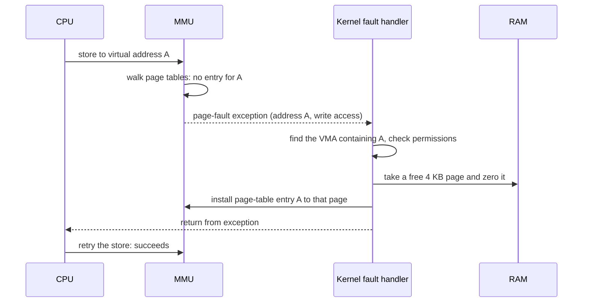
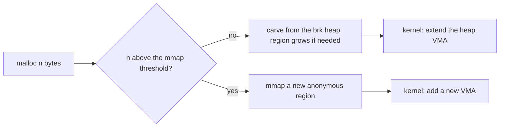

# Debugging Wizard — Phase 0, Chapter 2
# What a Process Really Is: Memory from the Kernel's Point of View

> **How to use this note** (same as Chapter 1)
> 1. Read the short concept at the start of each step.
> 2. Answer the 🧠 THINK / 🔬 PREDICT questions **on paper first**.
> 3. Only then open the **✅ Solution** block.
> 4. Run the experiment and record **your** numbers. If reality disagrees with your prediction, that is where the learning is.
> 5. Ask me follow-up questions any time. They go in the **Clarification Log** at the end.
>
> **About "reference data" boxes.** They show results I measured while testing this chapter on a *different machine* (a virtual machine, kernel 6.18, GCC 13, transparent hugepages set to `madvise`). They show what to expect in *shape*, not in exact numbers. Yours may differ, and your numbers are the ones that matter.
>
> **All code is in this note.** Every new or changed file is listed in full in **Appendix A**. Steps show the important parts inline and point to the full listing.
>
> **Honesty note.** The C++ sources and both test programs were compiled with the strict warning flags and run, plain and under ASan/UBSan. The CMake files were **not** run through CMake (my sandbox has none), so your first `cmake --preset debug` after adding this chapter is their real test. Paste any error to me.

---

## 0. Chapter Overview

### 0.1 What You Will Learn

By the end of this chapter you can:

- **Explain** what the kernel keeps for a process (task, address space, VMAs, page tables, descriptor table) and which parts a user-space tool can read.
- **Read and interpret** `/proc/self/maps`: permissions, file-backed versus anonymous regions, `[heap]`, `[stack]`, `[vdso]`.
- **Predict and measure** how `mmap`, touching pages, `MADV_DONTNEED`, and `munmap` change `VmSize`, `VmRSS`, `RssAnon`, and page-fault counts.
- **Explain** demand paging and the page-fault path, and distinguish minor from major faults.
- **Implement** `dw_core`, the first code in `src/`: a robust file reader, a memory snapshot, and a maps parser.
- **Validate** our numbers against independent views (sum of maps, `VmSize`, `pmap`).
- **Measure** what one snapshot costs, split into user and kernel time.
- **Explain** why a single number such as VSZ can mislead.

### 0.2 Prerequisites

Chapter 1 complete: presets build, `dw::Fd` exists, `run_measure` works. Tools: `pmap` (in `procps`, normally installed) and `strace`.

### 0.3 Why This Matters to Debugging Wizard

In Chapter 1, the leak grew `VmSize` by 1,028 kB per second while `VmRSS` grew by only 4 kB per second. Now we find out *why* those two numbers live in different places in the kernel. Every later phase depends on this: Phase 2 reads these files for *other* processes, Phase 3 builds leak and growth detection on them, and Phase 8 optimizes how cheaply we can read them.

### 0.4 Step Map

| Step | Focus |
|------|-------|
| 2.1 | What the kernel keeps for a process |
| 2.2 | The address space: `/proc/self/maps` |
| 2.3 | Pages and page faults |
| 2.4 | Build: the first code in `src/` (`dw_core`) |
| 2.5 | Experiment: demand paging (`touch_pages`) |
| 2.6 | Where do `malloc`'d bytes live? (`heap_vs_mmap`) |
| 2.7 | Validate against independent views |
| 2.8 | Break it: failure analysis |
| 2.9 | Measure our own cost (`bench_snapshot`) |
| 2.10 | Explain-it-back, knowledge check, completion |

### 0.5 Project Conventions (unchanged)

Code lives in the note. Predict before you run. Change one variable at a time. **Shell for short glue only; benchmarking and measurement code is always C++.** Chapter 1's `run_measure` benchmarks an external program end-to-end (fork, exec, wait); this chapter's `bench_snapshot` times one function from inside its own process (`chrono` plus `getrusage`) — both are C++, chosen for what each is measuring. Record the machine in `docs/environment.md`.

---

## Step 2.1 — What the Kernel Keeps for a Process

```mermaid
flowchart TD
    T[task_struct: the process] --> M[mm_struct: the address space]
    T --> F[files_struct: descriptor table]
    T --> S[scheduler state, credentials, signals]
    M --> V[VMAs: list of valid mappings]
    M --> PT[Page tables: virtual to physical]
    M --> C[Counters: total size, resident pages by kind, peak]
    PT --> MMU[MMU hardware walks them on every access]
    C --> P1[/proc/PID/status]
    V --> P2[/proc/PID/maps]
    F --> P3[/proc/PID/fd]
```

**How to read this diagram:**

| Element | Meaning |
|---------|---------|
| `task_struct` | The kernel's record of one schedulable thing: identity, state, credentials, pointers to everything else. |
| `mm_struct` | The process's **address space**. Threads of one process share it. |
| VMAs (virtual memory areas) | A list of ranges the process is **allowed** to use: start, end, permissions, and what backs it (a file or nothing). Think of them as **promises**. |
| Page tables | The structure the CPU's **MMU** walks to turn a virtual address into a physical one. An entry exists only for a page that is **actually in RAM**. Think of them as **facts**. |
| Counters | Totals the kernel maintains as it works: total mapped size (`VmSize`), resident pages split into anonymous / file / shared (`RssAnon`, `RssFile`, `RssShmem`), and a peak (`VmHWM`). |
| Arrows to `/proc/...` | These files are **windows**: when you `read()` one, the kernel formats the current state as text on the spot. |

**Where execution transitions:** user code touches a virtual address → the MMU consults page tables → if there is no entry, the CPU jumps into the kernel (Step 2.3). **Where data moves:** only when a page is first supplied. **How to observe:** `maps` shows the promises, `status` shows the totals.

> **The key idea of this chapter.** The *gap* between promises (VMAs) and facts (page tables) is what makes `VmSize` and `VmRSS` different numbers.

### 🧠 THINK

1. In Chapter 1, `VmSize` grew 1,028 kB/s while `VmRSS` grew 4 kB/s. Which kernel structure changed for `VmSize`, and which for `VmRSS`?
2. If VMAs are promises and page tables are facts, what happens when the CPU touches an address that is inside a VMA but has no page-table entry? What if there is no VMA at all?
3. Which of these can Debugging Wizard read for its own process without special privileges: the VMA list, the counters, the page tables? Through which files?

<details>
<summary>✅ Solution</summary>

1. `VmSize` follows the **total size of the VMAs**: each `mmap` adds a VMA, so it jumped by about 1 MB immediately. `VmRSS` follows the **resident-page counters**, which change only when the kernel installs a page-table entry for a page. The leak touched one page per block, so RSS moved by one 4 KB page.
2. Inside a VMA but no entry: the CPU raises a **page fault**, the kernel checks the VMA's permissions, supplies a page, installs the entry, and the instruction is retried, invisibly to the program. **No VMA at all**, or a permission violation (writing to a read-only region): the kernel delivers `SIGSEGV`. A segmentation fault is precisely "access outside the promises".
3. The VMA list through `/proc/self/maps`, and the counters through `/proc/self/status`. The raw page tables are not exposed as text (a restricted binary interface, `/proc/PID/pagemap`, exists; it comes up in Phase 3).

</details>

---

## Step 2.2 — The Address Space: `/proc/self/maps`

### The format

Each line is one VMA. A real example from a small C++ program (addresses shortened for reading):

```
5653bb9af000-5653bb9b1000 r--p 00000000 fe:00 190933   /usr/bin/head
5653bb9b1000-5653bb9b7000 r-xp 00002000 fe:00 190933   /usr/bin/head
5653bb9ba000-5653bb9bb000 rw-p 0000a000 fe:00 190933   /usr/bin/head
5653e8644000-5653e8665000 rw-p 00000000 00:00 0        [heap]
7f1fa5028000-7f1fa51b0000 r-xp 00028000 fe:00 191494   /usr/lib/x86_64-linux-gnu/libc.so.6
7f1fa5205000-7f1fa5212000 rw-p 00000000 00:00 0
```

| Field | Meaning |
|-------|---------|
| `start-end` | The virtual address range (hexadecimal, end exclusive). |
| `r w x p/s` | Permissions: read, write, execute, and `p` = private (copy-on-write) or `s` = shared. |
| offset | Where in the backing file this mapping starts. |
| `dev inode` | Which file backs it (`00:00 0` means **no file**: an *anonymous* mapping). |
| path | The file, or a special name: `[heap]` (the `brk` heap), `[stack]`, `[vdso]` and `[vvar]` (kernel-provided pages for fast syscalls and time), `[vsyscall]` (a legacy page). |

An executable appears as **several** VMAs because the kernel maps each ELF segment separately with its own permissions: read-only headers, read+execute code, read-only constants, read+write data. Normally **no region is both writable and executable**. Just-in-time compilers are the exception.

### 🧪 EXPERIMENT

```bash
head -30 /proc/self/maps        # 'head' inspects ITSELF
head -30 /proc/self/maps        # run it again and compare addresses
```

### 🔬 PREDICT

1. Which `r-xp` region is largest in a typical small C++ program, and why?
2. Run twice: will the `[heap]` and `[stack]` addresses be the same?
3. Can a normal region be both writable and executable? What enforces the permissions?

<details>
<summary>✅ Solution</summary>

1. A **shared library**, not your program. In the reference run, `libc` code was about 1.5 MB and `libstdc++` about 1.3 MB, while a tiny program's own code is a few kB. Your executable is small; the runtime it drags in is big.
2. **Different.** Address-space layout randomization (ASLR) picks new base addresses at every `exec`. It makes exploits harder. For our tools it means **never compare raw addresses across runs**; compare sizes and roles.
3. Not normally (the "W^X" policy). The **MMU** enforces permissions using bits in each page-table entry. A violation raises a fault, and the kernel answers with `SIGSEGV`.

</details>

---

## Step 2.3 — Pages and Page Faults



**How to read this diagram:**

| Step | What it means |
|------|---------------|
| Who initiates | An ordinary user instruction. The program did nothing special. |
| Where execution transitions | User mode → kernel (exception) → back to user mode, then the **same instruction runs again**. |
| What state changes | A page-table entry appears, the resident-page counter rises, and the process's fault counter rises. |
| Where data moves | The kernel **zero-fills** a fresh page (the kernel writes zeros). For *anonymous* memory no disk is involved. |
| Where blocking can occur | Finding a free page may force the kernel to reclaim memory first. If the page must come from **disk** (a file not in the page cache, or swap), the process sleeps until the I/O completes. |
| How to observe | `getrusage()` gives `ru_minflt` and `ru_majflt`. Also `/proc/PID/stat`, and later `perf`. |

- **Minor fault:** served **without disk I/O** (zero-fill, or the data was already in the page cache).
- **Major fault:** required **disk I/O**.

A page fault is not an error. "Fault" is just the CPU's name for the exception that *implements demand paging*.

### 🧠 THINK

1. A program calls `malloc(1 GB)` and never touches it. Does it use 1 GB of RAM? When would the system notice a problem?
2. Chapter 1's leak touched *one byte* per 1 MB block. Why did that cost a whole 4 KB of RSS?
3. Is a page fault a bug?

<details>
<summary>✅ Solution</summary>

1. No. It reserves 1 GB of *address space* (VMA), and RAM is consumed page by page as pages are **touched**. Under Linux's default overcommit heuristic the reservation succeeds unless the request is obviously absurd (larger than total RAM plus swap), even when most RAM is already in use, so trouble (memory pressure, the OOM killer) typically appears **at touch time**, not at `malloc` time. A tool that only watches for allocation failures will miss it.
2. The MMU works in whole pages. The first touch of any byte faults in the entire 4 KB page containing it.
3. No. It is the normal mechanism behind lazy allocation, program loading, and file mapping. Only a fault the kernel cannot resolve (no VMA, wrong permissions) is an error, and that is delivered as `SIGSEGV`.

</details>

---

## Step 2.4 — Build: The First Code in `src/`

Until now everything lived in `lab/`. This chapter's reader is used by later phases, so it **earns its place in `src/`** as the static library `dw_core`.

📄 **Full files:** Appendix A.4 (`src/CMakeLists.txt`), A.7 (`proc_self.hpp`), A.8 (`proc_self.cpp`). Updated CMake files: A.1, A.2, A.3. Test: A.12.

### Where does each number come from?

```mermaid
flowchart LR
    A[MMU: page tables and fault exceptions] --> B[Kernel: mm_struct counters, per-task usage]
    B --> C1[/proc/self/status: text formatted on read]
    B --> C2[getrusage syscall: binary struct]
    B --> C3[/proc/self/maps: one line per VMA]
    C1 --> D[read_file: open, read until EOF, close]
    C3 --> D
    D --> E[parse with string_view and from_chars, or sscanf]
    E --> F[MemSnapshot and MapEntry]
    C2 --> F
    F --> G[Your tool: print, compare, decide]
```

**How to read this diagram:** hardware events (page-table changes, fault exceptions) update kernel counters. The kernel exposes them two ways: as **formatted text** in `/proc` files (which we must read and parse) and as a **binary struct** from `getrusage` (no parsing). Both meet in our snapshot.

| Zoom | For the number `VmRSS` |
|------|------------------------|
| 1. User | "How much memory is my program using?" |
| 2. C++ | `read_mem_snapshot(s)` fills `s.vm_rss_kb` |
| 3. Linux interface | `open`, `read`, `close` on `/proc/self/status` |
| 4. Kernel | The resident-page counters in `mm_struct`, updated by the fault handler |
| 5. Hardware | The MMU finding (or not finding) a page-table entry, and raising the fault |

### Step A: read a whole virtual file

```cpp
bool read_file(const char* path, std::string& out) {
    out.clear();
    Fd fd(::open(path, O_RDONLY | O_CLOEXEC));
    if (!fd.valid()) { return false; }
    char buf[4096];
    for (;;) {
        const ssize_t n = ::read(fd.get(), buf, sizeof buf);
        if (n > 0)                  { out.append(buf, static_cast<std::size_t>(n)); }
        else if (n == 0)            { return true; }        // end of file
        else if (errno != EINTR)    { return false; }       // real error
    }
}
```

**THINK:** Why loop? `/proc/self/status` is only about 1.4 KB, so would one `read` of 4096 bytes be enough?

<details>
<summary>✅ Solution</summary>

For `status`, today, yes, but that is luck. `read()` may legally return **fewer bytes than requested**, and other files are much bigger: `maps` has one line per mapping, and a large program has hundreds. A single read would **silently truncate**, giving a wrong but plausible-looking picture. Reading until `read` returns 0 (end of file) is the only correct contract. We also retry on `EINTR` (a signal interrupted the call before any data was read) and reuse `dw::Fd` from Chapter 1, so the descriptor closes on every path. `O_CLOEXEC` keeps the descriptor from leaking into any program we later `exec`.

</details>

### Step B: parse `status` without copying

For each line we split at `:` using `std::string_view` (no allocation), compare the key, and convert the number with `std::from_chars`. Missing fields stay at **-1**.

**THINK:** Why `-1` for "missing" rather than `0`?

<details>
<summary>✅ Solution</summary>

Because `0` is a **valid measurement** (for example, zero major faults). If a field is missing, as `VmSize` is for kernel threads and zombie processes (Step 2.8), a reader must be able to tell "the kernel said 0" from "the kernel said nothing". Collapsing them would turn an absence of evidence into a false fact, which breaks the project's fact-versus-interpretation rule.

</details>

### Step C: page faults from `getrusage`

Fault counts are not in `status`. `getrusage(RUSAGE_SELF)` returns `ru_minflt` and `ru_majflt` for the whole process (all threads), straight from kernel accounting, with no text parsing.

### Step D: parse `maps`

```cpp
const int fields = std::sscanf(line.c_str(), "%lx-%lx %7s %lx %31s %lu %n",
                               &start, &end, perms, &offset, dev, &inode, &consumed);
if (fields < 6) { return false; }   // unexpected format
```

The `%n` records how many characters were consumed, so **everything after that point is the path**, including spaces (paths can contain spaces). Anonymous lines have no path, so `path` stays empty.

**THINK:** Why does `read_maps` return `false` on an unexpected line instead of skipping it?

<details>
<summary>✅ Solution</summary>

A silently incomplete picture is worse than an error. If we skipped a line we did not understand, later totals would be quietly wrong and nobody would know why. Failing loudly makes the problem visible at the point where it is cheapest to diagnose. This is the same reasoning as the `-1` sentinel: **never let a measurement pretend to be more certain than it is.**

</details>

### Step E: build and test

```bash
cmake --preset debug && cmake --build --preset debug -j
ctest --preset debug
cmake --preset asan  && cmake --build --preset asan -j
ctest --preset asan
```

`proc_self_test` checks: whole-file reading and clean failure on a missing file; that `VmRSS` equals `RssAnon + RssFile + RssShmem` (within 8 kB); that `mmap` grows `VmSize` but barely `VmRSS`; that touching every page grows `RssAnon` and the fault count; that `munmap` returns the address space; and that a stack address lands in `[stack]` and a code address in an executable mapping.

**THINK:** `dw_core` is compiled with the same sanitizer flags as its users because `dw_options` is linked `PUBLIC`. Why does that matter?

<details>
<summary>✅ Solution</summary>

Instrumented and uninstrumented code mixed in one program can hide bugs at the boundary: ASan only checks accesses made by instrumented code, and it replaces `malloc` process-wide, so memory allocated by one side and freed by the other is checked inconsistently. Propagating the flags through the library target guarantees that when we say "this build is sanitized", **all** of our code is.

</details>

---

## Step 2.5 — Experiment: Demand Paging

📄 **Full file:** Appendix A.10 (`touch_pages.cpp`).

`touch_pages` maps 256 MB of anonymous memory and walks through six steps, printing the kernel's numbers after each:

```bash
./build/debug/lab/touch_pages 256
cat /sys/kernel/mm/transparent_hugepage/enabled     # record this setting
```

### 🔬 PREDICT (fill in before running)

The region is 256 MB = 65,536 pages of 4 KB.

| Step | VmSize | VmRSS | Minor faults (cumulative) | VmHWM |
|------|--------|-------|---------------------------|-------|
| 1. after `mmap`, untouched | ? | ? | ? | ? |
| 2. touched first half | ? | ? | ? | ? |
| 3. touched everything | ? | ? | ? | ? |
| 4. after `madvise(MADV_DONTNEED)` | ? | ? | ? | ? |
| 5. re-touched first half | ? | ? | ? | ? |
| 6. after `munmap` | ? | ? | ? | ? |

<details>
<summary>✅ Solution</summary>

> **📊 Reference data** (sandbox, 4 KB pages, hugepages `madvise`; sizes in kB):
>
> | Step | VmSize | VmRSS | RssAnon | VmHWM | Minor faults (cumulative) |
> |------|--------|-------|---------|-------|---------------------------|
> | 0 baseline | 6,384 | 3,708 | 208 | 3,708 | 0 |
> | 1 after `mmap` | 268,528 | 3,772 | 208 | 3,772 | 0 |
> | 2 touched first half | 268,528 | 134,844 | 131,280 | 134,844 | 32,768 |
> | 3 touched everything | 268,528 | 265,916 | 262,352 | 265,916 | 65,536 |
> | 4 `madvise(DONTNEED)` | 268,528 | 3,772 | 208 | 265,836 | 65,536 |
> | 5 re-touched first half | 268,528 | 134,844 | 131,280 | 265,836 | 98,304 |
> | 6 `munmap` | 6,384 | 3,772 | 208 | 265,836 | 98,304 |

**Row by row:**
1. `VmSize` jumps by exactly **262,144 kB (256 MB)**, because a VMA was added. `VmRSS` moves by only about 64 kB, because **nothing was touched**. No faults.
2. Touching one byte per page for the first 32,768 pages costs **exactly 32,768 minor faults** (one per page) and adds exactly **131,072 kB (128 MB)** to RSS. Note that it went to `RssAnon`: anonymous memory.
3. Everything touched: 65,536 faults, RSS is about 256 MB above baseline.
4. `MADV_DONTNEED` tells the kernel to **discard** the pages. RSS falls back to baseline, `VmSize` does **not** change (the promise remains), the fault counter does not change (discarding is not a fault), and `VmHWM` keeps the **peak**.
5. Touching again faults again: **another 32,768 faults**. The kernel supplies fresh zero-filled pages, because the old contents were thrown away.
6. `munmap` removes the VMA: `VmSize` returns to baseline, while the peak in `VmHWM` stays.

**If your hugepage setting is `always`:** the kernel may map 2 MB pages instead, so you will see roughly 512 times *fewer* faults and RSS growing in 2 MB steps. Same mechanism, different granularity: check your setting before comparing to the table.

</details>

### 👀 OBSERVE (write down your own numbers)

```
hugepage setting: __________     step 2 minor faults: ________     step 2 RSS growth: ________ kB
```

### ⚠️ BREAK IT

Run the **sanitizer build** and look at `VmSize`:

```bash
cmake --build --preset asan -j
./build/asan/lab/touch_pages 64
```

**PREDICT:** how does the baseline `VmSize` change, and what does that tell you about alerting on VSZ?

<details>
<summary>✅ Solution</summary>

> **📊 Reference data:** baseline `VmSize` was **21,474,898,776 kB, about 20 TiB**, while `VmRSS` was only about 8 MB.

ASan reserves a vast range of address space for its shadow memory, but almost none of it is ever touched. This is the same lesson as Step 2.3 in a dramatic form: **`VmSize` is a reservation counter, not a usage counter.** Alerting on VSZ would fire constantly on any sanitized build and on programs that legitimately reserve large ranges (thread stacks, mapped files, allocator arenas). A useful detector combines VSZ, RSS by kind, and the *trend*.

</details>

---

## Step 2.6 — Where Do `malloc`'d Bytes Live?

📄 **Full file:** Appendix A.11 (`heap_vs_mmap.cpp`).

`malloc` is a user-space library function. Underneath, glibc asks the kernel for memory with `brk` (growing the `[heap]` region) or `mmap` (a fresh anonymous region). `heap_vs_mmap` allocates six sizes and uses `find_map` to ask which mapping contains each pointer.



**How to read this diagram:** small requests are served from one shared heap that grows with `brk`; large requests each get their own mapping. The switch point is glibc's *mmap threshold*, **128 KiB by default** (it can adapt upward at run time).

```bash
./build/debug/lab/heap_vs_mmap
strace -e trace=brk,mmap,munmap ./build/debug/lab/heap_vs_mmap 2>&1 | tail -20
```

### 🔬 PREDICT

For requests of 64 B, 1 KB, 64 KB, 200 KB, 1 MB, and 16 MB: which land in `[heap]` and which in an anonymous mapping? What will `strace` show for the two groups?

<details>
<summary>✅ Solution</summary>

> **📊 Reference data:**
> | Request | Region | Region size (kB) |
> |---------|--------|------------------|
> | 64 B, 1 KB, 64 KB | `[heap]` | 268 |
> | 200 KB | (anonymous) | 224 |
> | 1 MB | (anonymous) | 1,028 |
> | 16 MB | (anonymous) | 16,388 |

The three small requests share `[heap]`. The three large ones (above 128 KiB) each have their own anonymous mapping. `strace` should show `brk` calls for heap growth and `mmap` calls for the large blocks (verify this yourself; I could not run `strace` in my sandbox).

**Two details to notice:**
- 1 MB shows as **1,028 kB**: the request plus glibc's 16-byte header, rounded up to whole pages (the same extra page that made Chapter 1's leak grow at 1,028 kB per second).
- The 200 KB block shows as **224 kB**, more than a 200 KB block should need (about 208 kB). The kernel **merges neighbouring VMAs** that have identical permissions and no file, so a region can be larger than the one allocation inside it. *A maps line is a VMA, not an allocation.*

</details>

### 🧠 THINK

1. After `free()` of the 1 MB block, would you expect `VmSize` and `VmRSS` to drop? What about `free()` of a 64 KB block in the heap?
2. How does this connect to Chapter 1's benchmark, where the plain build took 259,000 page faults while holding 9 MB?

<details>
<summary>✅ Solution</summary>

1. For the mmapped block, glibc calls `munmap`, so **both** drop immediately. For a heap block, the memory is normally kept for reuse, so neither drops, unless the freed space is at the *top* of the heap and exceeds the trim threshold, in which case glibc gives it back with `brk`.
2. That is exactly the mechanism we tested in Chapter 1: each round freed memory at the top of the heap, glibc returned it to the kernel, and the next round faulted it in again. Setting `MALLOC_TRIM_THRESHOLD_` stopped the giving-back and halved the runtime. Now you can see it in the kernel's own terms: a **VMA shrinks and regrows, and every regrowth costs minor faults**.

</details>

---

## Step 2.7 — Validate Against Independent Views

A number is trustworthy when an **independent** route gives the same answer. `maps_summary` (Appendix A.9) sums the sizes of all VMAs and compares the total with `VmSize`:

```bash
./build/debug/lab/maps_summary
```

Independent check on a longer-lived process (note the short pause, which avoids sampling the shell before `sleep` has finished its `exec`):

```bash
sleep 30 &  SP=$!
sleep 0.5
grep VmSize /proc/$SP/status
pmap -x $SP | tail -1
kill $SP
```

### 🔬 PREDICT

Will the sum of maps equal `VmSize` exactly? Will `pmap`'s total equal either?

<details>
<summary>✅ Solution</summary>

> **📊 Reference data:**
> - `maps_summary` on itself: sum of maps **6,408 kB**, `VmSize` **6,404 kB**, difference **4 kB**, and the summary lists `[vsyscall]` as exactly **4 kB**.
> - On a `sleep` process: `VmSize` **2,704 kB**, `pmap` total **2,708 kB**, sum of `maps` **2,708 kB**.

Three routes agree apart from a constant **4 kB**, the size of the single `[vsyscall]` page. Our *hypothesis* is that this legacy page is listed in `maps` but not counted in `VmSize`. It is consistent with both measurements but I have not checked the kernel source, so treat it as a strong hypothesis, not a proven fact.

This is Version F of the project ladder: **validated against independent tools.** Where numbers differ by a constant, name the constant; do not paper over it.

> **Warning about "the first sample".** An earlier attempt of mine sampled `sleep` immediately after starting it and got a wildly different `VmSize`: the process was still the *forked shell* before its `exec`. A process's identity can change under you. That is one more reason to never treat a single early sample as truth.

</details>

---

## Step 2.8 — Break It: Failure Analysis

Real `/proc` reading fails in specific, predictable ways. Predict each, then try.

### 🧠 THINK

1. **Truncation.** In `read_file`, replace the loop with a single `read` into a 256-byte buffer. Which check in `proc_self_test` fails first, and why does it not crash?
2. **Permission.** As a normal user, `cat /proc/1/status` versus `cat /proc/1/maps`. Which do you expect to work?
3. **Missing fields.** What does `/proc/2/status` (a kernel thread) contain for `VmSize` and `VmRSS`?
4. **Peak counters.** After `MADV_DONTNEED` (Step 2.5, step 4) the peak `VmHWM` is supposed to never go down. Did it, between step 3 and step 4?
5. **Consistency.** We read `status` and `maps` at two different instants. Can they disagree?

<details>
<summary>✅ Solution</summary>

1. **Verified by running it.** The first failing check is the one that looks for `VmRSS:` in the text: `VmRSS:` starts at **byte 291** of `status`, past the 256-byte buffer, so it is simply not there. The size check (`> 200`) still passed, because 256 bytes were read. Even more instructive: with the truncated reader, `read_mem_snapshot` still returned **success**, with `VmSize` correct (its line comes early) and every later field (`VmRSS`, `VmHWM`, `RssAnon`, `Threads`) at **-1**. The program did not crash and the call did not fail: it returned *half-right data*. Two lessons: truncation is dangerous because it hides behind a success return, and the `-1` sentinel (Step 2.4, Step B) is what stopped it from reporting fake zeros. Try it yourself and compare.
2. **Prediction:** `status` is readable by everyone, but `maps` (like `fd` and `smaps`) is **access-checked** and needs permission to inspect that process (same user, or `CAP_SYS_PTRACE`), so a normal user should get `Permission denied` for `/proc/1/maps`. Verify it on your machine. This is why Phase 2's process observer must treat "permission denied" as a normal, expected outcome, not a crash.
3. **Verified in my sandbox:** the kernel thread's `status` has `Name:` and `Threads:` but **no `VmSize` or `VmRSS` lines at all**. Our `-1` sentinel handles this correctly; a parser that assumed those lines exist would fail or invent zeros.
4. **Yes, it went down** (see below).
5. **Yes.** Memory can change between our two reads, so `VmSize` and the maps total can differ by whatever happened in between. That is why our tests use tolerances, and why a snapshot must be described as "approximately simultaneous", never "atomic".

**Observation 4 in detail.** Across 30 runs of `touch_pages 256`, the `VmHWM` shown at step 4 was **lower than at step 3 in 30 of 30 runs**, by 76 to 148 kB (about 0.03-0.06%). At step 3 the value reported equals the *current* RSS. At step 4 it is a *stored* peak.

**Hypothesis** (not verified against kernel source): the kernel reports `VmHWM` as the larger of the current RSS and a stored high-water mark, and the stored mark is updated only at certain events (such as when pages are unmapped) rather than continuously. So a "peak" read at one moment can be slightly above what the stored mark later shows. The practical lesson is safe either way: **even the kernel's peak is an approximation**, so treat it as accurate to roughly 0.1%, never to the kilobyte. Distinguish what you *observed* (a decrease, 30 of 30 times) from what you *concluded* (a lazily updated mark): the two carry different confidence.

</details>

---

## Step 2.9 — Measure Our Own Cost

Reading `status` is not free. `bench/bench_snapshot.cpp` (Appendix A.6) calls `read_mem_snapshot` N times and reports the time per call. This time the **timer lives inside the program itself**, so there is no separate tool to build or run:

```cpp
const rusage ru_before = self_usage();               // getrusage(RUSAGE_SELF): our own CPU time so far
const auto t0 = std::chrono::steady_clock::now();    // a monotonic wall clock

for (long i = 0; i < calls; ++i) {
    if (!dw::read_mem_snapshot(s)) { /* ... */ }
    sink += s.vm_rss_kb;                              // keeps the compiler from deleting the loop
}

const auto t1 = std::chrono::steady_clock::now();
const rusage ru_after = self_usage();
```

`std::chrono::steady_clock` never jumps backward (unlike wall-clock time, which NTP can adjust), so it is the right clock for measuring a duration. `getrusage(RUSAGE_SELF)` is a single syscall that returns *our own* accumulated CPU time and fault counts, straight from the kernel's accounting: no `fork`, no external process, no parsing.

```bash
cmake --preset rel   && cmake --build --preset rel -j     # -O2 build
cmake --preset debug && cmake --build --preset debug -j   # -O0 build, for comparison

./build/rel/bench/bench_snapshot 50000
./build/debug/bench/bench_snapshot 50000
```

> **Why `bench/`, not `lab/`?** `lab/` is for throwaway experiments and deliberately broken programs (Chapter 1's rule). A benchmark is neither: it is a small piece of permanent tooling whose whole job is to produce a trustworthy number, and future chapters will want to run it again and compare. So it gets its own top-level folder, built by its own `bench/CMakeLists.txt` and linked straight against `dw_core`, the same way `lab/`'s `dw_lab_core` programs are. *(Chapter 1's `lab/bench.cpp` and `lab/run_measure.cpp` predate this distinction and still live in `lab/`; moving them is a Chapter 1 change, not made here.)*

### 🧠 THINK

1. Why take `getrusage` *and* `steady_clock` readings, instead of just timing wall time?
2. `sink += s.vm_rss_kb;` does nothing useful with the result. Why is it there?
3. Why measure `RUSAGE_SELF` from inside the very program being measured, instead of using a wrapper program (like Chapter 1's `run_measure`) that forks, execs, and waits?

<details>
<summary>✅ Solution</summary>

1. Wall time (`steady_clock`) tells you how long the loop *felt* from outside: it includes time the scheduler gave to **other** processes on the machine instead of us. `getrusage`'s user/sys times are what the kernel attributes specifically **to this process**, so subtracting them from wall time reveals how much of the wait was scheduling contention rather than our own work. Reporting only wall time would blame our code for noise on a busy machine.
2. Compilers are allowed to delete a loop whose result is never used (dead-code elimination), especially at `-O2`. Accumulating into `sink` and printing it afterward forces every call to actually happen. This is the same concern as Chapter 1's `bench.cpp`.
3. A fork-and-wait wrapper (`run_measure`) is the right tool for benchmarking **another program end-to-end**, including its process startup. Here we want the cost of **one function**, called many times, inside a process whose startup we don't care about. Reading our own `rusage` needs no extra process, no `fork`, and no `wait4`, so it is simpler and has less overhead of its own for this specific job. Chapter 1's approach and this one measure different things: an external program vs. one function.

</details>

### 🔬 PREDICT

1. Time per call at `-O2`: about 0.5 µs, 5 µs, or 50 µs? Is it mostly user time or kernel time?
2. How much slower is the `-O0` build, and where does the slowdown live (user or kernel)?
3. At 1,000 snapshots per second, what fraction of one CPU does *just this file* cost?
4. Does memory grow over more calls? How would this program's own output show that?

<details>
<summary>✅ Solution</summary>

1. > **📊 Reference data (sandbox, `-O2`, three repeats of 50,000 calls):**
   > | Run | Wall/call | User/call | Sys/call |
   > |-----|-----------|-----------|----------|
   > | 1 | 6.11 µs | 1.67 µs | 4.42 µs |
   > | 2 | 5.95 µs | 0.62 µs | 5.32 µs |
   > | 3 | 6.03 µs | 1.43 µs | 4.61 µs |

   About **6 µs per call**, and **kernel (sys) time dominates**: roughly 4.5-5.3 µs of the 6 µs is the kernel formatting all ~40 lines of `status`, while our own parsing costs only about 1-1.7 µs. User time visibly **jitters between runs** (0.62 to 1.67 µs) while sys time stays tighter — a reminder to repeat runs rather than trust one number.

2. > **📊 Reference data (`-O0`, 50,000 calls):**
   > | Wall/call | User/call | Sys/call |
   > |-----------|-----------|----------|
   > | 15.19 µs | 10.78 µs | 4.38 µs |

   About **2.5x slower overall**, and the slowdown is **entirely in user time** (0.62-1.67 µs at `-O2` versus 10.78 µs at `-O0`, roughly 8-17x). Kernel time barely moves (4.4-5.3 µs either way), which makes sense: the kernel's own `status`-formatting code is compiled once, in the kernel, unaffected by *our* optimization flags. Only *our* parsing (`string_view`, `from_chars`) gets slower without optimization. This repeats Chapter 1's warning that **Debug timings mislead**: benchmark with `-O2`.

3. About 6 µs × 1,000 = 6 ms per second, roughly **0.6% of one CPU** at `-O2` (1.5% at `-O0`), for reading one file. Phase 1 reads four system files, and Phase 2 reads several *per process*, so this cost multiplies. That is what Phase 1's persistent-descriptor experiments and Phase 8's optimization work will address, **only where measurement justifies it**. We do not optimize now.

4. **No growth observed.** The program prints `minor faults during loop`, and comparing across call counts shows it flat:
   > **📊 Reference data (`-O2` build):**
   > | Calls | Minor faults during the loop |
   > |-------|-------------------------------|
   > | 1,000 | 2 |
   > | 10,000 | 2 |
   > | 50,000 | 2 |
   > | 200,000 | 2 |

   Essentially **zero faults regardless of call count**, because `read_mem_snapshot` reuses the same stack-allocated buffer and `std::string` capacity on every call rather than allocating fresh memory each time. (Compare this with Chapter 1's `bench.cpp`, which *did* allocate every round and faulted heavily.) The ASan build's exit-time leak scan also reported nothing. That is evidence of **no growth in these runs**, obtained with the tool this chapter built. It is not a proof for all inputs.

</details>

### ⚠️ A caveat: this note cannot confirm the syscall count

An earlier draft of this chapter predicted `openat`, two `read`s, `close`, and `getrusage` per snapshot, verified with `strace -c`. `strace` was not available while re-testing this version, so that specific claim is **unverified here** — check it yourself:

```bash
strace -c -e trace=openat,read,close,getrusage ./build/debug/bench/bench_snapshot 1000
```

**PREDICT before running:** how many of each syscall do you expect for 1,000 calls, and why two `read`s per call rather than one?

<details>
<summary>✅ Reasoning (not yet re-verified against real strace output)</summary>

`dw::read_file` (Chapter 2, Step 2.4) loops until `read()` returns **0** (end of file), because a single `read()` is allowed to return fewer bytes than the whole file. For a ~1.4 KB file that usually means one `read()` returning the data, and a second `read()` returning 0. So the expected pattern per call is one `openat`, two `read`s, one `close`, and one `getrusage` — for 1,000 calls: about 1,000 `openat`, 2,000 `read`, 1,000 `close`, 1,000 `getrusage`, plus a handful from process startup. Confirm this on your machine and tell me if it differs.

</details>

---

## Step 2.10 — Explain It Back, Knowledge Check, Completion

### 🎯 Explain-it-back (no notes)

> We `mmap`'d 256 MB and `VmSize` rose by 256 MB but `VmRSS` did not move. Then we touched half of it and got exactly 32,768 minor faults and 128 MB more RSS. Explain both observations, naming the kernel structures involved.

<details>
<summary>✅ Model answer</summary>

`mmap` only adds a VMA to the process's address space: a promise that the range is valid. Total mapped size (`VmSize`) is the sum of VMAs, so it grows at once, but no page-table entry exists and no RAM has been assigned, so the resident counters (`VmRSS`) do not move. When we touched one byte in each of 32,768 pages (128 MB with 4 KB pages), each first touch found no page-table entry, so the MMU raised a page fault. The kernel's handler found the VMA, checked that writing was allowed, took a free page, zero-filled it, installed a page-table entry, and returned so the instruction retried. Each of those is one minor fault (no disk), and each adds 4 KB to the anonymous resident count: 32,768 × 4 KB = 128 MB, matching the observed 32,768 faults and +131,072 kB.

</details>

### Knowledge Check

**Level 1: Recall.** What is a minor page fault?

<details><summary>✅ Solution</summary>A page fault the kernel resolves without disk I/O, for example by zero-filling a new anonymous page or by finding the data already in the page cache.</details>

**Level 2: Understanding.** In the reference run the baseline `VmRSS` was 3,708 kB but `RssAnon` only 208 kB. Where was the rest?

<details><summary>✅ Solution</summary>In <code>RssFile</code> (and a little <code>RssShmem</code>): resident pages of the executable and shared libraries such as libc and libstdc++, which are file-backed. <code>VmRSS = RssAnon + RssFile + RssShmem</code>, and our test checks exactly that identity. A small program's resident memory is mostly its runtime's code, not its data.</details>

**Level 3: Mechanism.** Where does `VmSize` come from, and why does it not go down when we call `MADV_DONTNEED`?

<details><summary>✅ Solution</summary>It is the total size of all VMAs, kept as a counter in the process's <code>mm_struct</code>. <code>MADV_DONTNEED</code> discards the *pages* (page-table entries and RAM) but leaves the VMA, so the promise, and therefore <code>VmSize</code>, is unchanged. Only <code>munmap</code> removes the VMA.</details>

**Level 4: Experiment.** How would you prove that `MADV_DONTNEED` actually discards the data rather than merely marking it?

<details><summary>✅ Solution</summary>Write a nonzero value (say 42) into a page, call <code>madvise(DONTNEED)</code>, then read the same address. If the data is discarded, the read faults in a fresh zero-filled page and returns 0, and the fault counter rises. (This is Exercise 2.)</details>

**Level 5: Debugging.** A monitor shows `VmRSS` flat but `VmSize` rising 1 MB per second. Is the program safe? What would you look at?

<details><summary>✅ Solution</summary>Not necessarily safe. Possibilities: an <b>address-space leak</b> (mappings created and never unmapped, so the region count in <code>maps</code> keeps rising); memory <b>reserved but not yet touched</b> that may be touched later (the leak arrives as an RSS jump); or a benign lazy buffer. Distinguish by watching <i>which</i> region grows and how many regions exist (<code>maps</code>), and by comparing <code>VmSize</code> with <code>RssAnon</code> over time. This is exactly Chapter 1's leak: loud in VSZ, silent in RSS.</details>

**Level 6: Systems reasoning.** RSS rises by 50 MB, yet the program made no allocations. List competing explanations and the measurement that separates them.

<details><summary>✅ Solution</summary>
- More of a **mapped file or library** faulted in (e.g. code paths first executed). <i>Separate by:</i> <code>RssFile</code> rises, <code>RssAnon</code> does not.
- The page cache filled by file reads that the process mapped. <i>Separate by:</i> <code>RssFile</code>, and the region's path in <code>maps</code>.
- **Transparent huge pages** promoting earlier-touched memory. <i>Separate by:</i> jumps in 2 MB steps, fault count barely moving, and the hugepage setting.
- A previously reserved region being touched for the first time (a lazy allocation, Step 2.3). <i>Separate by:</i> <code>RssAnon</code> rises with <code>VmSize</code> unchanged.
Each competing explanation predicts a different pattern across the fields, which is why the snapshot records them separately.
</details>

### Exercises

1. **Hugepages (optional, needs `sudo`, reversible).** Predict how the fault counts in Step 2.5 change with hugepages set to `always`, then test: `echo always | sudo tee /sys/kernel/mm/transparent_hugepage/enabled`, rerun `touch_pages`, and restore with `echo madvise | sudo tee ...` (use whatever you recorded in Step 2.5).
2. **Prove `DONTNEED` discards.** Extend `touch_pages`: write `42` to the first byte, call `madvise(DONTNEED)`, read it back, and print the value and the fault delta.
3. **`MAP_POPULATE`.** Predict RSS and the fault counter immediately after `mmap(..., MAP_POPULATE, ...)` of 256 MB, then measure. Are populated pages counted as faults?
4. **A major fault.** `mmap` a large file read-only and read every page. Predict `RssFile` versus `RssAnon`, and whether the faults are minor or major on a cold cache versus a warm one. (Dropping the page cache needs `sudo sh -c 'echo 3 > /proc/sys/vm/drop_caches'` and is safe but slows the machine briefly.)
5. **More fields.** Add `VmData`, `VmPTE` (page-table memory), and `VmSwap` to `MemSnapshot`. Which are missing on some kernels, and does your code cope?
6. **Break the reader.** Do Step 2.8, question 1, and record exactly which check fails and what the data looked like.
7. **Predict permission.** Do Step 2.8, question 2, as a normal user and record the exact error.

---

## Chapter Completion Criteria

I can:

- [ ] Explain promises (VMAs) versus facts (page tables), and redraw the Step 2.1 diagram from memory
- [ ] Read a `/proc/self/maps` line and explain every field
- [ ] Explain the page-fault path from the sequence diagram, including where execution transitions and where blocking can occur
- [ ] Predict the `touch_pages` table row by row and explain each number
- [ ] Explain why `MADV_DONTNEED` changes `VmRSS` but not `VmSize`
- [ ] Explain why `VmSize` alone is a poor alarm (the ASan 20 TiB case)
- [ ] Explain each design choice in `dw_core` (read loop, `-1` sentinel, fail-loudly parsing)
- [ ] Validate `VmSize` against the maps sum and `pmap`, and name the constant difference
- [ ] Break the reader, diagnose the truncation, and explain why it is dangerous
- [ ] Report the cost of one snapshot, split into user and kernel time, and explain why `-O0` misleads
- [ ] Answer all six knowledge-check levels without opening the solutions

---

## What This Unlocks Next

**Chapter 3 (deliberate bugs).** We recreate Chapter 1's leaks, plus growth, fragmentation, and excessive allocation, and now recognize each one **in the kernel's own numbers**: which region grows in `maps`, whether `RssAnon` or `VmSize` moves, how the fault counter behaves. `dw_core` is the instrument.

---

## Clarification Log

> Ask me anything about any step. Each question and answer can be appended here so this file becomes your complete study record.

| # | Step | Your question | Answer summary |
|---|------|---------------|----------------|
| 1 | | | |
| 2 | | | |
| 3 | | | |

---

## Appendix A — Complete Code, File by File

Everything new or changed in this chapter is on this page; no download is needed. Each listing is the exact file that was compiled and tested while preparing this note (the CMake files excepted, see the honesty note at the top). Files marked **Replaces** overwrite your Chapter 1 versions; everything else is new. Files from Chapter 1 that are not listed here are unchanged.

### A.0 Create the new folder

```bash
cd ~/debugging-wizard
mkdir -p src bench   # both already exist from Chapter 1 (they held only .gitkeep)
```

Create or replace each file at the path in its heading. In VS Code: right-click the folder → **New File**, and paste the listing.
### A.1 `CMakeLists.txt`

```cmake
cmake_minimum_required(VERSION 3.25)
project(DebuggingWizard VERSION 0.1.0 LANGUAGES CXX)

set(CMAKE_CXX_STANDARD 17)
set(CMAKE_CXX_STANDARD_REQUIRED ON)
set(CMAKE_CXX_EXTENSIONS OFF)
set(CMAKE_EXPORT_COMPILE_COMMANDS ON)   # clangd reads compile_commands.json

if(NOT CMAKE_BUILD_TYPE AND NOT CMAKE_CONFIGURATION_TYPES)
  set(CMAKE_BUILD_TYPE Debug CACHE STRING "Build type" FORCE)
endif()

option(DW_SANITIZE    "Build with AddressSanitizer + UBSan" OFF)
option(DW_WERROR      "Treat warnings as errors"            OFF)
option(DW_BUILD_LAB   "Build lab experiments"               ON)
option(DW_BUILD_BENCH "Build benchmark programs"            ON)
option(DW_BUILD_TESTS "Build tests"                         ON)

# One INTERFACE target carries include paths, warnings and sanitizer flags
# to every executable in the repo.
add_library(dw_options INTERFACE)
target_include_directories(dw_options INTERFACE ${PROJECT_SOURCE_DIR}/include)
target_compile_options(dw_options INTERFACE -Wall -Wextra -Wpedantic -Wshadow)

if(DW_WERROR)
  target_compile_options(dw_options INTERFACE -Werror)
endif()

if(DW_SANITIZE)
  target_compile_options(dw_options INTERFACE
    -fsanitize=address,undefined -fno-omit-frame-pointer)
  target_link_options(dw_options INTERFACE
    -fsanitize=address,undefined)
endif()

add_subdirectory(src)   # the real tool: static library dw_core

if(DW_BUILD_LAB)
  add_subdirectory(lab)
endif()

if(DW_BUILD_BENCH)
  add_subdirectory(bench)
endif()

if(DW_BUILD_TESTS)
  enable_testing()
  add_subdirectory(tests)
endif()
```

### A.2 `lab/CMakeLists.txt`

```cmake
# Lab = throwaway experiments and deliberately broken programs.
# Code graduates to src/ only after it has earned its place.
function(dw_lab name)
  add_executable(${name} ${name}.cpp)
  target_link_libraries(${name} PRIVATE dw_options)
endfunction()

dw_lab(hello)
dw_lab(leak_bounded)
dw_lab(bugs)
dw_lab(fd_leak)
dw_lab(fd_raii)
dw_lab(bench)
dw_lab(observe_pid)
dw_lab(run_measure)

# Programs that use the real tool's library (dw_core).
function(dw_lab_core name)
  add_executable(${name} ${name}.cpp)
  target_link_libraries(${name} PRIVATE dw_core)
endfunction()

dw_lab_core(maps_summary)
dw_lab_core(touch_pages)
dw_lab_core(heap_vs_mmap)
```

### A.3 `tests/CMakeLists.txt`

**Replaces the Chapter 1 version.** Adds `proc_self_test`.

```cmake
add_executable(fd_test fd_test.cpp)
target_link_libraries(fd_test PRIVATE dw_options)
add_test(NAME fd_test COMMAND fd_test)

add_executable(proc_self_test proc_self_test.cpp)
target_link_libraries(proc_self_test PRIVATE dw_core)
add_test(NAME proc_self_test COMMAND proc_self_test)
```
### A.4 `src/CMakeLists.txt`

**New.** The static library `dw_core`.

```cmake
# The real tool. Code arrives here only after it has earned its place.
add_library(dw_core STATIC proc_self.cpp)
target_link_libraries(dw_core PUBLIC dw_options)
```
### A.5 `bench/CMakeLists.txt`
**New.** Registers the benchmark programs; links them against `dw_core`.
```cmake
# bench/ = programs that MEASURE, built against the real tool (dw_core).
# Distinct from lab/, which holds throwaway experiments and broken programs.
function(dw_bench name)
  add_executable(${name} ${name}.cpp)
  target_link_libraries(${name} PRIVATE dw_core)
endfunction()

dw_bench(bench_snapshot)
```

### A.6 `bench/bench_snapshot.cpp`
**New.** Step 2.9: cost of one snapshot, timed with `std::chrono` and `getrusage` from inside the same process (no external benchmarking tool needed).
```cpp
// How much does ONE memory snapshot cost? Self-contained: no external timing
// tool needed. Times N calls of dw::read_mem_snapshot with a plain monotonic
// clock, and separately asks the kernel for OUR OWN user/sys CPU time via
// getrusage (before/after), so we split wall time into "our CPU" and
// "everything else" (scheduling delay, other processes) without forking.
//
// Usage: bench_snapshot [calls=20000]
#include <chrono>
#include <cstdio>
#include <cstdlib>
#include <sys/resource.h>

#include "dw/proc_self.hpp"

namespace {

// Seconds from a timeval, as a double.
double to_seconds(const timeval& tv) {
    return static_cast<double>(tv.tv_sec) + static_cast<double>(tv.tv_usec) / 1e6;
}

rusage self_usage() {
    rusage ru{};
    ::getrusage(RUSAGE_SELF, &ru);   // one syscall; asks the KERNEL for our own accounting
    return ru;
}

}  // namespace

int main(int argc, char** argv) {
    const long calls = (argc > 1) ? std::atol(argv[1]) : 20000;
    if (calls < 1) {
        std::fprintf(stderr, "usage: %s [calls>=1]\n", argv[0]);
        return 2;
    }

    dw::MemSnapshot s;
    if (!dw::read_mem_snapshot(s)) {  // warm-up call: also proves the interface works
        std::fprintf(stderr, "cannot read /proc/self/status\n");
        return 1;
    }

    long sink = 0;  // keeps the loop's result observable, so it cannot be optimized away

    // --- the timer: wall clock via chrono, CPU time via getrusage ---
    const rusage ru_before = self_usage();
    const auto t0 = std::chrono::steady_clock::now();

    for (long i = 0; i < calls; ++i) {
        if (!dw::read_mem_snapshot(s)) {
            std::fprintf(stderr, "read failed at call %ld\n", i);
            return 1;
        }
        sink += s.vm_rss_kb;
    }

    const auto t1 = std::chrono::steady_clock::now();
    const rusage ru_after = self_usage();
    // --- end timer ---

    const double wall_s = std::chrono::duration<double>(t1 - t0).count();
    const double user_s = to_seconds(ru_after.ru_utime) - to_seconds(ru_before.ru_utime);
    const double sys_s = to_seconds(ru_after.ru_stime) - to_seconds(ru_before.ru_stime);
    const long minflt = ru_after.ru_minflt - ru_before.ru_minflt;

    std::printf("calls=%ld\n", calls);
    std::printf("wall total = %.4f s   (%.2f us/call)\n", wall_s, wall_s / static_cast<double>(calls) * 1e6);
    std::printf("user total = %.4f s   (%.2f us/call)\n", user_s, user_s / static_cast<double>(calls) * 1e6);
    std::printf("sys  total = %.4f s   (%.2f us/call)\n", sys_s, sys_s / static_cast<double>(calls) * 1e6);
    std::printf("minor faults during loop = %ld\n", minflt);
    std::printf("(sink=%ld, ignore: keeps the compiler from deleting the loop)\n", sink);
    return 0;
}
```

### A.7 `include/dw/proc_self.hpp`

**New.** Public interface: `read_file`, `MemSnapshot`, `MapEntry`, `read_maps`, `find_map`.

```cpp
#pragma once

#include <string>
#include <vector>

namespace dw {

// Read a whole (small) file. Loops until end-of-file and retries on EINTR.
// Returns false on any error; `out` is then unspecified.
bool read_file(const char* path, std::string& out);

// A snapshot of THIS process's memory accounting, as the kernel reports it.
// A field is -1 when the kernel did not provide it.
struct MemSnapshot {
    long vm_size_kb = -1;    // VmSize: total virtual address space ("VSZ")
    long vm_rss_kb = -1;     // VmRSS: pages resident in RAM ("RSS")
    long vm_hwm_kb = -1;     // VmHWM: peak RSS so far
    long rss_anon_kb = -1;   // resident anonymous pages (heap, stack, anonymous mmap)
    long rss_file_kb = -1;   // resident file-backed pages (code, libraries, mapped files)
    long rss_shmem_kb = -1;  // resident shared-memory pages
    long threads = -1;
    long minor_faults = -1;  // page faults served without disk I/O (getrusage)
    long major_faults = -1;  // page faults that needed disk I/O    (getrusage)
};

bool read_mem_snapshot(MemSnapshot& out);

// One line of /proc/self/maps.
struct MapEntry {
    unsigned long start = 0;
    unsigned long end = 0;
    std::string perms;  // for example "r-xp"
    unsigned long offset = 0;
    unsigned long inode = 0;
    std::string path;  // "" for anonymous mappings, else a file or "[heap]", "[stack]", ...

    unsigned long size_kb() const { return (end - start) / 1024; }
};

bool read_maps(std::vector<MapEntry>& out);

// The mapping that contains `addr`, or nullptr.
const MapEntry* find_map(const std::vector<MapEntry>& maps, const void* addr);

}  // namespace dw
```
### A.8 `src/proc_self.cpp`

**New.** The implementation (first code in `src/`).

```cpp
#include "dw/proc_self.hpp"

#include <cerrno>
#include <charconv>
#include <cstdio>
#include <cstring>
#include <fcntl.h>
#include <string_view>
#include <sys/resource.h>
#include <system_error>
#include <utility>
#include <unistd.h>

#include "dw/fd.hpp"

namespace dw {

bool read_file(const char* path, std::string& out) {
    out.clear();
    Fd fd(::open(path, O_RDONLY | O_CLOEXEC));
    if (!fd.valid()) {
        return false;
    }
    char buf[4096];
    for (;;) {
        const ssize_t n = ::read(fd.get(), buf, sizeof buf);
        if (n > 0) {
            out.append(buf, static_cast<std::size_t>(n));
        } else if (n == 0) {
            return true;  // end of file
        } else if (errno != EINTR) {
            return false;  // real error; EINTR means "interrupted, try again"
        }
    }
}

namespace {

// Parse the integer after "Key:" (leading blanks skipped). -1 if it is not a number.
long parse_number(std::string_view text) {
    while (!text.empty() && (text.front() == ' ' || text.front() == '\t')) {
        text.remove_prefix(1);
    }
    long value = -1;
    const auto res = std::from_chars(text.data(), text.data() + text.size(), value);
    return res.ec == std::errc() ? value : -1;
}

}  // namespace

bool read_mem_snapshot(MemSnapshot& out) {
    out = MemSnapshot{};

    std::string text;
    if (!read_file("/proc/self/status", text)) {
        return false;
    }

    std::string_view rest(text);
    while (!rest.empty()) {
        const std::size_t nl = rest.find('\n');
        const std::string_view line = rest.substr(0, nl);  // npos: the whole remainder
        rest = (nl == std::string_view::npos) ? std::string_view{} : rest.substr(nl + 1);

        const std::size_t colon = line.find(':');
        if (colon == std::string_view::npos) {
            continue;
        }
        const std::string_view key = line.substr(0, colon);
        const std::string_view value = line.substr(colon + 1);

        if (key == "VmSize") {
            out.vm_size_kb = parse_number(value);
        } else if (key == "VmRSS") {
            out.vm_rss_kb = parse_number(value);
        } else if (key == "VmHWM") {
            out.vm_hwm_kb = parse_number(value);
        } else if (key == "RssAnon") {
            out.rss_anon_kb = parse_number(value);
        } else if (key == "RssFile") {
            out.rss_file_kb = parse_number(value);
        } else if (key == "RssShmem") {
            out.rss_shmem_kb = parse_number(value);
        } else if (key == "Threads") {
            out.threads = parse_number(value);
        }
    }

    rusage ru{};
    if (::getrusage(RUSAGE_SELF, &ru) == 0) {
        out.minor_faults = static_cast<long>(ru.ru_minflt);
        out.major_faults = static_cast<long>(ru.ru_majflt);
    }
    return true;
}

bool read_maps(std::vector<MapEntry>& out) {
    out.clear();

    std::string text;
    if (!read_file("/proc/self/maps", text)) {
        return false;
    }

    std::size_t pos = 0;
    while (pos < text.size()) {
        std::size_t nl = text.find('\n', pos);
        if (nl == std::string::npos) {
            nl = text.size();
        }
        const std::string line = text.substr(pos, nl - pos);  // sscanf needs a NUL-terminated string
        pos = nl + 1;
        if (line.empty()) {
            continue;
        }

        // Format: start-end perms offset dev inode   [path]
        unsigned long start = 0;
        unsigned long end = 0;
        unsigned long offset = 0;
        unsigned long inode = 0;
        char perms[8] = {};
        char dev[32] = {};
        int consumed = -1;
        const int fields = std::sscanf(line.c_str(), "%lx-%lx %7s %lx %31s %lu %n", &start, &end,
                                       perms, &offset, dev, &inode, &consumed);
        if (fields < 6) {
            return false;  // unexpected format: better to fail loudly than to guess
        }

        MapEntry e;
        e.start = start;
        e.end = end;
        e.perms = perms;
        e.offset = offset;
        e.inode = inode;
        if (consumed >= 0 && static_cast<std::size_t>(consumed) < line.size()) {
            e.path = line.substr(static_cast<std::size_t>(consumed));  // may contain spaces
        }
        out.push_back(std::move(e));
    }
    return true;
}

const MapEntry* find_map(const std::vector<MapEntry>& maps, const void* addr) {
    const auto a = reinterpret_cast<unsigned long>(addr);
    for (const auto& m : maps) {
        if (a >= m.start && a < m.end) {
            return &m;
        }
    }
    return nullptr;
}

}  // namespace dw
```
### A.9 `lab/maps_summary.cpp`

**New.** Step 2.7: sum the maps and compare with `VmSize`.

```cpp
// Summarise /proc/self/maps and compare the total with VmSize from /proc/self/status.
#include <algorithm>
#include <cstdio>
#include <map>
#include <string>
#include <vector>

#include "dw/proc_self.hpp"

int main() {
    dw::MemSnapshot snap;
    std::vector<dw::MapEntry> maps;
    if (!dw::read_mem_snapshot(snap) || !dw::read_maps(maps)) {
        std::fprintf(stderr, "cannot read /proc/self\n");
        return 1;
    }

    struct Group {
        unsigned long regions = 0;
        unsigned long kb = 0;
    };
    std::map<std::string, Group> groups;
    unsigned long total_kb = 0;

    for (const auto& m : maps) {
        std::string category;
        if (m.path.empty()) {
            category = "anonymous";
        } else if (m.path[0] == '[') {
            category = m.path;  // [heap], [stack], [vdso], [vvar], ...
        } else {
            category = "file-backed";
        }
        groups[category].regions += 1;
        groups[category].kb += m.size_kb();
        total_kb += m.size_kb();
    }

    std::printf("%-14s %8s %12s\n", "category", "regions", "size(kB)");
    for (const auto& [name, g] : groups) {
        std::printf("%-14s %8lu %12lu\n", name.c_str(), g.regions, g.kb);
    }

    std::printf("\nsum of all mappings : %lu kB\n", total_kb);
    std::printf("VmSize (status)     : %ld kB\n", snap.vm_size_kb);
    std::printf("difference          : %ld kB\n", static_cast<long>(total_kb) - snap.vm_size_kb);

    std::vector<dw::MapEntry> largest = maps;
    std::sort(largest.begin(), largest.end(), [](const dw::MapEntry& a, const dw::MapEntry& b) {
        return a.size_kb() > b.size_kb();
    });
    std::printf("\nlargest mappings:\n");
    for (std::size_t i = 0; i < largest.size() && i < 5; ++i) {
        const auto& m = largest[i];
        std::printf("  %10lu kB  %s  %s\n", m.size_kb(), m.perms.c_str(),
                    m.path.empty() ? "(anonymous)" : m.path.c_str());
    }
    return 0;
}
```
### A.10 `lab/touch_pages.cpp`

**New.** Step 2.5: demand paging, step by step.

```cpp
// Demand paging in action: reserve, touch, release and unmap memory,
// and watch the numbers the KERNEL reports at each step.
// Usage: touch_pages [megabytes=256]
#include <cstdio>
#include <cstdlib>
#include <string>
#include <sys/mman.h>
#include <unistd.h>

#include "dw/proc_self.hpp"

namespace {

void row(const char* label, const dw::MemSnapshot& s, const dw::MemSnapshot& base) {
    std::printf("%-30s %10ld %10ld %10ld %10ld %12ld\n", label, s.vm_size_kb, s.vm_rss_kb,
                s.rss_anon_kb, s.vm_hwm_kb, s.minor_faults - base.minor_faults);
}

dw::MemSnapshot snap() {
    dw::MemSnapshot s;
    if (!dw::read_mem_snapshot(s)) {
        std::fprintf(stderr, "cannot read /proc/self/status\n");
        std::exit(1);
    }
    return s;
}

}  // namespace

int main(int argc, char** argv) {
    const long mb = (argc > 1) ? std::atol(argv[1]) : 256;
    if (mb < 4) {
        std::fprintf(stderr, "usage: %s [megabytes>=4]\n", argv[0]);
        return 2;
    }
    const std::size_t bytes = static_cast<std::size_t>(mb) * 1024 * 1024;
    const std::size_t page = static_cast<std::size_t>(sysconf(_SC_PAGESIZE));

    std::string thp;
    if (dw::read_file("/sys/kernel/mm/transparent_hugepage/enabled", thp)) {
        std::printf("transparent hugepages: %s", thp.c_str());
    }
    std::printf("page size: %zu bytes, region: %ld MB = %zu pages\n\n", page, mb, bytes / page);
    std::printf("%-30s %10s %10s %10s %10s %12s\n", "step", "VmSize kB", "VmRSS kB", "RssAnon kB",
                "VmHWM kB", "minflt delta");

    const dw::MemSnapshot base = snap();
    row("0 baseline", base, base);

    void* mem = mmap(nullptr, bytes, PROT_READ | PROT_WRITE, MAP_PRIVATE | MAP_ANONYMOUS, -1, 0);
    if (mem == MAP_FAILED) {
        std::perror("mmap");
        return 1;
    }
    volatile char* p = static_cast<volatile char*>(mem);
    row("1 after mmap (untouched)", snap(), base);

    for (std::size_t off = 0; off < bytes / 2; off += page) {
        p[off] = 1;  // one byte per page is enough to make the kernel supply the page
    }
    row("2 touched first half", snap(), base);

    for (std::size_t off = bytes / 2; off < bytes; off += page) {
        p[off] = 1;
    }
    row("3 touched everything", snap(), base);

    if (madvise(mem, bytes, MADV_DONTNEED) != 0) {
        std::perror("madvise");
        return 1;
    }
    row("4 madvise(DONTNEED)", snap(), base);

    for (std::size_t off = 0; off < bytes / 2; off += page) {
        p[off] = 2;
    }
    row("5 re-touched first half", snap(), base);

    munmap(mem, bytes);
    row("6 munmap", snap(), base);
    return 0;
}
```
### A.11 `lab/heap_vs_mmap.cpp`

**New.** Step 2.6: which region does each `malloc` land in.

```cpp
// Where do malloc'd bytes live? Allocate several sizes and ask /proc/self/maps.
#include <cstdio>
#include <cstdlib>
#include <vector>

#include "dw/proc_self.hpp"

int main() {
    const std::size_t sizes[] = {64, 1024, 64 * 1024, 200 * 1024, 1024 * 1024, 16 * 1024 * 1024};
    std::vector<void*> ptrs;
    for (std::size_t sz : sizes) {
        void* p = std::malloc(sz);
        if (p == nullptr) {
            return 1;
        }
        *static_cast<volatile char*>(p) = 1;  // touch the first byte
        ptrs.push_back(p);
    }

    std::vector<dw::MapEntry> maps;
    if (!dw::read_maps(maps)) {
        std::fprintf(stderr, "cannot read /proc/self/maps\n");
        return 1;
    }

    std::printf("%-12s %-16s %-14s %-12s %s\n", "request", "address", "region", "region kB", "perms");
    for (std::size_t i = 0; i < ptrs.size(); ++i) {
        const dw::MapEntry* m = dw::find_map(maps, ptrs[i]);
        std::printf("%-12zu %-16p %-14s %-12lu %s\n", sizes[i], ptrs[i],
                    m == nullptr ? "?" : (m->path.empty() ? "(anonymous)" : m->path.c_str()),
                    m == nullptr ? 0UL : m->size_kb(), m == nullptr ? "?" : m->perms.c_str());
    }

    for (void* p : ptrs) {
        std::free(p);
    }
    return 0;
}
```
### A.12 `tests/proc_self_test.cpp`

**New.** Step 2.4: tests for `dw_core`.

```cpp
// Tests for dw::read_file, dw::read_mem_snapshot, dw::read_maps and dw::find_map.
#include <cstdio>
#include <cstdlib>
#include <string>
#include <sys/mman.h>
#include <unistd.h>
#include <vector>

#include "dw/proc_self.hpp"

#define CHECK(cond)                                                                        \
    do {                                                                                   \
        if (!(cond)) {                                                                     \
            std::fprintf(stderr, "CHECK failed: %s (%s:%d)\n", #cond, __FILE__, __LINE__); \
            std::exit(1);                                                                  \
        }                                                                                  \
    } while (0)

static dw::MemSnapshot snap() {
    dw::MemSnapshot s;
    CHECK(dw::read_mem_snapshot(s));
    return s;
}

int main() {
    // 1. read_file: reads a whole virtual file, and fails cleanly on a missing one.
    {
        std::string text;
        CHECK(dw::read_file("/proc/self/status", text));
        CHECK(text.size() > 200);
        CHECK(text.find("VmRSS:") != std::string::npos);
        CHECK(!dw::read_file("/proc/this/does/not/exist", text));
    }

    // 2. Snapshot fields are present and consistent with each other.
    {
        const dw::MemSnapshot s = snap();
        CHECK(s.vm_size_kb > 0);
        CHECK(s.vm_rss_kb > 0);
        CHECK(s.vm_size_kb >= s.vm_rss_kb);
        CHECK(s.vm_hwm_kb >= s.vm_rss_kb);
        CHECK(s.threads >= 1);
        CHECK(s.minor_faults > 0);
        const long parts = s.rss_anon_kb + s.rss_file_kb + s.rss_shmem_kb;
        CHECK(parts >= s.vm_rss_kb - 8 && parts <= s.vm_rss_kb + 8);  // RSS = anon + file + shmem
    }

    // 3. Demand paging: mmap costs address space, touching costs resident pages and faults.
    {
        const std::size_t bytes = 32UL * 1024 * 1024;
        const std::size_t page = static_cast<std::size_t>(sysconf(_SC_PAGESIZE));
        const dw::MemSnapshot before = snap();

        void* mem = mmap(nullptr, bytes, PROT_READ | PROT_WRITE, MAP_PRIVATE | MAP_ANONYMOUS, -1, 0);
        CHECK(mem != MAP_FAILED);
        const dw::MemSnapshot reserved = snap();
        CHECK(reserved.vm_size_kb - before.vm_size_kb >= 32 * 1024 - 64);   // address space grew
        CHECK(reserved.vm_rss_kb - before.vm_rss_kb < 1024);                // RSS barely moved

        volatile char* p = static_cast<volatile char*>(mem);
        for (std::size_t off = 0; off < bytes; off += page) {
            p[off] = 1;
        }
        const dw::MemSnapshot touched = snap();
        CHECK(touched.rss_anon_kb - before.rss_anon_kb >= 30 * 1024);       // pages now resident
        CHECK(touched.minor_faults - before.minor_faults >= 1);

        std::string thp;
        if (dw::read_file("/sys/kernel/mm/transparent_hugepage/enabled", thp) &&
            thp.find("[always]") == std::string::npos) {
            // Without always-on huge pages, one fault per 4 KB page.
            CHECK(touched.minor_faults - before.minor_faults >= static_cast<long>(bytes / page) * 9 / 10);
        }

        CHECK(munmap(mem, bytes) == 0);
        const dw::MemSnapshot after = snap();
        CHECK(reserved.vm_size_kb - after.vm_size_kb >= 32 * 1024 - 64);    // address space returned
    }

    // 4. Maps parsing and lookup.
    {
        std::vector<dw::MapEntry> maps;
        CHECK(dw::read_maps(maps));
        CHECK(!maps.empty());

        const dw::MapEntry* stack = dw::find_map(maps, __builtin_frame_address(0));
        CHECK(stack != nullptr && stack->path == "[stack]");

        const dw::MapEntry* code = dw::find_map(maps, reinterpret_cast<const void*>(&dw::read_maps));
        CHECK(code != nullptr && code->perms.size() >= 3 && code->perms[2] == 'x');
        CHECK(!code->path.empty());

        CHECK(dw::find_map(maps, nullptr) == nullptr);

        void* anon = mmap(nullptr, 1 << 20, PROT_READ | PROT_WRITE, MAP_PRIVATE | MAP_ANONYMOUS, -1, 0);
        CHECK(anon != MAP_FAILED);
        CHECK(dw::read_maps(maps));
        const dw::MapEntry* a = dw::find_map(maps, anon);
        CHECK(a != nullptr && a->path.empty() && a->perms == "rw-p");
        munmap(anon, 1 << 20);
    }

    std::puts("proc_self_test: all checks passed");
    return 0;
}
```
### A.13 Build, test, and run

```bash
cmake --preset debug
cmake --build --preset debug -j
ctest --preset debug
./build/debug/lab/maps_summary
./build/debug/lab/touch_pages 256
./build/debug/lab/heap_vs_mmap
./build/debug/bench/bench_snapshot 5000
```

**Expected:** the build finishes with no warnings; `ctest` reports both `fd_test` and `proc_self_test` passed (`proc_self_test` prints `proc_self_test: all checks passed`); `maps_summary` prints a category table where the total exceeds `VmSize` by about 4 kB; `touch_pages` prints seven rows; `bench_snapshot` prints wall/user/sys timing and ends with a `minor faults during loop` line.

If the CMake step prints an error, copy the full message and ask me. Then commit: `git add -A && git commit -m "Phase 0 chapter 2: dw_core and process-memory experiments"`.
