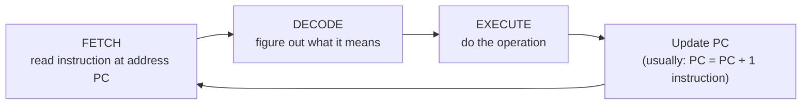
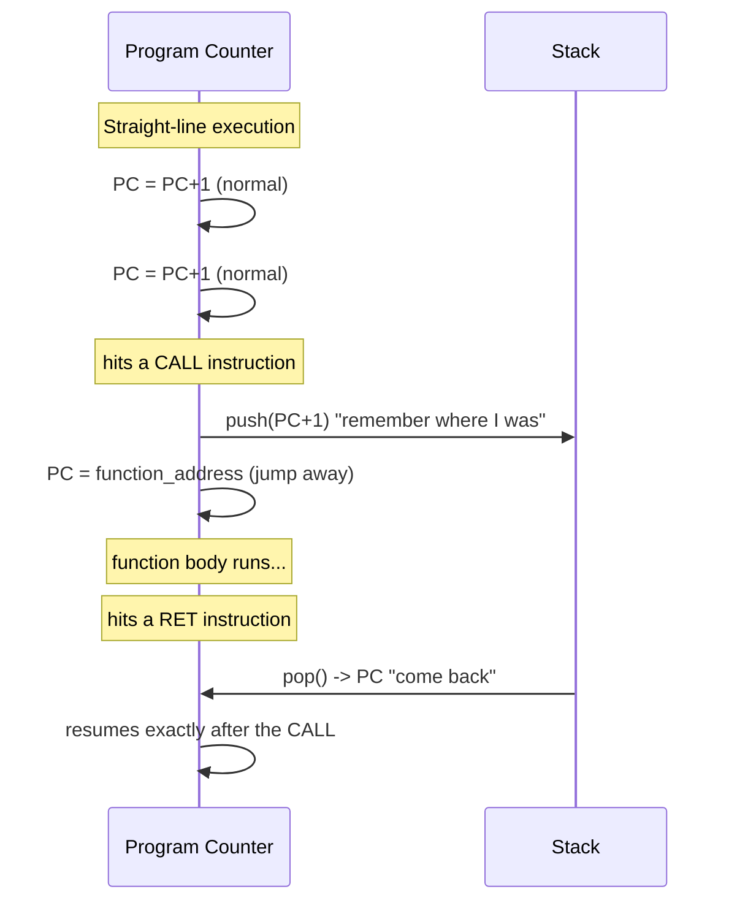

# Part 0 — The CPU's Only Trick

Before we touch `fork`, signals, or file descriptors, you need one picture burned into your head so hard that everything later in this course is just a variation on it. That picture is: **a CPU is a dumb loop that moves a pointer forward through memory, and the only two ways that pointer ever moves anywhere else are "jump" and "call+return."** Traps, interrupts, page faults, signals, context switches — all of Part 1 through Part 11 — are just increasingly clever ways of forcing that pointer somewhere unexpected and then getting back.

---

## 0.1 Setting up WSL2 (do this once)

Open **PowerShell as Administrator** on Windows and run:

```powershell
wsl --install -d Ubuntu
```

Reboot if prompted. Once Ubuntu opens (it'll ask you to create a username/password — this is separate from Windows), install the toolchain:

```bash
sudo apt update
sudo apt install -y build-essential gdb strace ltrace valgrind git
```

Verify:

```bash
g++ --version    # should show g++ 11+ 
strace --version # we'll use this constantly from Part 3 onward
```

From now on, do all work for this course **inside the WSL2 Ubuntu terminal**, not PowerShell. You can still edit files with VS Code — install the "WSL" extension and run `code .` from inside your WSL project folder to open it seamlessly.

Create a working folder:

```bash
mkdir -p ~/ecf-course/part0 && cd ~/ecf-course/part0
```

---

## 0.2 Theory: Fetch, Decode, Execute — and nothing else

A CPU core, at the hardware level, is doing exactly one loop, forever, as fast as it can:



That's it. That is the entire "normal flow of control" your OS textbook keeps referring to. Every single thing your program does — arithmetic, comparisons, function calls — happens by that loop repeating billions of times a second. There is no separate "control" system watching over it; the loop *is* the control.

**The Program Counter (PC)** is a special register holding the address of the *next* instruction to fetch. In the boring 99% case, after executing an instruction, `PC = PC + (size of that instruction)`. Straight line, forward, boring, predictable.

**Two instruction types break that boring default:**

1. **Jump** — the instruction directly overwrites PC with a new address. Forward jumps skip code (an `if` that's false). Backward jumps repeat code (a loop). Nothing mystical: it's a register write.
2. **Call / Return** — a jump that *remembers where it came from*. `call` pushes the return address onto the stack, then jumps. `ret` pops that address back into PC. The stack is the *only* place that "where do I go back to" information lives.

That's it. That's the whole toolbox the hardware gives you for "abnormal" flow — and notice something important: **nothing here required the operating system**. `if`, `while`, and function calls are pure CPU + stack mechanics, no kernel involved. Keep that in mind — it's exactly the gap that Part 1 and Part 2 are about to fill in: what happens when something needs to break this loop *from outside your program's own logic*.



---

## 0.3 Project: Build a Toy CPU and *watch* the PC move

Talk is cheap. We're going to build a tiny simulated CPU in C++ — registers, a program counter, a stack, and a handful of instructions — and trace every single step so you can literally watch the PC jump and come back. This is not a metaphor for what real hardware does; it's a simplified but structurally accurate model of it.

Save this as `~/ecf-course/part0/toy_cpu.cpp`:

```cpp
// toy_cpu.cpp
//
// A minimal CPU simulator: just a Program Counter (PC), a handful of
// registers, a memory array holding "instructions", and a stack.
// The point isn't the instruction set -- it's watching the PC move,
// and watching CALL/RET use the stack as the *only* mechanism that
// lets us "jump away and come back."
//
// Compile: g++ -std=c++17 -O2 -o toy_cpu toy_cpu.cpp
// Run:     ./toy_cpu

#include <iostream>
#include <vector>
#include <string>
#include <array>

enum class Op {
    LOAD, MOV, ADD, SUB, CMP, JMP, JZ, JNZ, PRINT, CALL, RET, HALT
};

struct Instr {
    Op op;
    int a = 0, b = 0, c = 0;
};

class ToyCPU {
public:
    explicit ToyCPU(std::vector<Instr> program) : mem(std::move(program)) {}

    void run(bool trace = true) {
        while (running) step(trace);
    }

private:
    std::vector<Instr> mem;
    std::array<int, 4> reg{};
    std::vector<int> stack;
    int pc = 0;
    int flag = 0;
    bool running = true;

    void step(bool trace) {
        if (pc < 0 || pc >= (int)mem.size()) { running = false; return; }
        Instr ins = mem[pc];        // FETCH
        int next_pc = pc + 1;       // DECODE: default is "next instruction"

        if (trace) printState(ins);

        switch (ins.op) {           // EXECUTE
            case Op::LOAD:  reg[ins.a] = ins.b; break;
            case Op::MOV:   reg[ins.a] = reg[ins.b]; break;
            case Op::ADD:   reg[ins.a] = reg[ins.b] + reg[ins.c]; break;
            case Op::SUB:   reg[ins.a] = reg[ins.b] - reg[ins.c]; break;
            case Op::CMP:   flag = reg[ins.a] - reg[ins.b]; break;
            case Op::JMP:   next_pc = ins.a; break;
            case Op::JZ:    if (flag == 0) next_pc = ins.a; break;
            case Op::JNZ:   if (flag != 0) next_pc = ins.a; break;
            case Op::PRINT: std::cout << "  >> OUTPUT: " << reg[ins.a] << "\n"; break;
            case Op::CALL:
                stack.push_back(pc + 1);   // save "come back here"
                next_pc = ins.a;
                break;
            case Op::RET:
                next_pc = stack.back();
                stack.pop_back();
                break;
            case Op::HALT:
                running = false;
                return;
        }
        pc = next_pc;
    }

    void printState(const Instr& ins) {
        static const char* names[] = {
            "LOAD","MOV","ADD","SUB","CMP","JMP","JZ","JNZ","PRINT","CALL","RET","HALT"
        };
        std::cout << "PC=" << pc << "  " << names[(int)ins.op]
                  << "  regs=[" << reg[0] << "," << reg[1] << "," << reg[2] << "," << reg[3] << "]"
                  << "  stack_depth=" << stack.size() << "\n";
    }
};

int main() {
    // R0 = 5; loop: print R0, R0 -= 1, if R0 != 0 loop again;
    // then CALL a function that prints 999 and returns; HALT.
    std::vector<Instr> program = {
        /*0*/  {Op::LOAD, 0, 5},
        /*1*/  {Op::LOAD, 2, 0},
        /*2*/  {Op::PRINT, 0},
        /*3*/  {Op::LOAD, 1, 1},
        /*4*/  {Op::SUB, 0, 0, 1},
        /*5*/  {Op::CMP, 0, 2},
        /*6*/  {Op::JNZ, 2},
        /*7*/  {Op::CALL, 9},
        /*8*/  {Op::HALT},
        /*9*/  {Op::LOAD, 3, 999},
        /*10*/ {Op::PRINT, 3},
        /*11*/ {Op::RET}
    };

    ToyCPU cpu(std::move(program));
    cpu.run(true);
}
```

Compile and run it:

```bash
g++ -std=c++17 -O2 -Wall -o toy_cpu toy_cpu.cpp
./toy_cpu
```

### What to look for in the trace (I already ran this — here's what came out)

```
PC=0  LOAD  regs=[0,0,0,0]  stack_depth=0
PC=1  LOAD  regs=[5,0,0,0]  stack_depth=0
PC=2  PRINT regs=[5,0,0,0]  stack_depth=0
  >> OUTPUT: 5
...
PC=6  JNZ   regs=[0,1,0,0]  stack_depth=0
PC=7  CALL  regs=[0,1,0,0]  stack_depth=0
PC=9  LOAD  regs=[0,1,0,0]  stack_depth=1     <-- PC jumped 7 -> 9, stack grew!
PC=10 PRINT regs=[0,1,0,999] stack_depth=1
  >> OUTPUT: 999
PC=11 RET   regs=[0,1,0,999] stack_depth=1
PC=8  HALT  regs=[0,1,0,999] stack_depth=0    <-- PC jumped 11 -> 8, stack shrank!
```

Three things to internalize from this trace, because we will refer back to them for the rest of the course:

1. **Every single line is just "fetch the thing PC points at, do it, move PC."** There's no special-casing anywhere in the loop for "this is a function call" — `CALL` is just an instruction that happens to also push a number.
2. **The `JNZ` at PC=6 repeatedly rewrites PC backward to 2** — that *is* your `while` loop. There is no "loop" concept in the hardware. It's an illusion built entirely from conditional jumps.
3. **`CALL` at PC=7 jumped forward to PC=9, and `RET` at PC=11 jumped back to PC=8 — not PC=9-or-10.** The return address (8, i.e. "PC+1 from the call site") was the *only* thing that made that possible, and it lived on the stack the entire time. If you corrupt that stack slot, `RET` will happily jump anywhere garbage tells it to — this is, not coincidentally, the entire mechanism behind stack-smashing exploits.

### Exercise before we move on (do this yourself, don't skip it)

Modify `toy_cpu.cpp` so the function at address 9 calls a *second* function before returning (nested calls). Run it and confirm the stack depth goes to 2 and unwinds back to 0 in the right order. This is the exact mechanism you'll see again in Part 4 when a process calls a function that calls another function that calls another — and again in Part 6 when a signal handler interrupts your code mid-function and effectively does an uninvited "CALL" you never wrote.

---

## What's next

In Part 1, we ask the question this chapter deliberately left hanging: **everything above happened with zero involvement from an operating system.** So what happens when your CPU needs to talk to a disk, or when a network packet shows up completely unannounced, or when your process tries to touch memory it has no right to? The PC-and-stack trick you just built isn't enough — because *nothing in your program asked for those things to happen*. That's where the mode bit, the exception table, and the actual operating system enter the picture.

Say **"start part 1"** when you're ready.
