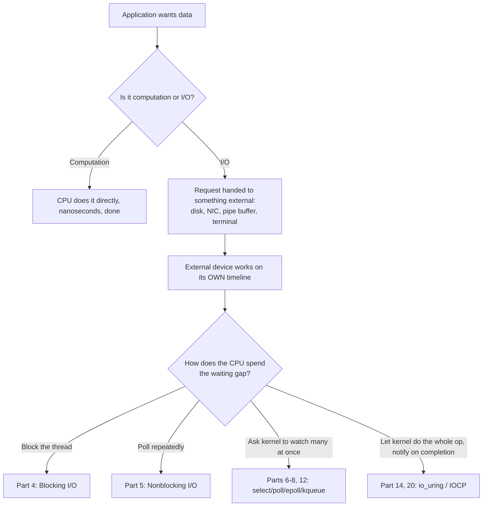
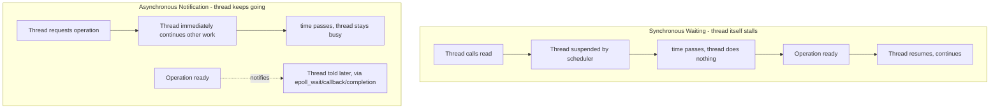
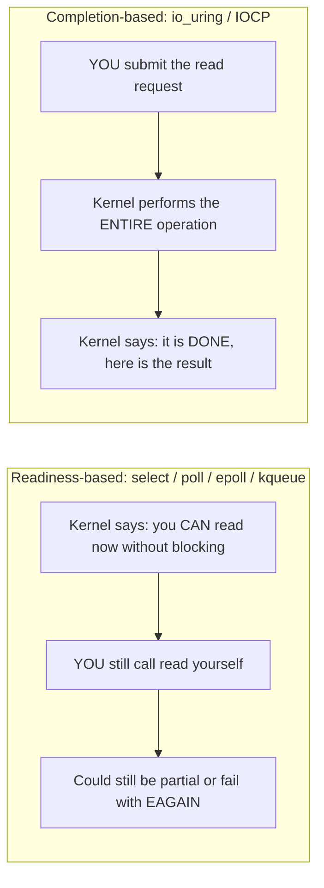

# PART 0 — HOW TO THINK LIKE AN I/O ENGINEER

## Chapter 0.1 — What Is I/O?

### 🎯 Learning Objectives
By the end of this chapter you can:
- Define I/O precisely, not just "input/output"
- Explain why I/O is treated as a *special* category of computation, not just "another instruction"
- Name the four fundamentally different kinds of I/O targets (file, network, pipe, device) and what they share
- State the one property of I/O that causes every mechanism in this entire course to exist

### 🧠 One-Sentence Mental Model
> I/O is the CPU asking something *outside its own timeline* to do work, and then having to deal with the fact that it doesn't know when that work will finish.

### 🧒 Explain Like I'm Five
When your CPU adds two numbers, it *knows* the answer will be ready in a fixed, tiny amount of time — always. When your CPU asks a disk to fetch a file, or asks the network to send a message, it's asking someone else — a machine, a wire, a spinning platter, a remote server — and that someone else works on a completely different clock. The CPU has no idea if the answer comes back in 200 nanoseconds or 200 milliseconds. That uncertainty is the entire problem I/O programming exists to solve.

### 🌍 Real-World Analogy
Computation is like doing mental arithmetic — the answer appears the instant you finish thinking. I/O is like mailing a letter and waiting for a reply. You don't control the postal service, the recipient's schedule, or how long they take to write back. Everything in this course — blocking, threads, select, epoll, io_uring — is really just different **strategies for waiting on a letter**, from "stand at the mailbox and do nothing else" (blocking) to "hire a huge staff to each watch one mailbox" (thread-per-connection) to "have a single assistant who tells you the instant *any* letter arrives" (epoll) to "tell the post office itself to just hand you a stack of completed letters when it's done, no watching required" (io_uring).

### ❓ The Problem
The CPU executes instructions at roughly one per clock cycle (sub-nanosecond, ignoring superscalar detail). Most of what a program *does* — arithmetic, comparisons, moving data between registers — completes in that same timescale. But the moment a program needs to:
- read from a disk,
- receive data from the network,
- write to a pipe another process is reading,
- wait for a keypress,

...it's no longer just "compute." It's asking a **physically separate device**, governed by **physically separate timing**, to do something, and then it must somehow reconcile its own nanosecond-scale clock with a device that might take microseconds (SSD), milliseconds (spinning disk, network round trip), or forever (a socket that never sends data, a user who never types).

### 🔥 Why This Problem Matters
Get this wrong and your program either:
1. **Wastes CPU** — spinning in a loop asking "is it ready yet? is it ready yet?" millions of times a second, burning a whole core for nothing, or
2. **Wastes threads/memory** — spawning one OS thread per outstanding operation, each costing ~1-8MB of stack and real kernel scheduling overhead, so a server with 100,000 connections needs 100,000 threads, which no OS handles gracefully, or
3. **Wastes time** — blocking so naively that your single-threaded server can only ever do one thing at a time, no matter how many idle cores sit unused.

Every major mechanism in the history of I/O — nonblocking flags, select, poll, epoll, kqueue, io_uring, IOCP — exists **only** because of this tension. There is no other reason for any of them to exist.

### 🕰 Historical Context
Early computers (1950s-60s) didn't multitask at all: a program that did I/O simply froze the entire machine until a card reader or tape drive finished — because there was nothing else to do anyway. As multiprogramming and timesharing emerged (1960s Unix ancestors), the OS learned to switch to *other* work while one program waited on I/O — this is the origin of blocking I/O being "safe": the CPU isn't wasted, just the *calling program* pauses, while the OS scheduler runs someone else. That single idea — "let something else run while this thing waits" — is the seed from which threads, select, epoll, and io_uring all eventually grew, each attempting to do that idea faster, cheaper, or at higher scale.

### 💡 The Naive Solution
"Just wait." A program calls a function like `read()`, and the calling thread simply does not proceed to the next instruction until data is available. This is called **blocking I/O**, and it is in fact how essentially every beginner program does I/O, and how most simple programs *should* do I/O.

### ❌ Why the Naive Solution (Eventually) Fails
Blocking is perfectly fine for **one thing happening at a time**. It fails the moment you need **many things happening "at the same time,"** e.g., a server handling 10,000 simultaneous client connections. If a thread blocks on client A's slow connection, it cannot simultaneously serve client B — unless you give client B its own thread, which reintroduces the thread-scaling problem above. This tension — *one blocking call ties up one entire thread of control* — is precisely the problem that Parts 5 through 14 of this course (nonblocking, select, poll, epoll, io_uring) exist to solve.

### ✅ The Better Solution (Preview Only — Not Yet Explained)
You'll spend the rest of this course learning the real answers, in the order they were historically invented:
- Give the CPU something else to do while waiting (**threads/processes** — Part 4)
- Ask "is it ready?" without freezing (**nonblocking + polling** — Part 5)
- Ask the *kernel* to watch many things and tell you which are ready (**select/poll/epoll/kqueue** — Parts 6-8, 12)
- Stop asking about readiness altogether; ask the kernel to just *do the operation* and tell you when it's *done* (**io_uring/IOCP** — Parts 14, 20)

We are not solving the problem yet in this chapter. We are only naming it precisely enough that every later chapter makes sense as "the next attempt to fix this."

### 🧠 Core Concept
> **I/O is any interaction where the CPU's timeline and the device's timeline are decoupled, and someone has to decide what the CPU does during that gap.**

Everything else — file descriptors, syscalls, readiness, completion, DMA, interrupts — is machinery built to answer that one question: *what does the CPU do during the gap?*

### 📐 Deep Technical Explanation
There are really only two kinds of "waiting" your process can do while an I/O operation is outstanding, and almost every mechanism in this course is a variation on one of these two:

1. **Synchronous waiting** — the calling thread itself stalls (is taken off the CPU by the scheduler) until the operation is ready or complete. The thread's instruction pointer does not advance. Examples: blocking `read()`, blocking `accept()`.
2. **Asynchronous notification** — the calling thread continues executing other instructions, and *something else* (the kernel, an event loop, a callback) tells it later that the operation is ready or complete. Examples: nonblocking `read()` + `epoll_wait()`, `io_uring` completions.

Within category 2, there is a distinction that will become critically important in Part 13, so plant it now:
- **Readiness-based**: you're told "you *can* now perform this operation without blocking" (select/poll/epoll). You still have to *do* the read/write yourself, and it can still fail or be partial.
- **Completion-based**: you're told "this operation *already happened*, here is the result" (io_uring, IOCP). The kernel did the work; you just collect the outcome.

That single distinction — readiness vs. completion — is why io_uring is architecturally not just "a faster epoll," but a genuinely different model. We will not go deep here; this is a flag for Part 13.

### 🏗 Architecture

**How to read this diagram:** Start at the top. Every request your program makes first gets classified — implicitly, by which function you called — as either pure computation (stays on-CPU, fast, deterministic) or I/O (leaves the CPU's control, timing becomes unpredictable). Only the I/O branch matters to this entire course. Once something is I/O, the *only* remaining design question is the bottom decision diamond: what does the CPU do during the gap between "asked" and "answered"? Every Part number in this course is a different answer to that single question, in the order they were invented as fixes to the previous answer's shortcomings.

### 🔀 Synchronous Waiting vs. Asynchronous Notification

**How to read this diagram:** In the SYNC path, the thread's own execution literally pauses — there is a gap in its instruction stream where nothing happens (step S3). In the ASYNC path, the thread's execution never pauses for this particular operation — it keeps running other instructions (step A2) while the operation happens off to the side (step A4, on its own timeline, shown with a dotted line because it's not part of the thread's own instruction flow). The entire second half of this course is really just different implementations of the ASYNC path, each trying to make the "notifies" step cheaper, more scalable, or more precise.

### 🎯 Readiness vs. Completion (Early Preview)

**How to read this diagram:** In the readiness model (left), the kernel's notification is only a *hint* — "go ahead, it probably won't block" — and you still do the actual work, which can still surprise you (a partial read, or even `EAGAIN` if conditions changed). In the completion model (right), you hand the entire operation to the kernel up front, and the notification you eventually get is the *finished result*, not a permission slip. This distinction is only named here as a landmark for Part 13 — the mechanics come later.

### 🐧 Linux Kernel View
At this stage, only the shape matters, not the mechanism (that's Part 2-3): when your C++ program calls something like `read()`, control does not stay in your process's normal instruction stream. It crosses into the **kernel** via a **system call** (Part 2.6) — a deliberate, guarded transition from unprivileged userspace execution to privileged kernel execution. The kernel then talks to the relevant subsystem (VFS for files, the socket layer for network, Part 3) which may itself need to wait on a **device** (Part 1) to finish work. The kernel decides, based on how you called the API (blocking vs. nonblocking) and what mechanism you're using (plain call vs. select/epoll/io_uring), whether to suspend your thread, return an error immediately, or queue you for later notification.

### ⚙️ Hardware View
Underneath even the kernel, the "device" your I/O eventually reaches is physically separate silicon with its own clock domain: a disk controller, a network interface card (NIC), a UART for a terminal. These devices do not execute your CPU's instructions — they run their own firmware/logic at their own pace, and communicate back via **interrupts** or **DMA writes to memory** (Part 1.7-1.8). This physical separation — two independent clocks that must be reconciled — is the hardware-level reason the "gap" from the architecture diagram exists at all. It's not a software design choice; it's physics that software then has to manage.

### 🔬 Experiment
**Predict Before Running.** No code needed for this one — just reasoning.

> Suppose you write a C++ program that does nothing but `std::cin >> x;` and wait for keyboard input. While it's waiting, is the CPU core it's running on:
> (a) spinning at 100% usage checking for input thousands of times a second,
> (b) doing literally nothing, fully free for other programs, or
> (c) something in between?

Click to reveal the answer

**(b) — fully free.** Reading from standard input with the default blocking mode causes your thread to be put to sleep by the kernel (removed from the CPU run queue entirely) until the terminal driver signals that a line is available. You can verify this yourself later (Part 4) with `top` or `htop` open in another window — a program blocked on `std::cin` shows ~0% CPU, not 100%. This is a preview of the difference between **blocking** (cheap on CPU, but ties up a whole thread) and **naive polling** (Part 5), which would show up as 100% CPU on one core doing nothing useful.

### ❌ Common Misconceptions
- ❌ **"I/O just means reading and writing files."** — It means *any* interaction with something outside the CPU's own deterministic timeline: files, sockets, pipes, terminals, even some inter-process memory operations. Files are just the most familiar example.
- ❌ **"The CPU is 'doing' the I/O operation."** — The CPU issues a *request*. The actual physical work (spinning a platter, moving electrons down a wire, waiting for a human to type) happens on hardware the CPU does not control and cannot speed up.
- ❌ **"Blocking I/O is always bad/slow."** — Blocking is the cheapest possible mechanism in CPU terms (the kernel just parks your thread) and is completely appropriate for the common case of "one thing at a time." It only becomes a problem at concurrency scale.
- ❌ **"Faster CPUs make I/O faster."** — I/O latency is usually dominated by the external device (disk seek time, network round-trip), not CPU speed. A 10x faster CPU does approximately nothing for a 50ms network round trip.
- ❌ **"There's one 'right' way to do I/O."** — Every mechanism in this course is a trade-off, not a strict improvement. Blocking, threads, epoll, and io_uring all remain in active production use today, each for different workloads (Part 29 will make this precise).

### 🧙 Wizard Insight
Every I/O mechanism ever invented — blocking, select, epoll, io_uring, IOCP — is answering the *exact same question*: "the CPU and the device have different clocks; who waits, how, and at what cost?" Once you see that all 29 parts of this course are variations on that one sentence, the entire field stops looking like a pile of unrelated APIs and starts looking like a single evolving argument. When you're deep in epoll flags or io_uring ring buffers later and feel lost, come back to this sentence — it is the root of everything else.

### 📝 Exercises
1. In your own words (not copying this chapter), explain why "the CPU is fast but I/O is slow" is an oversimplification of the real problem.
2. Name three physically different devices your program might do I/O with, and explain what timing property they share that makes them all "I/O" rather than "computation."
3. Why is blocking I/O described here as "cheap" rather than simply "bad"? Under what condition does it stop being cheap?

### 🧠 Quiz
**Q1.** What is the one property that defines something as "I/O" rather than plain computation?

Answer
The decoupling of timelines: the CPU cannot know in advance when the operation will complete, because that timing is controlled by something outside the CPU (a device, another machine, a human).

**Q2.** True or false: a blocked thread consumes CPU cycles while it waits.

Answer
False. A properly blocked thread is removed from the scheduler's run queue and consumes ~0% CPU until woken. (A thread doing naive *polling* instead of blocking is the one that burns CPU — that distinction is the whole subject of Part 5.)

**Q3.** What's the key architectural difference between "readiness" and "completion" notification, at a conceptual level (don't worry about implementation yet)?

Answer
Readiness tells you an operation *can now be performed* without blocking, but you must still perform it yourself. Completion tells you an operation *already happened*, and you just retrieve the result. Explored fully in Part 13.

### 🏆 Mastery Challenge
Without looking back at this chapter, sketch (on paper or in a text file) your own version of the architecture diagram above — application, the fork between computation and I/O, the external device, and the four strategies for handling the wait. You don't need the exact wording, just the shape of the idea.

### 📊 Mastery Level
**Current Level:** 🟢 NOOB → 🔵 BEGINNER (in progress)
**Next Level:** 🔵 BEGINNER — "I can use it" (requires Part 3-4: actually opening file descriptors and performing blocking I/O in C++)
**What I must be able to explain:** Why I/O timing is decoupled from CPU timing, and the four high-level strategies (block, poll, readiness-notify, completion-notify) for handling that gap.
**What I must be able to implement:** Nothing yet — first implementation task is in Part 3.
**What experiment proves mastery:** Correctly predicting, before running it, whether a blocked `std::cin >> x` shows up as 0% or 100% CPU in `top` — and explaining *why* in kernel terms (scheduler removes the thread from the run queue).

### 🔗 What This Connects To Next
**Previous:** — (this is the first chapter)
**Current:** Part 0, Chapter 0.1 — What Is I/O?
**Next:** Part 0, Chapter 0.2 — Why I/O Is Different From Computation (we formalize the CPU-vs-device timing gap with real numbers: cycle times vs. disk/network latency, so the "slow" in "I/O is slow" becomes concrete rather than a vibe)
