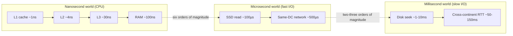

## Chapter 0.2 — Why I/O Is Different From Computation

### 🎯 Learning Objectives
By the end of this chapter you can:
- Quote, from memory and in the right order of magnitude, the latency of L1 cache, RAM, SSD, spinning disk, and a cross-country network round trip
- Explain "different from computation" in terms of orders of magnitude, not just vibes
- Explain why these numbers, not opinion, are the actual justification for every mechanism in Parts 4-14
- State Little's Law informally and explain why it matters for concurrent I/O

### 🧠 One-Sentence Mental Model
> If a single CPU cycle were one second long, waiting for a disk seek would be over a year — computation and I/O don't just differ in degree, they differ in *scale* by six to nine orders of magnitude.

### 🧒 Explain Like I'm Five
Imagine you can blink in a tenth of a second. Now imagine that's how fast your CPU does one instruction — a blink. Adding two numbers takes one blink. Reading from RAM takes about 100 blinks. Reading from an SSD takes about 100,000 blinks. Reading from a spinning hard disk takes about 10 million blinks — that's over 11 days of nonstop blinking for something the CPU thinks of as "one operation." That's why the CPU can't just sit and wait the naive way once things get to real I/O — the wait isn't a short pause, it's an eternity on the CPU's own timescale.

### 🌍 Real-World Analogy
If one CPU clock cycle (~0.3ns on a 3GHz chip) is scaled up to **one human heartbeat (~1 second)**, then:
- an L1 cache hit is another heartbeat or two,
- a RAM access is about a **90-second walk down the hall**,
- an SSD read is about a **day's round trip** by car,
- a spinning-disk seek is a **multi-month sea voyage**,
- a network round trip across a continent is **months to over a year**.

No sane system designer would build an architecture where the CPU "just waits" for a months-long sea voyage before doing anything else. That absurdity, scaled back down to real nanosecond/millisecond numbers, is exactly why blocking-everywhere doesn't scale, and why the rest of this course exists.

### ❓ The Problem
Chapter 0.1 established *qualitatively* that I/O timing is decoupled from CPU timing. This chapter makes it *quantitative*. Without real numbers, "I/O is slow" is just an assertion. With real numbers, it becomes an engineering constraint you can design against.

### 🔥 Why This Problem Matters
The size of the gap determines which strategy from 0.1's diagram is *appropriate*:
- If the gap is ~100ns (RAM), blocking briefly is fine — a full readiness/completion machinery would be overkill.
- If the gap is ~10ms (disk seek) or ~50-150ms (network round trip) and you have thousands of such operations outstanding at once, blocking-per-operation becomes catastrophic, because each blocked thread is dead weight for *millions of CPU cycles* — cycles that could have served other clients.

This is the actual arithmetic behind "epoll scales better than thread-per-connection": it's not a magic property of epoll, it's that **one thread blocked on a millisecond-scale wait is an enormous, quantifiable waste of a resource (a whole OS thread, ~1-8MB stack, kernel scheduling weight) relative to the nanosecond-scale things the CPU could otherwise be doing.**

### 🕰 Historical Context
The relative *ratio* between CPU speed and I/O device speed has actually **widened** over decades, not narrowed. CPUs got roughly 1000x faster from the 1990s to today; spinning disks barely improved in seek time (physically limited by platter rotation and head movement); even SSDs and modern NICs, despite being dramatically faster than old disks, still operate on scales that are enormous relative to a modern multi-GHz CPU core. This widening gap is *why* the I/O-handling mechanisms in this course kept needing to be reinvented every decade or so — select (1983 BSD) wasn't good enough forever, poll wasn't either, epoll (2002 Linux) is now itself insufficient for the highest-scale workloads, which is why io_uring (2019) exists. The mechanisms evolve because the underlying hardware ratio keeps getting more extreme.

### 💡 The Naive Solution
Treat every I/O operation as if it costs "basically nothing" and just block on it directly, the same way you'd wait for a register-to-register addition.

### ❌ Why the Naive Solution Fails
It fails *quantitatively*, not just conceptually: if a network request takes 50ms and your CPU can execute roughly 150 million instructions in that time (on a 3GHz core), blocking naively on that single request means potentially discarding the opportunity to do 150 million other instructions' worth of useful work. At the scale of one request, that might not matter. At the scale of 10,000 concurrent requests each blocking a thread for 50ms, it means needing 10,000 threads just to stay "busy-waiting the expensive way," each with its own real memory and scheduling cost.

### ✅ The Better Solution (Preview)
Match your I/O *strategy* to the actual *size* of the gap and the *number* of concurrent gaps you need to manage — this is the engineering judgment Parts 4 through 14 will each build toward, and which Part 29's decision framework will formalize.

### 🧠 Core Concept
> **The latency numbers below are not trivia — they are the load-bearing justification for every I/O mechanism that exists.** Memorize the *order of magnitude* of each, not the exact number (exact numbers vary by hardware generation; orders of magnitude are stable enough to reason from).

### 📐 Deep Technical Explanation

**Latency numbers every systems engineer should know** (approximate, modern commodity hardware, ~2020s):

| Operation | Approximate Latency | Relative to 1 CPU cycle (~0.3ns) |
|---|---|---|
| 1 CPU cycle | ~0.3 ns | 1x |
| L1 cache reference | ~1 ns | ~3x |
| L2 cache reference | ~4 ns | ~13x |
| Branch mispredict | ~5 ns | ~17x |
| L3 cache reference | ~15-40 ns | ~50-130x |
| Main memory (RAM) reference | ~100 ns | ~330x |
| Context switch | ~1-10 µs | ~3,000-30,000x |
| SSD random read (NVMe) | ~50-150 µs | ~200,000-500,000x |
| Read 1MB sequentially from RAM | ~3 µs | ~10,000x |
| Read 1MB sequentially from SSD | ~1 ms | ~3,000,000x |
| Round trip within same datacenter | ~0.5 ms | ~1,600,000x |
| Spinning disk seek | ~1-10 ms | ~3,000,000-30,000,000x |
| Round trip across continent (e.g., US ↔ Europe) | ~50-150 ms | ~150,000,000-500,000,000x |

*(These are widely-cited approximations in the spirit of Jeff Dean's "latency numbers every programmer should know" — treat exact figures as illustrative, not a spec sheet for any particular machine; always measure your own hardware, Part 22-23.)*

**The takeaway ratios:**
- RAM is ~100x slower than L1 cache.
- SSD is ~1,000x slower than RAM.
- Network (same datacenter) is ~10-100x slower again than SSD.
- Cross-continent network or a disk seek is ~1,000-10,000x slower than that.

Stacking these: a single cross-continent network round trip can cost **on the order of 100 million to 1 billion CPU cycles** worth of "wall-clock time" — during which a modern CPU core could otherwise have executed hundreds of millions of instructions.

**Little's Law (informal preview):** In queueing terms, the number of concurrent operations you need in flight to saturate a given throughput is `L = λ × W` — concurrency equals arrival rate times the time each item spends in the system. Because I/O latency `W` is enormous relative to CPU-only work, sustaining high throughput against high-latency I/O *requires* high concurrency (many operations in flight at once) — you cannot get there by making a single operation faster, because a single operation is fundamentally rate-limited by the external device (Part 23 makes this fully rigorous).

### 🏗 Architecture

**How to read this diagram:** Three separate "worlds" exist on wildly different timescales, and your program routinely has to bridge between them in a single function call. The dotted lines aren't real data connections — they mark the *magnitude of the jump* your code experiences when it goes from "reading a variable" (nanosecond world) to "reading a file" (microsecond-to-millisecond world) to "talking to a remote server" (millisecond world, sometimes worse). Nothing in the CPU's own execution model prepares it for jumps this large; that's why explicit mechanisms (blocking, epoll, io_uring) had to be *designed*, rather than falling out naturally from how CPUs already work.

### 🐧 Linux Kernel View
The kernel doesn't experience these numbers as abstractions — its scheduler literally makes decisions based on them. When your thread calls a blocking syscall expected to take microseconds-to-milliseconds, the kernel typically parks the thread on a **wait queue** (Part 2.10) and picks a different runnable thread/process for the CPU, precisely because the expected wait (µs-ms) vastly exceeds the cost of a context switch (~1-10µs) — so the "trade" is profitable. For extremely short waits (sub-microsecond), context-switching overhead can actually exceed the wait itself, which is part of why some very-low-latency systems intentionally **spin** rather than block (this becomes concrete in Part 21-22 when we discuss kernel bypass and busy-polling NIC drivers).

### ⚙️ Hardware View
The reason these numbers can't be "engineered away" is physical: light itself takes ~67ms to cross the US and back at the speed of light in vacuum (fiber is slower, ~1.5x that), so no amount of software or CPU improvement will ever make a cross-continent round trip nanosecond-scale — it's bounded by physics, not by whose code is faster. Disk seeks are bounded by the mechanical time to physically move a read head. SSD latency is bounded by flash cell electrical characteristics and controller logic. These are hard floors, which is exactly why all the software cleverness in this course goes into *hiding* or *overlapping* the wait rather than *eliminating* it.

### 🔬 Experiment
**Predict Before Running.**
> If you run a small C++ program that does 100 million simple integer additions in a loop, versus a program that does a single `read()` of one byte from a remote server 100ms away, which do you predict finishes first, and by roughly what factor?

Click to reveal the answer

The 100 million additions will very likely **finish first**, and not by a small margin. A modern CPU can execute roughly 100 million simple instructions in well under 100 milliseconds (often single-digit milliseconds, depending on optimization) — while a single 100ms network round trip is, by definition, 100ms, dominated entirely by physical transmission time, not computation. This is the concrete, measurable version of the abstract claim in Chapter 0.1: computation is CPU-bound and fast; I/O is often *not* CPU-bound at all, and "faster CPU" does almost nothing to fix it. Try this for real once we have working C++ examples in Part 4 — measure both with `std::chrono` and see the gap for yourself.

### 📊 Benchmark
Not yet — first real benchmark harness appears at the end of Part 4 (blocking file reader vs. blocking TCP server).

### ❌ Common Misconceptions
- ❌ **"A faster CPU makes I/O-bound programs faster."** — If your program spends 95% of its wall-clock time waiting on network/disk, doubling CPU speed barely moves the needle; you need to change the *waiting strategy*, not the *computation speed*.
- ❌ **"SSDs made the CPU/I/O gap basically go away."** — SSDs closed the gap *relative to spinning disks* by roughly 10-100x, but they're still ~1,000x slower than RAM, and RAM itself is ~100x slower than cache. The gap shrank; it didn't disappear.
- ❌ **"Network latency is mostly about bandwidth."** — Latency (time for the *first* byte to arrive) and bandwidth (bytes per second once flowing) are different axes entirely; a round trip's latency is often dominated by physical distance and protocol round trips, not by how "fast" the pipe is (Part 9 explores this rigorously).
- ❌ **"These numbers are fixed constants I can hard-code into my mental model forever."** — Orders of magnitude are stable; exact numbers drift with hardware generations (NVMe vs. SATA SSD, DDR4 vs. DDR5, etc.). Always benchmark your actual target hardware (Part 22-23) rather than trusting a table like this one for anything performance-critical.
- ❌ **"Since RAM is 'only' 100ns, it's basically free and I don't need to think about memory access patterns."** — 100ns is ~330 CPU cycles; a poorly cache-optimized loop that misses cache constantly can be dramatically slower than one that doesn't, even though both are "just RAM access." This becomes very relevant in Part 27 (cache lines, false sharing).

### 🧙 Wizard Insight
Every performance bug you will ever debug in an I/O-heavy system is, underneath, a story about which row of that latency table your code accidentally landed on. "Why is this request slow?" almost always resolves to "it silently moved from the RAM row to the disk row" (a cache miss, an unexpected page-cache eviction) or "from the same-datacenter row to the cross-continent row" (a misconfigured client hitting the wrong region). Wizards don't memorize APIs — they recognize, from a latency graph alone, roughly which physical tier a slow operation fell into, often before looking at a single line of code.

### 📝 Exercises
1. Without checking the table, write down your best estimate of L1 cache latency, RAM latency, SSD latency, and a cross-continent network round trip, in order of magnitude only. Then check yourself against the table.
2. Explain in your own words why Little's Law implies that high-latency I/O *requires* high concurrency to achieve high throughput, rather than requiring a "faster" single operation.
3. Pick any two adjacent rows in the latency table and explain, physically (not just "it's slower"), *why* that specific gap exists.

### 🧠 Quiz
**Q1.** Roughly how many orders of magnitude separate a RAM access from a cross-continent network round trip?

Answer
Roughly 6 orders of magnitude (RAM ~100ns; cross-continent RTT ~100ms = 100,000,000ns — a ratio of about 10^6).

**Q2.** Why can't better software ever make a cross-continent round trip nanosecond-scale?

Answer
It's bounded by the physical speed of light (and the real, slower speed of light in fiber) over that distance — a hard physical floor no algorithm or CPU improvement can cross.

**Q3.** What does Little's Law (`L = λ × W`) imply for a system that wants high throughput against high-latency (large `W`) I/O?

Answer
It needs high concurrency `L` — many operations in flight simultaneously — because a single operation's latency can't be reduced below the external device's floor, so throughput has to come from parallelism/overlap instead of from making one operation faster.

### 🏆 Mastery Challenge
Pick any real API call you've used before (database query, HTTP request, file read) and estimate, using this chapter's table, which latency tier(s) it likely touches (RAM? SSD? network same-DC? cross-region?) and roughly how many CPU cycles that represents. You don't need to be exact — the goal is developing the *reflex* of translating "this call is slow" into "this call is touching tier X."

### 📊 Mastery Level
**Current Level:** 🔵 BEGINNER (can state the numbers) → working toward 🟡 INTERMEDIATE
**Next Level:** 🟡 INTERMEDIATE — "I understand how it works" (requires Part 1-2: what's physically happening in hardware and kernel during these waits)
**What I must be able to explain:** The order-of-magnitude latency of cache/RAM/SSD/disk/network, and why these numbers — not opinion — justify every I/O mechanism in this course.
**What I must be able to implement:** Nothing yet.
**What experiment proves mastery:** Correctly predicting (before running) that 100M CPU-only additions finish faster than a single 100ms network round trip, and explaining why in terms of this chapter's table rather than vague intuition.

### 🔗 What This Connects To Next
**Previous:** Part 0, Chapter 0.1 — What Is I/O?
**Current:** Part 0, Chapter 0.2 — Why I/O Is Different From Computation
**Next:** Part 0, Chapter 0.3 — CPU vs Memory vs Device (we zoom into *where*, physically, each of these latency tiers actually lives — registers, caches, RAM, and the device/bus hierarchy — setting up Part 1's full hardware deep dive)
