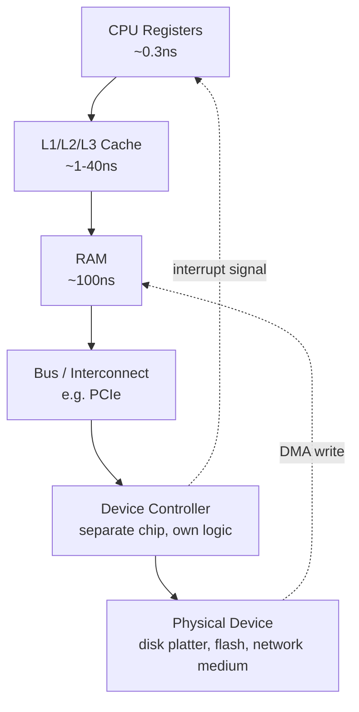

# PART 0 — HOW TO THINK LIKE AN I/O ENGINEER

## Chapter 0.3 — CPU vs Memory vs Device

### 🎯 Learning Objectives
By the end of this chapter you can:
- Draw the physical hierarchy a byte travels through: CPU registers → cache → RAM → bus/interconnect → device controller → device
- Explain what a "bus" is and why it, not the CPU or the device alone, is often the actual bottleneck
- Explain why "the CPU talks to the device" is a convenient lie, and what's really happening (CPU talks to a *controller*, which talks to the device)
- Locate, physically, where each latency tier from Chapter 0.2 actually lives

### 🧠 One-Sentence Mental Model
> The CPU never actually "talks" to a disk or a NIC directly — it talks to nearby fast memory, which talks to a bus, which talks to a controller chip, which is the only thing that ever actually touches the physical device.

### 🧒 Explain Like I'm Five
Think of the CPU as a chef in a kitchen. The chef's hands (registers) can only reach the counter in front of them (cache). Ingredients further away are in the pantry (RAM) — still in the building, just a walk away. But if the chef needs something from a grocery store (a disk or the network), the chef doesn't go themselves — they call a delivery service (the device controller), who fetches it and puts it on the counter when it arrives. The chef never leaves the kitchen. Every "I/O operation" is really the chef placing an order and continuing to cook other things until the delivery shows up.

### 🌍 Real-World Analogy
A company's org chart is a good analogy for the CPU/memory/device hierarchy. The CEO (CPU core) makes decisions using notes on their own desk (registers) — instant. For anything not on the desk, they ask their assistant (L1/L2 cache) — a few seconds. For anything not known to the assistant, it goes to the building's central filing department (RAM) — a short walk. But if something requires an *external vendor* (disk, network) — the request goes through a dedicated liaison office (the device controller) that exists specifically to interface with that outside vendor, on the outside vendor's own schedule. The CEO never personally negotiates with the vendor; they only ever talk to their own liaison, who eventually reports back.

### ❓ The Problem
Chapter 0.2 gave you *timing* numbers (nanoseconds, microseconds, milliseconds) without saying *where*, physically, each of those numbers lives. Without a physical map, "RAM access" and "disk access" sound like the same kind of thing happening at different speeds. They're not — they cross entirely different physical boundaries (on-chip vs. off-chip vs. off-machine-entirely), and that distinction is what determines *which mechanisms* (interrupts, DMA, buses) even become necessary.

### 🔥 Why This Problem Matters
You cannot understand *why* interrupts and DMA exist (Part 1.7-1.8) without first understanding that a device controller is a **separate, independently-operating chip** that the CPU cannot simply "wait on" the way it waits on its own registers. The CPU issuing a disk read isn't like asking itself a question — it's like sending an email to a different, semi-autonomous computer (the disk controller) and needing to be told, later, when the reply arrives. That "different computer" framing is the physical root of everything Parts 1-2 build on.

### 🕰 Historical Context
Early computer architectures had the CPU do everything itself, including babysitting I/O one byte at a time (**programmed I/O**) — the CPU would sit in a loop, checking a device's status register over and over. This is why **polling** was the *original* I/O strategy, decades before it became a "problem" needing epoll to fix — it was literally how the hardware worked. **Interrupts** were introduced so the device could *proactively signal* the CPU instead of the CPU wastefully asking "are you done yet?" in a loop. **DMA** (Direct Memory Access) came after that, letting devices write straight into RAM without even needing the CPU to shuttle each byte. This progression — CPU babysits every byte → device interrupts when ready → device moves data itself — is the *hardware-level* ancestor of the exact same evolutionary pattern you'll see again at the *software* level in Parts 5-14 (busy-poll → readiness notification → completion notification). It's the same idea, repeating one layer up the stack.

### 🧠 Core Concept
> **Every I/O operation crosses a real physical hierarchy — registers → cache → RAM → bus → controller → device — and each hop has its own latency, its own protocol, and its own failure modes. "The CPU does I/O" is shorthand for a multi-hop relay race, not a single action.**

### 📐 Deep Technical Explanation

**The hierarchy, in order, with what lives at each level:**

1. **Registers** — a handful of storage slots physically inside the CPU core. Fastest possible access (part of a single clock cycle). Hold the operands of the *current* instruction only.
2. **L1/L2/L3 cache** — small-to-medium fast memory, progressively larger and slower, physically on or very near the CPU die. Automatically managed by hardware to keep recently/frequently used data close to the core.
3. **RAM (main memory)** — the CPU's "working set" of program data and code, connected via a memory bus/controller. Still *inside the same machine*, but now a genuinely separate chip (or set of chips) the CPU must send a request across a bus to reach.
4. **The bus / interconnect** (e.g., PCIe) — the shared "roads" connecting the CPU to everything that isn't cache or RAM: disk controllers, NICs, GPUs. Crucially, a bus has **finite bandwidth shared by everything attached to it** — this is why "how many lanes of PCIe" matters for high-performance I/O (Part 21).
5. **The device controller** — a small, independent chip (or logic block) that speaks the device's actual protocol (SATA/NVMe for storage, Ethernet framing for a NIC) and exposes a simpler register-based interface to the CPU. **The CPU never speaks "disk" or "Ethernet" directly — it only ever speaks to the controller**, which is the actual translator to the physical medium.
6. **The device itself** — the spinning platter, flash chip, or physical network medium, operating under its own physical constraints, on its own timeline, exactly as established in Chapter 0.2.

**Why this matters concretely:** when your C++ program calls `read()` on a socket, the actual physical journey is: your process's virtual address → kernel decides to consult the network stack → network stack talks to the NIC's device driver → driver programs the NIC controller via memory-mapped registers or a descriptor ring → the NIC controller (separate silicon, its own clock) does the real work of receiving Ethernet frames → the NIC uses **DMA** to write received data directly into a kernel buffer in RAM, *without needing the CPU to copy each byte* → the NIC raises an **interrupt** to tell the CPU "data has arrived" → the kernel then makes that data available to your process. Six distinct hops, three of which involve pieces of hardware that are not the CPU and do not run on the CPU's clock.

### 🏗 Architecture

**How to read this diagram:** The solid arrows going down (A→B→C→D→E→F) represent the CPU *issuing a request* — this direction is relatively fast and entirely within the CPU's control. The two dotted arrows going back up are the interesting part: they represent the device controller **acting independently**, on its own schedule, to (1) write data directly into RAM via DMA — bypassing the CPU entirely for the data-copy step — and (2) raise an interrupt to notify the CPU that something happened. Notice the CPU is not in the loop for the dotted arrows at all until the interrupt fires. This is the physical basis for every "the kernel woke my thread up" story in this entire course.

### 🐧 Linux Kernel View
The kernel's **device driver** layer is the software counterpart to the controller in the diagram — it's the code that knows how to program a *specific* controller's registers/descriptor rings to start an operation, and how to handle that controller's interrupts when work completes. This is why Linux has separate drivers for different NIC chipsets or disk controllers even though they all ultimately expose "read"/"write" semantics upward — the *hardware protocol* between kernel and controller varies per device, even though the *kernel-to-userspace* API (`read()`, `write()`) stays uniform. That uniformity is a deliberate design goal of Unix ("everything is a file," elaborated in Part 3.5, VFS) — hiding this entire hardware hierarchy behind one consistent interface.

### ⚙️ Hardware View
The bus (step 4) deserves special attention because it's a genuinely shared, finite resource — unlike a CPU core's private L1 cache, a PCIe bus's bandwidth is divided among every device attached to it operating at once. This is why, at high performance scale (Part 21), engineers care about *which* PCIe slot a NIC is plugged into, how many "lanes" it has, and whether it's contending with a GPU or NVMe drive for the same shared interconnect — bottlenecks can live in the bus itself, not just in the CPU or the device.

### 🧠 Memory View
Concretely, for a network read: your application's buffer lives in your process's **virtual address space**, which the CPU/MMU translates to physical RAM addresses. The NIC's DMA engine writes incoming packet data to a *kernel-owned* physical RAM region (not your buffer directly) — the kernel then typically copies that data into your buffer during `read()` (unless you're using a zero-copy technique, Part 16, which tries to avoid exactly this extra copy). So a "simple" socket read already involves: NIC → DMA → kernel RAM buffer → CPU-driven copy → your userspace RAM buffer. Two RAM regions, one CPU-mediated copy, in the ordinary (non-zero-copy) case.

### 🔬 Experiment
**Predict Before Running.**
> A network card receives a 1500-byte Ethernet packet. Does the CPU spend cycles moving those 1500 bytes into RAM itself, or does something else do it?

Click to reveal the answer

On any modern system, the NIC's **DMA engine** writes the packet data directly into a pre-allocated kernel RAM buffer — the CPU is not involved in moving those bytes at all. The CPU only gets involved *after* the data has already arrived, when the NIC raises an interrupt (or, in high-performance polling drivers, when the CPU itself checks a descriptor ring — Part 21) to say "there's something in the buffer now, go look." This is precisely why modern network throughput can reach many gigabits per second without pegging a CPU core at 100% just moving bytes — the expensive per-byte work is offloaded to dedicated hardware, and the CPU is only involved in the comparatively cheap job of noticing and reacting.

### ❌ Common Misconceptions
- ❌ **"The CPU reads data from the disk."** — The CPU asks the disk controller to read data; the controller (and its DMA engine) does the actual physical/electrical work and delivers the result into RAM. The CPU is a requester and a notifier-consumer, not the thing physically touching the device.
- ❌ **"RAM and disk/network are the same kind of thing, just at different speeds."** — RAM is on the same machine, reachable over an internal memory bus, with no independent controller chip mediating in the same way. Disk and network access cross an entirely different kind of boundary — a shared bus, a separate controller chip, sometimes an entirely different physical machine.
- ❌ **"DMA means the device does everything without the kernel."** — DMA offloads the *data copy*, not the *coordination*. The kernel still has to set up the DMA transfer, handle the completion interrupt, and manage buffers — DMA just means the CPU isn't manually shuttling every byte.
- ❌ **"A faster CPU fixes bus/controller bottlenecks."** — If your bottleneck is PCIe bandwidth or a controller chip's own throughput ceiling, CPU speed is irrelevant; you've hit a different physical resource limit entirely (this becomes very concrete in Part 21's NIC/DMA discussion).
- ❌ **"Interrupts are free."** — An interrupt forces the CPU to save its current state and jump to a handler — real overhead (part of the µs-scale context-switch-adjacent costs from Chapter 0.2's table). Under very high interrupt rates (e.g., a NIC receiving millions of small packets per second), interrupt overhead itself can become the bottleneck — one motivation for interrupt coalescing and polling-based drivers, previewed in Part 21.

### 🧙 Wizard Insight
The single most underappreciated fact in this whole hierarchy is that **the bus is a shared resource, not a private pipe** — two devices contending for the same PCIe lanes can bottleneck each other in ways that have nothing to do with either device's own maximum speed, and nothing to do with CPU speed at all. When you eventually profile a real high-throughput system (Part 22-23) and see a mysterious ceiling that doesn't match either CPU utilization or any single device's rated spec, the bus/interconnect is one of the first places a wizard looks — precisely because it's invisible in most naive mental models that only think "CPU" and "device" and forget everything in between.

### 📝 Exercises
1. Trace, in your own words, the six hops a byte takes from a NIC receiving a packet to your C++ program's buffer holding that byte.
2. Explain why device drivers differ per hardware chipset even though the `read()`/`write()` API your program calls stays the same.
3. Why is a PCIe bus's *shared* nature relevant to performance debugging, even when no single device on it is at its rated maximum?

### 🧠 Quiz
**Q1.** Does the CPU physically read bytes off a spinning disk platter or a NIC's wire?

Answer
No — a separate controller chip (disk controller / NIC) does the physical/electrical work, and typically uses DMA to place the result directly into RAM; the CPU is only involved in requesting the operation and handling the eventual notification.

**Q2.** What two things does DMA specifically offload from the CPU, and what does it *not* offload?

Answer
DMA offloads the actual byte-by-byte data copy from the device into RAM. It does not offload the coordination work — the kernel/CPU still has to set up the transfer and handle the completion interrupt.

**Q3.** Why can a system hit a performance ceiling that matches neither CPU utilization nor any single device's rated throughput?

Answer
Because the shared bus/interconnect (e.g., PCIe) connecting the CPU to multiple devices has its own finite bandwidth, which can become the bottleneck independent of both CPU speed and any individual device's own maximum rate.

### 🏆 Mastery Challenge
Redraw this chapter's architecture diagram from memory, including both the "request" direction (CPU → device) and the two "independent" return paths (DMA write to RAM, interrupt to CPU) — without looking back at the diagram first.

### 📊 Mastery Level
**Current Level:** 🟡 INTERMEDIATE (can explain the physical hierarchy and why each hop exists)
**Next Level:** 🟠 ADVANCED — requires Part 1's full hardware deep dive (registers, caches, PCIe, interrupts, and polling explained mechanism-by-mechanism, not just named)
**What I must be able to explain:** The six-hop physical journey of an I/O operation, and why the CPU is a requester/notifier rather than the thing that directly touches a device.
**What experiment proves mastery:** Correctly predicting that a NIC's DMA engine, not the CPU, moves incoming packet bytes into RAM — and explaining why that matters for achievable network throughput.

### 🔗 What This Connects To Next
**Previous:** Part 0, Chapter 0.2 — Why I/O Is Different From Computation
**Current:** Part 0, Chapter 0.3 — CPU vs Memory vs Device
**Next:** Part 0, Chapter 0.4 — Latency vs Throughput (we separate two metrics people conflate constantly, and connect them back to this chapter's bus/controller bottlenecks and Chapter 0.2's Little's Law preview)
