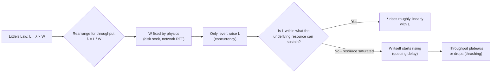
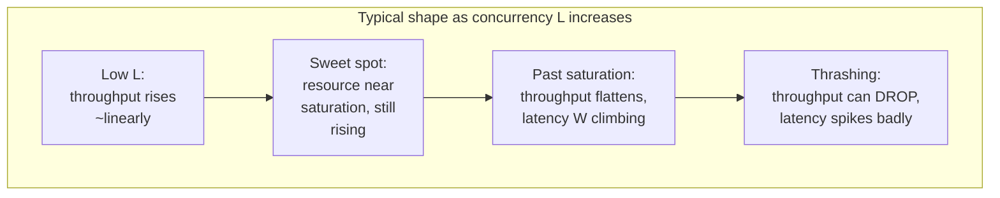

# Part 0, Chapter 0.4 — Latency vs Throughput

### 🧠 One-Sentence Mental Model
> Latency is how long *one* thing takes; throughput is how many things happen *per second* — and a system can have terrible latency with great throughput, or great latency with terrible throughput, at the same time.

### 🧒 Explain Like I'm Five
Imagine a highway. **Latency** is how long it takes one car to drive from one end to the other — say, 2 hours. **Throughput** is how many cars pass a checkpoint per hour — say, 10,000 cars/hour. You can widen the highway (add more lanes) and dramatically increase throughput *without changing how long any single car's trip takes*. That 2-hour drive is still 2 hours for every driver — you just fit way more drivers on the road at once. This is exactly what happens with I/O: adding concurrency (more "lanes") raises throughput without making any individual operation faster.

### 🌍 Real-World Analogy
A pizza restaurant with one oven that takes 15 minutes to cook a pizza has a **latency** of 15 minutes per pizza — always, no matter what. But if the oven can hold 8 pizzas at once, the **throughput** is 8 pizzas / 15 minutes = ~32 pizzas/hour, even though each individual pizza still personally experiences the full 15-minute wait. This is precisely the shape of every I/O system in this course: you cannot make one disk seek or one network round trip finish faster by "trying harder," but you can process many of them concurrently and get excellent aggregate throughput anyway.

### ❓ The Problem
People — even experienced engineers — routinely say "this system is fast" or "this system is slow" as if speed were one number. It isn't. A system can be:
- **Low latency, low throughput** — a single very fast operation, but the system can't do many at once (e.g., a single-threaded blocking server).
- **High latency, high throughput** — each operation feels slow to the caller, but the system processes enormous aggregate volume by running huge numbers concurrently (e.g., a batch data pipeline, or io_uring at deep queue depths).
- **Low latency, high throughput** — the ideal, and genuinely hard to achieve (e.g., a well-tuned in-memory cache cluster).
- **High latency, low throughput** — the worst case, usually a sign something is broken (e.g., a misconfigured, overloaded server).

Conflating these two axes leads to real engineering mistakes: optimizing for one while accidentally making the other worse.

### 🔥 Why This Problem Matters
Chapter 0.2 introduced Little's Law (`L = λ × W`) — this chapter is where it actually starts driving decisions. If you're designing a system and someone asks "should we use blocking threads or epoll?", the honest answer depends entirely on which axis you're optimizing:
- Optimizing for **latency of a single request**, low concurrency → blocking is often *fine*, sometimes even *better* (fewer moving parts, no readiness-checking overhead).
- Optimizing for **aggregate throughput** at high concurrency → you need a mechanism that holds many operations in flight without the linear cost-per-connection of a thread (epoll, io_uring).

Every mechanism from Part 4 onward will get evaluated on *both* axes, separately, in every benchmark table in this course (Part 23 makes this rigorous) — never collapse them into one "performance" number.

### 🕰 Historical Context
Early performance discussions (1970s-80s systems literature) mostly focused on throughput — "how many transactions per second can this mainframe handle" — because batch and timesharing workloads cared about total system utilization. The explosion of interactive and real-time systems (web in the 90s-2000s, then real-time bidding, gaming, and financial trading later) forced **latency**, especially **tail latency** (p99, p99.9 — Part 23), to become an equally first-class metric, because a system that's fast *on average* but occasionally takes 5 seconds is unacceptable for a human clicking a button or a trading algorithm racing a deadline. Modern I/O mechanism design (io_uring especially) explicitly optimizes for *both* axes simultaneously, which is part of why it's architecturally more complex than epoll.

### 💡 The Naive Solution
"Just measure requests per second" — treat throughput as the only metric that matters, since it's easy to compute (total requests ÷ total time) and looks good in a single number on a dashboard.

### ❌ Why the Naive Solution Fails
A system can have excellent *average* throughput while a meaningful fraction of individual requests take unacceptably long — average throughput completely hides this. Classic real example: a server processes 9,900 requests in 10ms and 100 requests in 5 full seconds (maybe they hit a slow disk path, a lock, a GC pause). Average latency looks fine. Throughput looks fine. But 1% of your users just had a terrible experience — and if those 100 slow requests are, say, checkout transactions, that 1% might be where all your revenue-critical traffic concentrates. This is exactly why Part 23 will insist on **percentile latency** (p50/p95/p99/p99.9), not averages.

### ✅ The Better Solution (Preview)
Always report and reason about **both axes independently**, and additionally report latency as a **distribution** (percentiles), not a single average — this becomes the standard benchmark format for the rest of the course (Part 23 formalizes the full methodology: hardware, workload, connection count, message size, warmup, measurement method, and both latency percentiles and throughput, every time).

### 🧠 Core Concept
> **Latency and throughput are independent axes. Concurrency is the dial that lets you trade between them (via Little's Law), but it does not eliminate either one — a system's true performance is a 2D picture (or more, once you add percentiles), never a single number.**

### 📐 Deep Technical Explanation

Formally, from Little's Law: `L = λ × W`
- `L` = average number of requests **in the system** at once (concurrency / "in-flight" count)
- `λ` (lambda) = arrival rate = **throughput** (requests completed per unit time, at steady state)
- `W` = average time each request **spends in the system** = **latency**

Rearranged: `λ = L / W` — **throughput equals concurrency divided by latency.**

This single equation is the mathematical spine of everything in this chapter:
- If `W` (latency) is fixed by physics (a disk seek, a network RTT — Chapter 0.2), the *only* way to raise `λ` (throughput) is to raise `L` (concurrency).
- If you *increase* concurrency `L` beyond what your latency-generating resource (disk, NIC, downstream service) can actually sustain, `W` itself starts to *increase* — queuing delay appears, because operations now wait behind other operations for the same limited resource. This is the mechanism behind the classic "throughput vs. latency" curve you'll build for real in Part 23: throughput rises roughly linearly with concurrency at first, then the curve bends as `W` starts increasing due to queuing, and eventually throughput plateaus or even *drops* as the system thrashes (too much contention, cache pressure, or scheduling overhead).

**Concretely relating this to I/O mechanisms:**
- Blocking, thread-per-connection: `L` is capped by how many threads your OS can reasonably run (thousands, not millions) — so throughput plateaus early even if the underlying device could sustain far more concurrent operations.
- epoll/io_uring: `L` can scale to tens or hundreds of thousands of in-flight operations on a single thread — so throughput can keep climbing (per Little's Law) far past what thread-per-connection could ever reach, *for the same per-operation latency* `W`.

This is the actual mathematical reason "epoll/io_uring scale better" — it's not magic, it's that they let you push `L` much higher without `L`'s own overhead (memory, scheduling) becoming the new bottleneck.

### 🏗 Architecture

**How to read this diagram:** Follow left to right. The equation at the top is not decoration — every box after it is a direct consequence of rearranging it. The critical fork is the diamond in the middle: as long as your concurrency `L` stays within what the underlying device/resource can actually sustain in parallel, more concurrency buys you more throughput almost for free. But push `L` past that point, and the *same* equation now works against you — because the resource is saturated, new requests start queuing behind old ones, `W` (latency) rises, and you can end up with **both** worse latency **and** flat-or-worse throughput. This bend in the curve is one of the most important shapes you'll learn to recognize on a real benchmark graph in Part 23.

### 📊 The Throughput-vs-Concurrency Curve, Visualized

**How to read this diagram:** This is the curve every real benchmark in Part 23 will produce when you sweep concurrency from 1 to a very large number while measuring both throughput and latency. Point P2 — the "knee" of the curve — is usually the actual target operating point for a production system: high throughput, latency still reasonable. Operating at P4 (common under traffic spikes without backpressure, Part 11.11) is the classic failure mode where a system under too much load performs *worse* on every axis simultaneously than it would serving fewer requests — a genuinely counter-intuitive but very real phenomenon you'll reproduce yourself with a real benchmark harness later in this course.

### 🔬 Experiment
**Predict Before Running.**
> A single-threaded blocking TCP echo server handles one client at a time; each request takes exactly 10ms of pure waiting (simulated network delay), and the server does nothing else while waiting. If 100 clients each send one request simultaneously, what is (a) the latency experienced by the *last* client served, and (b) the overall throughput of the system, in requests/sec?

Click to reveal the answer

**(a)** The last client waits for all 99 requests ahead of it to be served sequentially, plus its own — so its latency is roughly `100 × 10ms = 1000ms (1 second)`, even though the "real" per-request work is only 10ms. **(b)** Throughput is `100 requests / 1 second = 100 req/sec` in this batch, but note this number is deeply misleading as a steady-state figure — it was achieved by making 99 out of 100 clients wait far longer than their own request actually needed. This is the concrete version of the "average hides a lot" warning above: if you only reported "average latency ≈ 500ms, throughput = 100 req/sec," you'd completely miss that some clients had a dramatically worse experience than others purely due to queuing behind a single-concurrency bottleneck — exactly the problem Parts 4-14 exist to fix by raising `L`.

### ❌ Common Misconceptions
- ❌ **"High throughput means low latency."** — They're independent. You can have very high throughput with individually slow (but highly parallelized) requests — batch pipelines are a common real example.
- ❌ **"Average latency tells the whole story."** — It hides tail behavior completely; a system with great average latency can still deliver a terrible experience to a meaningful fraction of users (the 100-request example above, taken to its logical extreme in Part 23's percentile discussion).
- ❌ **"More concurrency always means more throughput."** — Only true up to the point where the underlying resource (CPU, disk, network, downstream service) is saturated; past that, more concurrency can make *both* throughput and latency worse via queuing and thrashing.
- ❌ **"Latency and throughput are the same kind of 'speed.'"** — They're genuinely different physical quantities — one is a duration (time per operation), the other is a rate (operations per time) — and optimizing one can actively hurt the other (e.g., batching improves throughput but can worsen the latency of any individual item stuck waiting for its batch to fill).

### 🧙 Wizard Insight
The most common real-world performance bug isn't "the system is slow" — it's "the system is fast *on average* and everyone stopped looking." Wizards distrust single numbers on principle: given only "average latency: 12ms, throughput: 50,000 req/sec," the correct first reaction is "what's the p99? what's the concurrency level this was measured at? is this near the knee of the curve or past it?" Nearly every production incident that starts with "but our dashboards looked fine" traces back to someone reporting one axis (usually throughput, because it's the easier number to compute) while the other axis (usually tail latency) had already quietly gone bad.

### 🏆 Mastery Challenge
Take the pizza-oven analogy from earlier and extend it yourself: what happens to throughput and latency if the restaurant adds a *second* oven with its own 15-minute cook time? What if instead they keep one oven but hire a much faster cook who reduces cook time to 10 minutes? Identify which change affects `L`, `λ`, or `W` in Little's Law, and which real I/O-mechanism change (more threads/epoll slots vs. a genuinely faster device) each corresponds to.

### 📌 Short Notes added to file
Saving the condensed version now — full chapter (analogies, exercises, quiz, etc.) stays here in chat as always.**Chapter 0.4 — Latency vs Throughput** taught in full above. Core takeaway: `λ = L/W` — once latency is physics-bound, concurrency is the only lever for throughput, and that's the real mathematical reason epoll/io_uring beat thread-per-connection at scale.

**Say one of these:**
- **NEXT** → Chapter 0.5 (Blocking vs Waiting)
- **DEEPER** / **PRACTICAL** / **QUIZ** / **RECAP**
