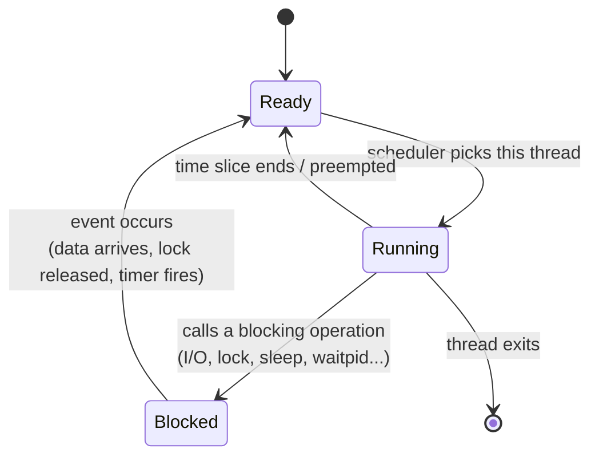
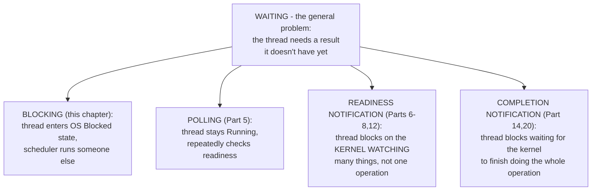

# Part 0, Chapter 0.5 — Blocking vs Waiting

### 🧠 One-Sentence Mental Model
> "Blocking" is a specific, named *technique* for waiting; "waiting" is the general problem — and confusing the two makes people think blocking is bad in itself, when really only *unmanaged concurrency* around blocking is the actual issue.

### 🧒 Explain Like I'm Five
Every kid waiting for a cookie is "waiting." But *how* they wait differs: one kid sits patiently and does nothing else until the cookie's ready (that's blocking). Another kid keeps running back to the kitchen every ten seconds asking "is it ready? is it ready?" (that's polling). A third kid tells their mom "yell for me when it's ready" and goes off to play with other toys (that's async notification). All three kids are "waiting" for the same cookie — but only the first one is specifically "blocking," and calling all three "blocking" would be wrong and confusing.

### 🌍 Real-World Analogy
"Waiting" is the genus; "blocking," "polling," and "async notification" are species. It's like calling every four-legged animal a "dog" — technically they share a category (waiting / animal), but conflating the specific mechanism with the general concept causes real misunderstanding. When someone says "blocking I/O doesn't scale," what they actually mean is "*unmanaged, one-thread-per-wait* blocking doesn't scale" — blocking itself, used *deliberately and in the right place*, is completely fine and often the simplest correct choice.

### ❓ The Problem
Chapters 0.1-0.4 have used the word "blocking" somewhat loosely as shorthand for "the thread stalls." This chapter draws the line precisely, because Part 4 is about to build real blocking servers, and getting the vocabulary exact now prevents confusion later when we contrast blocking against nonblocking (Part 5), readiness (Parts 6-8), and completion (Part 14) — all of which are also, in the broad sense, forms of "waiting."

### 🔥 Why This Problem Matters
Precision here prevents a specific, common beginner mistake: thinking "I should avoid blocking calls" as a blanket rule. That's wrong. The actual rule (which the rest of this course will justify in depth) is: **avoid tying up a scarce resource (a whole OS thread) on a blocking call when you have many concurrent waits to manage.** A command-line tool that reads one file and exits should absolutely use blocking I/O — it's simpler, has less code, and there's no concurrency to manage. A server juggling 50,000 connections should not use one blocking thread per connection. Same *waiting*, wildly different *appropriateness*, depending on concurrency requirements — not because blocking is inherently bad.

### 🕰 Historical Context
The word "blocking" comes directly from OS scheduling terminology: a process/thread in the **blocked** state (as opposed to **running** or **ready**) is one the scheduler has taken off the CPU because it's waiting on some event (I/O completion, a lock, a signal) — this is a formal state in essentially every OS's process state diagram, dating to the earliest multiprogramming systems (Part 2 will cover this state machine properly). "Blocking I/O" specifically refers to I/O calls that, by design, put the calling thread into this blocked state until the operation is ready or done. The term predates, and is more general than, any specific API — `read()`, `accept()`, `recv()`, a mutex `lock()`, even `sleep()` are all "blocking calls" in this formal sense, because they all can move the calling thread into the blocked state.

### 💡 The Naive Solution
Treat "blocking" and "waiting" as synonyms, and treat "avoid blocking" as a universal rule of good I/O programming.

### ❌ Why the Naive Solution Fails
It leads to two opposite mistakes:
1. **Over-engineering simple programs** — adding nonblocking sockets and an event loop to a script that only ever does one thing at a time, adding complexity for zero benefit.
2. **Under-engineering concurrent systems** — sticking with blocking-per-connection even as connection count grows past what threads can reasonably handle, because "blocking is what I know," without recognizing the actual scaling problem is thread count, not blocking itself.

Both mistakes come from not distinguishing "blocking" (the mechanism) from "the concurrency-scaling problem" (the actual issue that sometimes, but not always, makes blocking a bad choice).

### ✅ The Better Solution (Preview)
Ask two separate questions, not one: (1) "does this specific call need to wait?" — yes, unavoidably, for any real I/O; and (2) "how many of these waits do I need to manage concurrently, and does my chosen waiting mechanism's *resource cost per wait* fit that number?" Part 4 will show blocking's resource cost per wait is "one whole OS thread," which is fine for tens or hundreds of concurrent waits and painful for tens of thousands — that's the actual, resource-grounded version of "when to avoid blocking," replacing the vague folk rule.

### 🧠 Core Concept
> **Waiting is unavoidable for I/O. Blocking is one specific, named implementation of waiting (thread enters the OS "blocked" state). The question is never "should I wait?" — it's always "which waiting mechanism's resource cost fits how many concurrent waits I actually need?"**

### 📐 Deep Technical Explanation

**The formal OS process/thread states relevant here** (Part 2 covers the full state machine; here's the piece needed now):
- **Running** — actively executing on a CPU core right now.
- **Ready** — runnable, waiting only for the scheduler to give it a CPU core (not waiting on I/O or any external event).
- **Blocked / Waiting** — cannot run even if a CPU core were free, because it's waiting on something external (I/O completion, a lock, a signal, a timer).

A thread that calls a blocking `read()` on a socket with no data available transitions from Running → Blocked, and stays there until the kernel moves it back to Ready (data arrived) — at which point the scheduler will eventually give it a core again and it becomes Running.

**Crucially:** this "Blocked" state is not unique to I/O — a thread waiting on a mutex, a condition variable, `sleep()`, or `waitpid()` on a child process all also enter this same formal Blocked state. "Blocking I/O" is just the specific case where the thing you're blocked on is an I/O operation. This is why the vocabulary matters: "blocking" describes *what happens to the thread* (removed from the run queue), not *what you're waiting for* (which could be I/O, a lock, a timer, anything).

**The actual resource cost that matters (previewed fully in Part 4):** each blocked thread, regardless of what it's blocked on, still holds its full OS thread resources — a stack (typically 1-8MB, configurable), kernel scheduling metadata, and a slot in whatever thread-tracking structures the OS/runtime maintains. Blocking itself costs ~0 CPU cycles while blocked — but it costs a full thread's worth of *memory and OS bookkeeping* for as long as the block lasts. That's the actual number to reason about when deciding if blocking-per-operation will scale to your target concurrency.

### 🏗 Architecture

**How to read this diagram:** This is the general OS thread state machine (full detail in Part 2.7-2.10). The key insight for this chapter is the **Blocked** state's incoming arrow — it can be entered from *any* blocking operation, not just I/O. "Blocking I/O" is simply the special case where the outgoing arrow (back to Ready) is triggered by an I/O event specifically. When we say "avoid blocking at scale" later in this course, we specifically mean: avoid parking many threads in this Blocked state simultaneously, each one holding its full thread resources idle, when a mechanism exists (Parts 5-14) that can wait for many I/O events using far fewer threads.

### 🔀 "Blocking" Is a Subset of "Waiting"

**How to read this diagram:** All four boxes under "WAITING" are legitimate answers to the same underlying need — the thread needs something it doesn't have yet. Notice that D and E *also* technically involve blocking (the thread does eventually stop running while it waits for `epoll_wait()` or an `io_uring` completion) — the crucial difference from plain blocking (B) is *what* you're blocked on: one specific operation (B) versus a *notification about potentially many operations at once* (D, E). This is precisely why select/poll/epoll/io_uring aren't "the opposite of blocking" — they're smarter, batched versions of the same fundamental idea, letting one blocked thread stand in for thousands of individually-blocked operations.

### 🔬 Experiment
**Predict Before Running.**
> Two C++ programs each spawn 1,000 threads. Program A has each thread call `sleep(60)` (blocks on a timer, no I/O at all). Program B has each thread call a blocking `read()` on a socket that won't send data for 60 seconds. Do you predict the OS-level resource cost (memory, scheduler overhead) of these two programs differs significantly?

Click to reveal the answer

**No — they're essentially the same cost.** Both `sleep()` and blocking `read()` move their calling thread into the same formal Blocked state, and both hold the same per-thread resources (stack, kernel scheduling metadata) for the same duration, regardless of *what* they're blocked on. This is the concrete proof of this chapter's core point: the resource cost of blocking comes from *being a parked OS thread*, not from *what specifically you're waiting for*. 1,000 blocked threads cost roughly the same whether they're waiting on a timer, a socket, a mutex, or a child process — which is exactly why "1,000 blocking sockets" and "1,000 sleeping threads" are, from the OS's perspective, nearly the same problem with the same scaling ceiling.

### ❌ Common Misconceptions
- ❌ **"Blocking and waiting are the same thing."** — Waiting is the general problem (a thread needs something it doesn't have yet); blocking is one specific mechanism for waiting (thread enters the OS's formal Blocked state). Polling, readiness notification, and completion notification are other mechanisms for the same general problem.
- ❌ **"Blocking I/O is inherently bad."** — It's the cheapest possible mechanism in CPU terms and is the *correct* default choice whenever you don't have a large number of concurrent waits to manage. The problem is never blocking itself — it's the resource cost of *many simultaneous blocked threads*.
- ❌ **"Only I/O calls can block a thread."** — Mutex locks, condition variables, `sleep()`, `waitpid()`, and many other calls also move a thread into the Blocked state; "blocking" is a general OS scheduling concept, not an I/O-specific one.
- ❌ **"epoll/io_uring avoid blocking entirely."** — They still block — just on a *single call* (`epoll_wait()`, an io_uring completion wait) that can represent thousands of underlying I/O operations at once, rather than blocking one whole thread per operation. It's blocking used more efficiently, not blocking eliminated.

### 🧙 Wizard Insight
The vocabulary distinction in this chapter — blocking as a *specific mechanism* versus waiting as the *general problem* — is exactly what lets you see epoll and io_uring for what they really are: not "non-blocking magic," but *aggregated blocking*. A thread calling `epoll_wait()` is blocked, in the exact formal OS sense from this chapter's state diagram — it's just blocked on "any of these 50,000 sockets becoming ready," instead of blocked on one socket. Once you see it this way, the entire arc of this course (Parts 4 through 14) stops looking like "eliminating blocking" and starts looking like "amortizing the cost of blocking across more and more concurrent operations per blocked thread." That reframing is worth more than memorizing any individual API.

### 🏆 Mastery Challenge
Without looking back, explain to yourself (out loud or in writing) why calling `epoll_wait()` is, technically, still "blocking" in the formal OS sense — and why that's not a contradiction with epoll being the scalable solution to the thread-per-connection problem.

### 📌 Short Notes added to file next.**Chapter 0.5 — Blocking vs Waiting** done. Key reframe to keep: epoll/io_uring don't eliminate blocking — they amortize it, one blocked call standing in for thousands of operations instead of one thread per operation.

Only **0.6 — The I/O Mental Model** left in Part 0, then we move into Part 1 (hardware). 

**Say NEXT** to continue, or **DEEPER** / **PRACTICAL** / **QUIZ** / **RECAP**.
