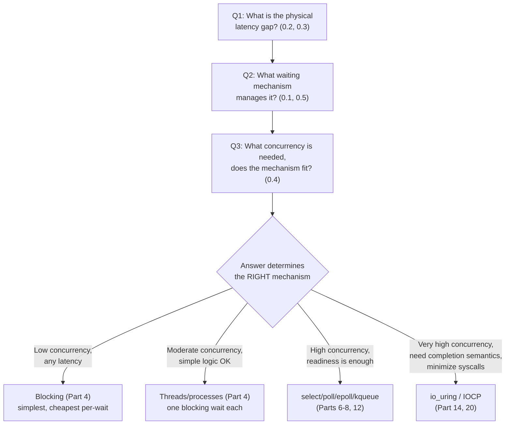
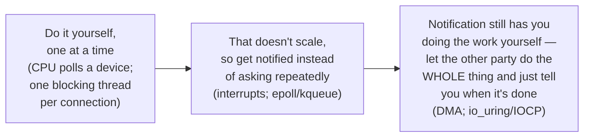

# Part 0, Chapter 0.6 — The I/O Mental Model

### 🧠 One-Sentence Mental Model
> Every I/O system, no matter how exotic, is just: a real physical latency gap (0.2, 0.3) that some waiting mechanism (0.1, 0.5) manages, sized to a concurrency requirement (0.4) — and once you can name those three things for any system, you understand it.

### 🧒 Explain Like I'm Five
This chapter doesn't teach anything new — it's the moment you step back from all the individual puzzle pieces (0.1 through 0.5) and see they form one picture. Like finishing a jigsaw puzzle: each piece made sense on its own, but only once they're all placed do you see the actual image. From here on, every new mechanism you learn (blocking servers, select, epoll, io_uring) is just a new *implementation detail* slotting into this same picture — not a new picture.

### ❓ The Problem This Chapter Solves
Without a synthesized mental model, students of I/O programming tend to memorize each mechanism (select, poll, epoll, io_uring) as an isolated fact — "epoll has these functions, these flags, this behavior" — with no organizing structure connecting them. When something new comes along (a new syscall, a new framework, a language's async runtime), they have to learn it from scratch, because they never built the underlying model that would let them slot the new thing in instantly. This chapter's entire purpose is to hand you that reusable model.

### 🧠 Core Concept — The Unified Model

> **Every I/O system can be fully described by answering three questions:**
> 1. **What is the physical latency gap?** (0.2, 0.3 — is this RAM-speed, SSD-speed, disk-speed, or network-speed? Where physically does the wait happen — controller, bus, remote machine?)
> 2. **What waiting mechanism manages that gap?** (0.1, 0.5 — blocking one thread per wait, polling, kernel-aggregated readiness notification, or kernel-driven completion?)
> 3. **What concurrency does it need to sustain, and does the mechanism's resource cost fit?** (0.4 — Little's Law: `λ = L/W` — does the chosen mechanism let `L` scale to the required `λ` without becoming the bottleneck itself?)

Any I/O system in existence — a simple CLI tool, nginx, Redis, a database engine, a video game's asset streaming, a high-frequency trading system — can be fully characterized by your answers to these three questions. This is the single model the entire rest of this 29-part course exists to fill in with real mechanisms, real APIs, and real numbers.

### 🏗 Architecture — The Full Synthesis Diagram

**How to read this diagram:** This is the decision path every real system design conversation about I/O eventually follows, whether people realize it or not. The three questions at the top aren't independent trivia — they chain together into one answer (the "R" diamond), and that answer picks a mechanism from Parts 4 through 20. Notice this is *exactly* the same shape as Chapter 0.1's very first diagram — we've now filled in the "how does the CPU spend the gap" decision with the actual reasoning (physical gap size + concurrency requirement) that determines which branch is correct for a *specific* system, rather than just naming the branches.

### 🔁 The Recurring Evolutionary Pattern

One more piece of the unified model, first spotted in Chapter 0.3's historical context and worth stating explicitly now: **the exact same evolutionary pattern repeats at every layer of this course**, hardware and software alike:

**How to read this diagram:** This three-stage pattern — *do it yourself repeatedly* → *get notified instead of asking* → *let the other side do the whole thing and just report completion* — appears at the hardware level (programmed I/O → interrupts → DMA, Chapter 0.3) and repeats almost identically at the software level (busy-polling → readiness notification via select/poll/epoll → completion notification via io_uring, Parts 5-14). Recognizing this as *one pattern appearing twice*, rather than two unrelated stories, is one of the most valuable "aha" moments this course can hand you — it means learning io_uring later will feel less like learning something new and more like recognizing something you already understand from a different layer.

### ❌ Common Misconceptions
- ❌ **"Each I/O mechanism is a completely separate technology to memorize independently."** — They're all specific answers to the same three questions (latency gap, waiting mechanism, concurrency fit); once you see the questions, new mechanisms become *recognizable variations*, not blank-slate memorization.
- ❌ **"Newer mechanisms (io_uring) are strictly better and should always be used."** — The unified model shows *why* this is false: if your latency gap is small and your concurrency need is low (Q1/Q3), blocking is still the simplest, cheapest, most correct answer — sophistication should match actual requirements, not just chase what's newest.
- ❌ **"This mental model is just an abstraction with no practical use."** — It's the actual tool for the real-world question "which I/O mechanism should I use here?" — Part 29's full decision framework is a direct, detailed expansion of exactly this three-question model.

### 🧙 Wizard Insight
The difference between an engineer who has *memorized* epoll and select and io_uring, versus one who *understands* I/O, is entirely this chapter. The former can answer "how do I call `epoll_ctl`?" The latter can answer "given this specific workload's latency profile and concurrency requirement, which mechanism is actually the right choice, and why would the alternatives be worse *here specifically*?" — which is a fundamentally more valuable and much rarer skill. Every remaining chapter in this 29-part course is going to hand you one more concrete mechanism to plug into this model; the model itself, not any single mechanism, is what makes you dangerous as a systems engineer.

### 🏆 Mastery Challenge — Part 0 Capstone
Pick any real system you've used or heard of (a video streaming service, a multiplayer game server, a database, a simple CLI backup script) and answer this chapter's three questions for it, from first principles, using only Chapters 0.1-0.6: (1) what's the dominant physical latency gap it deals with? (2) what waiting mechanism would make sense for it, and why? (3) roughly what concurrency does it need to sustain, and does your chosen mechanism's resource cost fit that? You don't need to be right about implementation details — the goal is proving to yourself that the three-question model actually produces a reasoned answer, not a guess.

---

**Part 0 is complete.** Everything from here forward (Part 1: hardware foundations, Part 2: kernel/process foundations, and onward through io_uring) is this same model, filled in with real mechanisms, real syscalls, and real C++ code.Found it — the section header got dropped in an earlier edit. Let me fix that and add Chapter 0.6.Now let's mark Part 0 complete in the roadmap file.**Part 0 is complete** — marked 🟩 in the roadmap. The unified model to carry forward: every I/O system = physical latency gap + waiting mechanism + concurrency fit, and the same "do-it-yourself → notify → completion" pattern repeats at both the hardware and software layers.

Next up is **Part 1 — Hardware Foundations** (registers, caches, PCIe, devices, DMA, interrupts, polling, memory-mapped I/O), which will start its own file (`part1_hardware_foundations.md`).

**Say NEXT** to begin Part 1, or **RECAP** for a full Part 0 quiz first.
