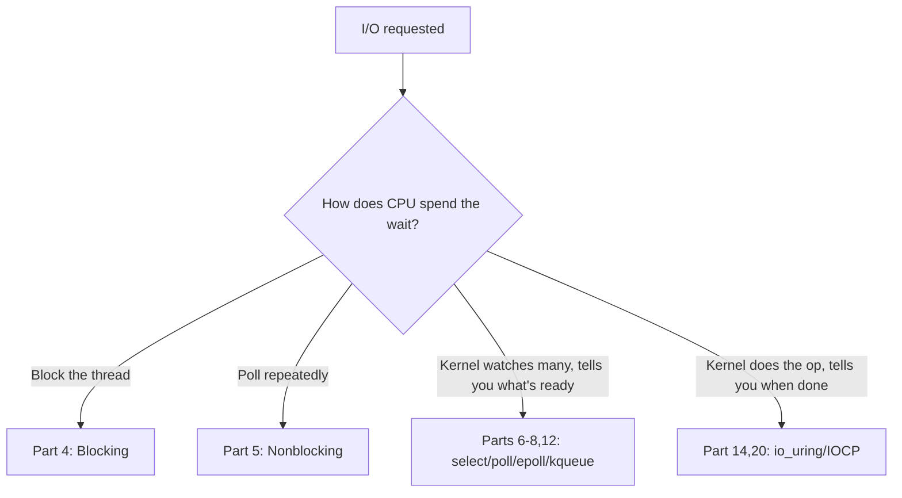
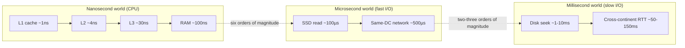
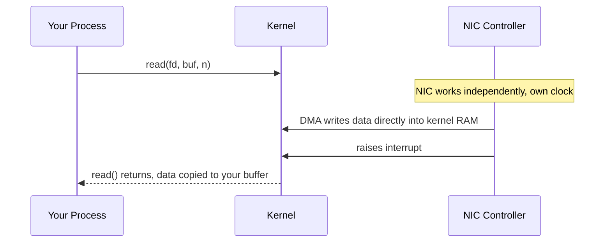
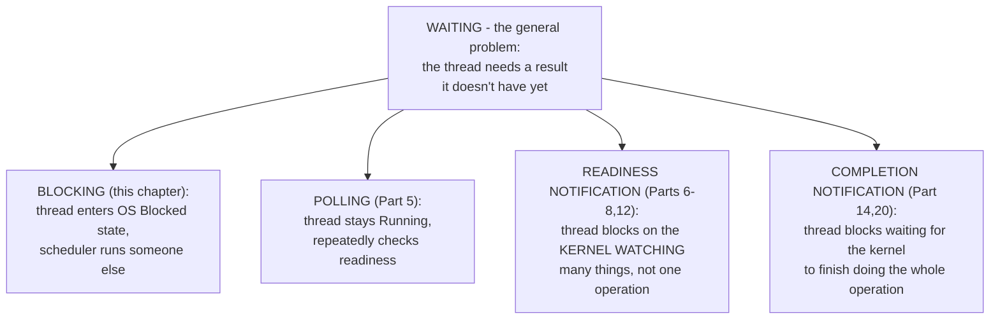

# PART 0 — HOW TO THINK LIKE AN I/O ENGINEER

> Condensed chapter summaries, not full chapters — for fast revision, not re-studying. Full deep teaching (analogies, exercises, quizzes) happens in chat when each chapter is first covered; only the compressed essence lands here.

---

## Chapter 0.1 — What Is I/O?

**Mental model:** I/O is the CPU asking something outside its own timeline (disk, NIC, pipe, human) to do work, then dealing with not knowing when it'll finish.

**Core idea:** I/O = CPU's timeline decoupled from a device's timeline. Everything else (fds, syscalls, readiness, completion, DMA, interrupts) is machinery to answer: *what does the CPU do during that gap?*

**Two waiting styles:** synchronous (thread stalls) vs asynchronous (thread keeps going, notified later). Async splits into **readiness** ("try now, you still do the op, can be partial/EAGAIN") vs **completion** ("op already done, here's the result") — full detail in Part 13.

**Gotchas:** blocking isn't "bad," it's cheap on CPU but ties up a whole thread — fine for one thing at a time, breaks at scale. A blocked thread uses ~0% CPU (kernel parks it on a wait queue); a naively *polling* thread burns 100% of a core for nothing.

---

## Chapter 0.2 — Why I/O Is Different From Computation

**Mental model:** If 1 CPU cycle = 1 second, a disk seek is over a year. The gap isn't a small difference, it's a different physical world.

**Latency ladder (memorize the order of magnitude, not exact numbers):**

Each step right is ~100x-1,000,000x slower.

**Why it matters:** a faster CPU does ~nothing for I/O-bound work — the device/network is the bottleneck, not computation. Latency (time to first byte) ≠ bandwidth (bytes/sec once flowing).

**Little's Law (`L = λ × W`):** when latency `W` is physics-bound (can't shrink), throughput can only rise via concurrency `L` — many ops in flight at once. This is *why* every later mechanism (threads, epoll, io_uring) manages many operations simultaneously instead of trying to make one operation faster.

**Gotchas:** SSDs shrank the RAM↔disk gap but didn't remove it (still ~1000x slower than RAM). Cross-continent latency is bounded by the speed of light — no software fixes that.

---

## Chapter 0.3 — CPU vs Memory vs Device

**Mental model:** The CPU never touches a disk/NIC directly — it talks to a controller chip, which is the only thing that ever touches the physical device.

**Physical hierarchy:** registers → cache → RAM → bus/interconnect (PCIe) → device controller → physical device.

**Key facts:**
- **DMA** offloads the data *copy* (device→RAM) from the CPU — not the coordination; kernel still sets up transfers and handles completion.
- **Interrupts** let the device proactively signal the CPU instead of the CPU polling a status register — not free, real per-interrupt overhead.
- The **bus/interconnect is shared** — bottlenecks can hide there, invisible if you only think "CPU vs device."
- One uniform `read()`/`write()` API hides completely different per-device drivers/protocols underneath (Unix "everything is a file").

**Gotchas:** "the CPU reads the disk" is a convenient lie — a separate controller chip does the physical work. A performance ceiling that matches neither CPU% nor any device's rated spec often means the *bus* is the bottleneck.

---

---

## Chapter 0.4 — Latency vs Throughput

**Mental model:** Latency = how long *one* operation takes. Throughput = how many operations happen *per second*. Independent axes — a system can be great on one and terrible on the other.

**Little's Law, rearranged:** `L = λ × W` → `λ = L / W` (throughput = concurrency ÷ latency). If latency `W` is physics-bound and fixed, the only way to raise throughput `λ` is to raise concurrency `L` — this is the mathematical reason epoll/io_uring "scale better" than thread-per-connection: they let `L` go far higher without `L` itself becoming the bottleneck.

**Gotchas:** average latency hides tail behavior — a system can look "fine" on average while a meaningful fraction of requests are terrible (percentiles p50/p95/p99 fix this, Part 23). More concurrency only helps up to the point the underlying resource saturates; past that, it can make *both* throughput and latency worse (queuing, thrashing). Never report one axis alone.

---

## Chapter 0.5 — Blocking vs Waiting

**Mental model:** "Blocking" is one specific mechanism for waiting (thread enters the OS's formal Blocked state); "waiting" is the general problem. Polling, readiness notification, and completion notification are other mechanisms for the same problem.

**Core idea:** any blocking call — I/O, a mutex, `sleep()`, `waitpid()` — moves a thread into the same OS "Blocked" state, with the same resource cost (a parked thread: stack + kernel scheduling metadata), regardless of *what* it's waiting for. The cost comes from being a parked thread, not from what you're blocked on.

**Reframe epoll/io_uring correctly:** they don't "eliminate blocking" — `epoll_wait()` still blocks, just on *one call representing thousands of operations* instead of one blocking call per operation. It's amortized blocking, not blocking removed.

**Gotchas:** "avoid blocking" is not a universal rule — blocking is the simplest, cheapest choice when you don't have many concurrent waits to manage. The real question is always: does my waiting mechanism's resource-cost-per-wait fit how many concurrent waits I actually need?

---

## Chapter 0.6 — The I/O Mental Model (Part 0 Synthesis)

**The unified model — every I/O system, fully described by three questions:**
1. **What's the physical latency gap?** (0.2/0.3 — RAM/SSD/disk/network speed, where the wait physically happens)
2. **What waiting mechanism manages it?** (0.1/0.5 — blocking, polling, readiness notification, completion notification)
3. **What concurrency must it sustain, and does the mechanism's resource cost fit?** (0.4 — Little's Law: `λ = L/W`)

**Core idea:** this 3-stage pattern (do-it-yourself → notification → completion) repeats identically at the hardware layer (Ch 0.3: programmed I/O → interrupts → DMA) and the software layer (Parts 5-14: busy-poll → select/poll/epoll → io_uring). Same pattern, two layers — recognize it once, understand both.

**Gotcha:** newer ≠ always better. io_uring isn't "strictly superior" to blocking — the right mechanism depends on your actual latency-gap and concurrency answers, not on chasing the newest API. Part 29 formalizes this into a full decision framework.

---

## 🗂 Part 0 — Short Notes (Fast Revision)

- I/O = CPU's timeline decoupled from a device's timeline — the entire reason this course exists.
- Sync (thread stalls) vs async (notified later); async splits into readiness vs completion (Part 13).
- Latency ladder: L1 ~1ns → RAM ~100ns → SSD ~100µs → disk seek ~1-10ms → cross-continent RTT ~50-150ms — each step ~100x-1,000,000x slower.
- Faster CPU ≈ useless for I/O-bound work. Latency ≠ bandwidth.
- Little's Law: physics-bound latency → concurrency is the only lever for throughput → why every mechanism after Part 0 manages *many* ops at once.
- Physical path: registers → cache → RAM → bus (PCIe) → device controller → device. CPU only ever talks to the controller.
- DMA offloads the copy, not coordination. Interrupts replace polling but aren't free. The bus is shared — bottlenecks can hide there.
- Bottom line: I/O programming = managing concurrency against a latency floor you cannot reduce.
