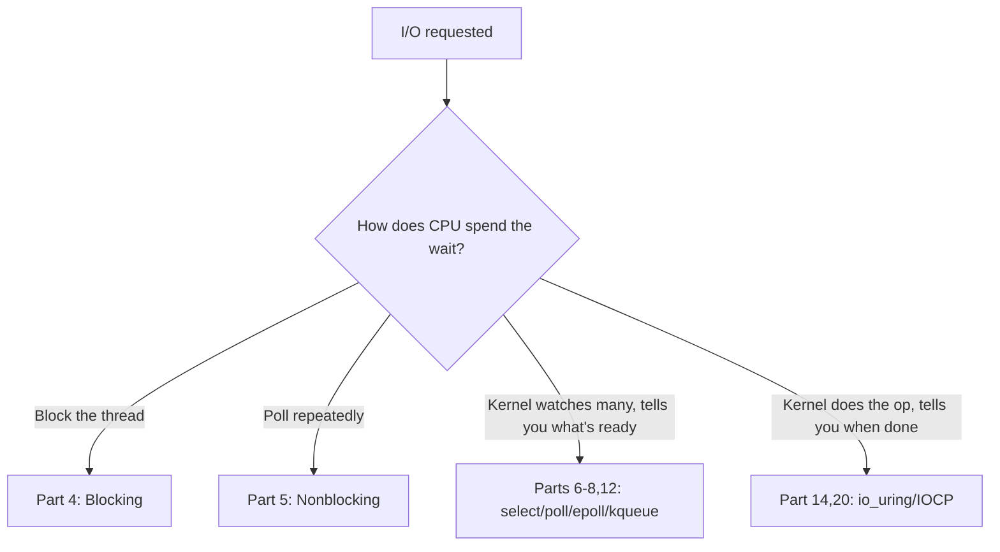
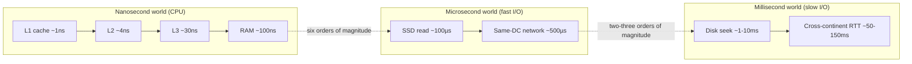
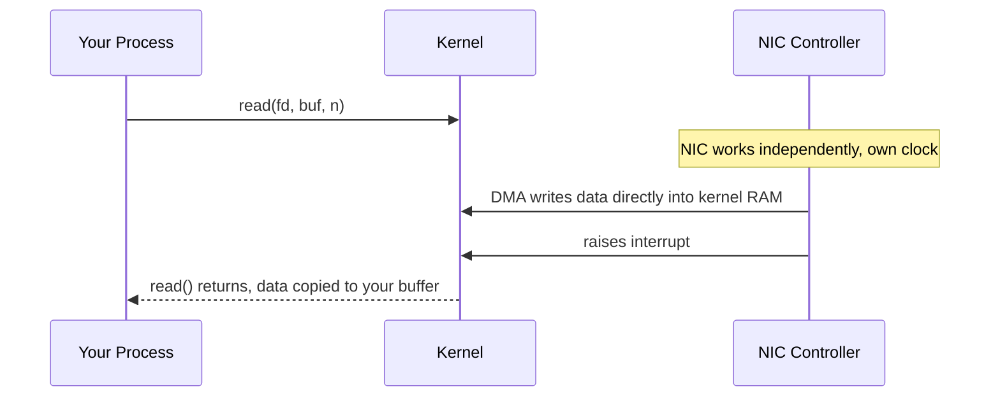

# PART 0 — HOW TO THINK LIKE AN I/O ENGINEER

> Condensed chapter summaries, not full chapters — for fast revision, not re-studying. Full deep teaching (analogies, exercises, quizzes) happens in chat when each chapter is first covered; only the compressed essence lands here.

---

## Chapter 0.1 — What Is I/O?

**Mental model:** I/O is the CPU asking something outside its own timeline (disk, NIC, pipe, human) to do work, then dealing with not knowing when it'll finish.

**Core idea:** I/O = CPU's timeline decoupled from a device's timeline. Everything else (fds, syscalls, readiness, completion, DMA, interrupts) is machinery to answer: *what does the CPU do during that gap?*

**Two waiting styles:** synchronous (thread stalls) vs asynchronous (thread keeps going, notified later). Async splits into **readiness** ("try now, you still do the op, can be partial/EAGAIN") vs **completion** ("op already done, here's the result") — full detail in Part 13.

**Gotchas:** blocking isn't "bad," it's cheap on CPU but ties up a whole thread — fine for one thing at a time, breaks at scale. A blocked thread uses ~0% CPU (kernel parks it on a wait queue); a naively *polling* thread burns 100% of a core for nothing.

---

## Chapter 0.2 — Why I/O Is Different From Computation

**Mental model:** If 1 CPU cycle = 1 second, a disk seek is over a year. The gap isn't a small difference, it's a different physical world.

**Latency ladder (memorize the order of magnitude, not exact numbers):**

Each step right is ~100x-1,000,000x slower.

**Why it matters:** a faster CPU does ~nothing for I/O-bound work — the device/network is the bottleneck, not computation. Latency (time to first byte) ≠ bandwidth (bytes/sec once flowing).

**Little's Law (`L = λ × W`):** when latency `W` is physics-bound (can't shrink), throughput can only rise via concurrency `L` — many ops in flight at once. This is *why* every later mechanism (threads, epoll, io_uring) manages many operations simultaneously instead of trying to make one operation faster.

**Gotchas:** SSDs shrank the RAM↔disk gap but didn't remove it (still ~1000x slower than RAM). Cross-continent latency is bounded by the speed of light — no software fixes that.

---

## Chapter 0.3 — CPU vs Memory vs Device

**Mental model:** The CPU never touches a disk/NIC directly — it talks to a controller chip, which is the only thing that ever touches the physical device.

**Physical hierarchy:** registers → cache → RAM → bus/interconnect (PCIe) → device controller → physical device.

**Key facts:**
- **DMA** offloads the data *copy* (device→RAM) from the CPU — not the coordination; kernel still sets up transfers and handles completion.
- **Interrupts** let the device proactively signal the CPU instead of the CPU polling a status register — not free, real per-interrupt overhead.
- The **bus/interconnect is shared** — bottlenecks can hide there, invisible if you only think "CPU vs device."
- One uniform `read()`/`write()` API hides completely different per-device drivers/protocols underneath (Unix "everything is a file").

**Gotchas:** "the CPU reads the disk" is a convenient lie — a separate controller chip does the physical work. A performance ceiling that matches neither CPU% nor any device's rated spec often means the *bus* is the bottleneck.

---

## 🗂 Part 0 — Short Notes (Fast Revision)

- I/O = CPU's timeline decoupled from a device's timeline — the entire reason this course exists.
- Sync (thread stalls) vs async (notified later); async splits into readiness vs completion (Part 13).
- Latency ladder: L1 ~1ns → RAM ~100ns → SSD ~100µs → disk seek ~1-10ms → cross-continent RTT ~50-150ms — each step ~100x-1,000,000x slower.
- Faster CPU ≈ useless for I/O-bound work. Latency ≠ bandwidth.
- Little's Law: physics-bound latency → concurrency is the only lever for throughput → why every mechanism after Part 0 manages *many* ops at once.
- Physical path: registers → cache → RAM → bus (PCIe) → device controller → device. CPU only ever talks to the controller.
- DMA offloads the copy, not coordination. Interrupts replace polling but aren't free. The bus is shared — bottlenecks can hide there.
- Bottom line: I/O programming = managing concurrency against a latency floor you cannot reduce.
