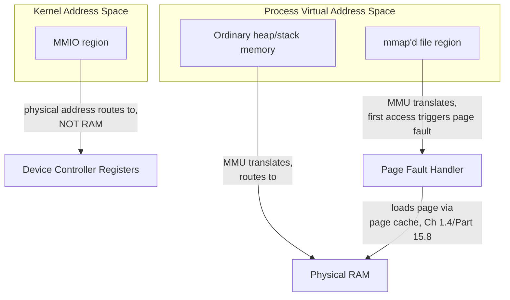

# Part 1, Chapter 1.10 — Memory-Mapped I/O

### 🧠 One-Sentence Mental Model
> Memory-mapped I/O means making something that *isn't* ordinary RAM — a device's registers, or even a file's contents — appear at a regular memory address, so the CPU can access it using the exact same load/store instructions it uses for everything else, with the actual routing (to a device or to a file-backed page) happening invisibly beneath the instruction.

### 🧒 Explain Like I'm Five
Imagine every drawer in the kitchen looks completely identical from the outside — same handle, same size, same way of opening. Some drawers hold ordinary ingredients (RAM). But one drawer is secretly a direct line to the delivery service's control panel (a device's registers), and another drawer is secretly a window into a specific page of a cookbook sitting in the pantry (a memory-mapped file) — opening it doesn't show you a copy, it shows you the actual page, live. The chef doesn't need special training for any of these drawers — "open the drawer" (a load/store instruction) works identically for all of them; what's different is what's actually wired up behind the drawer front.

### ❓ The Problem This Chapter Addresses
Chapter 1.6 introduced MMIO briefly as one of two ways the CPU addresses device registers. This chapter gives it the full, dedicated treatment — including the second, equally important meaning of "memory-mapped I/O" in systems programming: **memory-mapped files** (via `mmap()`), which lets a process treat a file's contents as if they were directly addressable memory, a concept that will become directly practical in Part 3 (file descriptors) and Part 15 (filesystem I/O), and is the final piece needed to complete this course's picture of "everything looks like memory to the CPU, until it doesn't."

### 🧠 Core Concept
> **"Memory-mapped" always means the same underlying trick: taking something that conceptually lives elsewhere (a device register, a file's bytes on disk) and making it addressable through the normal virtual memory system, so ordinary load/store instructions — and the MMU/page-table machinery from Chapter 1.4/Part 2.3 — handle the access, instead of requiring special-purpose instructions or explicit syscalls for every single access.**

### 📐 Deep Technical Explanation

**Two genuinely distinct applications of the same underlying idea, both worth knowing precisely because this course will use both terms later:**

**1. MMIO for device registers (Chapter 1.6's usage, now fully explained):** the kernel configures the system's memory management so that a specific range of physical addresses, instead of routing to actual RAM chips, routes to a device controller's registers. When your (kernel-level) code performs an ordinary load or store to an address in that range, the memory controller/chipset directs that access to the device instead of to DRAM — the CPU's load/store instruction itself has no idea anything unusual is happening; the routing is entirely a property of the physical address, decided by hardware configuration the kernel set up. This is what makes device drivers able to use ordinary C/C++ pointer dereferences (carefully, with appropriate volatile/memory-barrier handling to prevent compiler/CPU reordering from breaking hardware protocols) to control hardware, rather than needing entirely separate instruction forms for every device interaction.

**2. Memory-mapped files (`mmap()`, directly relevant to Part 3.5, Part 15, and Part 16's zero-copy techniques):** a process can ask the kernel to map a *file's* contents into its own virtual address space, such that reading/writing through an ordinary pointer into that mapped region transparently reads/writes the underlying file — the kernel handles this via the **page fault** mechanism (Part 2.3 preview): the file's pages aren't actually loaded into RAM until first touched, at which point a page fault occurs, the kernel loads the relevant page from disk (through the page cache, Chapter 1.4/Part 15.8) into RAM, maps it into the process's address space, and execution resumes as if the data had been there all along — again, completely transparent to the code doing the access, which just sees an ordinary pointer dereference. This is a genuinely different code path from `read()`/`write()` (no explicit syscall per access, no explicit buffer-copy step, Part 16 will contrast this directly against traditional read/write I/O for its zero-copy implications), even though the *concept* — "make something else look like ordinary memory" — is the same trick as MMIO for devices.

**Why both share the term "memory-mapped":** in both cases, the defining feature is that **ordinary memory-access instructions become the interface**, instead of specialized instructions (old-style port I/O) or explicit syscalls (traditional `read()`/`write()`). This is a recurring architectural pattern in systems design: whenever something can be made to "look like memory," the CPU's existing, highly-optimized load/store machinery (registers, Chapter 1.2; cache, Chapter 1.3; the MMU/page tables, Chapter 1.4) can be reused for it, rather than requiring a parallel, separately-optimized access path.

### 🏗 Architecture

**How to read this diagram:** Both halves of this diagram show the same underlying mechanism — an address that *looks* like ordinary memory to the code accessing it, but is actually routed somewhere else by the MMU/memory-controller machinery underneath. The top half (mmap'd files) routes, after a page fault, to real RAM holding a cached copy of file data. The bottom half (MMIO) routes directly to a device's registers, never touching RAM at all for that specific address range. The code performing the access — a pointer dereference in either case — cannot tell the difference from its own perspective; the entire distinction lives in how the kernel configured the underlying address mapping, invisible at the instruction level.

### ❌ Common Misconceptions
- ❌ **"Memory-mapped I/O only refers to device registers."** — In systems programming discussions, "memory-mapped" very commonly refers to `mmap()`-ed *files* as well — a genuinely different mechanism serving a different purpose (avoiding explicit read/write syscalls and copies for file access) but sharing the same core "make it look like memory" idea as device MMIO.
- ❌ **"Reading a memory-mapped file is exactly as fast as reading regular heap memory."** — The *first* access to any given mapped page still triggers a real page fault and (if not already in the page cache) a real disk read — mmap changes the *interface* (pointer access instead of read() calls) but does not eliminate the underlying I/O cost for genuinely uncached data; only subsequent accesses to already-faulted-in pages are RAM-speed.
- ❌ **"MMIO device registers can be accessed with any ordinary, unguarded pointer code, exactly like heap memory."** — Device registers often require careful ordering (volatile access, explicit memory barriers) because compilers and CPUs are free to reorder or optimize away "redundant-looking" ordinary memory accesses in ways that would break a hardware protocol expecting operations in a specific order — heap memory has no such constraint, but MMIO frequently does, which is exactly why device drivers use specific low-level access patterns rather than plain variable access.
- ❌ **"mmap() and DMA are unrelated mechanisms."** — They're complementary and sometimes directly connected: some high-performance I/O designs (Part 16, Part 21) use memory-mapped buffers specifically so a device's DMA engine can write directly into memory a userspace process has mapped, minimizing copies — understanding both mechanisms separately (this chapter, Chapter 1.7) is what makes that combination make sense when you meet it later.

### 🧙 Wizard Insight
This chapter closes Part 1 by revealing the single idea threading through nearly everything in this course's hardware layer: **"make it look like memory" is the master trick of systems design.** Registers look like fast memory to instructions (Chapter 1.2). Cache looks like RAM but is smaller and faster (Chapter 1.3). Device registers look like memory addresses via MMIO (this chapter, Chapter 1.6). Files look like memory via `mmap()` (this chapter). Even virtual memory itself (Part 2.3) is this same trick one level up — making physically scattered, possibly-swapped-out RAM look like one clean, contiguous address space to your program. Once you see this pattern as *one* idea applied repeatedly, rather than a dozen unrelated facts, Part 2 onward will feel like variations on a theme you already deeply understand, not a wall of new material.

### 🔬 Experiment
**Predict Before Running.**
> A C++ program `mmap()`s a 1GB file it has never accessed before, then immediately touches (reads) just the first 4KB of it. Do you predict the entire 1GB gets loaded into RAM at that moment, or something more limited?

Click to reveal the answer

**Only the specific page(s) actually touched get loaded — typically just one 4KB page (the standard page size on most systems), not the whole 1GB file.** This is the direct consequence of the page-fault mechanism described in this chapter: `mmap()` sets up the *address mapping* immediately (cheap, just kernel bookkeeping), but the actual data isn't pulled from disk into RAM until each individual page is genuinely touched, triggering its own page fault, on a page-by-page (**lazy loading** / **demand paging**) basis. Touching 4KB of a 1GB mapped file triggers roughly one page fault and one page's worth of disk I/O (or a page-cache hit if that data happened to already be cached, Chapter 1.4) — not 1GB of I/O. This is precisely why `mmap()` is attractive for working with very large files: you only pay the real I/O cost for the parts you actually access, exactly when you access them, rather than needing to read the entire file upfront the way a naive full-file `read()` call would.

---

**Part 1 is complete.** You now have the full hardware picture — CPU, registers, cache, RAM, PCIe, devices, DMA, interrupts, polling, and memory-mapped I/O — all built on the single recurring "make it look like memory, and reuse the fast path" idea. Part 2 builds the OS/kernel layer directly on top of this: processes, threads, virtual memory, syscalls, context switches, and the scheduler — the software machinery that turns this hardware into the "blocked thread," "wait queue," and "context switch" concepts Part 0 used freely and this course is about to make fully precise.Now let's mark Part 1 complete in the roadmap.**Part 1 — Hardware Foundations is complete** 🟩. The thread running through all ten chapters: "make it look like memory" — registers, cache, MMIO, mmap'd files, and eventually virtual memory itself are all the same trick reapplied at different layers.

Next up: **Part 2 — Linux Process + Kernel Foundations** (processes, threads, virtual memory, syscalls, context switches, the scheduler, wait queues) — this is where "blocked thread" and "context switch," used loosely since Part 0, finally get their full software-side mechanics, built directly on the hardware you now understand.

**Say NEXT** to begin Part 2, or **RECAP** for a Part 0 + Part 1 review quiz first.
