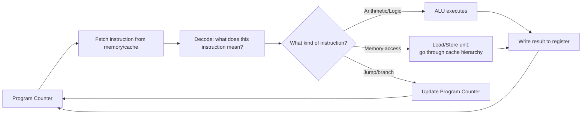

# Part 1, Chapter 1.1 — CPU

### 🧠 One-Sentence Mental Model
> The CPU is a very fast, very narrow-minded machine that can only ever do exactly what's in its current instruction — it has no concept of "I/O," "waiting," or "devices" at all; every one of those ideas is built on top of it by software and a handful of supporting hardware signals.

### 🧒 Explain Like I'm Five
The CPU is like someone who can only read one instruction card at a time, execute it instantly, then read the next card. It doesn't know what a "file" is, what a "network" is, or what "waiting" means — it just executes cards. Everything this whole course is about — I/O, waiting, devices — is stuff that has to be *built on top of* this extremely simple, extremely fast card-reader, because the card-reader itself has no built-in concept of any of it.

### ❓ The Problem This Chapter Addresses
Chapters 0.1-0.6 talked about "the CPU" as a somewhat abstract actor — "the CPU issues a request," "the CPU spends the gap doing X." This chapter (and the rest of Part 1) makes that concrete: what, physically and functionally, *is* a CPU, and what are its actual capabilities and limits, such that everything in Part 0 is even true?

### 🧠 Core Concept
A CPU core, at its simplest useful level of abstraction, repeatedly does exactly one loop, called the **fetch-decode-execute cycle**:
1. **Fetch** — read the next instruction from memory (using the **program counter**, a register holding the address of the next instruction).
2. **Decode** — figure out what that instruction means (add these two registers, jump to this address, load from this memory address, etc.).
3. **Execute** — actually do it, using the CPU's internal circuitry (the ALU for arithmetic, load/store units for memory access, etc.).

This loop runs continuously, once per clock cycle for simple instructions (modern CPUs actually overlap multiple instructions' stages — **pipelining** — and even execute multiple instructions per cycle — **superscalar** execution — but the conceptual loop above is the correct mental starting point; the real hardware complexity doesn't change the model, just its throughput).

**Critically: nothing in this loop has any concept of "waiting for a slow thing."** If an instruction needs data that isn't immediately available (e.g., a cache miss going to RAM, Chapter 0.2-0.3), the *hardware itself* stalls the pipeline for that instruction — but this is a very different, much more limited kind of "waiting" than what this course means by I/O waiting. A cache-miss stall is measured in tens to low-hundreds of cycles and is handled entirely by hardware, invisibly to software. Genuine I/O waiting (microseconds to milliseconds) is far too long for the CPU to simply stall the pipeline — that's exactly why the OS, not the CPU's own circuitry, has to get involved (moving the thread to the Blocked state, Chapter 0.5), and why the kernel/scheduler layer (Part 2) exists at all.

### 📐 Deep Technical Explanation

**What's physically inside a CPU core, relevant to this course:**
- **Registers** — a small, fixed number of storage slots (e.g., 16 general-purpose 64-bit registers on x86-64) directly wired into the execution units. Reading/writing them is part of executing a single instruction — effectively free in time.
- **Program counter (PC) / instruction pointer** — a special register holding the address of the next instruction to fetch. This is what "the thread's execution position" *means*, physically — and it's exactly what gets saved and restored during a context switch (Part 2.7) or when a thread blocks (Chapter 0.5) and later resumes.
- **ALU (Arithmetic Logic Unit)** — the circuitry that actually performs arithmetic and logic operations.
- **Load/store unit** — the circuitry that reads from and writes to memory (going through the cache hierarchy from Chapter 0.3).
- **Control unit** — decodes instructions and sequences the fetch-decode-execute steps, including handling **interrupts** (Chapter 0.3's preview, expanded in 1.8) — special signals that can make the CPU jump away from its normal instruction stream to run different code.

**Why "the CPU can't wait for I/O" is a hardware fact, not a design choice:** the CPU's pipeline is built to stall for at most a small, bounded number of cycles when data isn't immediately ready (e.g., waiting on a cache miss to resolve from RAM — Chapter 0.2's ~100ns). There is no hardware mechanism for the pipeline to "stall" for milliseconds while a disk seek completes — the pipeline would sit frozen, wasting every other instruction it could otherwise be running, for an eternity in CPU terms (Chapter 0.2's scaled-up analogy). This is the hardware-level reason software (the OS scheduler) has to step in and run a *different* set of instructions (another thread/process) during genuine I/O waits — it's not that "someone decided threads were a good idea," it's that the CPU's own instruction-execution hardware has no other way to stay useful during a multi-millisecond wait.

### 🏗 Architecture

**How to read this diagram:** This loop runs continuously, cycle after cycle. The critical thing to notice: there is no box in this diagram for "wait for a disk" or "wait for a network packet." Those concepts don't exist at this level — they're built entirely out of software (the OS) using a few specific hardware hooks: interrupts (which can redirect the Program Counter to different code, Chapter 1.8) and the memory-mapped registers of device controllers (Chapter 0.3, elaborated in 1.6/1.10). Everything this course teaches about I/O is, at the hardware level, ultimately just clever use of "redirect the Program Counter" and "read/write specific memory addresses that happen to be wired to a device" — nothing more exotic than that.

### ❌ Common Misconceptions
- ❌ **"The CPU 'waits' for I/O the same way it waits for a cache miss."** — A cache-miss stall is a bounded, hardware-managed pause of tens-to-hundreds of cycles. Genuine I/O waiting (µs-ms) is far too long for hardware pipeline stalling — it requires the OS to switch the CPU to running different instructions entirely (a different thread), which is a software-level mechanism, not a hardware pipeline feature.
- ❌ **"Modern CPUs execute one instruction at a time."** — Real CPUs pipeline and often execute multiple instructions per cycle (superscalar, out-of-order execution) — but this added complexity is about *throughput of computation*, and doesn't change anything about this chapter's core point: none of it has any built-in concept of I/O waiting.
- ❌ **"The CPU 'knows' it's running a thread doing I/O."** — The CPU just executes whatever instructions the Program Counter points to. It has no concept of "threads" or "processes" at all — those are entirely OS/software constructs built on top of the CPU's raw instruction execution (Part 2 makes this precise).

### 🧙 Wizard Insight
Every abstraction this course will teach — threads, blocking, epoll, io_uring — is, underneath, just software cleverly arranging which instructions get fed to this extremely simple fetch-decode-execute loop, and when. The CPU itself never got smarter about I/O over the decades this course's mechanisms evolved — `select()` in 1983 and `io_uring` in 2019 both ultimately just decide which instructions to feed a CPU core that works exactly the same way, at the level described in this chapter, as it always has. All the sophistication lives in software's decisions about *when* to redirect the Program Counter, never in the CPU somehow becoming aware of "I/O" as a concept.

### 🔬 Experiment
**Predict Before Running.**
> If a CPU core is executing a tight loop of pure arithmetic (no memory access beyond registers), and a network packet arrives for a completely different, currently-not-running thread on the same core, does that arithmetic loop get interrupted?

Click to reveal the answer

**Only if the OS/scheduler decides to.** The NIC raising a hardware interrupt (Chapter 0.3/1.8) does redirect the CPU core's Program Counter — but to the *interrupt handler* in the kernel, not directly to the other thread. The interrupt handler does its (typically very short) work, and then the kernel's scheduler decides whether to resume the originally-running arithmetic loop or switch to a different thread — this decision is software policy, not something the interrupt itself dictates. This is a preview of Part 2's scheduler chapters: hardware interrupts create *opportunities* for the OS to make scheduling decisions, but the CPU hardware itself has no opinion about which thread "deserves" to run next.

---

I'll now save the condensed version to the new Part 1 file.**Chapter 1.1 — CPU** done. Core takeaway: the fetch-decode-execute loop has zero built-in concept of I/O — the OS scheduler exists specifically because the CPU's own hardware can't stall for milliseconds.

**Say NEXT** for Chapter 1.2 (Registers), or **DEEPER** / **PRACTICAL** / **QUIZ** / **RECAP**.
