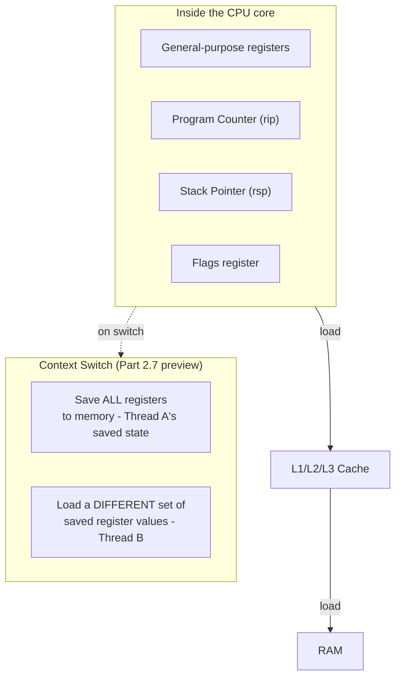

# Part 1, Chapter 1.2 — Registers

### 🧠 One-Sentence Mental Model
> Registers are the CPU's own hands — the only storage it can directly compute with — and every other kind of memory in this course (cache, RAM, disk, network buffers) exists only because registers are too few and too small to hold everything, forcing data to be shuttled in and out of this tiny, blazing-fast workspace.

### 🧒 Explain Like I'm Five
Imagine you can only do math using numbers written on your own two hands — maybe 16 slots total. Anything you need that isn't already on your hands, you have to go fetch (from a desk, a shelf, another room) and place onto a hand before you can use it. Registers are those hands: tiny in number, but the *only* place where the CPU can actually perform an operation. Every "instruction" in a CPU almost always reads its inputs from registers and writes its output back to a register — everything else (cache, RAM, disk) is just increasingly distant, increasingly large storage that data has to travel through to reach the hands.

### ❓ The Problem This Chapter Addresses
Chapter 1.1 mentioned registers as part of the fetch-decode-execute loop without explaining *why* they exist as a separate, special category of storage instead of the CPU just directly computing on RAM. This chapter fills that gap, and — more importantly for this course — explains why the Program Counter register specifically is the physical seat of "where a thread's execution currently is," which is the concept every context switch, block, and resume in the rest of this course manipulates.

### 🧠 Core Concept
> **Registers are storage physically built into the CPU core itself — not "nearby," not "on a bus," but part of the same silicon, wired directly into the ALU and control unit. This is why they're the fastest possible storage (effectively part of a single instruction's execution, no separate "access" step at all) and why there are so few of them (physical die space is expensive, and more registers means longer wires and more complexity in every instruction's decode/execute stage).**

Because registers are so scarce (typically 16-32 general-purpose registers on modern architectures), essentially every "real" piece of data a program cares about — its variables, its loop counters, its function arguments — spends almost its entire life *outside* registers, in cache or RAM, and gets loaded into a register only for the brief moment an instruction actually operates on it. This constant shuttling (load into register → compute → store back to memory) is such a fundamental, high-frequency operation that CPU designers spend enormous engineering effort optimizing exactly this path — which is part of why the cache hierarchy from Chapter 0.3 exists at all: to make that shuttling as cheap as possible.

### 📐 Deep Technical Explanation

**Categories of registers relevant to this course** (architecture-specific details vary; concepts are general):
- **General-purpose registers** — hold arbitrary data/addresses for computation (e.g., `rax`, `rbx`, ... on x86-64). Directly readable/writable by most instructions.
- **Program Counter / Instruction Pointer (`rip` on x86-64)** — holds the address of the next instruction to fetch. This is, physically, "where the thread is" in its own code. When a thread blocks (Chapter 0.5) or is context-switched (Part 2.7), what actually happens is: the kernel saves the current value of this register (plus the general-purpose registers, stack pointer, and a few others) to memory, so it can restore them exactly and resume as if nothing happened, later.
- **Stack Pointer (`rsp` on x86-64)** — holds the address of the top of the current thread's call stack (local variables, return addresses, function call bookkeeping). Also saved/restored on every context switch — this is *why* each thread needs its own stack memory (Part 2.2), and why more threads means more memory consumed even before any of them do anything (the 1-8MB-per-thread figure from Chapter 0.2/0.4's discussion).
- **Flags/status register** — holds the results of comparisons and arithmetic (e.g., "was the last result zero?", "did the last operation overflow?"), used immediately by the next conditional jump instruction.

**The "register set" as the complete definition of a thread's execution state:** the full collection of a CPU core's registers at any instant is, formally, the *entire* state needed to describe exactly where a computation is and what it's doing — nothing else about the CPU matters for resuming execution later. This is precisely why a "context switch" (Part 2.7) is fundamentally defined as: save this full register set to memory, load a *different* thread's previously-saved register set into the same physical registers, and let the fetch-decode-execute loop continue — the CPU core itself doesn't "know" it just switched to running an entirely different thread; from its perspective, it's just continuing to execute whatever the Program Counter now points to.

### 🏗 Architecture

**How to read this diagram:** The top box is what lives physically inside the CPU core — fast, tiny, few in number. Everything below it (cache, RAM) is where data waits when it's not actively being computed on, and is reached only via explicit load/store instructions moving data into and out of registers. The bottom box previews something Part 2 will make fully precise: a "context switch" is nothing more or less than swapping out the entire contents of this small set of registers for a different thread's previously-saved values — the Program Counter (`rip`) inside that swapped set is what makes the CPU "jump" to a completely different thread's code the instant the switch completes.

### ❌ Common Misconceptions
- ❌ **"Registers are just really fast RAM."** — They're not addressed the same way (no memory address — they're referenced by name/number directly in the instruction encoding) and are physically part of the CPU core's own circuitry, not a separate memory chip reached over any kind of bus at all.
- ❌ **"More registers would just make CPUs strictly faster with no downside."** — More registers means more silicon area, longer wires (physically slower signal propagation), and more complex instruction encoding (need more bits to specify which of more registers an instruction uses) — it's a real engineering trade-off, not a free win, which is why register counts have grown slowly and deliberately across CPU generations rather than just being made arbitrarily large.
- ❌ **"A context switch is some exotic, expensive kernel magic."** — At its physical core, it's "save this small set of register values, load a different small set" — genuinely fast in absolute terms (the µs-scale cost from Chapter 0.2's table comes mostly from other bookkeeping around the switch — scheduler decisions, cache effects from switching working sets — not from the raw act of swapping register values, which is itself extremely cheap).

### 🧙 Wizard Insight
Once you internalize that a thread's entire execution state is "just" the current values of a handful of registers, a lot of confusing systems concepts stop being confusing. A stack overflow is what happens when the Stack Pointer register runs off the end of its allocated memory. A segmentation fault from a wild pointer is the CPU trying to load/store through a register holding a bad address. A debugger "stepping through code" is literally just controlling the Program Counter register one instruction at a time. And critically for this course: every blocking call, every context switch, every thread wakeup is, underneath all the OS terminology, this same simple act — save a few register values, later restore them, and let the fetch-decode-execute loop from Chapter 1.1 carry on as if it never stopped.

### 🔬 Experiment
**Predict Before Running.**
> Two threads on the same CPU core are both mid-way through different function calls, each several stack frames deep. If the OS context-switches from Thread A to Thread B and back to Thread A a moment later, does Thread A need to "remember" or recompute where it was in its own function calls?

Click to reveal the answer

**No — it doesn't need to remember or recompute anything.** The Stack Pointer and Program Counter registers, saved exactly as they were the instant Thread A was switched out, are simply restored to their exact prior values when Thread A resumes. From Thread A's own perspective (and from the CPU's perspective, which has no memory of "being" Thread B in between), execution continues from precisely the next instruction after wherever it left off, with its entire call stack fully intact — because the call stack itself was never touched; only Thread A's *registers* were swapped out and back. This is exactly why threads can be paused and resumed transparently by the OS without the program itself needing any special logic to "save its place" — the register save/restore mechanism handles it completely invisibly.

---

Saving the condensed version now.**Chapter 1.2 — Registers** done. Key thread to hold onto: a thread's entire execution state is just its register values (PC + SP + general-purpose), which is why a context switch is fundamentally just "save one set, load another."

**Say NEXT** for Chapter 1.3 (CPU Caches), or **DEEPER** / **PRACTICAL** / **QUIZ** / **RECAP**.
