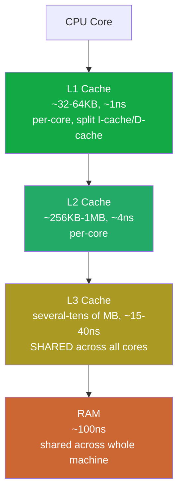
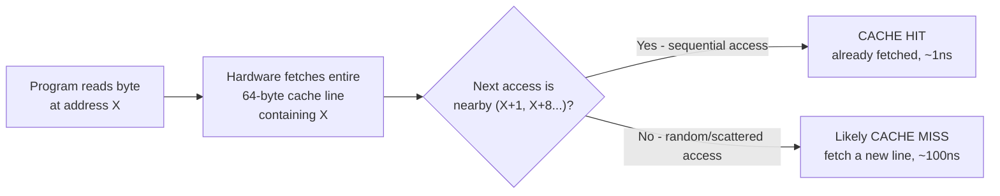

# Part 1, Chapter 1.3 — CPU Caches

### 🧠 One-Sentence Mental Model
> Cache exists because RAM, despite being "fast" compared to disk, is still roughly 300x slower than the CPU can consume data — so hardware automatically keeps copies of recently/likely-needed data much closer to the core, and almost everything about cache behavior follows from one idea: **locality** (if you used this data recently, or data near it, you'll probably need it again soon).

### 🧒 Explain Like I'm Five
Picture a chef with a small countertop (L1 cache), a nearby pantry shelf (L2), a walk-in fridge across the kitchen (L3), and a supermarket down the street (RAM). The chef doesn't walk to the supermarket for every single ingredient — that would be absurdly slow. Instead, ingredients used recently or often get kept on the countertop automatically, without the chef even having to think about it — a kitchen assistant (the hardware cache controller) handles moving things closer or further based on how often they're used. The chef (CPU) just reaches for what it needs and it's usually already close by — and only occasionally has to wait for something to be fetched from further away.

### ❓ The Problem This Chapter Addresses
Chapter 0.2 gave you cache latency numbers (L1 ~1ns, L2 ~4ns, L3 ~15-40ns) as facts to memorize. This chapter explains *why* those specific numbers exist, *why* there are multiple cache levels instead of one big fast one, and *why* cache behavior — not just raw CPU clock speed — is one of the most impactful, and most invisible, performance factors in any program, including the I/O-adjacent code this entire course is about.

### 🧠 Core Concept
> **Cache is automatic, hardware-managed, small-and-fast memory that sits between registers and RAM, exploiting two kinds of locality: temporal locality (if you accessed this address recently, you'll likely access it again soon) and spatial locality (if you accessed this address, you'll likely access nearby addresses soon too).**

Because building large amounts of very fast memory is physically expensive (fast memory needs more transistors per bit and more complex, power-hungry circuitry), CPU designers use a **hierarchy**: a very small, very fast L1 cache (typically 32-64KB per core), a larger but somewhat slower L2 (256KB-1MB), and a larger still, slower L3 shared across cores (several MB to tens of MB) — each level trading size for speed, so that the *common case* (data you just used, or data right next to it) is served by the fastest tier, while the *rare case* (genuinely new, scattered data) falls through to slower tiers or all the way to RAM.

### 📐 Deep Technical Explanation

**Why "spatial locality" specifically shapes cache design:** caches don't fetch single bytes from RAM — they fetch fixed-size chunks called **cache lines** (typically 64 bytes on modern x86-64) at a time. If your program reads one byte at address X, the hardware automatically pulls in the entire 64-byte-aligned block containing X, on the bet that you'll likely access nearby bytes soon (an array being iterated, a struct's adjacent fields). This is why **how you organize and access data** — not just how much data there is — massively affects performance: iterating an array sequentially is cache-friendly (each 64-byte fetch serves many subsequent accesses); jumping around randomly through memory (e.g., following pointers scattered across a large heap, common in naive linked-list-heavy code) defeats this entirely, forcing a fresh, slow fetch almost every time.

**Cache misses and their cost:** when the CPU needs data not currently in a given cache level, that's a **cache miss** at that level, and the request falls through to the next slower level (L1 miss → check L2 → L2 miss → check L3 → L3 miss → go all the way to RAM, ~100ns, Chapter 0.2). A program with a poor cache-access pattern can spend the overwhelming majority of its time simply waiting on cache misses rather than actually computing — invisible in the source code, only visible via profiling tools like `perf` (Part 22) that can directly count cache misses in hardware.

**Why this matters for an I/O-focused course specifically:** every I/O operation eventually involves touching real memory buffers — copying data in or out (Chapter 0.3's memory view), managing kernel data structures (Part 3's file descriptor tables, Part 8's epoll interest/ready lists). A naively-designed high-performance I/O system can be bottlenecked not by the network or disk at all, but by cache-unfriendly memory access patterns in the code managing all those buffers and structures — this becomes concretely important in Part 27 (cache lines, false sharing) when we discuss concurrent data structures shared across CPU cores.

**Cache coherency (brief preview, full detail in Part 27):** on a multi-core CPU, each core has its own L1/L2 cache, but they must all agree on the value of any given memory address — if core A writes to an address, core B's cached copy of that same address must be invalidated or updated. This coordination (handled by a hardware protocol, commonly a variant of MESI) has real performance costs when multiple cores frequently read/write the same cache line — a phenomenon called **false sharing**, which becomes directly relevant once this course reaches multithreaded epoll servers (Part 8.18) and lock-free queues (Part 27).

### 🏗 Architecture

**How to read this diagram:** Each level down is bigger, slower, and — critically — shared among more things (L1/L2 are private per core; L3 is shared across all cores on the chip; RAM is shared across the entire machine, all processes). A request only falls through to a slower level when the faster level above it doesn't have the data (a "miss"). The color gradient (green→red) mirrors Chapter 0.2's latency-ladder diagram deliberately — this is that same ladder, zoomed into just its first four rungs, with the *reason* for each rung's existence now explained: it's a size/speed trade-off, not an arbitrary design choice.

### 📏 Cache Lines and Spatial Locality

**How to read this diagram:** This is the mechanical reason "iterate an array" is fast and "chase pointers around a scattered heap" is slow, even when both touch the *same total amount* of data. The hardware doesn't know or care about your program's logic — it only knows "fetch the 64-byte block around whatever address was just requested." Code that happens to access memory in the same order that block was fetched (sequential, or structured for locality) gets almost every subsequent access served instantly (D); code that jumps around defeats the mechanism almost entirely (E) — same data, potentially 100x different performance, purely from access *pattern*.

### ❌ Common Misconceptions
- ❌ **"More cache always means faster."** — More cache means a *larger working set* can be served quickly, but doesn't help if your access pattern has poor locality — no amount of cache saves a genuinely random-access workload over a large enough dataset.
- ❌ **"Cache misses are rare edge cases."** — In memory-bound programs (many I/O-adjacent buffer-management workloads included), cache misses can dominate total runtime; profiling tools (Part 22's `perf`) routinely reveal cache-miss rates as the actual bottleneck in code that "looks" computationally simple.
- ❌ **"Cache is something I control directly in C++."** — You cannot explicitly place data "in L1" — cache behavior is entirely automatic hardware policy. What you *can* control is your data's memory layout and access pattern, which indirectly determines how cache-friendly your code is (this becomes concrete practice in Part 27).
- ❌ **"L3 cache being 'shared' is purely a bonus, no downside."** — Shared L3 (and any shared cache level) means cores can contend for the same cache space and bandwidth — a busy neighbor thread/process on another core can evict your data from shared cache, a real source of unpredictable performance variance in multi-tenant or multi-threaded systems.

### 🧙 Wizard Insight
The gap between "a program that works" and "a program that's fast" in performance-critical I/O systems (Part 22-24's territory) is very often not about algorithms or even about which I/O mechanism you chose — it's about whether your data structures and access patterns respect cache-line locality. Two implementations of the exact same epoll-based server, with identical logic, can differ by a large margin in throughput purely based on whether their per-connection data is laid out and accessed in a cache-friendly way. Wizards reach for `perf stat` and check cache-miss rates as a matter of habit whenever a system is "mysteriously" slower than the algorithm on paper suggests it should be — long before suspecting the I/O mechanism itself.

### 🔬 Experiment
**Predict Before Running.**
> Two C++ programs sum all elements of a 100MB array of integers. Program A sums them in order (index 0, 1, 2, ...). Program B sums them in a randomly shuffled order (same total work, same total data, different access pattern). Do you predict these run at roughly the same speed, or does one dramatically outperform the other?

Click to reveal the answer

**Program A (sequential) will very likely be dramatically faster** — often by a factor of several times to an order of magnitude, depending on array size relative to cache size. Sequential access means each 64-byte cache-line fetch serves 16 consecutive integers (assuming 4-byte ints) before the next fetch is needed — excellent spatial locality. Random access means nearly every single integer access falls in a *different* cache line, frequently missing all the way out to RAM (~100ns each) instead of hitting cache (~1-4ns). Same total arithmetic work, same total bytes summed — wildly different real-world speed, purely from memory access pattern. Try this yourself later with `std::chrono` timing both versions once we're doing real C++ experiments — this is one of the most reliable, easily-reproducible demonstrations of cache effects that exists.

---

Saving the condensed version now.**Chapter 1.3 — CPU Caches** done. The one thing to hold onto: cache lines (64 bytes) mean access *pattern* — not just data volume — can cause 100x performance swings, and this becomes directly relevant later for multithreaded I/O structures.

**Say NEXT** for Chapter 1.4 (RAM), or **DEEPER** / **PRACTICAL** / **QUIZ** / **RECAP**.
