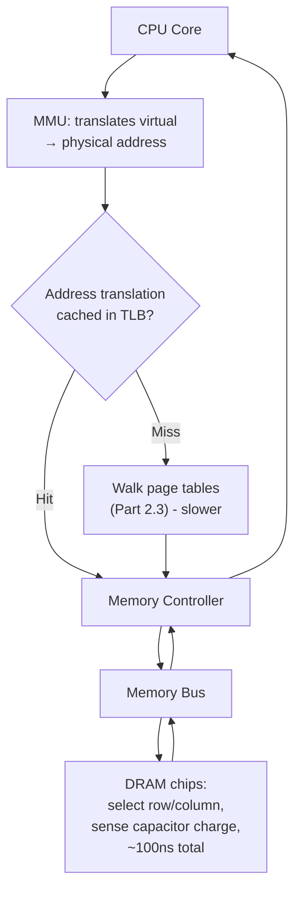
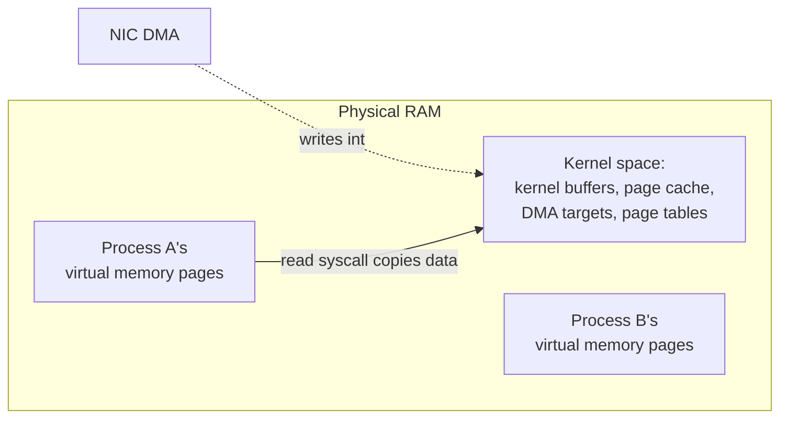

# Part 1, Chapter 1.4 — RAM

### 🧠 One-Sentence Mental Model
> RAM is the CPU's "working desk" — large enough to hold a program's entire active working set, but reached over a real physical bus with real physical latency (~100ns), which is why it's the last stop before things get genuinely, I/O-course-relevant slow (SSD, disk, network).

### 🧒 Explain Like I'm Five
If registers are the chef's hands and cache is the countertop, RAM is the entire kitchen's shelves and drawers — much bigger than the countertop, holds way more, but takes a real walk to reach, every single time. Unlike the countertop (cache), which the kitchen assistant manages automatically based on what's been used recently, the shelves (RAM) hold *everything* the program currently cares about — the assistant just decides what small slice of it currently sits on the countertop.

### ❓ The Problem This Chapter Addresses
Chapters 0.2-0.3 treated "RAM" as a single latency number (~100ns) and a box in the hierarchy diagram. This chapter makes RAM concrete: what it physically is, why accessing it takes ~100ns instead of ~1ns like cache, and — critically for this course — where kernel buffers, your program's variables, DMA targets, and page cache (Part 15) all actually *live*, since "RAM" is really where nearly everything non-trivial in this entire I/O course ends up.

### 🧠 Core Concept
> **RAM (DRAM specifically, in virtually all modern machines) is a genuinely separate set of chips from the CPU, connected via a memory bus/controller, storing data as electrical charge in tiny capacitors that must be constantly refreshed (hence "Dynamic" RAM) — and every access crosses a real, physical, off-chip journey, which is the direct physical reason for the ~100ns figure from Chapter 0.2, roughly 100x slower than L1 cache.**

RAM's ~100ns latency isn't arbitrary — it comes from real physical steps: the memory controller has to select the correct row and column in the DRAM chip's grid (a physical addressing scheme), wait for the capacitor's charge to be sensed reliably (this sensing step, "row activation," is a major contributor to DRAM latency), and transfer the result back across the memory bus to the CPU. This is fundamentally different from cache, which is built from SRAM (Static RAM) — faster, doesn't need refreshing, but needs far more transistors per bit, which is exactly why it's small and expensive (Chapter 1.3) while DRAM is large and comparatively cheap per bit.

### 📐 Deep Technical Explanation

**Why RAM specifically matters so much for I/O (not just as "generic memory"):**

1. **Kernel buffers live in RAM.** When a NIC's DMA engine writes incoming packet data (Chapter 0.3), it's writing into a specific region of RAM the kernel has set aside. When your `read()` call copies data into your process's buffer, that's also RAM — RAM-to-RAM copying, mediated by the CPU.
2. **The page cache lives in RAM** (Part 15.8) — the kernel's cache of recently-read/written file data, which is *why* a second read of the same file is often dramatically faster than the first: it may not touch the disk at all, being served entirely from RAM.
3. **Virtual memory (Part 2.3) makes RAM addressing indirect.** Your process's pointers are *virtual* addresses; the CPU's Memory Management Unit (MMU) translates them to *physical* RAM addresses on every access, using page tables the OS maintains. This translation itself has a cost (and its own small cache, the TLB — Translation Lookaside Buffer) which is part of why "just reading RAM" is a slightly more layered story than the raw ~100ns number suggests.
4. **RAM is finite and shared** — every process, every kernel buffer, the entire page cache, all compete for the same physical RAM. Under memory pressure, the kernel may evict page-cache pages (making a previously-fast repeated file read slow again) or, in the worst case, start swapping process memory to disk (Part 15's territory, and a scenario Part 22-24 will teach you to detect and avoid in performance-critical systems).

**Bandwidth vs. latency for RAM specifically:** a single RAM access has ~100ns latency, but RAM also has a maximum *bandwidth* (many GB/sec on modern systems) for sustained sequential transfers — this is the RAM-level instance of the latency-vs-throughput distinction from Chapter 0.4: a single random 8-byte read pays the full ~100ns latency, but reading a large contiguous block sequentially amortizes that latency across many bytes, achieving far higher effective throughput per byte than the raw latency number alone would suggest — directly analogous to why Chapter 0.2's table showed "read 1MB sequentially from RAM" at only ~3µs, much better per-byte than 100ns-per-random-access would imply.

### 🏗 Architecture

**How to read this diagram:** Even "just reading RAM" involves more steps than Chapter 0.2's single number suggests: your program's pointer is a *virtual* address (Part 2.3), which the MMU must translate to a *physical* RAM address — ideally using a cached translation (TLB hit, fast), but occasionally requiring a slower page-table walk (TLB miss). Only after that translation does the actual DRAM access (row/column select, charge sensing) happen. The ~100ns figure from Chapter 0.2 is a reasonable average across this whole path for a typical access — but a TLB miss, or accessing memory that's been swapped to disk (Part 15), can make an individual "RAM access" cost dramatically more than that average.

### 🧠 Memory View — Where Things Actually Live

**How to read this diagram:** RAM isn't one undifferentiated pool from your program's point of view — it's partitioned (via virtual memory, Part 2.3) into kernel space (shared, privileged, holds buffers and page cache) and per-process spaces (isolated from each other by the MMU/page tables). This is exactly why a `read()` on a socket involves *two* RAM regions and a copy between them (Chapter 0.3's memory view): the NIC's DMA writes into the kernel's region, and the syscall then copies from there into your process's own region — because your process cannot, by design, directly access kernel memory or another process's memory. Part 16 (zero-copy) is entirely about techniques to avoid or reduce exactly this copy.

### ❌ Common Misconceptions
- ❌ **"RAM access is a single, simple ~100ns operation."** — It typically involves a virtual-to-physical address translation (TLB hit/miss, Part 2.3) before the actual DRAM access even begins; the ~100ns figure is a reasonable average, not a hard constant for every single access.
- ❌ **"More RAM always means better I/O performance."** — More RAM allows a larger page cache (Part 15.8), which can dramatically help *repeated* file access, but doesn't change the latency of a single fresh RAM access, and doesn't help at all if your working set already comfortably fits in existing RAM.
- ❌ **"My process's memory and the kernel's buffers are just 'in the same RAM' with no real separation."** — Virtual memory (Part 2.3) and privilege levels genuinely isolate process memory from kernel memory and from other processes' memory — this is *why* `read()` has to copy data across that boundary rather than just handing you a pointer into the kernel's buffer directly (again, Part 16's zero-copy techniques exist specifically to work around this).
- ❌ **"Swapping to disk and 'the page cache' are the same mechanism."** — They're related but distinct: the page cache holds *file data* in RAM for speed (a cache that can be safely dropped and re-read from disk); swapping moves *process memory* (not backed by a file) out to disk under memory pressure, which is far more disruptive since that data has nowhere else to come from except being written out first (Part 15 covers both precisely).

### 🧙 Wizard Insight
"It's slow because it's touching RAM" is almost never, by itself, a useful diagnosis in a real performance investigation — RAM access is what *everything* does, constantly, and the real question is always *why* a given access pattern isn't hitting cache first (Chapter 1.3), or *why* a TLB miss / page fault is happening more than expected (Part 2.3), or *why* the page cache isn't already holding data you expected to be cached (Part 15.8). RAM is the ever-present baseline; wizards diagnose performance problems by figuring out which *layer above* RAM (cache, TLB, page cache) unexpectedly failed to do its job, not by pointing at RAM itself as the villain.

### 🔬 Experiment
**Predict Before Running.**
> A C++ program reads the same 500MB file twice in a row, sequentially, with no other disk activity in between. Do you predict the second read is roughly the same speed as the first, or meaningfully faster — and if faster, why?

Click to reveal the answer

**The second read will very likely be dramatically faster**, often by a large factor, assuming the file fits comfortably in available RAM and nothing evicted it in between. The reason is the **page cache** (Part 15.8): the first read pulled the file's data from disk into RAM as a side effect, and the kernel keeps that data cached there (as long as memory pressure doesn't force it out). The second read is served almost entirely from RAM (~100ns-scale per access, or even better with sequential access, Chapter 0.2's ~3µs/MB figure) instead of from disk (~1-10ms-scale seeks, or better for sequential reads, but still far slower than RAM). This is one of the most practically important patterns in this entire course: "the first access to a file is disk-speed; subsequent accesses (if memory allows) are RAM-speed," which is why real-world benchmarks (Part 23) always specify whether they're measuring cold-cache or warm-cache performance — conflating the two produces wildly misleading numbers.

---

Saving the condensed version now.**Chapter 1.4 — RAM** done. The single most important pattern to carry forward: first file read = disk-speed, second read (page cache) = RAM-speed — same file, orders of magnitude different, which is why every real benchmark later needs to specify cold vs. warm cache.

**Say NEXT** for Chapter 1.5 (PCIe), or **DEEPER** / **PRACTICAL** / **QUIZ** / **RECAP**.
