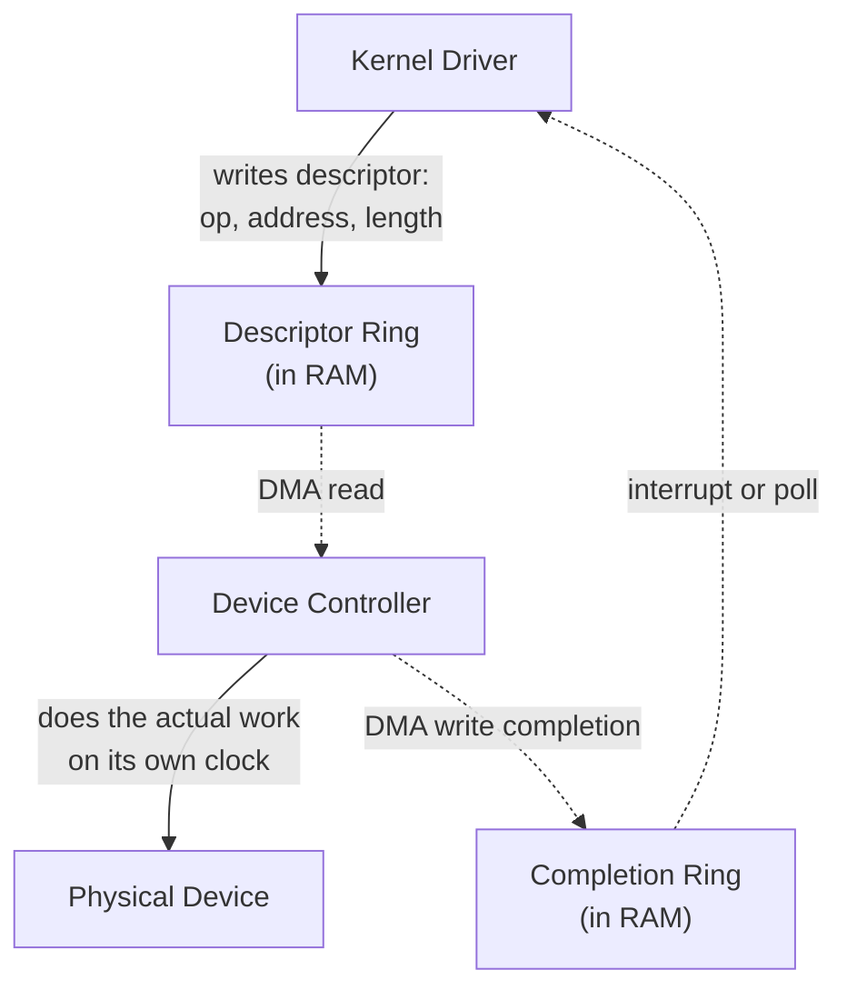

# Part 1, Chapter 1.6 — Devices

### 🧠 One-Sentence Mental Model
> A "device" is any piece of hardware with its own controller, its own clock, and its own protocol — and the CPU's *only* way to talk to it is through a small set of universal patterns (memory-mapped registers, port I/O, descriptor rings) that this chapter names explicitly, because every device driver in existence is just these patterns applied to a specific chip's specific register layout.

### 🧒 Explain Like I'm Five
Every "device" — a disk, a NIC, a keyboard, a GPU — is like a different vendor's delivery service, each with its own paperwork and procedures. But every one of them, no matter how different internally, exposes itself to the CPU through the same small handful of universal "interface windows": a set of labeled slots (registers) the CPU can read or write to give commands and check status. Learning "devices" isn't about memorizing every vendor's internals — it's about understanding these few universal interface patterns that every device, no matter how exotic, is built to expose.

### ❓ The Problem This Chapter Addresses
Chapters 0.3 and 1.5 referred to "the device controller" as a black box that "speaks the device's protocol." This chapter opens that box just enough to explain the actual, concrete mechanisms — memory-mapped I/O, port I/O, and descriptor rings — that the kernel driver layer (Chapter 0.3's driver diagram) uses to command a controller and read its status, which is the missing piece connecting "the CPU issues a request" to "the device controller does the work."

### 🧠 Core Concept
> **Every device controller exposes a set of registers — small, named storage locations, just like CPU registers conceptually, but living on the device itself — that the CPU reads and writes to control the device and check its status. How the CPU actually reaches those registers is one of a small number of standard patterns, the most important of which (for modern high-performance I/O) is Memory-Mapped I/O (MMIO) combined with descriptor rings in RAM.**

### 📐 Deep Technical Explanation

**Two classic ways the CPU addresses device registers:**
1. **Port-mapped I/O (PMIO)** — a legacy x86 mechanism using dedicated `IN`/`OUT` CPU instructions and a separate address space just for device ports, distinct from regular memory addresses. Largely a historical/legacy mechanism today for most high-performance devices, though still used for a few simple/legacy peripherals.
2. **Memory-Mapped I/O (MMIO)** — device registers are mapped into the *same* address space as regular RAM, at specific physical addresses. The CPU accesses a device register using ordinary load/store instructions (the same ones used for RAM access, Chapter 1.4) — from the CPU's instruction-set perspective, "write to this device register" looks identical to "write to this RAM address"; the *physical routing* (whether that address actually goes to RAM or to a device controller) is handled by the memory controller/chipset, invisibly to the instruction itself. MMIO is the dominant mechanism for modern high-performance devices (NICs, NVMe controllers, GPUs).

**Descriptor rings — the mechanism that actually matters most for this course's later chapters:** rather than the CPU manually writing each piece of data to a device register one at a time (which would be painfully slow for high-throughput devices), modern high-performance devices use **descriptor rings** (also called ring buffers or queues) — a data structure, living in regular RAM, that both the CPU/driver and the device controller can read and write. The driver writes "descriptors" (small structures describing a pending operation — e.g., "read from disk offset X for length Y into RAM address Z") into the ring; the device controller reads them via DMA (Chapter 0.3) and processes them independently, writing completion status back into the ring (or a separate completion ring) when done. This pattern — a shared ring buffer in RAM, one side submitting work, the other side reporting completions — is *exactly* the same conceptual pattern you'll see again explicitly, at the software/syscall level, in **io_uring** (Part 14) — its name literally means "I/O ring," because it's deliberately modeled on this exact hardware-level submission/completion-ring pattern that NICs and NVMe controllers have used internally for years. Seeing this now is a genuine preview payoff: io_uring isn't inventing a new idea, it's exposing an existing, proven hardware pattern directly to userspace.

**Why the driver needs to know the specific register layout, but your program doesn't:** Chapter 0.3's uniform-API diagram showed `read()`/`write()` staying the same regardless of device. This chapter explains the mechanism underneath that uniformity: the driver for a *specific* NIC chipset knows exactly which MMIO addresses correspond to that chipset's control registers, descriptor ring locations, and status flags — this knowledge is entirely chipset-specific and lives only in the driver. Your C++ program, and even most of the kernel above the driver layer, never needs to know any of this — it's fully encapsulated.

### 🏗 Architecture

**How to read this diagram:** The driver never talks to the device controller "directly" in a synchronous, one-at-a-time way for high-performance devices — it writes a description of the work into a ring buffer sitting in ordinary RAM, and the controller picks that work up on its own schedule via DMA, working through the ring independently. When done, it writes a completion record into another ring (or the same one), and either raises an interrupt or expects the driver to poll the completion ring (Part 21's high-performance polling drivers). This submission-ring / completion-ring shape is the direct hardware ancestor of io_uring's SQE (Submission Queue Entry) / CQE (Completion Queue Entry) model (Part 14) — when you reach that chapter, you'll be learning a software API that mirrors a hardware pattern you've already seen here.

### ❌ Common Misconceptions
- ❌ **"MMIO means the device data itself lives in RAM."** — MMIO means the device's *control/status registers* are addressed like RAM addresses; the actual bulk data transfer for high-throughput devices typically happens via separate DMA transfers into genuine RAM buffers, coordinated through descriptor rings, not by the CPU reading/writing bulk data through MMIO registers directly (that would be far too slow for high-throughput use).
- ❌ **"Every device uses descriptor rings."** — Simple, low-throughput devices (a basic serial port, some legacy peripherals) may use much simpler register-poke-and-check patterns; descriptor rings specifically earn their complexity for high-throughput devices (NICs, NVMe) where per-operation CPU involvement would be a bottleneck.
- ❌ **"io_uring is a completely novel invention."** — Its core submission-ring/completion-ring pattern directly mirrors decades-old hardware device-driver patterns (this chapter); its novelty is in exposing that pattern as a general-purpose *userspace-facing syscall interface* for arbitrary I/O operations, not in inventing the ring-buffer submission/completion idea itself.
- ❌ **"The kernel needs one driver per exact behavior, hand-written for the entire I/O stack."** — Only the low-level chipset-specific register/ring layout is driver-specific; everything above the driver (VFS, socket layer, syscall interface, Chapter 0.3) is shared, uniform code that works identically regardless of which specific driver is underneath.

### 🧙 Wizard Insight
Once you recognize the submission-ring/completion-ring pattern as the *universal* shape of high-performance device communication — not just "a NIC thing" or "an io_uring thing" — you gain a genuinely transferable mental model. NVMe SSDs use it. High-performance NICs use it. io_uring exposes it at the syscall level. Even GPU command buffers follow a closely related shape. When you eventually design or evaluate any high-throughput I/O system, asking "where's the submission side, where's the completion side, and is work being batched into the ring efficiently or trickling in one at a time" is one of the most broadly useful diagnostic questions in all of systems engineering — and you now have it, several parts before formally reaching io_uring.

### 🔬 Experiment
**Predict Before Running.**
> If a device driver needs to submit 1,000 small read operations to an NVMe SSD that uses a descriptor-ring interface, do you predict it's more efficient to write all 1,000 descriptors into the ring first and then notify the controller once, or to notify the controller separately after writing each individual descriptor?

Click to reveal the answer

**Writing all 1,000 descriptors first, then notifying once, is dramatically more efficient** — and this is exactly the batching principle previewed in Chapter 1.5 (PCIe protocol overhead per transaction) and made fully explicit here. Each "notify the controller" step (often itself an MMIO register write, "doorbell ring") has real overhead — a bus transaction, potentially a context switch if done from userspace, protocol framing (Chapter 1.5). Notifying once for 1,000 batched descriptors amortizes that fixed per-notification cost across all 1,000 operations, instead of paying it 1,000 separate times. This exact insight — batch submissions, minimize the number of separate "doorbell" notifications — is precisely why io_uring (Part 14) is architected around submitting many operations per syscall rather than one syscall per operation, and it's the direct software-level payoff of understanding this chapter's hardware-level ring pattern first.

---

Saving the condensed version now.**Chapter 1.6 — Devices** done, and this one's a genuine payoff chapter: the submission-ring/completion-ring pattern you just learned at the hardware level is *literally* what io_uring (Part 14) exposes to userspace. When you get there, it'll feel like recognition, not new material.

**Say NEXT** for Chapter 1.7 (DMA), or **DEEPER** / **PRACTICAL** / **QUIZ** / **RECAP**.
