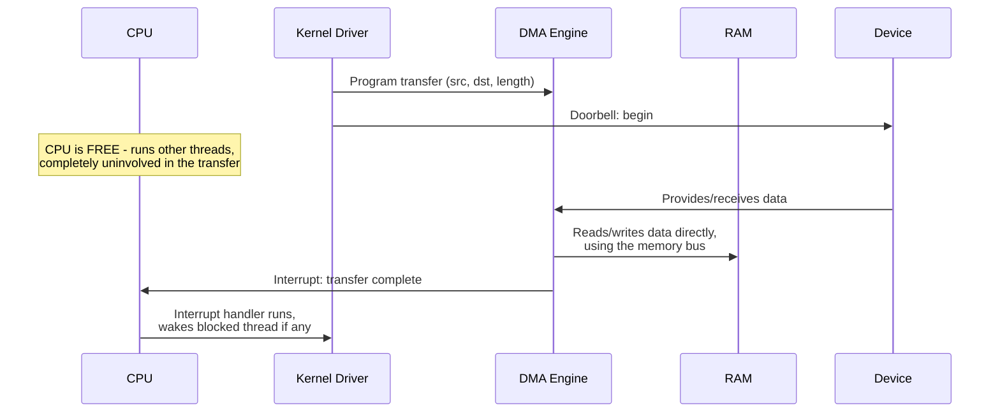

# Part 1, Chapter 1.7 — DMA

### 🧠 One-Sentence Mental Model
> DMA (Direct Memory Access) is a dedicated piece of hardware that moves data between a device and RAM *without* routing every byte through the CPU — the CPU sets up the transfer once, then is completely free to do other work until the transfer finishes, at which point it's notified (usually via interrupt).

### 🧒 Explain Like I'm Five
Without DMA, if the chef (CPU) wanted groceries delivered, the chef would have to personally carry each individual item from the delivery truck into the kitchen, one at a time, unable to cook anything else in between. With DMA, the chef tells the delivery service "put everything in this exact spot in the pantry" and then goes right on cooking other dishes — the delivery happens completely independently, and someone taps the chef on the shoulder only once everything's actually there. DMA is that delivery service doing the physical carrying itself, freeing the chef entirely.

### ❓ The Problem This Chapter Addresses
Chapters 0.3, 1.6 have referenced DMA repeatedly as a given fact ("the NIC uses DMA to write into RAM") without formally explaining the mechanism itself: what DMA hardware actually is, how a transfer gets set up, and precisely what the CPU is and isn't involved in. This chapter is where DMA finally gets its own full, dedicated treatment.

### ❓ Why This Existed as a Problem Historically
Before DMA (**programmed I/O**, mentioned in Chapter 0.3's historical context), the CPU itself had to execute a load instruction to read each unit of data from a device register and a store instruction to write it to RAM, in a tight loop, for the entire duration of a transfer. For a large transfer (a disk read of megabytes, a burst of network packets), this meant the CPU was 100% consumed, unable to do anything else, for the entire transfer — directly reintroducing the exact "wastes CPU" failure mode named all the way back in Chapter 0.1. DMA exists specifically to eliminate this.

### 🧠 Core Concept
> **A DMA engine is a small, semi-independent piece of hardware (sometimes part of the device controller itself, sometimes a separate chip) that can read and write RAM directly, using the same memory bus the CPU uses, but *without* CPU instructions driving each individual transfer — the CPU's only involvement is (1) programming the DMA engine with source, destination, and length up front, and (2) being notified when the transfer completes.**

### 📐 Deep Technical Explanation

**The DMA setup sequence, step by step (this is the concrete mechanism underlying every "NIC/disk uses DMA" statement in this course):**
1. The driver (Chapter 0.3) prepares a buffer in RAM to receive (or supply) data, and determines its physical address.
2. The driver programs the device controller's DMA engine — typically via MMIO register writes (Chapter 1.6) or by placing a descriptor in a ring (also Chapter 1.6) — telling it: source address (or "receive into this address"), destination address, and transfer length.
3. The driver tells the device to begin (a "doorbell" write, Chapter 1.6's experiment).
4. The CPU is now **completely free** — it can run any other thread, any other instructions, entirely unrelated to this transfer.
5. The DMA engine, independently and on its own schedule, moves the data — reading from the device and writing to RAM (or vice versa for outgoing transfers) — using the memory bus, competing for bus bandwidth with the CPU's own memory accesses (this is a real, if usually minor, source of interference — a very active DMA transfer can measurably slow down concurrent CPU memory access, since they share the same RAM bus).
6. When the transfer completes, the DMA engine (or the device controller it's part of) raises an **interrupt** (Chapter 1.8, next chapter) to notify the CPU.
7. The CPU's interrupt handler (running kernel code) acknowledges the interrupt and does whatever bookkeeping is needed — e.g., marking a buffer as ready, waking up a blocked thread waiting on this specific I/O operation (directly connecting back to Chapter 0.5's Blocked-state mechanics: this interrupt-triggered wakeup is *precisely* the event that moves a blocked thread from Blocked back to Ready).

**Two DMA models worth naming (architecture-general concepts, exact terminology varies):**
- **Direct/simple DMA** — the CPU explicitly programs a single transfer (source, destination, length) and is interrupted when it's done. Conceptually simple, suitable for lower-throughput scenarios.
- **Scatter-gather DMA** — the CPU provides a *list* of multiple source/destination/length triples in one setup (often via a descriptor ring, Chapter 1.6), and the DMA engine works through the entire list independently, potentially raising just one interrupt at the end (or using interrupt coalescing, Part 21) instead of one interrupt per individual chunk. This is the mechanism that makes high-throughput networking and storage practical — without it, a transfer involving many small non-contiguous buffers (common in real I/O — e.g., vectored I/O, Part 18) would require many separate DMA setups and many separate interrupts, reintroducing per-operation overhead DMA was supposed to eliminate.

**What DMA does *not* do:** it doesn't eliminate the need for the kernel to coordinate — buffers must be allocated and pinned (kept from being moved or paged out, Part 15, while a transfer is in flight) before a DMA transfer can safely target them, and the kernel still has to process the completion notification and hand data off appropriately. DMA removes the CPU from the *byte-copying* loop, not from the *coordination* responsibilities around a transfer — a distinction this course has flagged since Chapter 0.3's misconceptions section, now given its full mechanical explanation.

### 🏗 Architecture

**How to read this diagram:** The critical visual feature is the "CPU is FREE" note in the middle — for the entire duration of the actual data movement, the CPU has zero involvement, running completely unrelated code. This is the direct hardware realization of the async-notification model from Chapter 0.1's very first diagram: the CPU issues a request (programs the DMA engine), continues with other work, and gets notified later — except here it's happening at the hardware level, one layer below the software-level async patterns (epoll, io_uring) the rest of this course will build using this exact same shape.

### ❌ Common Misconceptions
- ❌ **"DMA means the CPU has literally zero involvement in an I/O operation."** — The CPU still has to set up the DMA transfer (program source/destination/length), and still has to handle the completion interrupt and do bookkeeping (waking threads, updating kernel data structures) — DMA specifically eliminates the CPU's involvement in the *bulk byte-copying* step, nothing more, nothing less.
- ❌ **"DMA transfers are instantaneous once started."** — They still take real time proportional to the amount of data and the bus/device speed (Chapters 0.2-0.3's latency numbers) — DMA changes *who* does the copying (freeing the CPU), not the fundamental physical speed of the transfer itself.
- ❌ **"A DMA engine and 'the device' are the same thing."** — The DMA engine is a specific piece of hardware functionality (sometimes integrated into the device controller, sometimes a shared system-level DMA controller) whose job is specifically the memory-move step — it's a component *of* the I/O path, not a synonym for the device as a whole.
- ❌ **"DMA transfers never affect CPU performance since the CPU isn't involved."** — DMA transfers use the same memory bus the CPU uses for its own RAM accesses (Chapter 1.4); a very heavy, sustained DMA transfer can measurably contend for memory bandwidth with whatever the CPU is doing concurrently — "the CPU is free" refers to instruction execution, not to zero system-wide resource impact.

### 🧙 Wizard Insight
DMA is the clearest possible illustration of this course's central theme, stated as concretely as it ever will be: the CPU issuing a request and *doing the work* are two completely different things, physically, at the hardware level, and every software abstraction in Parts 4-14 (blocking, epoll, io_uring) is really just different policies for managing that same separation one layer up. When you eventually see io_uring described as letting "the kernel perform I/O operations asynchronously, notifying you on completion" — recognize that you're looking at a software-level echo of exactly this chapter's DMA sequence diagram, with "DMA engine" swapped for "kernel/device combination" and "interrupt" swapped for "completion queue entry." The pattern was true in hardware first; io_uring just makes it available as a general-purpose programming model.

### 🔬 Experiment
**Predict Before Running.**
> A driver needs to receive 10,000 small network packets, each 200 bytes, arriving in quick succession. Without scatter-gather DMA (i.e., using only simple, single-transfer DMA), roughly how many separate DMA setups and interrupts would be needed, in the worst case — and why does this matter?

Click to reveal the answer

**In the worst case, up to 10,000 separate DMA setups and up to 10,000 separate interrupts** — one per packet, if each packet requires its own individually-programmed transfer and its own completion notification. Given Chapter 1.6's finding that batching submissions is dramatically more efficient than one-at-a-time operations, and this chapter's note that interrupts themselves have real overhead (Chapter 0.3's misconceptions: "interrupts are free" is false), 10,000 individual interrupt-driven DMA transfers for small packets would be a severe bottleneck — potentially spending more CPU time handling interrupts than doing anything useful with the actual data. This is exactly why real network drivers use scatter-gather DMA with descriptor rings (Chapter 1.6) and often **interrupt coalescing** (batching multiple completions into fewer interrupts, previewed here, made explicit in Part 21) — the raw architectural capability of DMA alone isn't enough; how it's *used* (batched vs. one-at-a-time) is just as important for real throughput, which is the exact same lesson this course will re-teach at the software level when it reaches io_uring's batched submission model in Part 14.

---

Saving the condensed version now.**Chapter 1.7 — DMA** done, with the mechanism now fully formalized (previous chapters only referenced it). Key connection: the interrupt that fires on DMA completion is literally the event that moves a blocked thread from Blocked→Ready (Ch 0.5) — that link is worth keeping firmly in mind going into Chapter 1.8.

**Say NEXT** for Chapter 1.8 (Interrupts), or **DEEPER** / **PRACTICAL** / **QUIZ** / **RECAP**.
