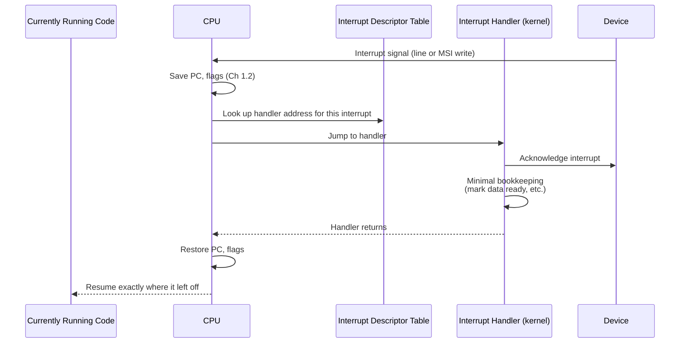

# Part 1, Chapter 1.8 — Interrupts

### 🧠 One-Sentence Mental Model
> An interrupt is a hardware signal that forcibly redirects the CPU's Program Counter to a special handler function, right in the middle of whatever it was doing — it's the *only* mechanism by which a device can proactively get the CPU's attention, rather than the CPU having to ask.

### 🧒 Explain Like I'm Five
Imagine the chef is deep in cooking a complicated dish, following a recipe card step by step (the Program Counter moving through instructions). An interrupt is like a delivery person ringing a doorbell — the chef immediately stops whatever step they're on, remembers exactly where they were (Chapter 1.2's register save), goes and handles the delivery (runs a short "interrupt handler" routine), and then goes right back to the exact step in the recipe they left off at. The delivery person never has to wait for the chef to finish the current dish and come check the door on their own — the doorbell forces immediate attention.

### ❓ The Problem This Chapter Addresses
Chapters 0.3, 1.6, and 1.7 have all mentioned interrupts as the mechanism that notifies the CPU when a device or DMA transfer completes, without formally explaining *how* an interrupt actually works at the CPU/hardware level. This chapter closes that gap — and, just as importantly, explains why interrupts have real overhead, a fact this course has repeatedly flagged (Chapter 0.3's misconceptions) but not yet fully justified.

### 🧠 Core Concept
> **An interrupt is an asynchronous hardware signal, delivered via a dedicated electrical line (or, on modern systems, a special memory-mapped message — MSI, Message Signaled Interrupts) that the CPU checks between instructions; when one arrives, the CPU automatically saves enough state to resume later (at minimum, the Program Counter and flags — Chapter 1.2), jumps to a specific handler address (looked up via the Interrupt Descriptor Table), runs that handler, then restores state and resumes exactly where it left off.**

### 📐 Deep Technical Explanation

**The interrupt handling sequence, step by step:**
1. A device (a NIC, a disk controller, a timer) needs the CPU's attention — most commonly, a DMA transfer just completed (Chapter 1.7), or new data has arrived that the device wants processed.
2. The device signals an interrupt — historically via a dedicated physical pin/line to the CPU or interrupt controller; on modern PCIe systems, more commonly via **MSI/MSI-X** (Message Signaled Interrupts), where the device simply performs a special memory write that the chipset recognizes as an interrupt request rather than requiring a separate physical wire per device — this scales far better with many devices, and allows a single device to have multiple distinct interrupt "vectors" (useful for routing different kinds of events, e.g., a NIC's RX-complete vs. TX-complete, to different CPU cores, Part 21).
3. The CPU, upon recognizing the interrupt (checked at defined points in its execution cycle), automatically pushes enough state (Program Counter, flags register, and depending on architecture, a bit more) onto the current stack, then jumps to a fixed handler address for that specific interrupt, looked up via a table the kernel set up in advance (the **Interrupt Descriptor Table**, or IDT, on x86).
4. The kernel's **interrupt handler** (also called an ISR, Interrupt Service Routine) runs — deliberately kept *very short* by convention: acknowledge the interrupt to the device/controller, do the minimal necessary bookkeeping (e.g., mark a DMA buffer as ready, note that a specific I/O operation completed), and often defer any heavier work to be done slightly later, outside the interrupt context (a mechanism Linux calls **softirqs**/**tasklets**/**workqueues** — full detail is beyond this course's scope, but the *reason* for deferring matters: interrupt handlers run with interrupts often disabled or restricted, and running too long inside one can delay other time-sensitive events, including other interrupts).
5. The handler finishes; the CPU restores the saved state (Program Counter, flags) and resumes exactly where the interrupted code left off — completely transparently to that code, which has no way to tell, from its own perspective, that anything happened at all (mirroring Chapter 1.2's context-switch transparency point, but here triggered by hardware rather than the scheduler).
6. Separately (not part of the interrupt handler itself, which stays short), the kernel's scheduler may, at a convenient later point, decide to wake a thread that was blocked waiting on this specific I/O event (Chapter 0.5's Blocked→Ready transition) — the interrupt is what *makes this possible*, but the actual thread-waking decision is scheduler policy, not something the interrupt handler itself does directly and immediately in all cases.

**Why interrupts have real, nonzero cost (justifying Chapter 0.3's flagged misconception):**
- Saving/restoring CPU state, even the minimal amount, takes real cycles.
- The interrupt handler itself, however short, still executes real instructions — time that isn't spent on whatever the CPU was doing before.
- Interrupts can disrupt pipeline state (Chapter 1.1) and cache locality (Chapter 1.3) — jumping to unrelated handler code can evict useful cache contents that the interrupted code was relying on, creating cache-miss costs *after* returning from the handler, on top of the direct handling cost.
- At very high interrupt *rates* (e.g., a NIC receiving millions of small packets per second, each individually raising an interrupt), this per-interrupt overhead, multiplied by a huge count, can genuinely consume the majority of a CPU core's time — a well-known real phenomenon called an **interrupt storm**, and the direct motivating problem behind both **interrupt coalescing** (batch multiple completions into fewer interrupts, Chapter 1.7's preview) and, at the extreme end, **polling-mode drivers** that deliberately disable interrupts entirely during high load and instead have the CPU actively check (poll) a descriptor ring — trading CPU cycles for eliminated interrupt overhead, profitable only when load is high enough to justify it (Part 21 makes this trade-off rigorous with real numbers).

### 🏗 Architecture

**How to read this diagram:** Notice the top and bottom — "Currently Running Code" has zero awareness this entire sequence happened; from its perspective, one instruction simply followed the previous one normally. Everything between the interrupt signal arriving and the code resuming is invisible overhead layered in by the CPU and kernel automatically. This diagram is the direct hardware-level realization of Chapter 0.1's "asynchronous notification" branch — a device is proactively telling the CPU something happened, rather than the CPU having to repeatedly ask (which would be the polling alternative, Chapter 0.3's historical context) — but notice this proactive notification isn't free; every box in this sequence costs real cycles, which is precisely the mechanical justification for why interrupt coalescing and polling-mode drivers (Part 21) exist as legitimate alternatives at very high event rates.

### ❌ Common Misconceptions
- ❌ **"Interrupts are essentially free — they're the 'efficient' alternative to polling, full stop."** — They eliminate wasted polling cycles when events are relatively infrequent, but each interrupt has real, nonzero cost (state save/restore, handler execution, cache disruption) — at sufficiently high event rates, that cost can exceed what polling would have cost, which is exactly why very high-throughput systems sometimes deliberately switch to polling-mode drivers under load (Part 21).
- ❌ **"An interrupt handler does all the work needed to respond to a device event."** — By convention, handlers do the bare minimum and defer heavier work to be run later, outside interrupt context, specifically because running long inside a handler can delay other interrupts and time-sensitive kernel activity.
- ❌ **"The interrupt directly wakes up the specific application thread waiting for the data."** — The interrupt handler does minimal bookkeeping (e.g., marking data as ready); the actual decision to move a specific blocked thread back to the Ready state and eventually schedule it to run is separate scheduler logic, which may happen slightly after the interrupt handler itself has already returned.
- ❌ **"Every device needs its own dedicated physical interrupt line."** — Modern PCIe systems predominantly use MSI/MSI-X (message-based interrupts via a special memory write), which scales to many devices and multiple interrupt vectors per device without needing dedicated physical wiring per interrupt source.

### 🧙 Wizard Insight
"Interrupt overhead" sounds like a minor implementation detail until you're debugging a real high-throughput networking system that's mysteriously CPU-bound despite seemingly modest traffic — and the actual culprit, visible only via tools like `/proc/interrupts` or `perf` (Part 22), turns out to be an interrupt storm: tens or hundreds of thousands of interrupts per second, each individually cheap, collectively consuming most of a core. Recognizing this pattern — and knowing that the fix is usually interrupt coalescing, RSS/RPS to spread interrupts across cores (Part 21), or in extreme cases switching to polling-mode drivers — is a genuinely valuable, non-obvious diagnostic skill that traces directly back to understanding this chapter's step-by-step interrupt mechanism, not just knowing "interrupts exist."

### 🔬 Experiment
**Predict Before Running.**
> A NIC receives network traffic at two different rates: (a) a light, steady trickle of a few packets per second, and (b) a heavy burst of hundreds of thousands of tiny packets per second. For which scenario would you predict interrupt-per-packet handling performs relatively well, and for which would you predict it becomes a genuine bottleneck?

Click to reveal the answer

**Interrupt-per-packet works fine for scenario (a)** — at a few interrupts per second, the real-but-small per-interrupt overhead (state save/restore, short handler execution, minor cache disruption) is utterly negligible relative to everything else the CPU is doing. **Scenario (b) is where it becomes a genuine bottleneck** — hundreds of thousands of interrupts per second, each individually costing real cycles (this chapter's sequence diagram), can consume a large fraction of a CPU core purely on interrupt handling overhead, leaving little capacity for actually processing the packets' contents. This is precisely the real-world motivation for interrupt coalescing (batch many packet-completions into fewer interrupts) and, at the extreme, NAPI-style polling drivers in Linux that switch from interrupt-driven to poll-driven operation specifically when load crosses a threshold — a concrete, load-dependent instance of this course's recurring theme (Chapter 0.6's evolutionary pattern: do-it-yourself → notification → completion) where the "best" mechanism actually depends on the workload's rate, not on any mechanism being universally superior.

---

Saving the condensed version now.**Chapter 1.8 — Interrupts** done — this is the chapter that finally justifies "interrupts aren't free," a claim this course has been making since Chapter 0.3. Diagnostic tool worth remembering: `/proc/interrupts` for spotting interrupt storms.

**Say NEXT** for Chapter 1.9 (Polling), or **DEEPER** / **PRACTICAL** / **QUIZ** / **RECAP**.
