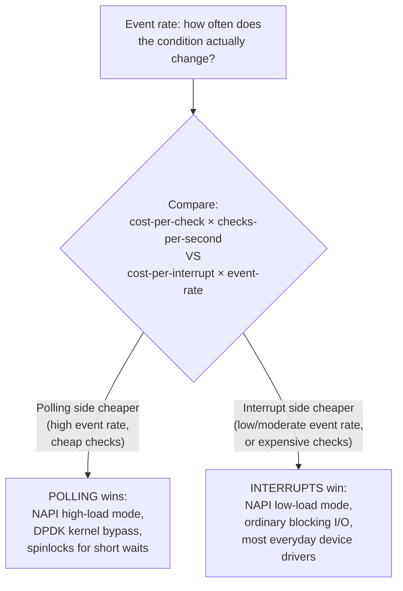

# Part 1, Chapter 1.9 — Polling

### 🧠 One-Sentence Mental Model
> Polling is the CPU repeatedly asking "are you ready yet?" by reading a status register or checking a memory location — it's the oldest, simplest I/O technique in existence, and understanding exactly when it's *good* (not just "the naive bad thing") is what separates a shallow understanding of this course from a deep one.

### 🧒 Explain Like I'm Five
Polling is the chef walking to the oven every few seconds and opening the door to check if the food's ready, instead of waiting for a timer to ding. It sounds wasteful — and for a 40-minute roast, it obviously is. But if the food is going to be ready in exactly 2 seconds and checking costs nothing, walking over once and just watching for 2 seconds might genuinely be simpler and faster than setting up a timer, waiting for it to ding, and then walking over anyway. Polling isn't "the bad option" — it's the *simplest* option, correct exactly when the wait is short enough, or checking is cheap enough, that the overhead of a fancier notification mechanism isn't worth it.

### ❓ The Problem This Chapter Addresses
This entire course, starting from Chapter 0.1, has framed polling somewhat negatively — "busy polling wastes CPU," used mainly as the *motivating problem* that justified inventing interrupts (hardware level, Chapter 1.8) and later select/epoll (software level, Parts 6-8). This chapter is the necessary correction: polling is not universally bad, and understanding precisely *when* it wins is essential preparation for Part 21, where you'll learn that the highest-performance networking systems in existence often deliberately *choose* polling over interrupts at high load — a fact that would seem contradictory without this chapter's nuance.

### 🧠 Core Concept
> **Polling means actively, repeatedly checking a condition (a status register, a memory flag, a ring buffer's head/tail pointers) instead of being passively notified. Its cost is proportional to how often you check and how long you check before the thing you're waiting for actually happens; interrupts' cost is proportional to how often the event itself occurs. Which wins is a direct function of event rate and how expensive a single "check" is relative to a single "interrupt handling."**

### 📐 Deep Technical Explanation

**The core trade-off, made mathematically explicit:**
- **Polling's cost** ≈ (number of checks performed) × (cost per check). If you poll in a tight loop, the number of checks scales with *how long you wait*, not with how often the event actually happens — waiting a long time for a rare event means enormous wasted-check overhead (the original "busy polling wastes CPU" problem from Chapter 0.1).
- **Interrupt's cost** ≈ (number of actual events) × (cost per interrupt, Chapter 1.8's real, nonzero figure). This scales with how often the event *genuinely occurs* — completely independent of how long you wait between events.

**The crossover point:** when events are frequent enough, `(cost per interrupt) × (event rate)` can exceed `(cost per check) × (checks per unit time)` — meaning polling actually becomes *cheaper* than interrupts, because you avoid the fixed per-event overhead of state save/restore and handler dispatch (Chapter 1.8) entirely, replacing it with cheap, tight-loop checking that's often just a single memory read and comparison. This is precisely why **NAPI** (New API, Linux's adaptive networking driver model) and other high-performance drivers dynamically switch between interrupt-driven mode at low traffic and polling mode at high traffic — neither mechanism is "correct," the *crossover point* depends on real, measurable costs on the actual hardware (Part 21, Part 22 will show you how to measure this directly).

**Polling isn't just "the old, bad way" — it appears throughout this entire course, disguised in different clothes:**
- A spinlock (Part 27) is polling on a memory location, waiting for a lock-holder to release it — chosen deliberately over blocking when the expected wait is very short (shorter than a context switch would cost), directly mirroring this chapter's crossover-point logic.
- **Busy-wait network drivers** (Part 21, DPDK-style kernel bypass) poll descriptor rings continuously instead of using interrupts at all, dedicating an entire CPU core to polling — profitable specifically at extremely high, sustained packet rates where that core would otherwise spend nearly all its time in interrupt handlers anyway.
- Even **`epoll_wait()`** (Part 8), despite fundamentally being a *notification* mechanism from the caller's perspective, is implemented with the kernel internally checking/tracking readiness — the "you don't have to poll yourself" promise of epoll is really "the kernel does the checking efficiently on your behalf, using its own optimized internal data structures," not "checking has been eliminated as a concept entirely."

**Why polling done *naively* (Chapter 0.1's original example) is genuinely bad:** the failure mode isn't "polling exists," it's polling in a **tight loop with no pacing**, checking millions of times per second for an event that might not occur for milliseconds — burning 100% of a CPU core checking a condition that changes rarely relative to how often it's being checked. The fix isn't necessarily "always use interrupts instead" — it can also be "poll, but with deliberate, paced delays between checks" (a middle ground, still simpler than full interrupt-driven design, appropriate when you have a rough sense of how long the wait usually is) or, as this chapter has now shown, "poll deliberately and aggressively, precisely because the event rate is so high that this is actually the cheaper option."

### 🏗 Architecture

**How to read this diagram:** This is the formalized version of the crossover point described above, as an actual decision process rather than a rule of thumb. Notice neither branch is labeled "correct" or "the modern way" — both are legitimate, actively-used-in-production choices, and the entire point of this diagram is that the right answer is a *calculation*, not a default. This is a direct preview of the kind of reasoning Part 21 and Part 23 will have you do with real measured numbers on real hardware, rather than trusting either "polling bad, interrupts good" or its opposite as a blanket rule.

### ❌ Common Misconceptions
- ❌ **"Polling is always the naive, wrong approach that interrupts/epoll fixed."** — Polling remains the *correct* choice in specific, well-understood scenarios: extremely short expected waits (shorter than an interrupt/context-switch would cost), extremely high event rates (where per-event interrupt overhead would exceed tight-loop checking overhead), or scenarios where checking cost is genuinely near-zero.
- ❌ **"Modern high-performance systems have moved entirely away from polling."** — The opposite is often true at the extreme high-performance end: DPDK, kernel-bypass networking, and NAPI's high-load mode all deliberately choose polling specifically *because* they're optimizing for extremely high throughput, where polling's cost model wins over interrupts' cost model.
- ❌ **"epoll/io_uring eliminate polling as a concept."** — They eliminate *your program* having to poll — the kernel still does internal readiness tracking/checking using its own efficient data structures; "no polling" from the caller's perspective doesn't mean "no checking happens anywhere in the system."
- ❌ **"The choice between polling and interrupts is a fixed, permanent architectural decision."** — Adaptive systems (NAPI being the canonical example) switch dynamically between the two based on real-time measured load, precisely because the crossover point this chapter describes is workload-dependent and can shift during a single system's operation as traffic patterns change.

### 🧙 Wizard Insight
The single most valuable reframe this chapter offers: stop asking "should I poll or use interrupts/notifications?" as if it were a fixed philosophical stance, and start asking "at my actual expected event rate and actual measured per-check and per-interrupt costs, which one is cheaper *right now*?" This is precisely the question NAPI answers dynamically inside the Linux kernel's networking stack, and it's the same question you'll learn to answer explicitly, with real benchmark numbers, for your own systems in Part 21-23. Engineers who internalize "polling is bad" as an absolute rule, rather than a crossover-point calculation, will systematically make the wrong choice at the highest-performance end of systems design — precisely where getting it right matters most.

### 🔬 Experiment
**Predict Before Running.**
> A network driver is receiving 2 million tiny packets per second, sustained, on one core. Each interrupt costs roughly 1 microsecond of CPU handling overhead (state save/restore + minimal handler work, Chapter 1.8). Roughly what fraction of that CPU core's time would be consumed purely by interrupt handling overhead if every single packet raised its own interrupt (no coalescing)?

Click to reveal the answer

**Roughly 100% of the core — the core would be completely consumed by interrupt overhead alone**, with essentially zero time left for actually processing packet contents. The math: 2,000,000 events/sec × 1 microsecond/event = 2,000,000 microseconds of interrupt-handling time needed per second — but a single core only has 1,000,000 microseconds available per second (1 second = 1,000,000 µs) — meaning the *demand* for interrupt handling alone exceeds the core's total available time, an impossible, saturated scenario in practice (in reality, packets would be dropped or the system would show severe symptoms of overload well before reaching this exact math). This is not a contrived example — it's essentially the textbook motivating scenario for why interrupt coalescing and NAPI's polling mode exist in real Linux kernels, and it's a direct, concrete, numeric justification (rather than a vague "interrupts have overhead" statement) for everything this chapter has been building toward.

---

Saving the condensed version now.**Chapter 1.9 — Polling** done — this is the chapter that corrects the "polling = naive/bad" framing this course has used since 0.1. Real numeric proof included: at 2M events/sec with 1µs/interrupt, interrupt overhead alone can saturate an entire core, which is exactly why NAPI and DPDK deliberately poll at high load.

One chapter left in Part 1 — **1.10 Memory-Mapped I/O**.

**Say NEXT** to finish Part 1, or **DEEPER** / **PRACTICAL** / **QUIZ** / **RECAP**.
