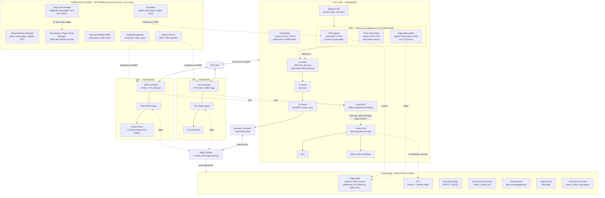
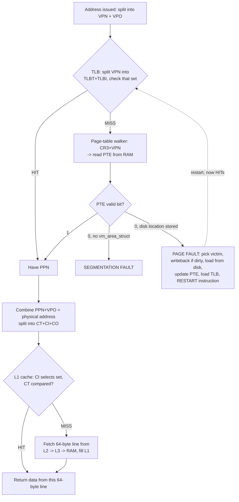
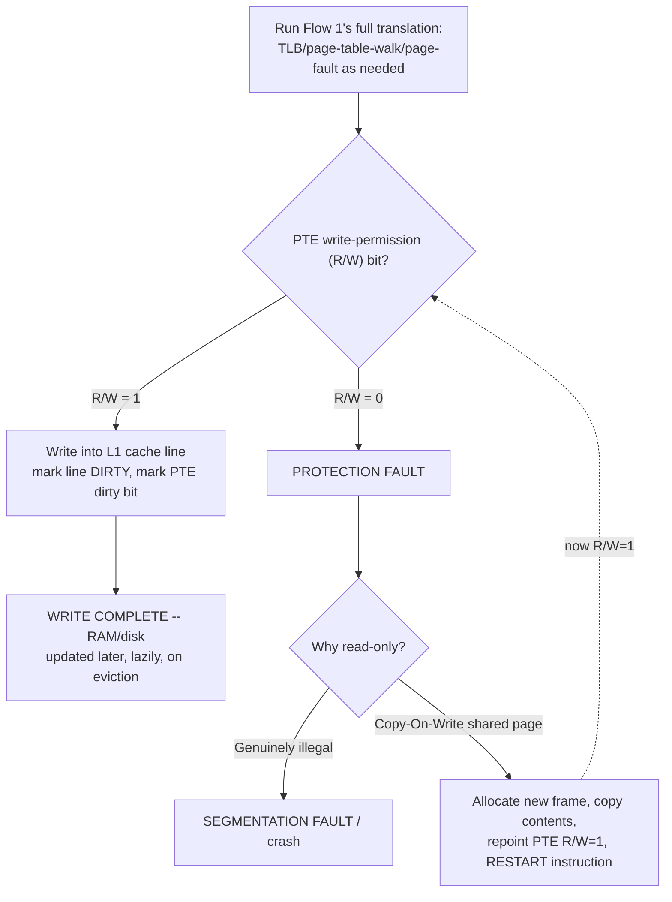
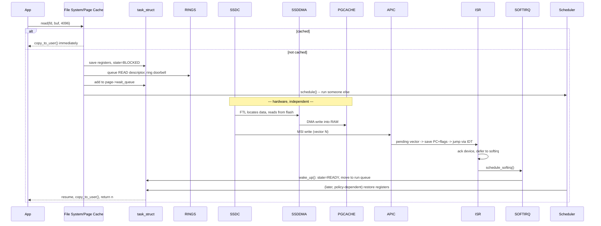
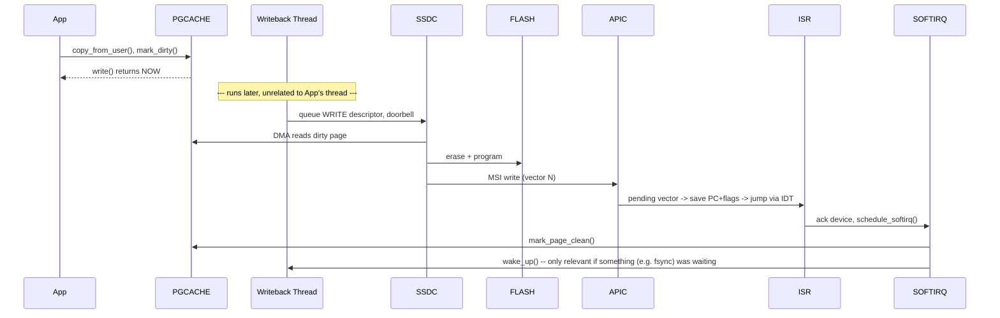

# The Complete Architecture Model — One Picture, Four Flows, For Life

One static "Full Machine" map — the picture that should live permanently in your head — then every flow traced as movement *through* that exact same map. Same box names every time, so nothing ever needs re-learning. Every unfamiliar term is explained the moment it first appears. The interrupt mechanism is folded directly into the two I/O flows (3 and 4) where it actually happens — it's not a separate, disconnected topic.


---

## THE STATIC MAP — Memorize This Shape, Not Just The Words



**Legend:**
- **HARDWARE** (solid boxes) — physical silicon: CPU, ALU, registers, MMU, CR3, TLB, cache, RAM, NIC/SSD chips, DMA engines, APIC.
- **SOFTWARE** (dashed-style boxes) — the OS: page fault handler, VM manager, scheduler, drivers, ISR, softirq.
- **DATA STRUCTURE** — bytes sitting in ordinary RAM, whose *format* is defined by software but which is *read directly* by hardware (page table by the MMU, IDT/rings by the CPU/devices).

**Where the call stack physically lives:** `%rsp`/`%rbp` are hardware registers holding *addresses*. The actual stack bytes — locals, return addresses, saved frame pointers — live in ordinary RAM pages (`PROCDATA` above), get cached in L1/L2/L3 like anything else, and can be paged out under memory pressure. Nothing about the stack is special hardware — it's a software convention pointed to by two ordinary registers.

---

## THE STATIC MAP — Every Connection Explained, In Sequence

### Group A — Inside the CPU Core (instruction execution)
- **`CU -> ALU`** and **`CU -> BUSIF`**: the Control Unit is the "conductor" — decoded arithmetic/logic goes to the ALU; anything leaving the chip (a cache miss, an MMIO write) goes through the Memory Bus Interface.
- **`SP -.address of.-> L1`**: `%rsp`/`%rbp` don't hold data — they hold an *address*, used exactly like any other address: cache first.
- **`REGF -> MMU`**: before any address-holding register value can fetch data, it passes through the MMU for translation.

### Group B — The MMU (address translation)
- **`CR3`** holds the physical address of the *current process's* page table root. **`TLB`** is checked first. On a miss, **`PTW`** (page-table walker) starts from `CR3` and walks the table.
- **`PTW -.walks.-> PT`** and **`CR3 -.points to.-> PT`**: the MMU's hardware reaching *out of the CPU chip, into RAM*.

### Group C — MMU -> Cache -> RAM (the data path)
- **`MMU -> L1 -> L2 -> L3`**: L1 first, always.
- **`L3 -> MC`**: only on an L3 miss does the request leave the CPU package.
- **`MC <--> RAMHW`** (Memory Bus): two-way — commands out, data back, over the same wires every DMA engine also uses.

### Group D — RAM, Split Into Hardware vs. What It Holds
- **`RAMHW -.physically holds.-> RAMCONTENT`**: a *category* relationship, not data-flow. No second memory system exists for "kernel data structures" — it's all the same chips.

### Group E — PCIe: the Second Road Into RAM
- **`CPUCHIP <--> PCIE`**, **`PCIE <--> NICC`**, **`PCIE <--> SSDC`**: one shared PCIe bus, finite total bandwidth (Ch 1.5).
- **`NICDMA <-.DMA.-> RAMHW`** and **`SSDDMA <-.DMA.-> RAMHW`**: both DMA engines land on the exact same `RAMHW` node Group C serves — proof of one shared memory system.

### Group F — Inside Each Device
- **`NICC --- NICDMA --> WIRE`** and **`SSDC --- SSDDMA --> FLASH`**: the DMA engine is embedded *inside* its controller, not a separate device.

### Group G — The Interrupt Path
- **`NICC -.MSI.-> APIC`** and **`SSDC -.MSI.-> APIC`**: both controllers can independently interrupt, both target the same APIC.
- **`APIC -.interrupt: save PC+flags, jump via IDT.-> CU`**: the ONLY arrow going from hardware back into the Control Unit unconditionally.
- **`CU -.on interrupt, consults.-> IDT`**: the CPU hardware's actual read of the IDT table sitting in RAM.

### Group H — Software -> Hardware Control Arrows
- **`DRV -.programs via MMIO.-> NICC/SSDC`**: the driver reaching *out* to configure hardware.
- **`SCHED -.reloads on switch.-> CR3`**: switching to a *different process* also reloads CR3 — why switching processes costs more than switching threads within the same process.
- **`PFH -.on fault, may trigger.-> FSSM`**: a file-backed page fault hands off to the File System/Page Cache Manager, which follows Flow 3's read path.

**The one-paragraph summary:** every solid arrow is a **data path**. Every dotted arrow is either a **hardware signal**, a **software configuration action**, or a **containment/consultation relationship**. Every flow below is a specific subset of these exact arrows, traversed in a specific order.

---

## FLOW 1 — Reading From Memory (Full Virtual Memory Detail)

**Rule to hold onto for both Flow 1 and Flow 2:** every access is really `translate -> check cache -> touch RAM/disk`. Translation always happens the same way. Only the LAST step differs between a read and a write.

**Goal:** we want data from virtual address `0xA3F`.

### The address gets split the instant it's issued

```
address 0xA3F
 -> split into: VPN (Virtual Page Number, the upper bits) + VPO (Virtual Page Offset, 0xA3F's lower 12 bits)
 -> VPO rides along UNCHANGED through the entire translation -- only the VPN needs translating
```

### Step 1 — MMU checks the TLB first, always

```
MMU takes VPN to the TLB
   VPN is split AGAIN -> TLBT (tag) + TLBI (index)
   TLBI picks the SET (the TLB has ~64 entries, grouped into sets)
   search that set's few entries, comparing TLBT against each entry's stored tag
   each TLB entry holds: [valid bit | tag | PPN (Physical Page Number)]
```

**CASE A — TLB HIT** (tag matched, valid=1): got the PPN straight from the TLB, no page-table walk needed. Skip to Step 3 (cache check).

**CASE B — TLB MISS** (no matching valid entry in that set): continue to Step 2.

### Step 2 — Page-table walk (only on a TLB miss)

```
PTW (page-table walker, hardware) takes CR3 (base of THIS process's page table) + VPN
   -> walks the table (a real system has 4 levels; one level shown here for clarity)
   -> fetches the PTE (Page Table Entry) from RAM at the computed address
   -> RAM returns the PTE: [valid bit | PPN, or a disk location instead]
```

**Now check the PTE's valid bit** (the same check the TLB-hit path skipped entirely):

**`valid = 0`** → the page is NOT in RAM. Look at what's stored in its place:
- **No `vm_area_struct` covers this address at all** → **SEGMENTATION FAULT**. This address was never legally yours to touch — not recoverable, the process is killed (or gets a signal it can catch).
- **A real disk location is stored here instead** → **PAGE FAULT** (a *legal* address, just not currently resident). The OS page-fault handler (`PFH` on the map) runs:
  1. Picks a **victim page** currently occupying some physical frame in RAM.
  2. Victim **dirty**? → write it back to disk first (Flow 2 territory). Victim **clean**? → just discard it, the disk copy is already correct.
  3. Reads the **requested** page from disk into that now-free frame.
  4. Updates the PTE: `valid=1`, `PPN = new frame`.
  5. Loads this new translation into the TLB.
  6. **Restarts the faulting instruction from scratch** — the CPU re-issues the exact same virtual address.
  7. This time: TLB now has it → HIT → continue to Step 3.

**`valid = 1`** → the PPN is already sitting right there in the PTE, page is resident → continue to Step 3.

### Step 3 — Check the cache (runs on BOTH the TLB-hit and TLB-miss paths)

This is a *separate* question from "is the page in RAM" — even a page that's fully resident in RAM might not currently have its specific bytes sitting in fast cache.

```
combine PPN + VPO = the physical address
split the physical address -> CT (cache tag) + CI (cache index) + CO (offset within the 64-byte line)
look up L1 using CI:
   HIT  (CT matches) -> the data is already sitting in this 64-byte line -> return it, DONE
   MISS -> fetch the ONE 64-byte line containing this address
           (NOT the whole 4KB page -- that already happened in Step 2, if at all)
           from L2 -> L3 -> RAM, whichever level actually has it, load it into L1
```

### Step 4 — Return the bytes to the CPU register. READ COMPLETE.



### Worked example — reading an already-resident, already-cached variable

Say variable `x`'s page was touched recently (TLB and L1 both still hold it from a previous access):

```
1. CPU issues x's virtual address
2. Split VA -> VPN_x + VPO_x
3. Check TLB for VPN_x -> HIT -- no table walk needed at all
4. Combine PPN_x + VPO_x = physical address
5. Check L1 cache at that address -> HIT -- line already resident
6. Return the value to the CPU -- fast path, both TLB and cache hit, ~1ns total
```

**Why this matters for "just reading a variable":** the exact same C++ statement can cost anywhere from ~1ns (this fast path) to hundreds of cycles (TLB miss forcing a page-table walk, or worse, an actual page fault forcing a disk read) — a spread of several orders of magnitude, completely invisible in the source code.

---

## FLOW 2 — Writing To Memory (Full Virtual Memory Detail)

**Everything in Flow 1 happens exactly the same way first.** A write needs a *resolved, cached* physical address too, before it can write anything. The difference only shows up in **one extra permission check**, and in what happens *after* the write.

### Step 1 — Run the entire Flow 1 translation, unchanged

Get to: a valid PTE, a physical address, and the target 64-byte line loaded into L1.

### Step 2 — NEW: check the PTE's write-permission bit (R/W), not just its valid bit

**`R/W = 1` (writable):**
```
-> perform the write directly into the L1 cache line
-> mark that cache line DIRTY (differs from RAM now -- write-back policy)
-> mark the PTE's dirty bit too (the MMU sets this automatically on x86)
-> WRITE COMPLETE -- nothing has touched RAM or disk yet.
   RAM gets updated only when this dirty CACHE LINE is eventually evicted.
   Disk gets updated only when this dirty PAGE is eventually evicted from RAM.
   (If the process exits first, these writes may NEVER reach disk at all --
    this laziness is a deliberate performance win, not an oversight.)
```

**`R/W = 0` (read-only)** → hardware raises a **PROTECTION FAULT**, a different kind of fault than Flow 1's not-present page fault. The OS fault handler checks *why* this page is read-only:
- **Genuinely illegal** (e.g. writing to `.text`, the executable code segment) → **SEGMENTATION FAULT / crash**. Not recoverable.
- **Marked Copy-On-Write (COW)** — this physical page is currently *shared* between two processes (the classic case: right after `fork()`, parent and child share every page read-only until one of them writes):
  1. Allocate a **new** physical frame.
  2. Copy the shared page's contents into it.
  3. Update **this process's own** PTE: point at the new frame, `R/W = 1`.
  4. **Restart** the write instruction.
  5. This time: `R/W = 1` → normal write path above → succeeds, writing only into this process's own **private** copy.
  6. The other process's page is completely untouched.



### Worked example — `int x = 10;`, the very first touch of a fresh stack page

```cpp
int x = 10;   // a local variable, lives on the stack, first-ever touch of this page
```

| Step | What happens |
|---|---|
| 1-2 | CPU issues the write instruction; virtual address splits into VPN + VPO |
| 3 | Check TLB → **MISS** (first touch, nothing cached yet) |
| 4 | Walk the 4-level page table via CR3 |
| 5 | Final PTE: **valid bit = 0** — this stack page has never been backed by real memory |
| 6 | **PAGE FAULT** raised |
| 7 | Handler checks `vm_area_struct` — is this address inside the stack region? **Yes, legal.** |
| 8 | This is a **demand-zero** page (no file backs it) — OS finds a free physical frame, fills it with zeros |
| 9 | Update PTE: `valid=1`, `PPN = new frame`, `R/W=1` (writable — it's stack memory) |
| 10 | Load this new translation into the TLB |
| 11-12 | **Restart** the faulting instruction; CPU re-issues the same virtual address |
| 13 | Check TLB again → **HIT** this time (just installed in step 10) |
| 14-15 | Combine PPN+VPO; check L1 cache → **MISS** (freshly zeroed page never cached) |
| 16 | Fetch the 64-byte line containing this address from DRAM |
| 17-18 | **The write happens**: value `10` stored at the right offset in this L1 line; line marked **DIRTY** |
| 19 | Instruction complete. `x` holds `10` — only in L1 cache (and eventually DRAM). **Nothing written to disk yet.** |

**State of every layer immediately after this one instruction:**

| Layer | State |
|---|---|
| TLB | Valid VPN→PPN translation cached — next nearby stack access is a TLB hit |
| Page table (PTE) | `valid=1`, points to the new frame, `R/W=1` |
| L1 cache | Holds the line containing `x`, marked dirty, value 10 at the right offset |
| DRAM | Still holds *old* content until this dirty line is eventually evicted (Ch 1.3/1.4's write-back) |
| Disk/swap | Untouched — may *never* be touched if this stack frame is popped before eviction pressure forces it |

### What if another CPU core reads or writes this same variable right now?

This is **cache coherency**, and it's the direct multi-core extension of Flow 2's "dirty" concept:
1. Core B's cache controller sends a request across the inter-core interconnect for this address.
2. Core A's L1 sees that another core wants data it holds as **Modified/Dirty**. Core A must intercept this request, transition its own line to **Shared** (or **Invalid** if Core B is writing), and flush the updated value out of its own cache hierarchy.
3. The updated value gets written down to shared L3 (or DRAM, depending on the exact cache architecture) so Core B reads the correct, up-to-date `10` — not stale data.

This hardware protocol (commonly MESI or a variant) is what makes "dirty in one core's cache, but another core needs it" safe by default — full depth in Part 27.

---

## FLOW 3 — I/O Reading (`read()` from a file), Interrupt Mechanism Included

```cpp
int fd = open("data.bin", O_RDONLY);
char buf[4096];
ssize_t n = read(fd, buf, sizeof(buf));
```

### Step 1 — What is the "page cache"?

**Analogy:** a library has a small front desk with the 20 most-requested books sitting right there, and a huge basement archive holding everything else. When you ask for a book, the librarian checks the front desk FIRST. If it's there — instant. If not, someone walks to the basement (slow), and — key part — **they leave that book on the front desk too**, in case someone asks again soon.

**The real mechanism:** the **page cache** is a region of ordinary RAM the kernel uses to hold copies of file data it has recently read or written. It exists because RAM is ~100ns and the SSD is ~100us-ms — a difference of 1,000x to 10,000x. Checking RAM first, before ever bothering the disk, is the single biggest lever the kernel has for making file I/O fast.

```c
sys_read(fd, buf, len) {
    file = get_file(fd);
    page = page_cache_lookup(file, offset);   // is it on the "front desk"?
    if (page != NULL) {
        copy_to_user(buf, page->data, len);   // FOUND IT -- skip to Step 6
        return len;
    }
    // NOT FOUND -- continue to Step 2
}
```

### Step 2 — What does "blocking" actually DO here?

If the page isn't cached, the thread must wait for the disk. "Waiting" physically means: **save this thread's current register values somewhere, so the CPU can go do something else, and come back to exactly this spot later.**

**Where do the registers get saved?** Every thread has one permanent record in kernel memory called a `task_struct` — a filing folder with the thread's name on it, sitting in a fixed cabinet slot for as long as the thread exists. One field, `saved_ctx`, is specifically reserved for "the register values, if this thread is ever paused."

```c
current->saved_ctx.rip = /* exact instruction we're at, mid-read() */;
current->saved_ctx.rsp = /* current stack pointer */;
current->saved_ctx.rax = /* ... every register ... */;
current->state = TASK_BLOCKED;
```

### Step 3 — Telling the SSD what to do: the descriptor ring

The driver (the only kernel code that knows this exact SSD chip's register layout) writes an entry into a table in RAM called the **submission queue**: "read logical block X, put the result at RAM address Y (a page-cache slot we just reserved)." Then one MMIO register write — the **doorbell** — tells the SSD chip "go look at what I just wrote."

```c
queue_ssd_descriptor(READ, file_to_lba(file, offset), phys_addr(new_page_cache_slot));
ring_doorbell(ssd_controller);
```

### Step 4 — What is a "wait queue," and why per-resource, not global?

**Analogy:** a restaurant with no free tables keeps a physical clipboard by the door — a waitlist. Your name goes on THIS restaurant's clipboard, not a generic city-wide list.

**The real mechanism:** a **wait queue** is a linked list belonging to one specific resource — here, the specific page of the specific file we're trying to read. Blocking means adding a pointer to our own `task_struct` onto THIS page's wait queue.

```c
list_add(&current->wait_link, &page->wait_queue);   // "my name's on THIS page's list"
schedule();   // give the CPU to someone else entirely
```

A **"specific resource"** here means the exact, individual object your thread needs and cannot proceed without — a specific memory page (`page->wait_queue`), a specific socket, a specific lock — never a generic system-wide waiting area.

**Why per-resource, not one giant global queue?** Efficiency and precision. If the kernel had one giant wait queue for everything, the instant Page #5482 finished loading, the kernel would have to wake up *every sleeping thread on the machine* just to ask "did any of you want this?" — massive wasted CPU. By attaching the wait queue directly to the specific resource, the kernel goes straight to that page's own clipboard and wakes up *only* the threads actually blocked on it, leaving everything else undisturbed.

### Step 5 — What happens on the SSD while our thread is asleep

**New term: FTL (Flash Translation Layer).** Flash cannot be overwritten in place — a cell must be fully erased (in large blocks) before it can be reprogrammed, and flash cells wear out after limited erase/write cycles. So the SSD controller keeps an internal map: "logical block X -> physical flash location," deliberately spreading writes across cells over time — **wear-leveling**. The FTL is the SSD's OWN firmware, on its OWN tiny embedded processor — your machine's CPU is not involved.

```
[HARDWARE, SSD's own controller chip, zero CPU involvement]
1. SSD controller reads the submission queue entry from RAM.
2. FTL firmware looks up: "logical block X -> physical flash location Z"
3. SSD reads the voltage state of the flash cells at location Z.
4. SSD's own DMA engine writes those bytes into RAM at address Y --
   using the same PCIe->Memory Controller->Memory Bus->DRAM path
   as everything else.
5. SSD controller now needs to tell the CPU "I'm done." Continue to Step 6.
```

### Step 6 — The interrupt: how "done" actually reaches our sleeping thread

This is the part with the most new vocabulary, explained fully, right here, because it's where "the SSD finished" actually turns into "our thread can resume."

**What is "MSI"?** An apartment intercom analogy: pressing a button doesn't ring a physical bell in the apartment — it sends an electrical signal to a shared panel, decoded as "someone wants 4B." Every CPU core has a small hardware unit next to it, the **Local APIC**, whose job is "watch for a specific signal, and when it arrives, tell the CPU core to stop and pay attention." It has its own address, in the same address space as everything else (MMIO). **MSI (Message Signaled Interrupt)** means: the SSD controller raises an interrupt by performing an ORDINARY write — electrically no different from any other memory write — targeted at the Local APIC's address, carrying a small number (the **vector**) as payload.

**What is the "IDT"?** A hotel switchboard analogy: "call code 402 -> manager's desk." The **Interrupt Descriptor Table** is a table, in RAM, built ONCE by the kernel at boot: vector number -> handler address. When the Local APIC flags "vector N pending," the CPU's own hardware — not any running program — looks up entry N and jumps there. This check happens as a **mandatory step wedged into the CPU's own fetch cycle**, unconditional, regardless of what was running.

**What is an "ISR"? Why must it be SHORT?** The function the IDT pointed to — ordinary kernel code, but running in a special, urgent context: it has HIJACKED whatever the CPU core was doing, and until it finishes, other interrupts on this core may be delayed.

```c
ssd_interrupt_handler() {
    write_mmio_register(ssd_base + ACK_OFFSET, 1);   // tell device "got it"
    mark_completion_ready(queue_index);               // tiny bookkeeping
    schedule_softirq(BLOCK_IO_SOFTIRQ);                 // "do the REAL work later"
    // return immediately -- whatever was running before resumes right after
}
```

**What is a "softirq"? Why not do the work in the ISR?** A fire alarm analogy: the alarm (ISR) makes everyone evacuate immediately; the actual investigation (softirq) happens afterward, calmly, once things aren't an emergency. A **softirq** (or workqueue) is kernel code scheduled to run shortly after the ISR returns, NOT inside the urgent interrupt context. This is where the real work happens:

```c
block_io_softirq() {
    copy_completed_data_into(page);          // data already sat in RAM since Step 5.4
    mark_page_valid(page);
    wake_up(&page->wait_queue);              // <-- see next
}
```

**What does `wake_up()` actually DO?** A restaurant host crossing a name off the waitlist clipboard and moving it to "ready to be seated" — that does NOT mean a table is instantly given. They're eligible; a host still has to walk over and seat them, whenever free.

```c
wake_up(&page->wait_queue) {
    for each (task in page->wait_queue) {
        task->state = TASK_READY;          // NOT running -- just eligible now
        remove_from(page->wait_queue);
        add_to(scheduler_run_queue);        // moved to a DIFFERENT list
    }
}
```

Notice: **no registers are touched here at all.** This only flips a status flag and moves a pointer between two lists.

**What is the "run queue," and why might resuming be delayed?** The "ready to be seated" list might have five parties, but the host seats one at a time, prioritizing by wait time or policy. The **run queue** is the scheduler's list of every eligible thread. Exactly when `schedule()` picks OUR thread depends on real policy: priority, fairness, core availability, real-time scheduling classes. Can be microseconds (idle core grabs it) or measurably delayed (all cores busy with higher-priority work).

```c
schedule() {
    next = pick_next_ready_thread();   // POLICY decision
    restore_context(&next->saved_ctx); // Step 2's data, read back out
}
```

**The three decisions, precisely:**

| Decision | Who makes it | When | What it does |
|---|---|---|---|
| 1. Run the ISR | CPU hardware | Immediately, unconditionally | Jumps via IDT — zero policy, always happens |
| 2. Mark thread eligible | Softirq (software) | Shortly after the ISR returns | `wake_up()` flips BLOCKED->READY, moves pointer to run queue. No registers touched. |
| 3. Actually run the thread | Scheduler (software) | Whenever `schedule()` next runs | Restores registers from `task_struct.saved_ctx` — only NOW does it truly resume |

This is why "the interrupt makes it possible, but doesn't do it directly and immediately in all cases" — Decision 1 is guaranteed and instant; Decisions 2 and 3 are software, and Decision 3 is subject to real scheduling policy.

### Step 7 — Our thread resumes and the syscall finally returns

```c
copy_to_user(buf, page->data, len);   // now the data IS there
return len;
```
```cpp
ssize_t n = read(fd, buf, sizeof(buf));  // <- resumes here, app has no idea any of this happened
```



---

## FLOW 4 — I/O Writing (`write()` to a file), Interrupt Mechanism Included

```cpp
int fd = open("out.bin", O_WRONLY);
write(fd, "result", 6);
```

### Step 1 — Where does the data actually go first?

Unlike a read, a write's very first stop is the **page cache** itself — not the disk.

```c
page = page_cache_get_or_alloc(file, offset);
copy_from_user(page->data, buf, len);   // your bytes land HERE, in RAM, nowhere else yet
```

### Step 2 — What does "marking a page dirty" mean?

Recall Flow 2: when the CPU writes to a cache line, it marks that line **dirty** — "newer than what's in RAM." A page cache page works the same way, one layer up: **dirty** means "newer than what's on disk."

```c
mark_page_dirty(page);
return len;   // <-- write() returns RIGHT HERE. Nothing has touched the SSD yet.
```

**Why so fast?** From the kernel's point of view, the write is "done" — the data is safely in RAM (page cache). Getting it onto physical disk is separate, lower-priority housekeeping.

### Step 3 — What is the "writeback thread"?

**Analogy:** a waiter drops order tickets on a spike and goes back to serving tables — a separate cook checks the spike on their own schedule, unrelated to any specific waiter's timing.

**The real mechanism:** the kernel runs its own permanent background thread (its own `task_struct`, exactly like your application thread) whose job is periodically scanning for dirty pages and flushing them.

```c
writeback_thread() {   // SEPARATE thread, own task_struct, NOT part of your write() call
    while (true) {
        sleep(dirty_expire_interval);       // e.g. every 30 seconds
        for (page in dirty_pages_list()) {
            queue_ssd_descriptor(WRITE, offset_to_lba(page), phys_addr(page));
            ring_doorbell(ssd_controller);
        }
    }
}
```

### Step 4 — What happens on the SSD for a write (same FTL, opposite direction)

```
[HARDWARE, SSD controller, zero CPU involvement]
1. SSD's DMA engine READS the dirty page bytes FROM RAM (opposite
   direction from Flow 3's read case).
2. FTL firmware decides WHERE to physically put this data --
   possibly a DIFFERENT physical location, for wear-leveling.
3. If that location holds old data, it must first be ERASED (a real,
   distinct, slower flash operation) before the new data can be
   PROGRAMMED into it -- unique to flash, part of why SSD writes
   are often slower than SSD reads.
4. SSD controller now needs to tell the CPU "write complete." Continue below.
```

### Step 5 — The interrupt, same mechanism as Flow 3, this time telling the writeback thread

Exactly the same chain as Flow 3 Step 6 — MSI write to the Local APIC, CPU hardware unconditionally jumps via the IDT, a short ISR acks the device and defers, a softirq does the real work:

```c
ssd_interrupt_handler() {          // Decision 1 -- CPU hardware, unconditional
    write_mmio_register(ssd_base + ACK_OFFSET, 1);
    mark_completion_ready(queue_index);
    schedule_softirq(BLOCK_IO_SOFTIRQ);
}

block_io_softirq() {               // Decision 2 -- software, "soon"
    mark_page_clean(page);
    wake_up(&page->wait_queue);    // only matters if someone (e.g. an fsync() caller) is waiting
}
```

If nobody is blocked on this specific page's wait queue (the normal case for a plain background writeback), `wake_up()` simply finds an empty list and does nothing further — the writeback thread itself was never blocked waiting for this individual completion; it just moves on to the next dirty page.

### Step 6 — What if the application NEEDS a guarantee the data is really on disk?

This is what `fsync()` is for — the ONE call that behaves like Flow 3's full blocking pattern, including Decision 3's scheduler-restore:

```c
sys_fsync(fd) {
    for (page in dirty_pages_of(fd)) {
        current->saved_ctx = save_my_registers();          // Flow 3 Step 2, same mechanism
        current->state = TASK_BLOCKED;
        list_add(&current->wait_link, &page->wait_queue);  // Flow 3 Step 4, same mechanism
        queue_ssd_descriptor(WRITE, ...);
        ring_doorbell(ssd_controller);
        schedule();
        // resumes once THIS thread's wake_up() (Step 5 above) fires,
        // then Decision 3 -- scheduler restores registers -- same as Flow 3 Step 7
    }
}
```

**The one thing to hold onto:** `write()` and `fsync()` are almost two different operations wearing the same-looking name — `write()` touches only RAM and returns instantly, never touching the interrupt machinery at all in the common case; `fsync()` is the one that actually waits for the physical flash write's completion interrupt, using the exact same three-decision mechanism as Flow 3.



---

## Quick-Reference Summary

| Flow | Touches a device? | Blocks the thread? | Key mechanism |
|---|---|---|---|
| 1. Read from memory | No | No | TLB split (TLBT/TLBI), page-table walk, page fault (segfault vs demand-zero/load), cache split (CT/CI/CO) |
| 2. Write to memory | No (until eviction) | No | Same translation + R/W permission bit check, dirty cache line, copy-on-write protection fault, cache coherency (MESI) |
| 3. Read from file | Only on page-cache miss | Only on page-cache miss | Page cache, `task_struct`, per-resource wait queue, descriptor ring, FTL, **full interrupt chain (MSI->IDT->ISR->softirq->wake_up->scheduler)** |
| 4. Write to file | No (unless `fsync()`) | No (unless `fsync()`) | Page cache (dirty page), writeback thread, FTL, **same interrupt chain as Flow 3**, only truly blocks on `fsync()` |
