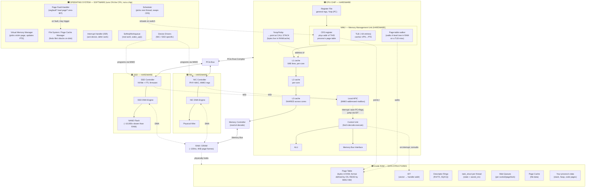
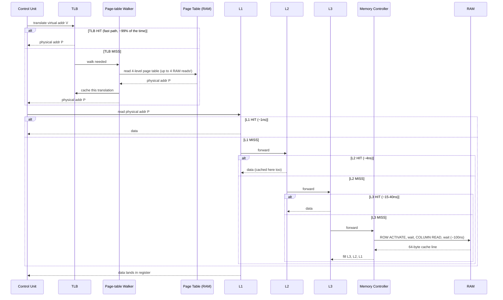
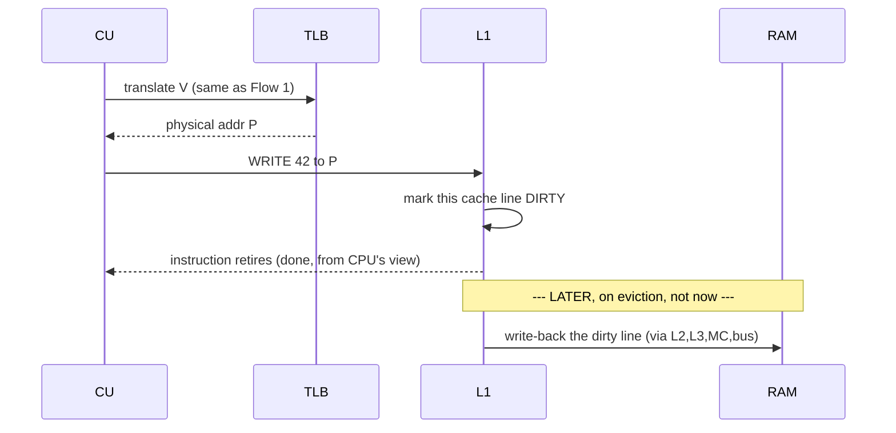
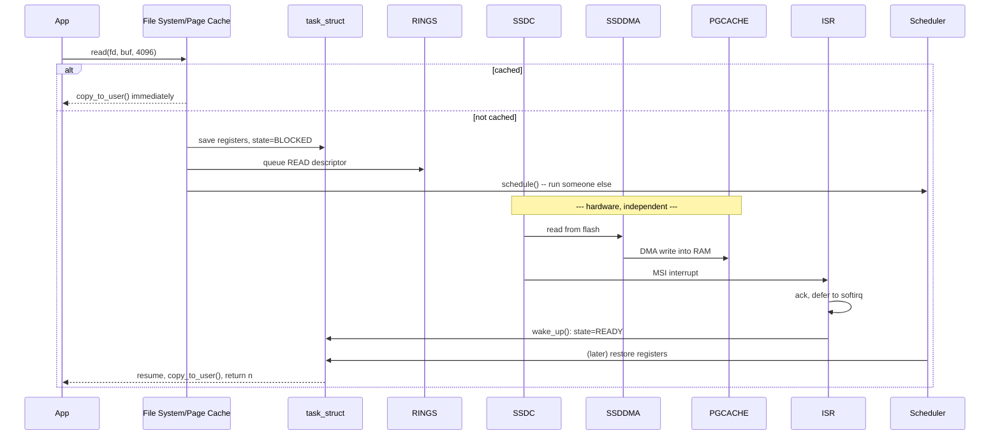
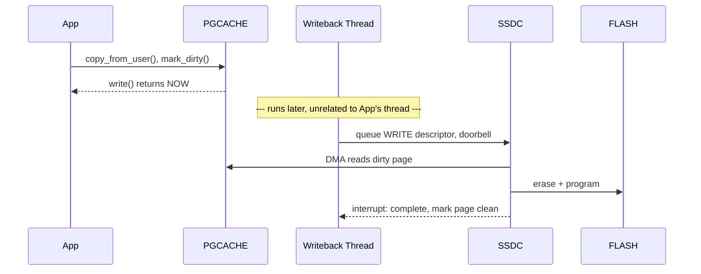
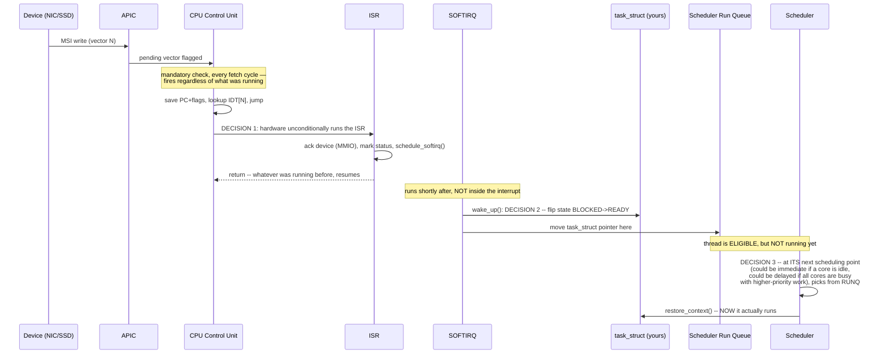

# The Complete Architecture Model — One Picture, Five Flows, For Life

One static "Full Machine" map — the picture that should live permanently in your head — then every flow traced as movement *through* that exact same map. Same box names every time, so nothing ever needs re-learning. Every unfamiliar term is explained the moment it first appears.

---

## THE STATIC MAP — Memorize This Shape, Not Just The Words



**Legend:**
- 🟦 **HARDWARE** (solid) — physical silicon: CPU, ALU, registers, MMU, CR3, TLB, cache, RAM, NIC/SSD chips, DMA engines, APIC.
- 🟧 **SOFTWARE** (dashed) — the OS: page fault handler, VM manager, scheduler, drivers, ISR, softirq.
- 🟩 **DATA STRUCTURE** — bytes sitting in ordinary RAM, whose *format* is defined by software but which is *read directly* by hardware (page table by the MMU, IDT/rings by the CPU/devices).

**Where the call stack physically lives:** `%rsp`/`%rbp` are hardware registers holding *addresses*. The actual stack bytes — locals, return addresses, saved frame pointers — live in ordinary RAM pages (`PROCDATA` above), get cached in L1/L2/L3 like anything else, and can be paged out under memory pressure. Nothing about the stack is special hardware — it's a software convention pointed to by two ordinary registers.

Yes, exactly. The work queues, wait queues, and ready queues you see here are the exact real-world implementation of the abstract queues taught in every operating system textbook.

While textbooks often draw them as simple boxes labeled *"Ready Queue"* or *"Blocked/Waiting Queue,"* in the Linux kernel they are actual, concrete C data structures (like circular doubly linked lists using `struct list_head`) living inside RAM.

Here is how the textbook concepts map directly to what we just walked through:

* **The "Ready" / Run Queue:** This is the textbook **Ready Queue**. It holds the `task_struct` pointers of all threads whose states are `TASK_READY` (or `TASK_RUNNING`)—meaning they have all their data, are fully unblocked, and are just waiting for the scheduler to hand them a CPU core.
* **The Wait Queue:** This is the textbook **Blocked/Waiting Queue**. Unlike textbooks which sometimes imply a single global waiting area, real kernels use **specific resource queues** (`page->wait_queue`, socket wait queues, etc.) so the OS knows precisely which thread to target when a specific piece of data finally arrives.
* **Work Queues / Softirqs:** These handle deferred tasks (like finishing up an I/O operation after an interrupt). Textbooks often touch on bottom-halves, deferred service routines, or device queues here to explain how the OS separates urgent, split-second hardware events from heavy background processing.

So every time an OS textbook talks about a process state transition (from *Running* to *Blocked* to *Ready*), it is literally describing a `task_struct` having its state variable updated and its pointer being unlinked from one of these lists and linked into another!

---

## FLOW 1 — Reading From Memory

**Goal:** `int x = myGlobalVar;` — one load instruction.

```cpp
int x = myGlobalVar;   // myGlobalVar's VIRTUAL address is baked into the compiled instruction
```



**Step by step, tied to the static map:**
1. `CU` (Control Unit) has decoded a LOAD instruction with virtual address `V`.
2. `V` goes to the **MMU** first, always — never straight to cache with a virtual address.
3. **TLB hit** (common case): the MMU already has `V`'s translation cached from a recent access → physical address `P` instantly.
4. **TLB miss** (rare, but real): the **page-table walker** hardware walks the 4-level page table (`PT`, a data structure in RAM, pointed to by `CR3`) — this itself can be up to 4 separate RAM reads before the actual data read even starts. The result gets cached in the TLB for next time.
5. With physical address `P` in hand, the request goes down the cache hierarchy: L1 → L2 → L3 → Memory Controller → RAM — stopping at whichever level already has the 64-byte line containing `P`.
6. Data flows back up, gets cached at every level it passed through, lands in the destination register.

**Why this matters for "just reading a variable":** a single C++ read can be anywhere from ~1ns (L1+TLB hit) to ~100ns+ (TLB miss forcing a page-table walk, AND a cache miss forcing a real DRAM access) — a >100x spread, invisible in the source code.

---

## FLOW 2 — Writing To Memory

**Goal:** `myGlobalVar = 42;`

```cpp
myGlobalVar = 42;
```



**Step by step:**
1. Same MMU translation as Flow 1 (TLB hit/miss identical mechanism) — virtual → physical address `P`.
2. The write goes to **L1 first** — modern caches are typically **write-back**: the new value `42` is written *only* into the L1 cache line, and that line is marked **dirty** (modified, not yet reflected in RAM).
3. The CPU instruction **completes immediately** — it does NOT wait for RAM to be updated.
4. **Later**, when that dirty cache line needs to be evicted (to make room for something else), the cache hierarchy writes it back down: L1 → L2 → L3 → Memory Controller → RAM, in the same ROW ACTIVATE/COLUMN WRITE/wait pattern as Flow 1's miss path, just in the write direction.

**The gotcha this resolves:** "I wrote a value, is it in RAM yet?" — usually **no**, not immediately. It's sitting dirty in cache. This is exactly *why* DMA (Flow 3/4) and multi-core cache coherency (Part 27 preview) matter: a device or another core reading RAM directly could see stale data unless the hardware's cache-coherency protocol (or an explicit flush) intervenes.

---

## FLOW 3 — I/O Reading (`read()` from a file), Every Term Explained

```cpp
int fd = open("data.bin", O_RDONLY);
char buf[4096];
ssize_t n = read(fd, buf, sizeof(buf));
```

### Step 1 — What is the "page cache"?

**Analogy:** a library has a small front desk with the 20 most-requested books sitting right there, and a huge basement archive holding everything else. When you ask for a book, the librarian checks the front desk FIRST. If it's there — instant. If not, someone walks to the basement (slow), and — key part — **they leave that book on the front desk too**, in case someone asks again soon.

**The real mechanism:** the **page cache** is a region of ordinary RAM the kernel uses to hold copies of file data it has recently read or written. It exists because RAM is ~100ns and the SSD is ~100µs-ms — a difference of 1,000x to 10,000x. Checking RAM first, before ever bothering the disk, is the single biggest lever the kernel has for making file I/O fast.

```c
sys_read(fd, buf, len) {
    file = get_file(fd);
    page = page_cache_lookup(file, offset);   // <-- is it on the "front desk"?
    if (page != NULL) {
        copy_to_user(buf, page->data, len);   // FOUND IT -- skip to Step 6
        return len;
    }
    // NOT FOUND -- continue to Step 2
}
```

### Step 2 — What does "blocking" actually DO here?

If the page isn't cached, the thread must wait for the disk. "Waiting" physically means: **save this thread's current register values somewhere, so the CPU can go do something else, and come back to exactly this spot later.**

**Where do the registers get saved?** Every thread has one permanent record in kernel memory called a `task_struct` — a filing folder with the thread's name on it, sitting in a fixed cabinet slot for as long as the thread exists. One field, `saved_ctx`, is specifically reserved for "the register values, if this thread is ever paused."

```c
current->saved_ctx.rip = /* exact instruction we're at, mid-read() */;
current->saved_ctx.rsp = /* current stack pointer */;
current->saved_ctx.rax = /* ... every register ... */;
current->state = TASK_BLOCKED;
```

### Step 3 — Telling the SSD what to do: the descriptor ring

The driver (the only kernel code that knows this exact SSD chip's register layout) writes an entry into a table in RAM called the **submission queue**: "read logical block X, put the result at RAM address Y (a page-cache slot we just reserved)." Then one MMIO register write — the **doorbell** — tells the SSD chip "go look at what I just wrote."

```c
queue_ssd_descriptor(READ, file_to_lba(file, offset), phys_addr(new_page_cache_slot));
ring_doorbell(ssd_controller);
```

### Step 4 — What is a "wait queue"?

**Analogy:** a restaurant with no free tables keeps a physical clipboard by the door — a waitlist. Your name goes on THIS restaurant's clipboard, not a generic city-wide list.

**The real mechanism:** a **wait queue** is a linked list belonging to one specific resource — here, the specific page of the specific file we're trying to read. Blocking means adding a pointer to our own `task_struct` onto THIS page's wait queue.

```c
list_add(&current->wait_link, &page->wait_queue);   // "my name's on THIS page's list"
schedule();   // give the CPU to someone else entirely
```

In the context of an operating system kernel and a wait queue, a **"specific resource"** is the exact, individual object, piece of hardware, or data block that your thread needs right now and cannot move forward without.

Instead of a generic system-wide waiting area, the waiting mechanism is glued directly to the exact item you are waiting for.

### Examples of "Specific Resources"

Depending on what your program is doing, a specific resource can be:

1. **A specific memory page (`page->wait_queue`):** As shown in your text snippet, if you want to read File X, Chunk Y, you aren't just waiting for "some disk operation." You are waiting for **that exact memory page** to be filled with data from the disk.
2. **A network socket:** If your server is waiting for data to arrive from a client, it waits on that specific socket's queue, not every socket on the machine.
3. **A mutex or lock:** If a thread needs to modify a shared variable, it waits on the queue specifically tied to that mutex lock.

---

### Why does the kernel use *specific* resource queues?

**Efficiency and Precision.**

Imagine if the kernel only had *one* giant global wait queue for everything. When the disk finally finished reading Page #5482, the kernel would have to wake up *every single thread* sleeping on the computer just to ask, *"Hey, did any of you happen to want Page #5482?"* Every other thread would look around, realize they were waiting for something else (like a network packet or a different file), and go back to sleep. That would waste massive amounts of CPU time.

By attaching the wait queue directly to the **specific resource** (`page->wait_queue`):

* When the disk finishes writing data into that exact page, the kernel goes straight to **that page's** clipboard.
* It wakes up *only* the threads that are blocked on that exact page, leaving all other sleeping threads safely undisturbed.

### Step 5 — What happens on the SSD while our thread is asleep

**New term: FTL (Flash Translation Layer).** Flash cannot be overwritten in place — a cell must be fully erased (in large blocks) before it can be reprogrammed, and flash cells wear out after limited erase/write cycles. So the SSD controller keeps an internal map: "logical block X → physical flash location," deliberately spreading writes across cells over time — **wear-leveling**. The FTL is the SSD's OWN firmware, on its OWN tiny embedded processor — your machine's CPU is not involved.

```
[HARDWARE, SSD's own controller chip, zero CPU involvement]
1. SSD controller reads the submission queue entry from RAM.
2. FTL firmware looks up: "logical block X -> physical flash location Z"
3. SSD reads the voltage state of the flash cells at location Z.
4. SSD's own DMA engine writes those bytes into RAM at address Y --
   using the same PCIe->Memory Controller->Memory Bus->DRAM path
   as everything else.
5. SSD controller raises an interrupt (Flow 5) to say "done."
```

### Step 6 — Our thread resumes and the syscall finally returns

Once the interrupt chain (Flow 5) finishes and the scheduler picks our thread again, it reads our registers back OUT of `current->saved_ctx` — the exact folder slot they were written into in Step 2 — and we resume at the exact next line:

```c
copy_to_user(buf, page->data, len);   // now the data IS there
return len;
```
```cpp
ssize_t n = read(fd, buf, sizeof(buf));  // <- resumes here, app has no idea any of this happened
```



---

## FLOW 4 — I/O Writing (`write()` to a file), Every Term Explained

```cpp
int fd = open("out.bin", O_WRONLY);
write(fd, "result", 6);
```

### Step 1 — Where does the data actually go first?

Unlike a read, a write's very first stop is the **page cache** itself — not the disk.

```c
page = page_cache_get_or_alloc(file, offset);
copy_from_user(page->data, buf, len);   // your bytes land HERE, in RAM, nowhere else yet
```

### Step 2 — What does "marking a page dirty" mean?

Recall: when the CPU writes to a cache line, it marks that line **dirty** — "newer than what's in RAM, RAM needs updating eventually." A page cache page works the same way, one layer up: **dirty** means "newer than what's on disk, disk needs updating eventually."

```c
mark_page_dirty(page);
return len;   // <-- write() returns RIGHT HERE. Nothing has touched the SSD yet.
```

**Why so fast?** From the kernel's point of view, the write is "done" — the data is safely in RAM (page cache). Getting it onto physical disk is treated as separate, lower-priority housekeeping, not something your thread waits for.

### Step 3 — What is the "writeback thread"?

**Analogy:** a waiter drops order tickets on a spike and goes back to serving tables — a separate cook checks the spike on their own schedule, unrelated to any specific waiter's timing.

**The real mechanism:** the kernel runs its own permanent background thread (its own `task_struct`, exactly like your application thread) whose job is periodically scanning for dirty pages and flushing them.

```c
writeback_thread() {   // SEPARATE thread, own task_struct, NOT part of your write() call
    while (true) {
        sleep(dirty_expire_interval);       // e.g. every 30 seconds
        for (page in dirty_pages_list()) {
            queue_ssd_descriptor(WRITE, offset_to_lba(page), phys_addr(page));
            ring_doorbell(ssd_controller);
        }
    }
}
```

### Step 4 — What happens on the SSD for a write (same FTL, opposite direction)

```
[HARDWARE, SSD controller, zero CPU involvement]
1. SSD's DMA engine READS the dirty page bytes FROM RAM (opposite
   direction from Flow 3's read case).
2. FTL firmware decides WHERE to physically put this data --
   possibly a DIFFERENT physical location, for wear-leveling.
3. If that location holds old data, it must first be ERASED (a real,
   distinct, slower flash operation) before the new data can be
   PROGRAMMED into it -- unique to flash, part of why SSD writes
   are often slower than SSD reads.
4. SSD raises an interrupt: "write complete."
```

### Step 5 — What if the application NEEDS a guarantee the data is really on disk?

This is what `fsync()` is for — the ONE call that behaves like Flow 3's blocking pattern:

```c
sys_fsync(fd) {
    for (page in dirty_pages_of(fd)) {
        current->saved_ctx = save_my_registers();   // Flow 3, Step 2, same mechanism
        current->state = TASK_BLOCKED;
        list_add(&current->wait_link, &page->wait_queue);   // Flow 3, Step 3
        queue_ssd_descriptor(WRITE, ...);
        ring_doorbell(ssd_controller);
        schedule();
        // resumes once the interrupt chain (Flow 5) confirms this page is written
    }
}
```

**The one thing to hold onto:** `write()` and `fsync()` are almost two different operations wearing the same-looking name — `write()` touches only RAM and returns instantly; `fsync()` actually waits for the physical flash write, using Flow 3's exact blocking mechanism.



---

## FLOW 5 — The Interrupt, Every Term Explained, Full Three-Decision Breakdown

This is what's inside "Step 5" of Flow 3 and "Step 4" of Flow 4 — the mechanism most people get subtly wrong.

### Step 1 — What is "MSI"?

**Analogy:** an apartment intercom. Pressing a button sends an electrical signal to a shared panel, which the building's system decodes as "someone wants apartment 4B" — it doesn't ring a physical bell in the apartment directly.

**The real mechanism:** every CPU core has a small hardware unit next to it called the **Local APIC** — its job is "watch for a specific signal, and when it arrives, tell the CPU core to stop and pay attention." The Local APIC has its own address, in the same address space as everything else (MMIO). **MSI (Message Signaled Interrupt)** means: the device raises an interrupt by performing an ORDINARY write — electrically no different from any other memory write — targeted at the Local APIC's address, carrying a small number (the **vector**) as payload.

### Step 2 — What is the "IDT"?

**Analogy:** a hotel switchboard: "call code 402 → manager's desk; call code 815 → housekeeping." The switchboard doesn't think — it just looks up the code.

**The real mechanism:** the **Interrupt Descriptor Table (IDT)** is a table, in RAM, built ONCE by the kernel at boot: vector number → handler address. When the Local APIC flags "vector 65 pending," the CPU's own hardware — not any running program — looks up entry 65 and jumps there.

### Step 3 — What is an "ISR"? Why must it be SHORT?

The ISR is the function the IDT pointed to — ordinary kernel code, but running in a special, urgent context: it has HIJACKED whatever the CPU core was doing, and until it finishes, other interrupts on this core may be delayed.

```c
nic_interrupt_handler() {
    write_mmio_register(nic_base + ACK_OFFSET, 1);   // tell device "got it"
    mark_rx_descriptor_ready(ring_index);             // tiny bookkeeping
    schedule_softirq(NET_RX_SOFTIRQ);                  // "do the REAL work later"
    // return immediately -- whatever was running before resumes right after
}
```

### Step 4 — What is a "softirq"? Why not do the work in the ISR?

**Analogy:** a fire alarm (ISR) makes everyone evacuate immediately — the actual investigation (softirq) happens afterward, calmly, once things aren't an emergency.

**The real mechanism:** a **softirq** (or workqueue) is kernel code scheduled to run shortly after the ISR returns, NOT inside the urgent interrupt context. This is where the real work happens.

```c
net_rx_softirq() {
    packet = extract_from_dma_buffer(ring_index);
    deliver_to_socket_layer(packet);
    wake_up(sock->wait_queue);   // <-- DECISION 2, next
}
```

### Step 5 — What does `wake_up()` actually DO?

**Analogy:** a host crossing a name off the waitlist clipboard and moving it to "ready to be seated" — that does NOT mean a table is instantly given. They're eligible; a host still has to walk over and seat them, whenever free.

```c
wake_up(&page->wait_queue) {
    for each (task in page->wait_queue) {
        task->state = TASK_READY;          // NOT running -- just eligible now
        remove_from(page->wait_queue);
        add_to(scheduler_run_queue);        // moved to a DIFFERENT list
    }
}
```

Notice: **no registers are touched here at all.** This only flips a status flag and moves a pointer between two lists. This is why the interrupt handler "doesn't wake your thread directly" in any deeper sense — it triggers code that makes your thread *eligible*, full stop.

### Step 6 — What is the "run queue," and why might resuming be delayed?

**Analogy:** the "ready to be seated" list might have five parties, but the host seats one at a time, prioritizing by wait time or reservation — even though you were JUST added.

**The real mechanism:** the **run queue** is the scheduler's list of every eligible thread. Exactly when `schedule()` picks OUR thread depends on real policy: priority, fairness, which core has capacity, real-time scheduling classes. Can happen in microseconds (idle core grabs it) or be measurably delayed (all cores busy with higher-priority work).

```c
schedule() {
    next = pick_next_ready_thread();   // POLICY DECISION — Decision 3
    restore_context(&next->saved_ctx); // Flow 3, Step 2's data, read back out
}
```



**No, they are completely different registers in entirely opposite locations.**

They flow in opposite directions across the PCIe bus and serve two completely different purposes:

---

### 1. The Doorbell Register (CPU $\rightarrow$ Device)

* **Where it lives:** **On the device controller chip** (e.g., sitting physically on the SSD or NIC card).
* **Who writes to it:** The **CPU core** writes to it using **MMIO** (Memory-Mapped I/O).
* **What it means:** The CPU is telling the device: *"I just wrote a new command descriptor into the submission queue in RAM; go look at it."*

### 2. The MSI Interrupt Write (Device $\rightarrow$ CPU)

* **Where it lives:** **Inside the CPU chip** (specifically, inside the CPU core's **Local APIC** register).
* **Who writes to it:** The **device's PCIe/DMA engine** writes to it.
* **What it means:** The device is sending a message across the PCIe bus directly to the CPU's Local APIC to say: *"I finished the job you asked for; raise interrupt vector N."*

---

### Summary of Direction

* **Doorbell:** CPU $\rightarrow$ PCIe Bus $\rightarrow$ **Device Register**
* **Interrupt (MSI):** Device $\rightarrow$ PCIe Bus $\rightarrow$ **CPU's Local APIC Register**

Because they move in opposite directions and control different hardware chips entirely, they are entirely separate physical registers.

### The Three Decisions, Named Explicitly

| Decision | Who makes it | When | What it does |
|---|---|---|---|
| **1. Run the ISR** | CPU hardware | Immediately, unconditionally | Jumps via IDT to the handler — zero policy, always happens |
| **2. Mark thread eligible** | Softirq (software) | Shortly after the ISR returns | `wake_up()` — flips BLOCKED→READY, moves pointer to run queue. **No registers touched.** |
| **3. Actually run the thread** | Scheduler (software) | Whenever `schedule()` next runs on some core | Restores registers from `task_struct.saved_ctx` — only NOW does the thread truly resume |

**This is precisely why** "the interrupt makes it possible, but doesn't do it directly and immediately in all cases" — Decision 1 is guaranteed and instant; Decisions 2 and 3 are software, and Decision 3 specifically is subject to real scheduling policy, which is why the gap between "the SSD/NIC finished" and "your thread actually continues running" can vary.

---

## Quick-Reference Summary

| Flow | Touches a device? | Blocks the thread? | Key data structure involved |
|---|---|---|---|
| 1. Read from memory | No | No | TLB, page table, cache lines |
| 2. Write to memory | No (until eviction) | No | Dirty cache line |
| 3. Read from file | Only on page-cache miss | Only on page-cache miss | Page cache, `task_struct`, wait queue, descriptor ring |
| 4. Write to file | No (unless `fsync()`) | No (unless `fsync()`) | Page cache (dirty page), writeback thread |
| 5. Interrupt (underlies 3 & 4's device path) | — | Determines *when* a blocked thread resumes | Local APIC, IDT, ISR, softirq, run queue |
