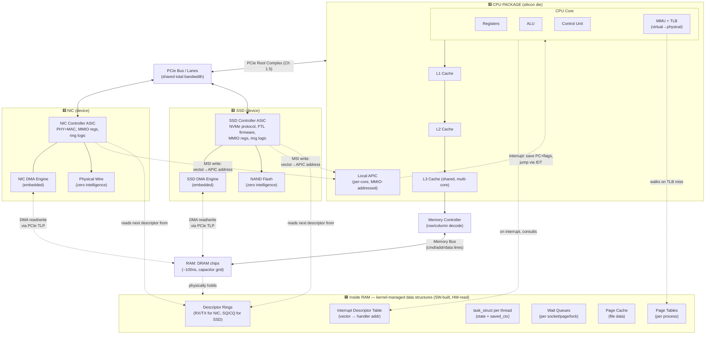

# MASTER REFERENCE — The Complete Hardware-to-Software I/O Pipeline

> One document, start to finish, no gaps. If anything below is unclear, that's the exact sentence to ask about — everything here has already been traced to the level of real electrical/silicon behavior in Part 1 and its addenda; this file is the clean, organized version of all of it.

---

## PART 1: Component Glossary — What Everything Is, In One Line

| # | Component | HW or SW | What it actually is |
|---|---|---|---|
| 1 | **CPU Core** | HW | Silicon: registers + ALU + Control Unit. Runs the fetch-decode-execute loop, one instruction at a time (per pipeline stage). |
| 2 | **Registers** | HW | A handful of storage slots physically wired into the ALU — the ONLY place the CPU can compute with data directly. |
| 3 | **L1/L2/L3 Cache** | HW | Small, fast SRAM memory, automatically managed, holding recently/nearby-used 64-byte chunks (cache lines) of RAM. |
| 4 | **Memory Controller** | HW | Logic that translates a flat address into DRAM row+column commands. Often on the same CPU package today. |
| 5 | **Memory Bus** | HW | The literal copper wires (address/data/command lines) connecting the memory controller to the DRAM chips. **Shared** by CPU and every DMA engine. |
| 6 | **RAM (DRAM chips)** | HW | Millions of capacitors in a grid, each holding one bit as electrical charge. Volatile (leaks, needs refresh). Reading is destructive (must rewrite after sensing). |
| 7 | **PCIe Root Complex / Bus** | HW | The CPU package's gateway to everything that isn't RAM — serial, packet-based (TLPs), lane-based (Ch 1.5), shared total bandwidth across all devices. |
| 8 | **Device Controller** (NIC/SSD) | HW | A dedicated ASIC chip that speaks the device's protocol, exposes MMIO registers, manages descriptor rings. The "smart" chip. |
| 9 | **DMA Engine** | HW | A circuit block, usually embedded INSIDE a device controller, whose only job is moving bulk bytes to/from RAM without per-byte CPU involvement. |
| 10 | **The Device itself** (wire / NAND flash) | HW | The dumb physical medium with zero intelligence — copper/radio for network, floating-gate transistors for flash. |
| 11 | **Local APIC** | HW | Tiny hardware unit next to each CPU core, addressed like memory (MMIO), that latches pending interrupt vectors and signals the core. |
| 12 | **Interrupt Descriptor Table (IDT)** | Data structure (in RAM, built by SW, read by HW) | A table mapping interrupt vector numbers to kernel handler addresses. Built once at boot by the kernel; consulted by the CPU hardware on every interrupt. |
| 13 | **Descriptor Ring** (submission/completion) | Data structure (in RAM, built by SW, read/written by HW) | A table of {buffer address, length, status} entries in ordinary RAM — the "forwarding address cards." Built by the driver; read/written by the device's DMA engine. |
| 14 | **Device Driver** | SW (kernel) | Code that knows a SPECIFIC chip's register layout and ring format. Sets up rings, programs MMIO registers, handles that device's interrupts. |
| 15 | **Interrupt Handler (ISR)** | SW (kernel) | Short kernel code that runs the instant an interrupt fires. Acks the device, does minimal bookkeeping, defers real work. |
| 16 | **Softirq / Workqueue** | SW (kernel) | Deferred kernel work, run shortly after the ISR returns — does the actual heavy lifting (deliver packet, wake threads) outside interrupt context. |
| 17 | **Scheduler** | SW (kernel) | Decides which READY thread runs on which CPU core next. Performs context switches (save/restore registers via `task_struct`). |
| 18 | **task_struct** | Data structure (in RAM, per thread) | Every thread's permanent kernel record: state (RUNNING/BLOCKED/READY), saved register context, pointer to its own kernel stack. |
| 19 | **Wait Queue** | Data structure (in RAM, per resource) | A linked list of `task_struct` pointers, owned by a socket/page/lock — who is currently waiting on THIS specific thing. |
| 20 | **Page Cache** | SW-managed region of RAM | The kernel's cache of file data, held in ordinary RAM, checked before any real disk I/O happens. |
| 21 | **MMU (Memory Management Unit)** | HW | Translates virtual addresses (what your pointer holds) to physical addresses (what the memory controller needs), using page tables. |
| 22 | **Virtual Memory / Page Tables** | Data structure (in RAM, built by SW/kernel, read by HW/MMU) | Per-process mapping of virtual → physical addresses, enabling isolation between processes and the kernel. |

---

## PART 2: The Software vs. Hardware Rule — Stated Once, Precisely

> **Software is instructions a CPU core executes. Hardware is anything that exists and acts independently of whether a CPU core is currently executing anything about it.**

Two tests that resolve every edge case:
- **Test 1 — "Is this a CPU core running instructions right now?"** If yes → software (even if it's deep in the kernel, even if it's a device driver — it's still just code on the same CPU core your app used).
- **Test 2 — "Does this keep doing its job with zero CPU instructions currently executing about it?"** If yes → hardware (a NIC receiving a frame, a DMA engine mid-transfer, RAM holding a charge, the Local APIC latching a vector).

A device driver is 100% software — it's kernel code, nothing more. The NIC controller chip, its embedded DMA engine, the physical wire, the Local APIC, the DRAM chips — all 100% hardware, working whether or not any CPU is thinking about them.

**Descriptor rings, the IDT, `task_struct`, wait queues, and the page cache are the interesting middle category:** they're DATA STRUCTURES — built and interpreted by software, but *sitting in RAM*, and *read directly by hardware* (the NIC controller reads the ring; the CPU's own interrupt-delivery hardware reads the IDT). They are the literal, physical handshake points between the SW and HW worlds — this is worth internalizing as its own category, not forcing it into one bucket or the other.

---

## PART 3: The Complete Physical Map (Corrected & Elaborated)

**How to read this corrected diagram, precisely:**
- **Two solid-line paths reach RAM**: the CPU's own cache-miss path (via L3 → Memory Controller → Memory Bus) and the PCIe path (any device DMA, via the Root Complex → the SAME Memory Controller → the SAME Memory Bus). Both dotted DMA arrows from NICDMA/SSDDMA ultimately resolve through this one shared route — the diagram shows them going straight to RAMHW as a shorthand, but Part 4's "PCIe" entry is explicit that this still passes through Memory Controller (4) and Memory Bus (5).
- **Two separate interrupt sources, one shared destination**: both the NIC controller and the SSD controller can independently raise an MSI — both target the *same* Local APIC (there's one per CPU core; a real multi-core system has one APIC per core, and interrupts can be routed to whichever core the kernel configures, Part 21).
- **RAM is drawn twice on purpose**: once as raw hardware (`RAMHW`, just capacitors and rows/columns — Part 4 entry 6), and once as "what's stored inside it" (`RAMCONTENT` — the IDT, descriptor rings, `task_struct`s, wait queues, page cache, page tables). This split is the fix for the previous diagram's biggest gap: it showed RAM as one undifferentiated box, which hid the fact that the IDT, the rings, and the thread bookkeeping are not separate mechanisms — they are ordinary data sitting in the exact same physical DRAM chips as everything else, just organized and interpreted by kernel software.
- **The three dotted "consults/reads/walks" arrows are the precise SW↔HW handshake points**: the CPU core's own interrupt hardware reads the IDT; the NIC/SSD controllers' hardware reads the descriptor rings; the MMU hardware reads the page tables. In all three cases, software built the table once, and hardware reads it directly and repeatedly at runtime with no software mediation on the read path — this is the same pattern in three places.

---

## PART 4: Every Component, Condensed to Its Essential Mechanism

**CPU Core (1):** fetch → decode → execute, forever. Every memory access ALWAYS goes to cache first (2), never directly to RAM (6). Has zero built-in concept of I/O, threads, or waiting — all of that is software built on top (Part 2 of the course).

**Registers (2):** a thread's ENTIRE execution state = its register values (Program Counter = position in code, Stack Pointer = call stack location). A context switch = save one thread's registers into its `task_struct` (18), load a different thread's — nothing more mysterious than that.

**Cache (3):** fetches 64-byte lines, not single bytes — exploits locality. Miss escalates: L1(~1ns)→L2(~4ns)→L3(~15-40ns)→RAM(~100ns). Access PATTERN (sequential vs. scattered), not just data volume, is what determines real-world speed.

**Memory Controller (4):** a flat address isn't enough for DRAM — it must be decoded into row + column. Issues ROW ACTIVATE (wait tRCD) then COLUMN READ/WRITE (wait CAS latency). This sequential, physically-timed command process IS the reason RAM is ~100ns, not ~1ns.

**Memory Bus (5):** shared copper wires. Command lines, address lines, data lines. Whatever is issuing row-activate/column commands — CPU OR any DMA engine — uses these SAME wires. This is the literal site of "DMA competes with CPU for memory bandwidth."

**RAM/DRAM (6):** capacitors in a grid; charge = data; leaks over time (needs refresh, hence "Dynamic"). Reading destroys the charge, so it must be sensed AND rewritten in the same operation — real analog electrical process, the physical root of the ~100ns number.

**PCIe (7):** the OTHER road into RAM. Any device DMA request becomes a packet (TLP) that travels the PCIe lanes to the Root Complex, which then issues the SAME kind of request to the Memory Controller (4) that the CPU itself would — proving there's one shared memory system, not two parallel ones. Total bandwidth is finite and shared across every device (`lspci -tv` to inspect).

**Device Controller (8, e.g. NIC/SSD ASIC):** speaks the device's protocol, exposes MMIO registers, manages descriptor rings, contains an embedded DMA engine. For a NIC: checks MAC address + checksum before anything else, discards invalid frames before they ever touch RAM. For an SSD: contains a Flash Translation Layer (FTL) — its own firmware, on its own tiny embedded CPU — mapping logical blocks to physical flash cells for wear-leveling.

**DMA Engine (9):** embedded inside the controller. Packages transfers as PCIe TLPs. Uses PCIe's own built-in ack/retry. Reports completion back to the controller, which then triggers the interrupt. Offloads the byte-COPY from the CPU — never the coordination (setup and completion handling stay software's job).

**The Device Itself (10):** zero intelligence. Copper/radio = pure physics, signal propagation at a fraction of light speed. NAND flash = floating-gate transistors trapping charge (non-volatile); can't overwrite in place — must ERASE (large blocks) then PROGRAM (high-voltage electron tunneling) — physically slower than reads, why the FTL exists.

**Local APIC + MSI (11):** every CPU core has this tiny hardware mailbox, itself addressed like memory (MMIO, one more layer of Ch 1.10's trick). A device raises an interrupt by performing an ORDINARY PCIe/memory write to the APIC's address with the vector number as payload — electrically indistinguishable from any other bus write. The CPU checks "pending vector?" as a MANDATORY step wedged into its own fetch cycle — unconditional, not a software decision, works even from a halted (`HLT`) core.

**IDT (12):** a table, in RAM, built by the kernel at boot: vector number → handler address. The CPU hardware consults this table itself, automatically, the instant it sees a pending vector.

**Descriptor Ring (13):** the "forwarding address cards." Driver pre-allocates buffers, gets their PHYSICAL addresses (`dma_map_single`), writes those addresses into a table in RAM, tells the device chip (once, via MMIO) where that table lives. At runtime, the device reads the next slot's address straight off RAM and DMA's data there — zero intelligence, pure lookup.

**Driver (14):** the ONLY piece of software that knows a specific chip's exact register offsets and ring format. Everything above it (VFS, socket layer, syscalls) is uniform and device-agnostic.

**ISR (15):** runs the instant the CPU jumps via the IDT. Deliberately SHORT — ack the device (MMIO write), mark status, defer the real work (`schedule_softirq`), return. Long ISRs delay other interrupts.

**Softirq/Workqueue (16):** does the actual heavy lifting shortly after the ISR returns — extracts data, delivers it up the stack, and — critically — calls `wake_up()` on the relevant wait queue. **The ISR itself never wakes your thread directly.**

**Scheduler (17):** `schedule()` picks a READY `task_struct`, restores ITS saved register context (from field 18's `saved_ctx`), and execution resumes exactly where that thread left off — transparently, with no memory of the gap.

**task_struct (18):** one permanent structure per thread, fixed location in kernel RAM for the thread's whole life. Contains `state` and `saved_ctx` (registers). Blocking = write your own registers into your own struct's field. This is the literal answer to "where do saved registers live and how does resume find the right ones" — there's no search, just a dedicated, permanently-labeled slot.

**Wait Queue (19):** a linked list, owned by whatever resource threads are waiting on (a socket, a page, a lock). Blocking = add a pointer to your `task_struct` here. Waking = walk the list, flip each `state` to READY, move the pointer to the scheduler's run queue. No registers touched during wake — only during the LATER resume via the scheduler.

**Page Cache (20):** RAM holding recently-read/written file data. `read()`/`write()` check/use this FIRST, before ever touching a real device. This is the entire mechanism behind "second read of a file is RAM-speed."

**MMU + Virtual Memory (21, 22):** your C++ pointers are VIRTUAL addresses. The MMU translates them to PHYSICAL addresses on every access, using page tables the kernel maintains, cached in a small hardware structure called the TLB (fast path) — falling back to a slower page-table walk on a TLB miss. This translation is why "just reading RAM" is a slightly more layered story than one flat ~100ns number.

---

## PART 5: The Four End-to-End Flows, One Final Time, Fully Condensed

**`recv()` (socket read):** thread blocks (saved into `task_struct`, added to socket's wait queue) → **independently**, NIC hardware receives frame → reads descriptor ring for target RAM address → DMA writes data → MSI interrupt → ISR (short) → softirq (real work) → `wake_up()` → scheduler restores thread → `copy_to_user()` → return. *Data arrives unsolicited; blocking exists to use the CPU elsewhere during an unpredictable wait.*

**`send()` (socket write):** copy user data into a kernel `sk_buff` → TCP/IP adds headers → queue a TX descriptor → ring doorbell → **`send()` RETURNS IMMEDIATELY** → independently, afterward, NIC's DMA reads FROM RAM and transmits → TX-complete interrupt frees the buffer. *A successful send() is not proof of delivery — that's TCP's job, layers above this trace.*

**`read()` (file read):** check page cache FIRST. Hit → pure RAM copy, no device, no blocking, done. Miss → block (same pattern as recv) → queue SSD read descriptor → SSD's FTL finds the physical flash location → DMA writes into the page cache slot → interrupt → wake → copy to user buffer. *This cache check is the entire "first read = disk speed, second = RAM speed" mechanism.*

**`write()` (file write):** in the common case, copy into a page cache slot, `mark_page_dirty()`, **return immediately — no device touched at all.** A separate background writeback thread flushes dirty pages later, with zero connection to your original thread's blocking state. Only `fsync()` forces a real, blocking device write (same block/wake pattern as recv/read).

| | Blocks caller? | Touches device now? | Uses page cache? |
|---|---|---|---|
| recv() | yes, until data arrives | no — device already wrote before notification | no |
| send() | only if send buffer full | no — queues, returns, device works after | no |
| read() | only on cache miss | only on cache miss | yes — hit = no device |
| write() | almost never (unless fsync) | no — marks dirty, background thread handles it | yes — write target IS the cache |

---

## PART 6: FAQ — Every Confusion, Answered Directly, No Gaps

**Q: If "the CPU is free" during DMA, why can DMA still slow things down?**
A: "Free" describes instruction execution only (zero CPU instructions copy the bytes). DMA and the CPU's own memory accesses share the same physical Memory Bus (5) and Memory Controller (4) — heavy sustained DMA can measurably reduce the effective bandwidth/latency available to concurrent CPU memory access. Two different claims; only one of them is true.

**Q: How can an interrupt "wake" the kernel if the kernel might not be running?**
A: A CPU core is NEVER truly off while powered — it's always executing something: your thread, another thread, or the idle task (often parked in `HLT`). Checking for a pending interrupt is a MANDATORY hardware step wedged into the CPU's own fetch cycle (or built into how `HLT` behaves) — not a software decision, not dependent on any particular thread being active. Only explicitly disabling interrupts on that specific core can block delivery.

**Q: Does the interrupt handler wake my blocked thread directly?**
A: No. The ISR does minimal work (ack device, defer). A LATER softirq/workqueue does the real work and calls `wake_up()`, which flips your thread's `state` from BLOCKED to READY — you're now eligible to run, not yet running. The scheduler decides when to actually restore your registers and resume you.

**Q: How does the NIC know WHERE in RAM to write incoming data?**
A: It doesn't decide — it LOOKS UP an address that the driver wrote into a descriptor ring (a table in RAM) long before any packet existed. Runtime is pure lookup, zero intelligence, exactly like `array[i]`.

**Q: What IS an MSI, physically?**
A: An ordinary PCIe/memory bus write, electrically indistinguishable from any other write, EXCEPT its target address happens to be the Local APIC's special address (itself just another instance of Ch 1.10's "make it look like memory" trick), and its payload is a small vector number.

**Q: Where do a blocked thread's saved registers actually live?**
A: In a dedicated field (`saved_ctx`) inside that thread's own permanent `task_struct`, sitting at a fixed, known location in kernel RAM for that thread's entire lifetime. Not a generic pool, not a search — a dedicated, labeled slot per thread.

**Q: What's the actual difference between a device, a device controller, and a DMA engine?**
A: Nested, not parallel. Device = dumb physical medium (flash chips, the wire). Controller = the smart ASIC that speaks the protocol and manages rings/registers. DMA engine = one specific hardware component, embedded INSIDE the controller, whose only job is the bulk RAM copy.

**Q: Why does `write()` usually return instantly, while `send()` sometimes blocks and `recv()` almost always does?**
A: `write()`'s target IS the page cache (RAM) — the real device write is deferred to a background thread entirely. `send()` only blocks if the kernel's own send buffer is full (backpressure) — otherwise it also just queues and returns. `recv()` blocks because it's waiting for something that hasn't happened yet and that the kernel has no control over the timing of — there's no cache to check, the data simply isn't there yet.

**Q: Why is "first read slow, second read fast" true?**
A: The FIRST read finds nothing in the page cache (`page == NULL`), forcing the full SSD/flash round trip. The data that round trip fetches gets LEFT in the page cache afterward. The SECOND read finds it already there — pure RAM copy, no device, no interrupt, no blocking. Same file, same bytes, structurally different code path.
