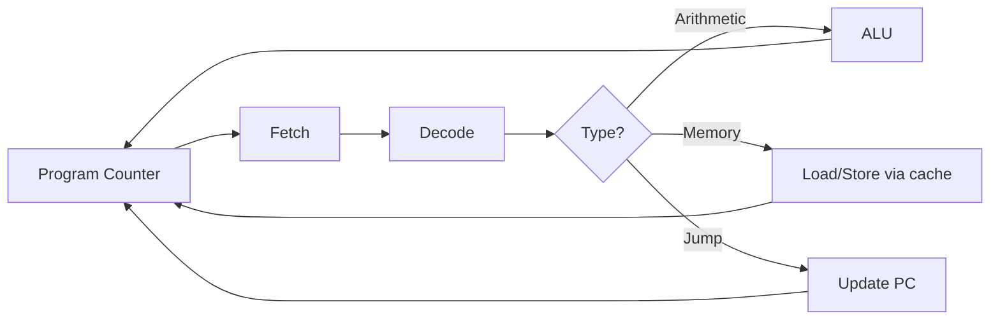
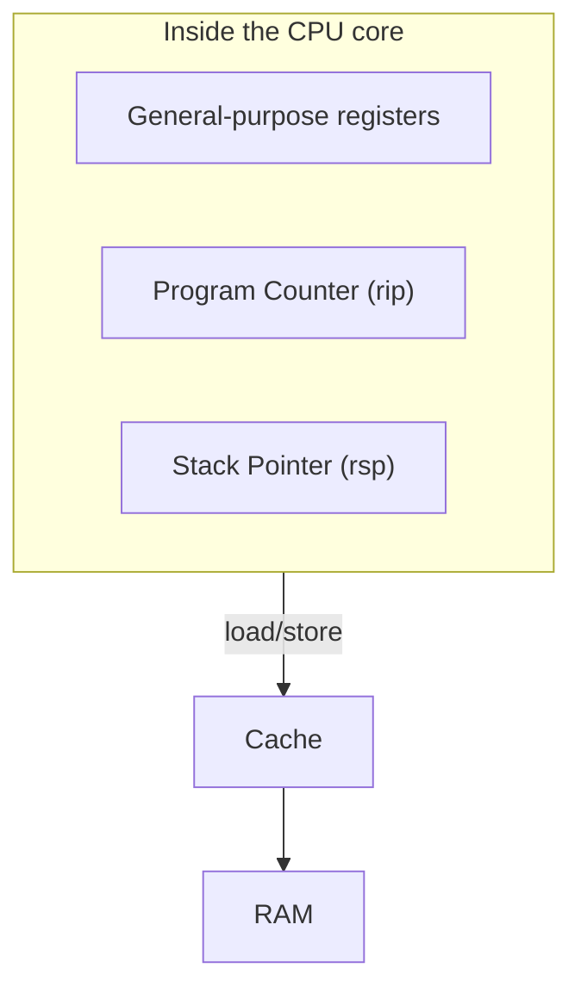
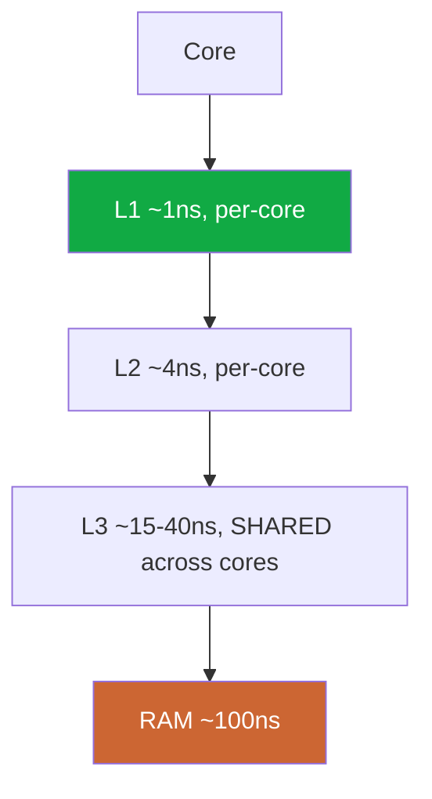
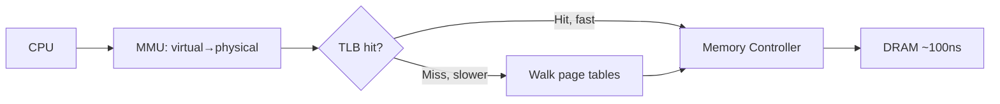
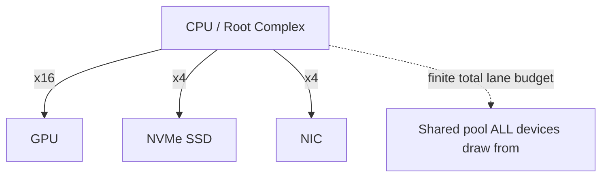
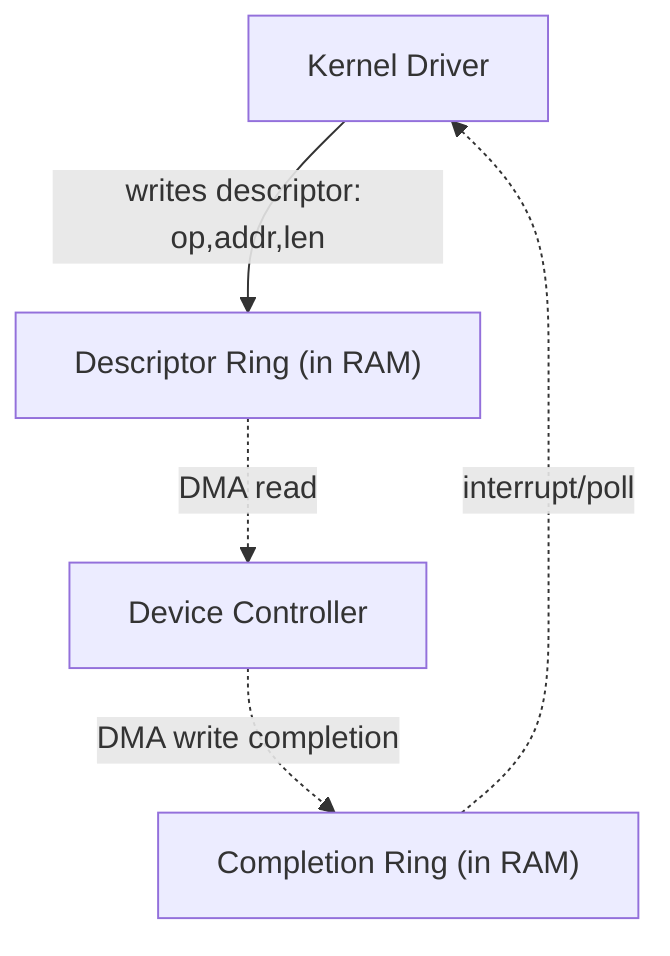
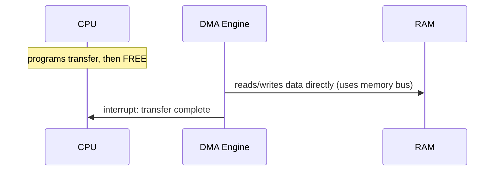
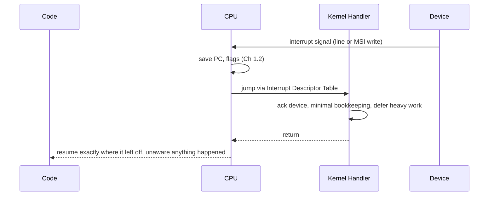
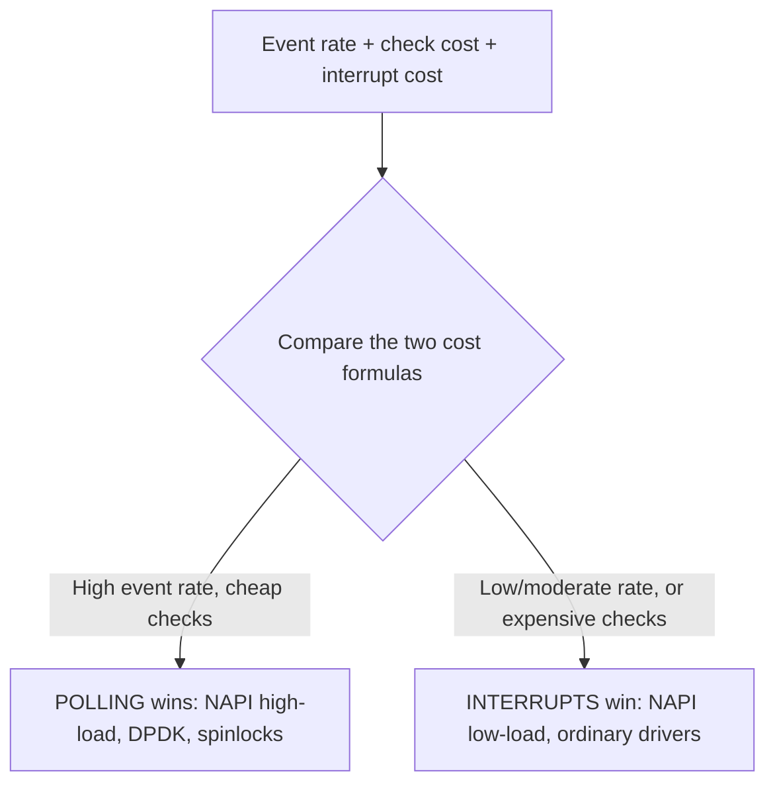
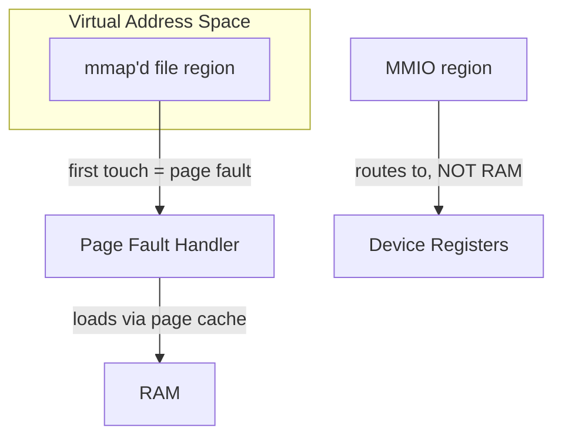

# PART 1 — HARDWARE FOUNDATIONS

> Condensed chapter summaries. Full deep teaching happens in chat when each chapter is first covered.

---

## Chapter 1.1 — CPU

**Mental model:** The CPU is a very fast, narrow-minded fetch-decode-execute loop with zero built-in concept of "I/O," "waiting," or "devices." Everything this course teaches is software built on top of that simple loop.

**Core idea:** the pipeline can hardware-stall for a cache miss (~tens-hundreds of cycles, Ch 0.2) but has no mechanism to stall for a multi-millisecond I/O wait — that's *why* the OS scheduler (Part 2) has to step in and run a different thread. Threads, blocking, epoll, io_uring are all just software deciding which instructions feed this same simple loop and when — the CPU itself never "learned" about I/O.

**Gotchas:** the CPU has no concept of "threads" — that's a pure OS/software construct (Part 2). A hardware interrupt redirects the Program Counter to a kernel handler, not directly to another thread — resuming a different thread afterward is a *scheduler policy decision*, not something the interrupt itself does.

---

## Chapter 1.2 — Registers

**Mental model:** Registers are the CPU's own hands — the only storage it can directly compute with. Everything else (cache, RAM, disk) exists because registers are too few/small, forcing constant shuttling of data in and out.

**Core idea:** a thread's *entire* execution state = the current values of its registers (PC = where it is in code, SP = where its call stack is, plus general-purpose registers). A **context switch** (Part 2.7 preview) is nothing more than: save one thread's register values to memory, load a different thread's previously-saved values — that's the whole mechanism underlying blocking, waking, and switching between threads.

**Gotchas:** registers aren't "fast RAM" — they're not addressed the same way and live in the CPU's own circuitry. The raw act of swapping registers is cheap; the µs-scale "context switch cost" (Ch 0.2) mostly comes from surrounding bookkeeping (scheduler decisions, cache effects), not the register swap itself. Each thread needs its own stack (memory) precisely because SP gets saved/restored per thread — this is the real source of the "~1-8MB per thread" cost from Ch 0.2/0.4.

---

## Chapter 1.3 — CPU Caches

**Mental model:** Cache = automatic, hardware-managed fast memory between registers and RAM, exploiting **temporal locality** (recently used → reuse soon) and **spatial locality** (used address X → nearby addresses likely used soon).

**Core idea:** caches fetch fixed 64-byte **cache lines**, not single bytes — sequential/structured access reuses a fetched line many times (fast); scattered/random access (pointer-chasing) triggers a fresh miss almost every time (slow) — same data, same total work, can differ 100x in speed purely by access pattern. You can't place data "in L1" directly — only control layout/access pattern indirectly.

**Preview for later:** multi-core cache coherency (keeping each core's cached copy in sync) has real costs — **false sharing** (cores fighting over the same cache line) becomes directly relevant in Part 8.18 (multithreaded epoll) and Part 27 (lock-free queues).

**Gotchas:** more cache ≠ faster if access pattern has poor locality. Cache misses often dominate runtime in "computationally simple" but memory-heavy code — check with `perf` (Part 22) before assuming the bottleneck is elsewhere. Shared L3 means noisy neighbors can evict your data.

---

## Chapter 1.4 — RAM

**Mental model:** RAM is the CPU's "working desk" — big enough for the whole working set, but reached over a real physical bus (~100ns), the last stop before things get genuinely I/O-slow (SSD/disk/network).

**Core idea:** "RAM access" isn't one simple step — your pointer is a *virtual* address the MMU must translate to physical (TLB hit = fast, TLB miss = slower page-table walk) before the actual DRAM access happens. RAM splits into kernel space (buffers, **page cache** Part 15.8, DMA targets) and per-process spaces, isolated by virtual memory — which is *why* `read()` copies data across that boundary instead of just handing you a pointer (Part 16 zero-copy exists to reduce this).

**The single most practically important pattern in this course:** first read of a file = disk-speed (ms). Second read (if it still fits in RAM) = page-cache/RAM-speed (µs-ns) — same file, ~1000x+ difference, purely from caching. Real benchmarks (Part 23) must always specify cold-cache vs warm-cache.

**Gotchas:** more RAM helps repeated access (bigger page cache) but doesn't speed up a single fresh access. "It's slow because RAM" is rarely the real diagnosis — check which layer *above* RAM (cache, TLB, page cache) failed first.

---

## Chapter 1.5 — PCIe

**Mental model:** PCIe is the highway system connecting CPU/RAM to every device — dedicated point-to-point "lanes" per device, but drawing from one finite total lane budget the CPU/chipset can offer.

**Core idea:** each device gets a dedicated link (no old-style literal wire sharing), but bandwidth = lane count × per-lane speed (roughly doubles each PCIe generation), and the *total* lanes across all devices is capped by the CPU/chipset — a fast NIC and fast NVMe SSD can together exceed that shared budget even though neither is individually maxed out. This is Ch 0.3's "shared bus" warning made concrete and modern.

**Gotchas:** a device's rated max speed assumes its link actually has enough lanes — fewer lanes than needed bottlenecks the device regardless of the device's own spec. PCIe is packet-based (framing/addressing overhead per transaction) — many tiny transfers are less efficient per byte than fewer large ones, which is *why* batching (io_uring submission batching Part 14.12, vectored I/O Part 18) pays off later. When a system hits a ceiling matching neither CPU% nor any single device's spec, check `lspci -tv` (PCIe topology/lane allocation) — a real, underused diagnostic step.

---

## Chapter 1.6 — Devices

**Mental model:** Every device exposes itself via a small set of universal patterns — port I/O (legacy), MMIO (device registers mapped into the same address space as RAM, read/written with ordinary load/store), and, for high-throughput devices, **descriptor rings**.

**Core idea — the big payoff:** the descriptor-ring / completion-ring pattern (driver writes work into a RAM ring, controller processes via DMA on its own schedule, writes completions back to another ring) is the **exact hardware-level ancestor of io_uring** (Part 14's SQE/CQE model literally mirrors this). io_uring isn't a novel invention — it's this decades-old hardware pattern exposed as a general userspace syscall interface. NVMe SSDs, high-perf NICs, and GPU command buffers all use this same shape.

**Gotchas:** MMIO addresses device *registers*, not bulk data — actual data transfer for high-throughput devices goes through DMA + rings, not through the CPU reading/writing bulk data via MMIO directly. Only the driver needs to know a chipset's exact register/ring layout — everything above it (VFS, syscalls) stays uniform (Ch 0.3). Batching descriptors before one "doorbell" notification is dramatically more efficient than notifying per-operation — the same batching principle that motivates io_uring's design later.

---

## Chapter 1.7 — DMA

**Mental model:** DMA is dedicated hardware that moves data between a device and RAM *without* the CPU copying each byte — CPU sets up the transfer once, is then completely free, and gets notified (interrupt) on completion.

**Core idea:** DMA removes the CPU from the *byte-copying* loop, not from *coordination* — driver still sets up the transfer and still handles the completion interrupt (waking a blocked thread = exactly the Ch 0.5 Blocked→Ready transition). **Scatter-gather DMA** (a list of transfers set up once, via a descriptor ring — Ch 1.6) is what makes high-throughput I/O practical — without it, many small transfers would need many separate setups/interrupts, reintroducing per-operation overhead. This whole chapter is the hardware-level version of the async-notification pattern (Ch 0.1) that epoll/io_uring later implement in software.

**Gotchas:** DMA transfers aren't instant — same physical latency numbers apply (Ch 0.2), just without tying up the CPU. DMA competes with the CPU for memory-bus bandwidth (Ch 1.4) — "CPU is free" means free of instruction execution, not zero system-wide impact. Buffers must be pinned in RAM before DMA can target them (Part 15 detail).

---

## Chapter 1.8 — Interrupts

**Mental model:** An interrupt is a hardware signal that forcibly redirects the CPU's Program Counter to a handler mid-execution — the only way a device can proactively get the CPU's attention instead of the CPU having to ask.

**Core idea:** interrupts aren't free — state save/restore, handler execution, and cache disruption (evicting the interrupted code's cache lines, Ch 1.3) all cost real cycles. At very high event rates (NIC handling hundreds of thousands of packets/sec), interrupt-per-event overhead can consume most of a CPU core — an **interrupt storm**. Fix: **interrupt coalescing** (batch completions into fewer interrupts) or, at the extreme, **polling-mode drivers** that deliberately disable interrupts under high load (Part 21) — trading CPU cycles for eliminated per-interrupt overhead, profitable only when load justifies it. Modern devices mostly use **MSI/MSI-X** (message-based interrupts via memory write) instead of dedicated physical wires, scaling to many devices/vectors.

**Gotchas:** the handler does NOT wake the blocked application thread directly — it does minimal bookkeeping (mark data ready); the scheduler separately decides when to actually move that thread Blocked→Ready (Ch 0.5). Handlers are kept deliberately short; heavier work gets deferred (softirqs/workqueues) so as not to delay other time-sensitive events.

---

## Chapter 1.9 — Polling

**Mental model:** Polling = actively, repeatedly checking a condition instead of being notified. Not "the bad old way" — it's a legitimate choice with its own cost model, and knowing when it wins vs. loses against interrupts is the real skill.

**The crossover math:** polling cost ≈ (checks/sec) × (cost/check) — scales with *how long you wait*, independent of real event rate. Interrupt cost ≈ (event rate) × (cost/interrupt, Ch 1.8) — scales with how often the event *actually* happens. At high enough event rates, `(event rate) × (cost/interrupt)` can exceed tight-loop polling cost — polling becomes *cheaper*. This is exactly why NAPI (Linux) dynamically switches interrupt-mode ↔ polling-mode based on real-time load, and why DPDK/kernel-bypass networking deliberately polls at extreme throughput.

**Where polling hides throughout this course, disguised:** spinlocks (Part 27, poll a memory location, cheaper than blocking for very short waits), busy-wait DPDK-style drivers (Part 21), and even epoll internally — "no polling from your program" means the kernel does the checking efficiently on your behalf, not that checking vanished entirely.

**Gotchas:** "polling is bad" is not a universal rule — it's a rule of thumb that breaks down exactly at the highest-performance end of systems design, where getting this crossover-point calculation right matters most. Naive polling's real failure mode is *tight-loop with no pacing for a rare/slow event* — not polling itself.

---

## Chapter 1.10 — Memory-Mapped I/O

**Mental model:** "Memory-mapped" = making something that isn't ordinary RAM (device registers, or a file's contents) addressable via normal load/store instructions — routing happens invisibly beneath the instruction.

**Two distinct applications of the same trick:**
1. **MMIO for device registers** (Ch 1.6 revisited): a physical address range routes to a device controller instead of RAM. Ordinary pointer access controls hardware — but needs `volatile`/memory barriers since compilers/CPUs may reorder "redundant-looking" accesses in ways that break hardware protocols.
2. **Memory-mapped files (`mmap()`)**: a file's contents appear in your virtual address space. First touch of any page triggers a **page fault** → kernel loads that page from disk (via page cache, Ch 1.4) → transparent resume. Only pages actually touched get loaded — **lazy/demand paging**, not the whole file upfront.

**Part 1 closing insight:** "make it look like memory" is the master trick threading through this entire part — registers (1.2), cache (1.3), MMIO (1.6/1.10), mmap'd files (1.10), and later virtual memory itself (Part 2.3) are all the same idea applied at different layers: reuse the CPU's fast load/store path instead of building a separate access mechanism.

**Gotchas:** mmap doesn't make first-access free — it changes the *interface* (pointer vs. syscall), not the underlying I/O cost for genuinely uncached data. mmap + DMA combine in high-performance designs (Part 16, 21): DMA writes directly into memory a process has mapped, cutting out a copy.

---

## 🗂 Part 1 — Short Notes (Fast Revision)

- CPU = fetch-decode-execute loop, zero built-in I/O concept; hardware can stall for a cache miss but not an I/O wait — that gap is why the OS scheduler exists.
- A thread's entire execution state = its register values (PC = position, SP = call stack). Context switch = save one register set, load another — the mechanism under every block/wake/switch.
- Cache lines (64B) + locality mean access *pattern*, not just data volume, can cause 100x speed differences. Can't place data "in L1" directly — only control layout/pattern.
- RAM access involves virtual→physical translation (MMU/TLB) before the ~100ns DRAM step. First file read = disk-speed; second (page cache) = RAM-speed — same file, orders of magnitude apart.
- PCIe: dedicated per-device lanes, but a finite *shared* total lane budget across all devices — real bottleneck at high-end multi-device systems (check `lspci -tv`).
- Devices expose registers via MMIO; high-throughput devices use **descriptor rings** (submit + completion, via DMA) — this is the direct hardware ancestor of io_uring's SQE/CQE model (Part 14).
- DMA offloads the byte-copy from the CPU, not the coordination — CPU still sets up transfers and handles completion interrupts. Scatter-gather DMA (batched via rings) is what makes high-throughput I/O practical.
- Interrupts aren't free — state save/restore, handler execution, cache disruption. At very high event rates this can saturate a core (interrupt storm) — fixed via coalescing or switching to polling.
- Polling isn't "the bad old way" — it's a genuine cost-model competitor to interrupts, and wins at high event rates / cheap checks (NAPI high-load mode, DPDK, spinlocks). The right choice is a calculation, not a rule.
- "Make it look like memory" is the one idea repeating throughout: registers, cache, MMIO, mmap'd files, and virtual memory (Part 2.3) are all this same trick at different layers.
