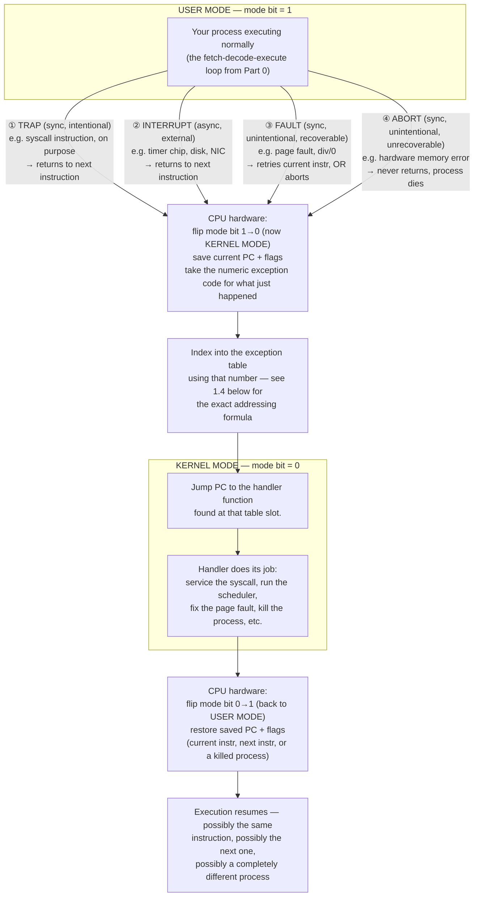
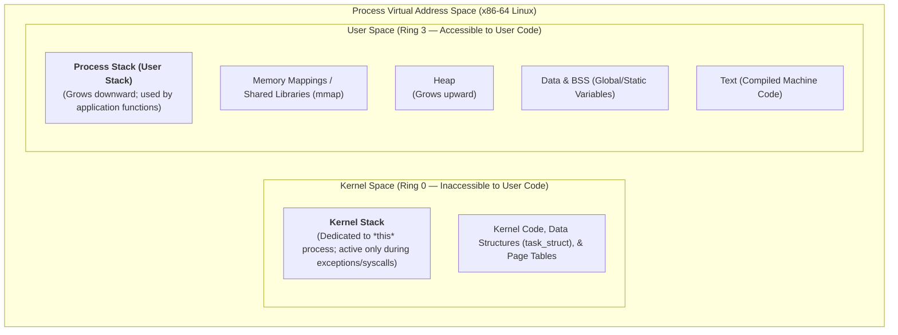
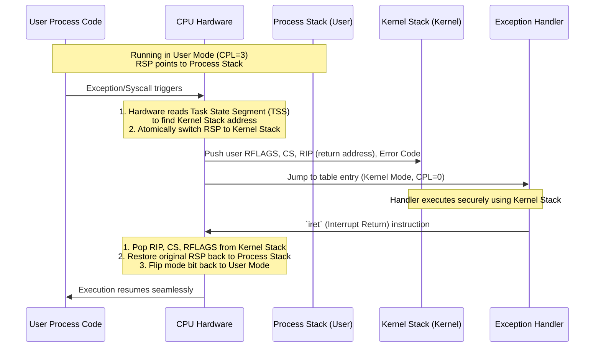
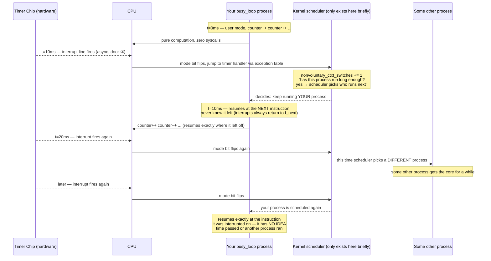

# Part 1 — The Machine's Two Faces: User Mode vs Kernel Mode

Part 0 left a gap on purpose. We built a CPU that fetches, decodes, executes, jumps, and calls/returns — and *none* of that needed an operating system. Straight-line code, `if`, `while`, function calls: all pure hardware mechanics. So here's the question this chapter answers: **if the OS isn't involved in any of that, when is it involved at all — and where actually *is* it while your program runs?**

CS:APP has a clean one-line definition we'll adopt as our anchor for the rest of this course:

> **Exception**: an abrupt change in the control flow, in response to some change in the processor's state.

Notice how that's a strict generalization of Part 0. Part 0's jumps and calls were changes in control flow driven by *your program's own logic* — you wrote the `if`, you wrote the loop. An exception is a change in control flow driven by something **outside** that logic — a state change the processor detects that your code never explicitly asked for.

---

## 1.1 The myth you probably believe (I did too, once)

Most people's mental model of an operating system is something like a police officer directing traffic, or air-traffic control — a supervisor sitting above everything, watching all the processes, ready to step in the instant something goes wrong. It's a comforting image. It is also **wrong**, and it's important that you see exactly why.

Ask yourself a very literal question: right now, on a single CPU core, if *your* process is running, is the operating system also running on that core, at the same time?

Ignore hyperthreading for a moment. The answer is **no**. A core executes one instruction stream at a time. If your process's instructions are what's being fetched-decoded-executed, then by definition the kernel's instructions are *not* being fetched-decoded-executed on that core at that moment. This was even more starkly true on classic single-core machines: there was exactly one instruction stream in the entire computer at any instant, and either your process owned it or the kernel did — never both.

This raises an uncomfortable question immediately: **if the OS isn't running while your process runs, what stops your process from doing whatever it wants?** What stops you from reading another user's private files? From talking directly to the disk controller and scribbling over someone else's data? If there's no traffic cop physically present, what's actually enforcing any rules at all?

Something has to give. And the answer is not "the OS is sneakily still running in the background" — it genuinely isn't. The answer is a piece of hardware you've probably never thought about: **the mode bit.**

---

## 1.2 The mode bit: the only lock on the door

Real CPUs have (at minimum) two privilege levels, commonly called **user mode** and **kernel mode** (or supervisor mode). This isn't a software convention — it's a physical bit of state inside the CPU itself, and the hardware checks it on every single instruction that touches something sensitive.

While your process runs, the CPU is in **user mode**. In user mode:

- You can do arithmetic, move data between your own registers and your own memory, jump, call, return — anything that stays inside your own process's sandbox.
- You **cannot** execute certain instructions at all — the ones that talk directly to hardware devices (disk controllers, network cards), the ones that flip the mode bit itself, the ones that reconfigure how memory addresses get translated. The CPU's own decode logic refuses to execute them, full stop, regardless of what the OS is or isn't doing at that moment.

**Kernel mode** is the only privilege level allowed to execute those instructions. And here's the key structural fact that answers our earlier question: **kernel-mode code is not "the OS constantly watching you." It is a specific, small, fixed set of functions, installed once at boot time, that only get control at very specific, well-defined moments.** The rest of the time — the vast, overwhelming majority of the time — nothing kernel-related is running at all. Your process simply owns the core.

---

## 1.2b Where this physically lives: the full machine

Everything in 1.2 was true, but it was also disembodied — "the CPU," "the mode bit," floating in the abstract. Let's ground it in an actual picture of the machine you're running this course on, because the mode bit doesn't live in some separate mystical location; it's one small piece of state sitting right next to the registers you already know about.


A few things to pin down from this picture before we go further:

- **The CPU chip** contains far more than just "the loop from Part 0." Alongside the register file (`%rax`, `%rbx`, ..., `%rip`) and the ALU sits the **MMU (Memory Management Unit)** — dedicated hardware whose entire job is translating the virtual addresses your program uses into physical RAM addresses. We haven't needed the MMU yet, but it's about to become extremely relevant in section 1.12 below, because a huge fraction of *faults* (in our 1.3 taxonomy) come directly from the MMU detecting a translation problem.
- **The operating system, per this diagram, is explicitly labeled as software** — the dashed orange box at the top — sitting logically "above" the hardware, not inside the CPU chip as a separate physical block. The page fault handler, the virtual memory manager, the scheduler: these are just more code, sitting in RAM like any other code, that happens to only run when a trap/interrupt/fault hands it control via the exact mechanism from section 1.4's formula. There is no "OS chip." This diagram makes concrete something section 1.1 already argued: the OS isn't a separate omnipresent entity, it's ordinary code waiting for its turn.
- **`%rsp`/`%rbp` are just hardware registers holding addresses** — the actual bytes of your call stack (locals, saved return addresses) live in perfectly ordinary RAM, get cached in L1/L2/L3 like any other data, and can even be paged out to disk under memory pressure. The stack from Part 0 isn't special hardware — it's a software convention built on top of two general-purpose-ish registers.
- Notice the **scheduler is explicitly annotated "swaps CR3 on context switch."** `CR3` is a real x86 register holding the physical address of the *current* process's page table. Every context switch you measured indirectly in section 1.8's experiment involves the kernel handler rewriting this one register — that single write is most of what makes "process B now sees process B's memory instead of process A's" true. We'll come back to `CR3` properly when we cover virtual memory in a later chapter, but it's worth seeing it here so the scheduler stops being a black box.

---

## 1.3 The precise taxonomy: it's not just "three doors" — CS:APP's exact categories

I previously described three doors into the kernel (trap, interrupt, fault). That was correct but slightly compressed. The textbook definition draws the line first at a higher level — **synchronous vs. asynchronous** — and then subdivides synchronous exceptions further, into **three** categories, not one. Getting this taxonomy exact matters, because it's the vocabulary every kernel developer, every `man 2` page, and every debugger uses.

| Category | Sync or Async? | Caused by | Returns to... |
|---|---|---|---|
| **Interrupt** | Asynchronous | An event *external* to the processor — a hardware device signaling on an interrupt pin (timer, disk finished, network packet arrived) | Always the **next** instruction after the one that was executing |
| **Trap** | Synchronous | An *intentional* action by the currently executing instruction — most importantly, the `syscall` instruction, executed on purpose | Always the **next** instruction (this is how system calls feel like ordinary function calls to your code) |
| **Fault** | Synchronous | An *unintentional* but potentially **recoverable** error — e.g. a page fault (the memory you touched isn't physically resident yet) | Either **re-executes the same instruction** (if the kernel fixed the problem, e.g. loaded the missing page) or aborts |
| **Abort** | Synchronous | An *unintentional and unrecoverable* error — e.g. a parity error in DRAM, unrecoverable hardware failure | Never returns to your process — control goes to a kernel abort routine, and the process is typically killed |

The distinction between **fault** and **abort** is worth sitting with, because it explains something that feels almost magical the first time you see it: a page fault can happen *in the middle of one instruction*, the kernel can go fetch the missing memory page from disk, and then the **exact same instruction re-runs from scratch** as if nothing happened — the instruction has no idea it failed the first time. That's only possible because a fault is defined as recoverable. An abort makes no such promise; something has gone wrong enough that continuing isn't an option.

Here's the general shape all four of these share, redrawn from the source material, showing exactly where each of the three possible return paths goes:


Read this left-to-right: your user code is marching along, `I_current` about to execute, when an **event** fires. Control transfers into kernel code — the exception handler runs — and when it's done, exactly one of three things happens: it **re-runs `I_current`** (a recoverable fault, like a page fault once the missing page is loaded), it **moves on to `I_next`** (a trap or interrupt — the normal case), or it **aborts** (unrecoverable, process dies). Every single row in the taxonomy table above is just picking one of those three exits.



---

## 1.4 How the CPU actually finds the handler: the exception table formula

In the last version of this chapter I described "a fixed table of entry points" abstractly. Let's make that completely concrete, because it isn't hand-waving — it's a real formula the CPU executes in hardware on every single exception.

Every exception type is assigned a small integer, the **exception number**. Some numbers are assigned by the processor designer at chip-design time (divide-by-zero, page fault — these are baked into the silicon). Others are assigned by the kernel developers (system calls, specific I/O signals) — the CPU doesn't care what the number *means*, only that it's a valid index.


The formula is almost embarrassingly simple: **`address of handler = exception_table_base_register + (exception_number × 8)`**. Each entry in the table is 8 bytes (a 64-bit address, on a 64-bit machine) — so multiplying the exception number by 8 gives you the byte offset to that entry, exactly the way indexing into any array of pointers works in C. There's a dedicated hardware register holding the base address of this table, set up once when the kernel boots, before your process — or anyone's process — ever runs a single instruction. This is precisely why the table is trustworthy: the CPU will only ever add a small integer to a base address the kernel itself installed, never jump to an address supplied by your user-mode code.

This is Part 0's array-of-function-pointers idea, but now you can see it's not a metaphor — it's a literal array, indexed with literal pointer arithmetic, exactly like `handlers[exception_number]` would be in C.

---

## 1.5 What makes an exception different from an ordinary `CALL`

Part 0 built `CALL`/`RET` entirely out of "push return address, jump, later pop it back." An exception *looks* similar at a glance — control jumps somewhere, and eventually comes back — but there are three concrete differences worth nailing down, because they explain behavior you'll otherwise find confusing later in this course:

1. **The return address pushed can be the current instruction *or* the next one** — unlike `CALL`, which always pushes "the instruction right after me." A fault pushes the address of the instruction that *faulted*, so it can be retried. A trap or interrupt pushes the address of the *next* instruction, since there's nothing to retry.
2. **Processor state beyond just the address gets pushed too** — condition codes (the CPU's internal flags register) are saved as well, because the kernel handler is about to run its own code, which will inevitably clobber those flags, and your process needs them intact when it resumes.
3. **The push happens onto the *kernel's* stack, not your process's stack.** This is the detail people miss most often. Your `CALL` in Part 0 pushed onto whatever stack your program was already using. An exception switches to an entirely separate, kernel-owned stack before pushing anything — because your user-mode stack might itself be the *reason* the exception happened (a stack overflow, for instance), and the kernel can't safely trust it.

Every process has two entirely separate memory stacks: a **process stack** (user stack) for your application code, and a **kernel stack** reserved exclusively for when that process enters the kernel.

### Process Stack vs. Kernel Stack

* **Process Stack (User Stack):** This is the memory region allocated in your virtual address space to hold local variables, function parameters, and return addresses for your own code (like the stack you built in Part 0). It is fully readable and writable by your program.
* **Kernel Stack:** The operating system allocates a separate, highly protected stack page in kernel memory *for every single process*. When an exception or system call occurs, the CPU hardware automatically switches the stack pointer (`%rsp`) to point to this kernel stack *before* pushing anything.

This separation is a critical security feature. If your user-mode code corrupts its own stack (such as via a stack overflow or buffer overflow), it cannot overwrite kernel return addresses or hijack the operating system's execution flow.




---

### Exception Stack Switch Sequence



---

### Code and Assembly Contrast: `CALL` vs. Exception

To see the difference in practice, look at what happens at the instruction level when a user function executes a standard `CALL` versus when the hardware handles an exception.

### Side-by-Side: Ordinary `CALL` vs. Hardware Exception (`syscall`)

---

### Path 1: The Ordinary Function `CALL` (User Stack Only)

When your code executes a standard function call, everything stays in user space (Ring 3). There is no privilege change, and the stack pointer (`%rsp`) never leaves your process stack.

#### Code & Assembly

```cpp
void foo() {
    int x = 42; 
}
int main() {
    foo(); 
}

```

```asm
main:
    call foo             ; 1. Pushes return address to user stack, jumps to foo
    ...
foo:
    push %rbp            ; 2. Saves old base pointer on user stack
    mov  %rsp, %rbp      ; 3. Sets up foo's stack frame
    movl $42, -4(%rbp)   ; 4. Stores local variable x
    leave                ; 5. Tears down frame
    ret                  ; 6. Pops return address into %rip, returns to main

```

#### Visual: The Process Stack (User Space)

```text
  HIGH MEMORY (e.g., 0x7fff0000)
  +-----------------------------------+
  | main()'s variables / stack frame  |
  +-----------------------------------+
  | Return Address (to main)          |  <-- Pushed by `call foo`
  +-----------------------------------+
  | Saved %rbp (caller's frame)       |  <-- Pushed by `push %rbp` inside foo
  +-----------------------------------+
  | Local variable x (42)             |  <-- %rsp points here during foo() execution
  +-----------------------------------+
  LOW MEMORY

```

#### Step-by-Step Execution

1. **`call foo`**: CPU pushes the return address (`%rip`) onto the **Process Stack**. `%rsp` decrements.
2. **`push %rbp`**: Software convention saves the previous base pointer onto the same **Process Stack**.
3. **Execution**: Code runs in **Ring 3 (User Mode)**. Condition codes (`%rflags`) are *not* saved.
4. **`ret`**: CPU pops the return address off the **Process Stack** into `%rip`. `%rsp` restores. Privilege level remains unchanged.

---

### Path 2: The Hardware Exception / Syscall (User Stack $\to$ Kernel Stack)

When a `syscall` instruction executes, a page fault hits, or a timer interrupt fires, the CPU hardware intercepts execution, switches stacks, and elevates privileges to Ring 0.

#### Code & Assembly

```cpp
// User space code triggering a system call
asm volatile("mov $1, %rax; syscall");

```

```asm
    mov $1, %rax         ; Syscall number for write
    syscall              ; TRAP instruction -- hardware takes over instantly
    ; === CPU HARDWARE INTERCEPTION (Ring 3 -> Ring 0) ===
    ; 1. Atomically reads Task State Segment (TSS) to find Kernel Stack
    ; 2. Switches %rsp to point to the PROCESS'S KERNEL STACK
    ; 3. Pushes user-mode state onto the Kernel Stack
    ; 4. Flips mode bit to Ring 0 and jumps to exception table handler

```

#### Visual: The Dual-Stack Transition

```text
[ Process Stack (User Space - Ring 3) ]        [ Kernel Stack (Kernel Space - Ring 0) ]
  HIGH MEMORY                                    HIGH MEMORY
  +-------------------------------+              +-------------------------------+
  | User local variables          |              | (Unused / Top of Kernel Stack)|
  | %rsp points here BEFORE       |              +-------------------------------+
  | the syscall happens.          |              | Saved User %rsp               |  <-- Pushed by CPU
  +-------------------------------+              +-------------------------------+
                                                 | Saved CPU Flags (%rflags)     |  <-- Pushed by CPU
                                                 +-------------------------------+
                                                 | Saved Code Segment (%cs)      |  <-- Pushed by CPU
                                                 +-------------------------------+
                                                 | Saved Return Address (%rip)   |  <-- Pushed by CPU
                                                 +-------------------------------+
                                                 | %rsp switches HERE instantly  |  <-- %rsp points here in Kernel Mode
                                                 LOW MEMORY                      LOW MEMORY

```

#### Step-by-Step Execution

1. **The Trigger (`syscall` or Interrupt)**: The CPU detects the event. It stops user execution.
2. **The Hardware Stack Switch**: The CPU hardware looks up the designated **Kernel Stack** for *this specific process* and changes `%rsp` to point to it. The user stack is completely abandoned.
3. **Saving State Atomically**: The CPU hardware automatically pushes `%rip`, `%cs`, `%rflags`, and the user's `%rsp` onto the **Kernel Stack**. (Condition codes and flags are safely preserved).
4. **Privilege Elevation**: The mode bit flips from **User Mode (Ring 3)** to **Kernel Mode (Ring 0)**.
5. **Table Lookup & Handler**: The CPU jumps to the handler function via the exception table, executing securely inside kernel space using the **Kernel Stack**.
6. **The Return (`sysret` / `iret`)**: When the kernel finishes, it executes a return instruction. The CPU hardware reverses the process: pops saved registers off the Kernel Stack, restores `%rsp` back to the **Process Stack**, flips back to Ring 3, and resumes user code seamlessly.

When an explicit system call like `open()` is executed, the traversal mechanism differs slightly from a hardware fault because a `syscall` is an intentional **trap** (category ② from the taxonomy). Rather than indexing the CPU's primary exception table directly with a hardware-assigned number, it uses a two-stage routing process: a hardware jump followed by a software table lookup using the register value you provided.

The traversal executes step by step:

1. **Setting the Syscall Number and Triggering (`syscall`):** User-mode code places the specific syscall number for `open` (which is `2` on x86-64 Linux) into the `%rax` register and executes the `syscall` instruction.
2. **The Hardware Interception & MSR Jump:** The CPU hardware catches the `syscall` instruction. It instantly switches the stack pointer (`%rsp`) to the process's **Kernel Stack**, saves the return address and CPU flags, flips the mode bit to Ring 0 (Kernel Mode), and jumps directly to a kernel entry point address pre-loaded into a special CPU hardware register (the `LSTAR` Model-Specific Register, set up when the kernel booted).
3. **Reaching the Kernel Dispatcher:** Control is now inside kernel mode at a central entry point routine (such as `entry_SYSCALL_64`). This routine saves your user-mode registers onto the kernel stack so they aren't lost.
4. **Using `%rax` as the Table Index:** The kernel dispatcher reads the syscall number sitting in `%rax` (`2`). It treats this number as an index into its own internal software array of function pointers—the `sys_call_table`.
5. **Applying the Table Formula:** The kernel computes the exact address of the handler using pointer arithmetic identical in principle to the hardware formula:
`handler_address = sys_call_table_base + (2 × 8)`
6. **Jumping to the File System Code:** The kernel reads the 8-byte function pointer found at that table slot (which points to the kernel's actual `sys_open` implementation) and jumps to it. When `sys_open` finishes opening the file, it places the resulting file descriptor into `%rax` and executes `sysret`, restoring your user state and returning control to the instruction right after `syscall`.

```c
// Conceptual C equivalent of the kernel's internal syscall lookup
// (Happens after the CPU hardware has already transitioned you to Ring 0)
sys_call_t handler = sys_call_table[rax_syscall_number]; // rax = 2 for open
long result = handler(); // Jumps to the kernel's open implementation

```
---

## 1.6 A concrete trap, in real assembly

We keep saying "a trap is when you deliberately ask to cross over" — here is exactly what that looks like for a real, everyday system call. This is (a simplified version of) what `open()` compiles down to on x86-64 Linux:

```asm
<__open>:
  ...
  mov  $0x2, %eax   ; open is syscall #2 -- put the number in a register
  syscall           ; the TRAP instruction itself -- door #1, opened on purpose
  ; kernel returns the file descriptor (or a negative error code) in %rax
  cmp  $0xfffffffffffff001, %rax
  ...
  retq
```

Look closely: `syscall` is a single instruction, sitting right there in the middle of otherwise completely ordinary code, next to a `mov` and a `cmp` — nothing about it looks special in the instruction stream itself. But that one instruction is precisely door ① from the diagram above: the mode bit flips, the CPU saves state onto the *kernel* stack (not this function's stack — see 1.5.3), indexes into the exception table using the number that was sitting in `%rax`, and jumps into kernel code that actually knows how to open a file. When that kernel code finishes, control returns to the instruction right after `syscall` — the `cmp` — with `%rax` now holding the real result. We will build our own raw version of exactly this call in Part 3.

---

## 1.7 Why trust matters more than presence

If kernel-mode code only runs occasionally, in short bursts, triggered by these four categories — how does it stay trustworthy? Why can't a malicious process just... also write kernel-mode code and run it?

Because kernel mode isn't a place *any* code can jump to. The instructions that flip the mode bit from user to kernel don't let you specify "run whatever code I want in kernel mode" — they only ever hand control to the fixed table from section 1.4, populated once when the operating system boots, before your process (or any other process) ever got to run at all. Hold onto this one sentence, because it's the entire foundation of OS security: **kernel-mode code is trustworthy not because it's supervising you constantly, but because the only code that can ever run with that privilege was placed there by the system itself before you ever got a chance to run anything.**

That trusted code is what actually enforces permissions — it checks "who is asking, what are they asking for, are they allowed" — but it only gets the chance to check *at the moment one of the four exception types fires*, never continuously.

And because time is exactly what your busy-loop experiment below measures, it helps to see the same mechanism laid out on a real timeline instead of a flowchart:



Notice the crucial detail in this diagram: your process, when it resumes, has **no way of knowing** it was ever interrupted. It doesn't see the timer fire. It doesn't see another process run in between. It just continues, mid-loop, as if no time passed at all — because an interrupt, per the taxonomy table, always resumes at the next instruction, indistinguishable from ordinary sequential execution. That's not an accident of good engineering — it's the entire illusion multitasking is built on.

---

## 1.8 Project 1: Prove the OS isn't watching you (context-switch accounting)

Enough theory — let's make this measurable. If "the OS isn't running while you run, and only takes over via an interrupt" is true, we should be able to observe it directly: a pure CPU-bound loop that never makes a single system call should still get forcibly kicked off the CPU periodically — but *only* because of the (asynchronous) timer interrupt, never because it "asked" to yield via a (synchronous) trap.

Linux exposes exactly the counter we need in `/proc/self/status`: `voluntary_ctxt_switches` (times your process gave up the CPU on its own — a synchronous trap, e.g. blocking on I/O) and `nonvoluntary_ctxt_switches` (times the scheduler forcibly took the CPU away from you — an asynchronous interrupt).

```cpp
// busy_loop.cpp
// Runs a pure CPU-bound loop for N seconds -- no syscalls, no sleep,
// no I/O -- then inspects /proc/self/status to see how many times
// we got kicked off the CPU, and *how*.
#include <iostream>
#include <fstream>
#include <sstream>
#include <string>
#include <chrono>

void print_ctxt_switches(const std::string& label) {
    std::ifstream status("/proc/self/status");
    std::string line;
    std::cout << "--- " << label << " ---\n";
    while (std::getline(status, line)) {
        if (line.rfind("voluntary_ctxt_switches", 0) == 0 ||
            line.rfind("nonvoluntary_ctxt_switches", 0) == 0) {
            std::cout << "  " << line << "\n";
        }
    }
}

int main(int argc, char** argv) {
    double seconds = (argc > 1) ? std::stod(argv[1]) : 3.0;

    print_ctxt_switches("BEFORE busy loop");

    auto start = std::chrono::steady_clock::now();
    volatile long counter = 0;   // volatile so the compiler can't optimize the loop away
    while (std::chrono::duration<double>(std::chrono::steady_clock::now() - start).count() < seconds) {
        counter++;               // pure register/memory work, zero syscalls
    }

    std::cout << "Busy-looped for " << seconds << "s, counter reached " << counter << "\n";
    print_ctxt_switches("AFTER busy loop");
    return 0;
}
```

```bash
g++ -std=c++17 -O0 -o busy_loop busy_loop.cpp
./busy_loop 3
```

**Actual output from running this myself:**

```
--- BEFORE busy loop ---
  voluntary_ctxt_switches:	2
  nonvoluntary_ctxt_switches:	1
Busy-looped for 3s, counter reached 49106101
--- AFTER busy loop ---
  voluntary_ctxt_switches:	2
  nonvoluntary_ctxt_switches:	329
```

**Read those numbers carefully — this is the whole chapter proven in two lines:**

- `voluntary_ctxt_switches` **did not move**: 2 → 2. The process never once executed a synchronous trap asking to give up the CPU. It never called `read`, `sleep`, `write` — nothing that would let it "volunteer" to step aside.
- `nonvoluntary_ctxt_switches` **jumped from 1 to 329**. Roughly a hundred times a second, an asynchronous interrupt forcibly evicted this process from the CPU — without the process's knowledge, consent, or cooperation, and without a single line of this program's code asking for it.

That "something" is the timer interrupt from section 1.3's taxonomy, firing on a fixed schedule, opening door ②, running the scheduler for a few microseconds, and — if it decides someone else deserves the core — throwing this process off and putting another one on. Your busy loop never noticed, and per the taxonomy table, an interrupt always resumes at the *next* instruction — which is exactly why it feels seamless.

**Run it yourself in WSL2** and try `./busy_loop 5` and `./busy_loop 10` — the nonvoluntary count should climb roughly linearly with time, at a rate tied to your kernel's timer interrupt frequency (commonly 100–1000 Hz).

---

## 1.9 Project 2: Prove the mode bit is hardware, not policy

The previous experiment showed the OS taking control *away* from you periodically via an interrupt. This one shows the flip side: what happens when *you* try to do something only kernel mode is allowed to do — this will be a **fault**, per our taxonomy, and specifically an unrecoverable one for this particular instruction (so it should behave like an abort in practice, even though the general fault mechanism is often recoverable for things like page faults).

`HLT` is a real x86 instruction whose job is to halt the CPU until the next interrupt — an instruction only the kernel's idle loop has any business running. If a user-mode program executes it, the CPU raises a **General Protection Fault** immediately, in hardware, and *then* hands control to a kernel fault handler, which in turn delivers a signal (`SIGSEGV` on Linux) to the offending process. We'll go deep on signals in Part 6, but for now we just need it as a probe to observe the fault and prove we survived it deliberately, using the `setjmp`/`longjmp` mechanism previewed in the roadmap.

```cpp
// privileged.cpp
// Attempts to execute a privileged (ring-0-only) x86 instruction from
// ordinary user-mode code. This isn't the OS "catching" us doing
// something naughty -- the CPU itself refuses at the hardware level,
// generates a General Protection Fault, and *then* the kernel's fault
// handler turns that into a signal sent to us.
#include <cstdio>
#include <csignal>
#include <csetjmp>

sigjmp_buf jump_buffer;

void fault_handler(int sig) {
    printf("Caught signal %d -- the CPU itself refused to run a privileged instruction.\n", sig);
    siglongjmp(jump_buffer, 1);
}

int main() {
    signal(SIGSEGV, fault_handler);
    signal(SIGILL, fault_handler);

    printf("About to execute HLT (a ring-0-only instruction) from user mode...\n");

    if (sigsetjmp(jump_buffer, 1) == 0) {
        asm volatile("hlt");   // privileged instruction -- illegal in user mode
        printf("This line should NEVER print.\n");
    } else {
        printf("Recovered via longjmp. Process is still alive because we handled the fault.\n");
    }

    printf("Program continues normally -- proving the crash was contained, not systemic.\n");
    return 0;
}
```

```bash
g++ -std=c++17 -O0 -o privileged privileged.cpp
./privileged
```

**Actual output from running this myself:**

```
About to execute HLT (a ring-0-only instruction) from user mode...
Caught signal 11 -- the CPU itself refused to run a privileged instruction.
Recovered via longjmp. Process is still alive because we handled the fault.
Program continues normally -- proving the crash was contained, not systemic.
```

Signal 11 is `SIGSEGV`. Notice what *didn't* happen: nothing in your process's own code checked "am I allowed to run `hlt`?" before executing it. The `asm volatile("hlt")` line executed, the CPU's decode stage saw a ring-0-only opcode being requested from ring 3, and it faulted *immediately, in silicon* — before the kernel software layer had any chance to be "smart" about it. The kernel's only job afterward was deciding what to do about a fault that had already happened, not preventing one from happening — prevention is entirely the CPU's job.

---

## 1.9b The canonical example of a recoverable fault: the page-fault pathway

Section 1.3's taxonomy table claimed a fault can "retry the current instruction" once the kernel fixes the underlying problem, and called that almost magical. Let's stop taking that on faith and walk through the single most common real-world fault, step by step, using the MMU we just met in section 1.2b.


Walk the numbered arrows exactly as drawn:

1. **CPU → MMU**: your instruction touches a virtual address (`VA`) — this could be as innocent as `mov (%rax), %rbx`, dereferencing an ordinary pointer.
2. **MMU → Cache/Memory**: the MMU needs the Page Table Entry (PTE) for that address, so it asks memory for it (`PTEA` = page table entry address).
3. **Cache/Memory → MMU**: the PTE comes back. Embedded in that PTE is a "valid" bit.
4. **If that valid bit is 0** — meaning this virtual page genuinely has no corresponding physical page loaded right now — the MMU itself, in hardware, raises an **Exception** straight to the **Page fault handler**. This is door ③ from section 1.3's flowchart, firing automatically, mid-instruction, with zero cooperation from your code.
5. **Page fault handler → Disk**: the handler figures out where on disk the needed data actually lives (or realizes it needs to evict some other page first to make room — the "victim page").
6. **Disk → Cache/Memory**: the new page gets loaded into a physical RAM frame.
7. **Back to the CPU, retrying the exact same virtual address**: the instruction that faulted — the very same `mov` from step 1 — runs again from scratch. This time, step 3's PTE lookup succeeds, because the page is now resident, and your program continues, completely unaware anything unusual happened.

This is precisely the "return to `I_current`" arrow from section 1.3's exception-flow diagram, now with a name and a mechanism: the instruction didn't skip forward, it **re-executed itself**, and it could only safely do that because a fault is defined as something the kernel can fix without corrupting any state — nothing was partially written, nothing was left half-done. Compare this to the `HLT` experiment in section 1.9: that fault had no fix available (there's no "correct" way to let user code execute a privileged instruction), so it took the abort-like SIGSEGV branch instead of the retry branch. Same category (synchronous, unintentional), same hardware mechanism, completely different resolution — exactly because "fault" in the taxonomy table only promises *possible* recoverability, not guaranteed recoverability.

We'll come back to page faults properly once we cover virtual memory in depth later in the course — for now, the goal was just to make "a fault can retry the current instruction" stop being an abstract claim and become a concrete, numbered sequence you can trace with your finger.

---

## 1.9c Project 3: Read the actual mode bit out of a real register

Every experiment so far has proven the mode bit's *effects* indirectly — context-switch counters, a crash we survived. Let's close the loop and actually **read the bit itself**, live, from inside a running C++ program. On x86-64, the CPU's current privilege level isn't stored in some separate hidden flag — it's encoded directly in the two low-order bits of the **CS (code segment) register**, the same register that, alongside `%rip`, tells the CPU what code it's currently executing. Those two bits are called the **CPL (Current Privilege Level)**, and they can express four possible rings (0–3), though Linux only ever uses ring 0 (kernel) and ring 3 (user).

```cpp
// read_cpl.cpp
// Reads the raw CS (code segment) register and extracts the two
// low-order bits -- the CPU's Current Privilege Level (CPL).
// This is the real, physical "mode bit" from Part 1, made visible.
#include <cstdio>
#include <cstdint>

int main() {
    uint16_t cs;
    asm volatile ("mov %%cs, %0" : "=r"(cs));

    uint16_t cpl = cs & 0x3;   // lowest 2 bits of the segment selector = CPL

    printf("Raw CS register value: 0x%04x (%d in decimal)\n", cs, cs);
    printf("Binary: ");
    for (int i = 15; i >= 0; i--) printf("%d", (cs >> i) & 1);
    printf("\n");
    printf("Lowest 2 bits isolated (cs & 0x3) = %d  <-- this IS the mode bit(s)\n", cpl);

    if (cpl == 3) {
        printf("CPL == 3  ->  RING 3  ->  USER MODE. This is the ONLY value\n");
        printf("             user code will ever see, because if CPL were 0,\n");
        printf("             this wouldn't be user code executing at all.\n");
    } else if (cpl == 0) {
        printf("CPL == 0  ->  RING 0  ->  KERNEL MODE.\n");
    }
    return 0;
}
```

```bash
g++ -std=c++17 -O0 -o read_cpl read_cpl.cpp
./read_cpl
```

**Actual output from running this myself:**

```
Raw CS register value: 0x0033 (51 in decimal)
Binary: 0000000000110011
Lowest 2 bits isolated (cs & 0x3) = 3  <-- this IS the mode bit(s)
CPL == 3  ->  RING 3  ->  USER MODE. This is the ONLY value
             user code will ever see, because if CPL were 0,
             this wouldn't be user code executing at all.
```

`cs & 0x3` gives `3` — bit pattern `11`. This isn't a simulation or a proxy measurement like the context-switch counters were; this is the literal hardware register that the CPU's fetch stage consults on every instruction to decide whether a given opcode (like our old friend `hlt`) is even legal to decode. Notice the two low-order bits of the full value `0x0033` (`00110011` in the low byte) — `11` in binary is exactly `3`.

**One important thing this experiment can *never* show you, and why that's not a bug**: try as you might, you cannot write a user-mode C++ program that prints `CPL == 0`. This isn't a limitation of the code — it's a direct logical consequence of everything in section 1.2. The instant the CPL became 0, by definition kernel code would be running, not your `printf`. You cannot observe kernel mode from inside a program executing in user mode, for the exact same reason you couldn't observe what happened during the timer interrupt in section 1.8's experiment — the entire point of the mode bit is that these two worlds don't coexist in the same instruction stream. Every observation we make of kernel-mode behavior in this course, from here on, will necessarily be indirect: counters, crashes, timing, side effects — never a direct printout of "yep, I'm in the kernel right now."

**Try this yourself**: run `sudo ./read_cpl` in WSL2 and see if the CPL changes. It won't — and that's a genuinely important, commonly misunderstood point. Being `root` is a *kernel-enforced permission check* (the trusted table-installed handlers from section 1.7 deciding "is this UID allowed to do X"), not a different CPU ring. Root-owned processes run in exactly the same ring 3 as your own user account. Root doesn't get a "more privileged CPU" — it gets past more of the kernel's own bookkeeping checks once it's already made a trap into kernel mode.

---

## 1.10 What we've actually established

| Claim | How we proved / grounded it |
|---|---|
| Exceptions come in exactly four flavors, not a vague "abnormal stuff" bucket | The sync/async split, then trap/fault/abort — matching the official taxonomy, each with a defined return behavior |
| The OS is not continuously running alongside your process | `voluntary_ctxt_switches` never moved during a syscall-free busy loop — no trap ever occurred |
| Something still evicts you from the CPU periodically | `nonvoluntary_ctxt_switches` climbed steadily — an asynchronous interrupt firing on a fixed schedule |
| The CPU knows exactly where to jump via simple arithmetic, not magic | `base_register + exception_number × 8` — a real formula, not a metaphor |
| An exception isn't just "a fancy CALL" | Return address can target the *current* instruction (unlike CALL), extra processor state is saved, and it uses the *kernel's* stack, not yours |
| Kernel privilege is enforced by hardware, not software vigilance | `hlt` faulted instantly at the CPU decode stage, before any OS "policy" could apply |
| A fault can genuinely retry the exact instruction that failed | Walked the numbered page-fault pathway: MMU → exception → handler → disk → retry the same `VA` |
| The mode bit is a real, readable register field, not a metaphor | Read `%cs & 0x3` directly and got `3` — and confirmed `sudo` doesn't change it, because root is a kernel permission check, not a CPU ring |

You now have the *shape* of the mode bit, the exact four-way taxonomy, the real addressing formula for the exception table, and two real experiments with numbers you can reproduce on your own machine. What you don't have yet is **what's actually stored inside each table entry**, how the kernel decides which of the many possible handlers applies, and — most importantly — how *you*, as a programmer, deliberately walk through door ① to make a system call on purpose, in your own C++ code, without libc doing it for you.

That's Part 2.

### Exercise before moving on

Modify `busy_loop.cpp` to call `usleep(1000)` once per iteration instead of pure computation, and re-run it. Watch what happens to `voluntary_ctxt_switches` this time. Then, using the taxonomy table from 1.3, explain in your own words: is calling `usleep` a trap or an interrupt? What return path does it take? Be ready to justify your answer before Part 2.

Say **"start part 2"** when you're ready.
