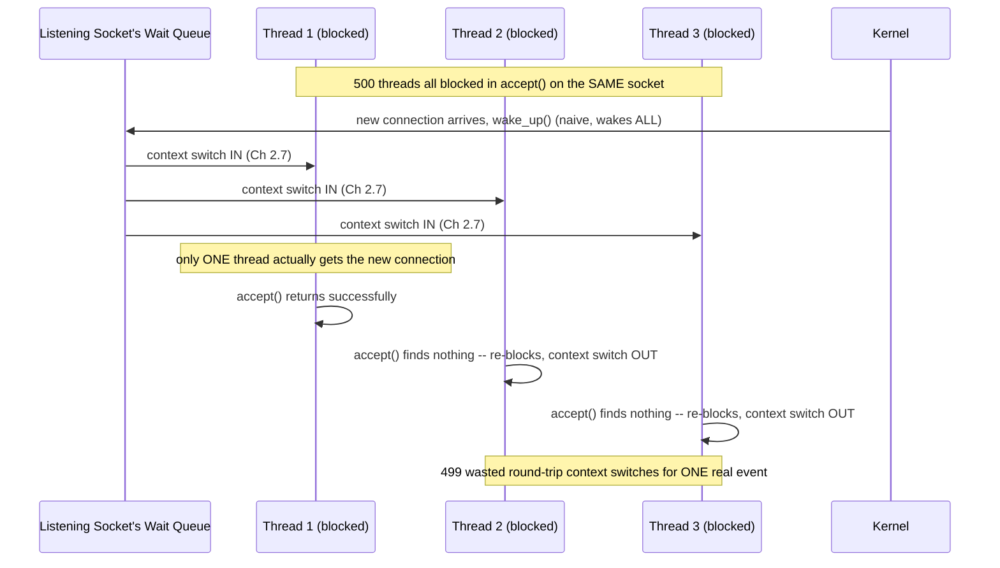

# PART 2 — Linux Process + Kernel Foundations

## Chapter 2.10 — Wait Queues

*(Part 1's Flow 3/4 already built and used wait queues extensively — every blocked thread added itself to a specific resource's wait list, and `wake_up()` walked that list. This final chapter of Part 2 formalizes the actual data structure and reveals a real, named problem that arises from waking too many threads at once.)*

### 🧠 One-Sentence Mental Model
> A wait queue is a linked list of threads waiting on one specific resource — and the choice of whether `wake_up()` wakes everyone on that list or just one specific thread is not a minor implementation detail, but the difference between an efficient system and one that wastes enormous amounts of CPU on pointless, simultaneous wakeups.

### 🧒 Explain Like I'm Five
Imagine a bakery with a "take a number" system, but the number display has a design flaw: whenever ONE order is ready, the loudspeaker announces "SOME order is ready!" to the entire waiting room, and everyone gets up to check the counter, even though only one person's order is actually done. Everyone else stood up, walked over, and sat back down for nothing. A better bakery calls out the *specific* number that's ready — only the person who needs to move, moves.

### 🌍 Real-World Analogy
Picture a large apartment building's single shared package room, where every resident who's expecting a delivery has signed up on one shared notification list. If the building's system, whenever ANY single package arrives, texts *every single resident on the list* "a package has arrived!" — most of them will walk down, discover it's not theirs, and walk back, having wasted a genuinely real trip for nothing. A well-designed system instead only notifies the specific resident whose specific package actually arrived.

### ❓ The Problem
Part 1 used the wait queue mechanism correctly for its single-thread examples — one thread blocks on one specific page's wait queue, `wake_up()` finds that one thread. But real systems often have **many** threads waiting on the **same** resource simultaneously — many threads all calling `accept()` on the same listening socket, for instance, all genuinely blocked on that one socket's wait queue at once. This chapter asks: what happens when `wake_up()` fires in that many-waiters case, and does the obvious answer ("wake all of them") actually make sense?

### 🔥 Why This Problem Matters
This is not an academic corner case — it's a real, historically significant performance problem in exactly the kind of server architecture this entire course is building toward (Parts 4, 6-8, 14). A server design that doesn't account for this chapter's lesson can waste a large fraction of its CPU capacity on wasted wakeups under real, heavy concurrent load — and the fix for it directly motivated a specific, real epoll flag you'll meet by name in Part 8.

### 🕰 Historical Context
As soon as multiple threads/processes commonly blocked on the same shared resource (multiple worker processes all `accept()`-ing on one listening socket being the classic case), the "wake everyone, let them sort it out" default behavior of early wait-queue implementations became a measurable, named performance problem once concurrency levels grew large enough for the wasted wakeups to matter — this is the origin of the term **thundering herd**, and it directly motivated the development of more selective, single-waiter wakeup primitives.

### 💡 The Naive Solution
Whenever a resource becomes available, wake up *every* thread waiting on it, and let them race to grab it — whichever one gets there first wins, the rest simply notice nothing's actually available for them and go back to sleep.

### ❌ Why the Naive Solution Fails
Each of those "losing" threads still had to be fully woken — which means, per Chapter 2.7, a real context switch back into that thread (register restore, and if it's a different process, the full `CR3`-reload/TLB-invalidation cascade), just so it can immediately discover there's nothing for it and go back to `TASK_BLOCKED`, incurring *another* full context switch back out. With `N` threads waiting and only one resource becoming available, this naive approach pays for `N` context switches (or `2N`, counting the trip back to sleep) to accomplish work that fundamentally only needed one thread to actually do anything.

### ✅ The Better Solution
Provide a wakeup primitive that wakes exactly **one** waiting thread — the resource, once available, is claimed by that one thread, and everyone else remains asleep, undisturbed, never paying for a pointless wakeup at all.

### 🧠 Core Concept
> **A wait queue is a per-resource linked list of waiting `task_struct`s (Part 1's mechanism, now formalized). `wake_up()` wakes every thread on the list — appropriate when the event genuinely matters to all of them. `wake_up_exclusive()` wakes exactly one — appropriate when only one thread can actually consume the newly-available resource, avoiding the wasted-wakeup cost known as the thundering herd problem.**

### 📐 Deep Technical Explanation

**The formal structure:**

```c
struct wait_queue_head {
    spinlock_t lock;             // protects the list itself from concurrent
                                  // modification (multiple threads could try
                                  // to add/remove themselves simultaneously,
                                  // a genuine multi-core concurrency concern,
                                  // Part 27's territory, showing up here first)
    struct list_head task_list;  // linked list of waiting task_structs (Part 1)
};
```

**Two waking styles, and precisely when each is correct:**

```c
wake_up(&wq);                // wakes EVERY thread on this wait queue

wake_up_interruptible(&wq);  // same, but only affects TASK_INTERRUPTIBLE
                              // sleepers (Chapter 2.9's distinction) -- a
                              // thread in TASK_UNINTERRUPTIBLE sleep on this
                              // SAME queue would be left alone by this call

wake_up_exclusive(&wq);      // wakes only ONE waiting thread -- specifically
                              // designed for the case where only one waiter
                              // can meaningfully consume the event
```

**The thundering herd problem, made concrete:**



**How to read this diagram:** every single one of those 499 "wasted" threads still paid the real, physical cost Chapter 2.7 described — register restore, and (if these are separate processes rather than threads of one process) the full `CR3`/TLB-invalidation cascade — twice each, once going in and once going back to sleep — to accomplish precisely nothing. With `wake_up_exclusive()` instead, only Thread 1 (or whichever one thread the kernel selects) is ever touched at all; the other 499 remain fully asleep, at zero cost, the entire time.

**Why this matters concretely, and where it resurfaces later in this course:** this exact problem — many waiters on one shared resource, only one of which can actually be served by a given event — is precisely the motivating scenario behind the `EPOLLEXCLUSIVE` flag you will meet by name in Part 8, when multiple threads share one epoll instance watching the same listening socket. That flag exists specifically to apply this chapter's `wake_up_exclusive()` principle at the epoll layer, one level above the raw wait-queue mechanism described here — recognizing this connection when you reach Part 8 will make that flag feel like an obvious, already-understood idea rather than a new, arbitrary API detail.

### ❌ Common Misconceptions
- ❌ **"Waking every thread on a wait queue is always the 'safe default' with no real downside."** — Under real concurrent load with many waiters and a single-consumer resource (like one new connection on a shared listening socket), it causes a genuine, measurable performance problem (thundering herd) — the "safe" default is not free.
- ❌ **"The thundering herd problem is purely theoretical / only matters at extreme scale."** — It's a real, historically-documented, named problem that directly motivated real kernel and API changes (like `EPOLLEXCLUSIVE`, Part 8) — it's a practical concern in any design with genuinely many concurrent waiters on one shared resource, which real high-concurrency servers routinely have.
- ❌ **"`wake_up_exclusive()` is just `wake_up()` that happens to only wake one thread by coincidence."** — It's a deliberately different primitive, specifically designed for the single-consumer-resource case, chosen consciously by kernel code (and, at a higher layer, by flags like `EPOLLEXCLUSIVE`) precisely to avoid the wasted-wakeup cost of the all-waiters version.
- ❌ **"A wait queue is a process-specific or thread-specific structure."** — It belongs to the *resource* (a socket, a page, a lock) — Part 1's original framing ("your name goes on THIS specific restaurant's clipboard") — any number of threads from any number of processes can be simultaneously linked into the same one wait queue.

### 🧙 Wizard Insight
The thundering herd problem is one of the cleanest possible illustrations of a theme running through this entire course: a mechanism that is *individually* cheap (one context switch, Chapter 2.7) can still add up to a *systemically* expensive problem once it's multiplied by real-world scale (hundreds of simultaneous waiters). A wizard evaluating any "wake everyone who's waiting" pattern in a system design — whether at this raw kernel wait-queue level, or at a higher application level (a condition variable's `notify_all()` in your own C++ code, waking many threads when only one can actually proceed) — immediately asks: "how many of these wakeups will turn out to be wasted, and is there a more selective primitive available?" This exact question, asked here at the kernel level, is precisely the same question you'll learn to ask again about condition variables in Part 27.

### 🧠 Quiz
**Q1.** Why does waking all 500 threads blocked on one listening socket, when only one new connection arrived, cost more than just "500 threads waking up"?
<details><summary>Answer</summary>Each woken thread pays a real context-switch cost (Ch 2.7) to be restored and run, discovers there's nothing for it, and then pays ANOTHER context-switch cost going back to sleep -- 499 of the 500 threads pay this double cost for zero actual benefit.</details>

**Q2.** What's the difference between `wake_up()` and `wake_up_exclusive()`, and when is each the correct choice?
<details><summary>Answer</summary>wake_up() wakes every waiting thread -- correct when the event genuinely matters to all of them. wake_up_exclusive() wakes exactly one -- correct when only one waiter can actually consume the newly-available resource, avoiding wasted wakeups (the thundering herd problem).</details>

**Q3.** What real, named epoll feature, covered later in this course, is directly motivated by this chapter's thundering herd problem?
<details><summary>Answer</summary>EPOLLEXCLUSIVE (Part 8) -- it applies this same wake_up_exclusive() principle one layer up, at the epoll level, for multiple threads sharing one epoll instance watching the same listening socket.</details>

---

## 🗂 Part 2 — Short Notes (Fast Revision)

- **Process** = container (address space + file descriptors + signal handlers + PID); **thread** = one execution stream inside it. A program is an inert file on disk until `execve()`'d into a process.
- `task_struct` (Part 1) is really a **thread's** kernel record — Linux has no separate process object; a multithreaded process is several `task_struct`s sharing one address space via `clone()`'s `CLONE_VM` flag.
- `fork()` is fast because of **Copy-On-Write** — no real memory copy until a page is actually written (Part 1's Flow 2 protection-fault mechanism, reused exactly). `execve()` replaces a process's code/data in place, same PID.
- Threads share heap/globals/code/fds/signal handlers; keep private: registers, own stack, own `task_struct.saved_ctx`. This exact split is why thread creation/switching is cheaper than process creation/switching.
- Virtual memory exists for three reasons at once: **isolation** (separate page tables per process), **addressing simplicity** (every program assumes the same layout), **overcommit/laziness** (demand-paging). Virtual memory ≠ swap.
- Address space layout, low to high: `.text` → `.data`/`.bss` → heap (grows up) → unmapped gap → mmap region → stack(s) (grow down).
- User space (ring 3) vs. kernel space (ring 0) is a real, **hardware-enforced** CPU privilege boundary, checked before privileged instructions execute — not a software convention. Kernel space is mapped into every process's page table for syscall speed — and this exact shared mapping is what Meltdown exploited (KPTI is the costly fix).
- A **syscall** = one instruction (`syscall`) that atomically switches ring 3→0, switches to a per-thread kernel stack, jumps to a FIXED kernel entry point (never user-chosen) — genuinely expensive (~hundreds of ns) relative to a function call, the direct justification for io_uring's batching (Part 14).
- **Context switch**: same-process thread switch = registers only (cheap). Cross-process switch = registers + `CR3` reload, which invalidates cached TLB translations and forces a burst of page-table walks afterward (PCID softens but doesn't eliminate this).
- **Scheduler (CFS)**: always run the READY thread with the lowest `vruntime` (priority-weighted accumulated CPU time) — fairness by one continuous comparison rule, not fixed time slices. This is the concrete policy behind Part 1's "Decision 3."
- `TASK_INTERRUPTIBLE` (signal can wake early → `EINTR`) vs `TASK_UNINTERRUPTIBLE` (`D` state — deliberately un-killable, even by `SIGKILL`, until a safe checkpoint is reached; not a bug, a real diagnostic signal about an underlying stuck operation).
- **Wait queues** are per-resource linked lists of waiting `task_struct`s. `wake_up()` wakes everyone (risking a **thundering herd** — many wasted context switches for one real event); `wake_up_exclusive()` wakes just one — the direct ancestor of epoll's `EPOLLEXCLUSIVE` (Part 8).

### 🔗 What This Connects To Next
**Previous:** Part 2, Chapter 2.9 — Sleeping and Waking
**Current:** Part 2, Chapter 2.10 — Wait Queues (Part 2 complete)
**Next:** Part 3 — File Descriptors (what the `fd` in every `read(fd, ...)`/`write(fd, ...)` call actually IS, end to end — file descriptor tables, open file descriptions, `struct file`, and the VFS layer that makes files, sockets, and pipes all answer to the same API)
