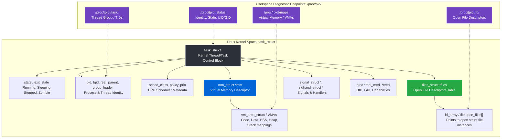
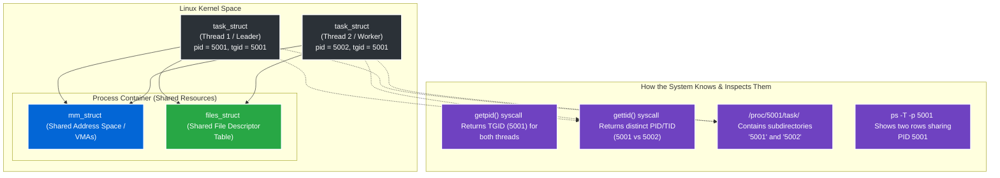
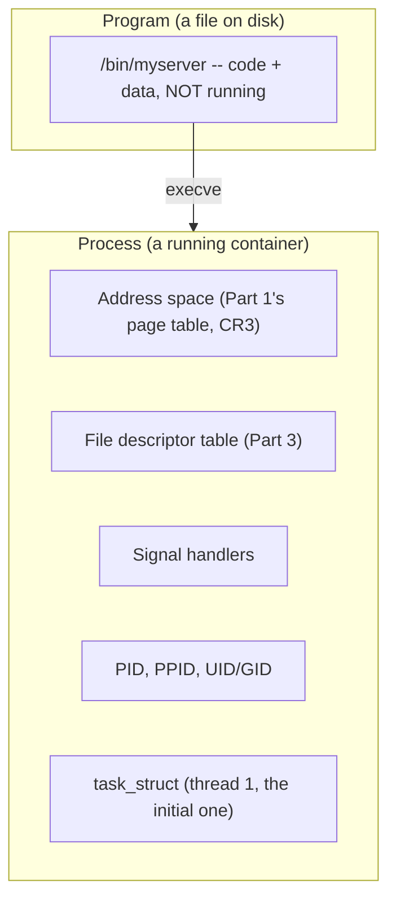
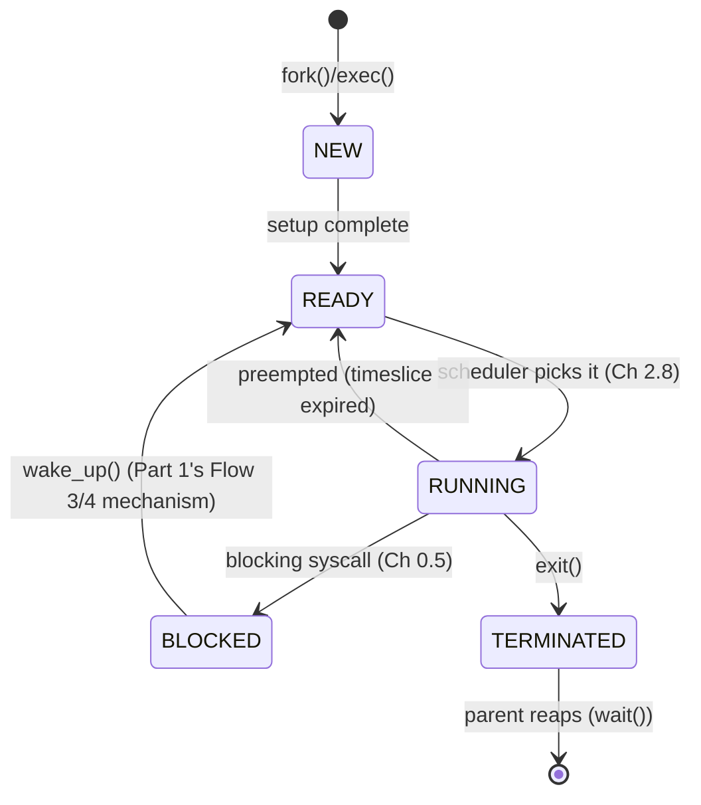

# PART 2 — Linux Process + Kernel Foundations

## Chapter 2.1 — Process



---


### 🧠 One-Sentence Mental Model
> A process is the OS's unit of *ownership* — one private address space plus everything needed to run code in it — while the thread (next chapter) is the OS's unit of *execution*. Confusing the two is the single most common source of confusion in this entire part.

### 🧒 Explain Like I'm Five
Imagine a process is a private office — it has its own filing cabinet (memory), its own phone line (file descriptors), its own nameplate on the door (PID). A thread is a worker inside that office. One office can have one worker or five workers, but they all share the same filing cabinet and phone line — because it's the *same office*. Two different offices, even with identical furniture, never share a filing cabinet — that's the whole point of giving them separate offices.

### 🌍 Real-World Analogy
A process is like a restaurant franchise location — its own kitchen, its own inventory, its own staff roster, its own address. A thread is one cook working in that kitchen. Two cooks in the same location share the same walk-in fridge, the same pantry, the same ovens — but a cook from a *different* franchise location across town has zero access to this location's fridge, no matter how similar the menus are. "The process owns resources" means the restaurant location owns the fridge, not any individual cook — cooks (threads) come and go, but the fridge (address space, file descriptors) belongs to the location itself.

### ❓ The Problem
Chapters 0.1-0.6 and all of Part 1 talked freely about "a thread," "the calling process," "the kernel" — using these words as if their boundaries were obvious. They aren't. Before this course can go further into scheduling, syscalls, and eventually multi-connection servers, it needs a precise answer to: **what, exactly, is the container that owns memory, files, and permissions — and how is that different from the thing that actually executes instructions?**

### 🔥 Why This Problem Matters
Nearly every I/O mechanism in Parts 4-14 involves a design choice that hinges on this exact distinction: "should I handle this connection with a new *process* (Part 4.9) or a new *thread* (Part 4.8)?" Getting the process/thread boundary wrong in your mental model means you can't reason correctly about **what's shared and what's isolated** between two pieces of concurrently-running code — and that reasoning is the entire basis for choosing between concurrency strategies later in this course.

### 🕰 Historical Context
Early Unix (1970s) had only processes — no threads at all. Concurrency meant `fork()`ing a whole new process for every unit of work, each with its own full address space. This was simple and safe (total isolation) but expensive (Chapter 0.2's numbers: allocating and tearing down an entire address space repeatedly is real, measurable overhead). Threads were retrofitted onto Unix-family systems later (POSIX threads, 1990s) specifically to let concurrent work *share* memory cheaply when isolation wasn't actually needed — this is the direct ancestor of the "threads vs. processes" trade-off Part 4 will make concrete with real benchmarks.

### 💡 The Naive Solution
Treat "process" and "program" as synonyms, and treat "process" and "thread" as synonyms too — just "the thing that's running."

### ❌ Why the Naive Solution Fails
It collapses three genuinely distinct concepts into one word:
- A **program** is a file on disk — code and data, not running at all.
- A **process** is that program *loaded into memory and given resources* — an address space, file descriptors, a PID — but a process by itself doesn't "do" anything; it's a container.
- A **thread** is what actually executes instructions *inside* that container.

Collapsing these means you can't answer simple but important questions: "if I run `ls` in two terminals, is that one process or two?" (Two — same program, two independent processes, two separate address spaces, even though the code is identical.) "If my process has 8 threads, how many processes is that?" (Still one — the *container* hasn't multiplied, only the execution streams inside it have.)

### ✅ The Better Solution
Keep three sharp, separate definitions in mind at all times — program (file), process (container: address space + resources + at least one thread), thread (execution stream). Chapter 2.2 builds the thread side fully; this chapter builds the process/container side.

### 🧠 Core Concept
> **A process bundles a private virtual address space, open file descriptors, signal handlers, and identity (PID, parent PID) — and owns at least one thread. Everything Part 1 called `task_struct` is actually the kernel's record for one *thread*; a process with N threads has N `task_struct`s, all pointing at the same shared address-space data structure.**

### 📐 Deep Technical Explanation

**What a process bundles, concretely:**
- A **virtual address space** (Ch 1.10, Part 2.3) — its own private view of memory, translated by its own page tables, pointed to by its own `CR3` value (Part 1's static map).
- **Open file descriptors** — a table of integers mapping to open files/sockets/pipes (Part 3 builds this fully).
- **Signal handlers** — what code runs if this process receives `SIGTERM`, `SIGSEGV`, etc.
- **Identity** — a PID (process ID), a parent PID (PPID), a user/group ID for permission checks.
- **At least one thread** — a process with zero threads is not a running process at all; it's either not yet started or already exited.

**The correction Part 1 glossed over, made precise:** Part 1 used `task_struct` as shorthand for "a thread's kernel record" — that's exactly what it is on Linux. Linux does not have a separate "process control block" object distinct from a thread object at the kernel's lowest level — a `task_struct` *is* a schedulable thread of execution, and what userspace calls "a process" is really a *group* of `task_struct`s that happen to share one address space (plus a "thread group leader" `task_struct` whose PID is used as the process's PID for external identification). This single fact is the mechanical root of Chapter 2.2's entire "threads are cheap, processes are expensive" story — because creating a new thread within a process is "make a new `task_struct`, point it at the *same* existing address space," while creating a new process is "make a new `task_struct` AND a whole new address space to go with it."

### 🏗 Architecture



**How to read this diagram:** the program on disk is inert — bytes, nothing more. `execve()` (Chapter 2.1's own machinery, expanded below) is the moment a program becomes a process: the kernel builds a fresh address space, loads the program's code and data into it, sets up an initial `task_struct`, and that's the birth of a process. Everything inside the `Proc` box is what "the process" *means* — none of it does anything on its own until that initial thread starts executing.

### 🔄 Process States — the Full Picture (Chapter 0.5, Formalized)



**How to read this diagram:** this is the exact same state machine Chapter 0.5 introduced abstractly, now given its concrete Linux names. The one addition worth flagging: `TERMINATED` is not the true end — a terminated process becomes a **zombie**, kept around by the kernel purely so its exit status can be reported to its parent via `wait()`/`waitpid()`. A parent that never calls `wait()` on its dead children leaves zombies accumulating — a real, classic Unix bug pattern, and the mechanical reason "zombie process" is a real diagnostic term, not just a spooky name.

### 🔌 `fork()` and `exec()` — How New Processes Are Actually Born

```c
pid_t pid = fork();   // duplicate the CURRENT process almost entirely
if (pid == 0) {
    // child: gets its OWN copy of the address space (via Copy-On-Write!)
    execve("/bin/ls", argv, envp);   // REPLACE this process's code/data with a new program
} else {
    // parent: pid is the child's PID
    waitpid(pid, &status, 0);        // reap the child, avoid a zombie
}
```

**What `fork()` actually does, step by step:**
1. The kernel creates a new `task_struct`, a near-duplicate of the calling thread's.
2. It creates a new address space for the child — but does **not** copy any physical memory. Instead, every page table entry in the child is marked **read-only** and tagged **Copy-On-Write (COW)**, and both parent and child's page tables now point at the *exact same physical frames*.
3. `fork()` returns **twice** — once in the parent (returning the child's PID) and once in the child (returning `0`) — because after step 2, there are genuinely two separate `task_struct`s now both resuming from the same point in the kernel's `fork()` code.

**The direct payoff from Part 1:** the "copy" in `fork()` is not a real byte-for-byte memory copy — it's exactly the Copy-On-Write mechanism from Part 1's Flow 2 (the `int x = 10;` chapter's protection-fault path). The instant *either* process writes to a shared page, that specific page (and only that page) gets duplicated into a fresh physical frame, right then, via a protection fault — never before, never for pages neither process touches. `fork()` is fast specifically because of this laziness, and you now already understand the exact mechanism, because Part 1 built it before this chapter needed it.

**What `execve()` does:** it doesn't create a new process — it **replaces** the calling process's address space entirely: throws away the old code/data/heap mappings, loads a brand-new program's code and data from disk (via page faults, lazily, exactly like Part 1's demand-paging), resets the stack, and jumps to the new program's entry point. The PID stays the same — `execve()` is a *transformation* of an existing process, not a new one.

### ❌ Common Misconceptions
- ❌ **"A process and a program are the same thing."** — A program is a file; a process is that program loaded and running, with its own PID and state. One program can be the source of many simultaneous, fully independent processes.
- ❌ **"`fork()` copies the entire address space immediately."** — It sets up Copy-On-Write sharing; the real copy (per-page) only happens lazily, on the first write to each specific page, via the exact protection-fault mechanism from Part 1's Flow 2.
- ❌ **"`task_struct` represents 'a process' in the Linux kernel."** — It represents one **thread**. What userspace thinks of as "a process" is a group of `task_struct`s sharing one address space, identified externally by the thread-group leader's PID.
- ❌ **"A terminated process disappears immediately."** — It becomes a zombie, retained until the parent calls `wait()`/`waitpid()` to collect its exit status; an unreaped zombie is a real, diagnosable resource leak.

### 🧙 Wizard Insight
The entire performance story of "threads are cheap, processes are expensive" (which Part 4 will benchmark directly) traces back to one single fact from this chapter: creating a thread means making a new `task_struct` pointing at an *existing* address space, while creating a process means making a new `task_struct` **and** a new address space to go with it. Every subsequent chapter in Part 2 — virtual memory, context switching, the scheduler — is going to keep referencing this one asymmetry, because it is the root cause of nearly every "process vs. thread" cost difference you'll encounter in real systems for the rest of your career.

### 🧠 Quiz
**Q1.** If you run the same shell script in three separate terminal windows, how many processes and how many programs are involved?
<details><summary>Answer</summary>Three processes (three independent PIDs, three independent address spaces), one program (the same file on disk, loaded three separate times).</details>

**Q2.** Why does `fork()` return twice?
<details><summary>Answer</summary>Because after the kernel duplicates the calling thread into a new `task_struct` with its own (COW-shared) address space, there are genuinely two independent threads of execution now both resuming from the same point in the kernel's fork() implementation — one continues as the parent, one as the child, and each gets a different return value to tell them apart.</details>

**Q3.** What's the actual first real memory copy that happens after a `fork()`, and what triggers it?
<details><summary>Answer</summary>The first write, by either parent or child, to any page that was marked Copy-On-Write — that write triggers a protection fault (Part 1's Flow 2), and only that one specific page gets duplicated into a new physical frame at that moment.</details>

### 📌 Short Notes (Quick Reference)
- Process = container (address space + fds + signal handlers + PID); thread = execution stream inside it. Program = inert file on disk.
- `task_struct` (Part 1) is really a **thread's** kernel record; a multithreaded process is several `task_struct`s sharing one address space.
- `fork()` is fast because of **Copy-On-Write** — no real memory copy until a page is actually written (Part 1's Flow 2 protection-fault mechanism, reused exactly).
- `execve()` replaces a process's code/data in place — same PID, entirely new program.
- A terminated-but-unreaped process is a **zombie** — retained so `wait()` can collect its exit status.

### 🔗 What This Connects To Next
**Previous:** Part 1 (all of it — this chapter is where its mechanisms get their formal names)
**Current:** Part 2, Chapter 2.1 — Process
**Next:** Part 2, Chapter 2.2 — Thread (what's actually shared vs. private when multiple `task_struct`s share one process, and why that asymmetry makes threads cheap)
