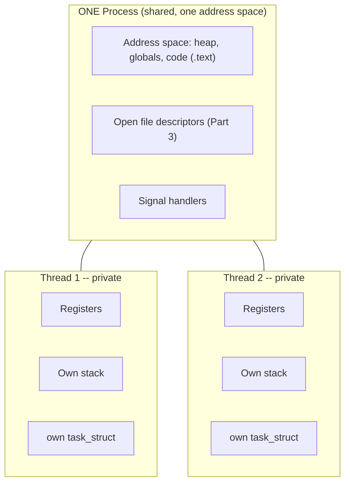

# PART 2 — Linux Process + Kernel Foundations

## Chapter 2.2 — Thread

### 🧠 One-Sentence Mental Model
> A thread is one independent instruction stream living inside a process — and the entire "threads are cheap" story comes down to one fact: threads share almost everything, and only need their own registers, stack, and scheduling bookkeeping.

### 🧒 Explain Like I'm Five
If the process is the restaurant kitchen, a thread is one cook. Multiple cooks in the same kitchen share the same walk-in fridge (heap), the same pantry (global variables), the same delivery entrance (file descriptors) — but each cook has their own two hands and their own personal cutting board (registers and stack) that they don't hand off to another cook mid-task. Adding a second cook to an existing kitchen is cheap — the fridge is already stocked, the pantry's already there. Opening a whole *second* kitchen across town (a new process) means building a new fridge, a new pantry, everything from scratch.

### 🌍 Real-World Analogy
Think of a large open-plan office (the process) with several employees (threads) working at their own desks. Every employee can walk to the shared filing cabinet (heap) and shared supply closet (globals) whenever they need to — no permission required, no copying. But each employee has their own personal notepad (stack) where they jot down what they're currently working on, and their own current train of thought (registers/program counter) that nobody else can read or interrupt mid-sentence. If the office needs a new employee, HR just adds a desk — cheap. If the company needs a whole new office branch, that's a real, expensive undertaking (a new process).

### ❓ The Problem
Chapter 2.1 established that a process can own *multiple* `task_struct`s. This chapter answers the two questions that naturally follow: **exactly what do those `task_struct`s share, and exactly what stays private to each one** — and **why does that specific split make threads so much cheaper to create than processes?**

### 🔥 Why This Problem Matters
Every concurrency strategy from Part 4 onward (thread-per-connection, thread pools, worker threads feeding an event loop) lives or dies on this shared/private split. Shared heap memory means threads can pass data to each other with zero copying — genuinely fast — but it also means two threads can corrupt each other's data if they touch the same memory without coordination, which is the entire reason Part 27 (locks, atomics, memory ordering) has to exist. Understanding precisely what's shared is the prerequisite for understanding precisely what needs protecting.

### 🕰 Historical Context
For a long time, Unix processes had no in-kernel notion of "thread" at all — user-space threading libraries simulated concurrency by manually swapping stacks within a single process, invisible to the kernel scheduler, which could only ever schedule one such "green thread" per process onto a CPU at a time — no real parallelism across cores. Native kernel threads (the kernel scheduler directly aware of, and able to run in parallel, multiple execution streams within one process) arrived later specifically to let multi-core hardware actually parallelize work within a single program — this is the direct ancestor of `std::thread` and POSIX `pthread_create()` today.

### 💡 The Naive Solution
Assume "thread" and "process" differ only in some vague sense of "lighter weight," without a precise account of *what specifically* is lighter.

### ❌ Why the Naive Solution Fails
Without the precise shared/private list, you can't answer real, consequential questions: "can Thread A see a variable that Thread B just allocated on the heap?" (Yes — same process, same heap.) "Can Thread A see Thread B's local variables?" (No — those live on Thread B's *own* stack, private.) "If Thread A closes a file descriptor, does Thread B lose access to it too?" (Yes — file descriptors are a process-level resource, shared by every thread in that process.) Vague intuition gets these wrong often enough to cause real, hard-to-debug concurrency bugs.

### ✅ The Better Solution
Memorize the split precisely, once, as a fixed table — not a feeling.

### 🧠 Core Concept
> **Everything that lives in the process's address space (heap, globals, code, open file descriptors, signal handlers) is shared automatically by every thread in that process. Everything that describes "where am I right now, and what's my own private call history" (registers, stack, and the `task_struct` itself) is private per thread.**

### 📐 Deep Technical Explanation

**The precise shared/private table:**

| Shared across all threads in a process | Private to each individual thread |
|---|---|
| Heap memory (`malloc`/`new`) | Registers (Part 1 Ch 1.2) |
| Global/static variables | Its own stack (a separate memory region) |
| Code (`.text` segment) | `task_struct.saved_ctx` (Part 1's save/restore field) |
| Open file descriptors (Part 3) | Thread-local storage (`thread_local` in C++) |
| Signal handlers (process-wide by default) | Thread ID, scheduling priority |
| The page table / address space itself | — |

**Why this exact split makes threads cheap:** creating a new thread means the kernel allocates a new `task_struct` and a new (comparatively small, a few MB) stack region — and that's it. It does **not** need to build a new page table, does **not** need to set up Copy-On-Write sharing (Chapter 2.1), does **not** need to duplicate file descriptor tables. It's handed a pointer to the *existing* process's already-built address space and immediately shares it. This is the mechanical reason thread creation is measured in microseconds while process creation (even with `fork()`'s COW laziness) is measurably more expensive — there is strictly less kernel bookkeeping to set up.

**The Linux mechanism underneath `std::thread`:** both process creation and thread creation ultimately go through the same underlying syscall, `clone()`, which takes a set of flags controlling *exactly which resources the new `task_struct` should share* with its creator:

```c
// heavily simplified conceptual view of what creating a thread does under the hood
clone(CLONE_VM | CLONE_FILES | CLONE_SIGHAND | ..., child_stack, ...);
//     ^^^^^^^^   ^^^^^^^^^^^   ^^^^^^^^^^^^^
//     share the  share the    share signal
//     address    file descr.  handlers
//     space      table

// vs. what fork() effectively does:
clone(SIGCHLD, 0, ...);   // NONE of those sharing flags set -- everything gets its own copy
```

`CLONE_VM` is the single most important flag here — it's the literal kernel switch that says "don't build a new address space, point this new `task_struct` at the existing one." This is not a metaphor or a simplification for teaching purposes — it is genuinely the exact mechanism; `pthread_create()` (and therefore `std::thread` underneath it) calls `clone()` with this flag set.

### 🏗 Architecture



**How to read this diagram:** the top box is drawn once, because there is only one of it — every thread inside this process reaches into the *exact same* heap, the *exact same* file descriptor table, no copying, no translation needed. The two lower boxes are drawn separately and are genuinely separate — Thread 1 writing to its own stack has zero effect on Thread 2's stack, because they occupy different memory regions entirely, even though both regions live inside the same overall address space (Chapter 2.3 will place these stacks precisely within that address space's layout).

### 🔌 Code

```cpp
#include <thread>
#include <vector>

int shared_counter = 0;   // lives in the DATA segment -- shared by every thread

void worker(int id) {
    int local_variable = id * 10;   // lives on THIS thread's OWN stack -- private
    shared_counter++;               // touches SHARED memory -- a real race condition here!
}

int main() {
    std::thread t1(worker, 1);
    std::thread t2(worker, 2);   // t1 and t2 share this process's heap/globals automatically
    t1.join();
    t2.join();
}
```

**Why `shared_counter++` is dangerous here, precisely:** because it touches memory both threads can reach, and `++` is not a single atomic CPU operation (it's read-modify-write, several instructions) — if both threads execute it "at the same time" (interleaved across cores, or interrupted mid-sequence by a context switch, Chapter 2.7), the final value can be wrong. This is not a hypothetical — it is the direct, practical consequence of this chapter's shared-memory fact, and it's exactly the problem Part 27 exists to solve with locks and atomics.

### ❌ Common Misconceptions
- ❌ **"Threads are a completely different kind of kernel object than processes."** — On Linux, they're both `task_struct`s created via the same `clone()` syscall, differing only in *which sharing flags* were set. There is no separate "thread" object distinct from a process at the kernel's lowest level.
- ❌ **"A thread has its own copy of global variables."** — No — global/static variables are shared, exactly like the heap. Only stack-local variables and registers are private per thread.
- ❌ **"Closing a file descriptor in one thread only affects that thread."** — File descriptors are process-level, shared by every thread; closing one in Thread A makes it invalid for Thread B too, immediately.
- ❌ **"Thread creation is 'basically free.'"** — It's dramatically cheaper than process creation, but still real: allocating a `task_struct` and a stack region, registering with the scheduler — genuinely fast (microseconds), but not literally zero cost, which is exactly why thread *pools* (Part 26) exist rather than spawning a fresh thread per tiny unit of work.

### 🧙 Wizard Insight
The shared/private table in this chapter is the single most load-bearing piece of knowledge for everything Part 27 (locks, atomics, memory ordering, false sharing) will build on. Every concurrency bug you will ever debug in multithreaded C++ code is, underneath, a story about code that assumed something in the "private" column was actually shared, or forgot that something in the "shared" column genuinely is — and needed protecting. Internalizing this table now, before any of Part 27's mechanisms exist in your vocabulary, is what will make those mechanisms feel like *obvious* solutions to a *precise* problem, rather than arbitrary incantations.

### 🧠 Quiz
**Q1.** Two threads in the same process each declare `int x = 5;` as a local variable inside their own function. Do they see each other's `x`?
<details><summary>Answer</summary>No — each thread's local variables live on that thread's own private stack; there are two completely independent `x` variables at two different memory addresses.</details>

**Q2.** What's the one `clone()` flag most responsible for making thread creation cheap, and what does it do?
<details><summary>Answer</summary><code>CLONE_VM</code> — it tells the kernel to point the new task_struct at the EXISTING address space instead of building a new one, skipping the page-table setup that process creation requires.</details>

**Q3.** Why is `shared_counter++` from two threads a real bug, not just a theoretical concern?
<details><summary>Answer</summary>Because the increment is actually several CPU instructions (read, modify, write), not one atomic step — if two threads' instructions interleave (across cores, or via a context switch mid-sequence), one thread's update can be lost, producing a final count lower than expected. This is a genuine, reproducible race condition.</details>

### 📌 Short Notes (Quick Reference)
- Threads share: heap, globals, code, open file descriptors, signal handlers, the address space itself. Threads keep private: registers, their own stack, `task_struct.saved_ctx`, thread-local storage.
- On Linux, threads and processes are both created via `clone()` — the difference is entirely which sharing flags are set (`CLONE_VM`, `CLONE_FILES`, etc.); there's no separate kernel "thread" object.
- `CLONE_VM` is the specific flag that skips building a new address space — the mechanical reason thread creation is cheap relative to process creation.
- Shared mutable memory (like `shared_counter`) accessed from multiple threads without coordination is a real race condition, not a theoretical one — the direct motivation for Part 27.

### 🔗 What This Connects To Next
**Previous:** Part 2, Chapter 2.1 — Process
**Current:** Part 2, Chapter 2.2 — Thread
**Next:** Part 2, Chapter 2.3 — Virtual Memory (why every process's address space is a convenient lie the MMU makes real, and where a thread's private stack actually sits within it)
