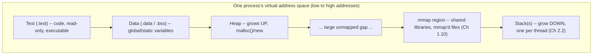

# PART 2 — Linux Process + Kernel Foundations

## Chapter 2.3 — Virtual Memory

*(The mechanism — TLB, page tables, page faults — was fully built in Part 1's Flow 1/2. This chapter is not a repeat of that mechanism; it answers the question Part 1 deliberately deferred: **why** virtual memory exists at all, and what a real process's address space is actually shaped like.)*

### 🧠 One-Sentence Mental Model
> Every process believes it owns the entire address space alone, from address zero to the architecture's maximum — a convenient, load-bearing lie that the MMU (Part 1) makes real enough to safely program against.

### 🧒 Explain Like I'm Five
Imagine every kid in a huge apartment building is told "you have the entire building to yourself — apartment 1 through the penthouse, all of it is yours." Obviously that can't literally be true for everyone at once. But there's a magic doorman (the MMU) who, whenever a kid walks through *their own* front door, secretly teleports them to whatever real, actual room has been assigned to them — different kids get teleported to completely different real rooms, even though they all believe they're walking into "their" building's ground floor. Nobody ever bumps into another kid's stuff, and nobody has to know or care which real room they actually ended up in.

### 🌍 Real-World Analogy
It's like every hotel guest being given room number "101" on their key card, no matter which actual physical room they're staying in — the front desk (the MMU/page tables) maintains the real mapping from "guest's room 101" to "actual physical room 847" privately, and swaps that mapping out completely when a different guest checks in later and is also told they're in "room 101." Every guest's experience of "my room, 101" is identical and simple; the actual physical building underneath can be reorganized, rooms can be reassigned, without any guest's key card ever needing to change.

### ❓ The Problem
Part 1 showed *how* a virtual address gets translated to a physical one (TLB, page-table walker, the whole Flow 1 sequence) in exhaustive mechanical detail. What it didn't explain is **why any of this exists at all** — why not just let every program address real, physical RAM directly, the way things worked on many early, simpler computing systems?

### 🔥 Why This Problem Matters
Without virtual memory, every running program would need to know, and negotiate for, real physical addresses — two programs could never both assume they start at address zero, a buggy program could trivially stomp on another program's or even the kernel's memory, and there'd be no way to give a process "more memory than physically exists" via lazy allocation. Virtual memory is the single piece of infrastructure that makes multi-process, multi-user, memory-safe computing possible at all — everything from Part 3 onward (file descriptors being per-process, isolated address spaces enabling safe concurrent servers) quietly depends on it.

### 🕰 Historical Context
Early computers ran one program at a time, with that program addressing physical memory directly — simple, but it meant no isolation and no ability to run multiple programs "at once" without them actively cooperating to avoid stepping on each other's memory. As timesharing systems emerged (1960s-70s), the need to run multiple untrusted or independently-written programs simultaneously, safely, drove the development of hardware-assisted virtual memory — a dedicated piece of silicon (the MMU, Part 1) whose entire job became maintaining this illusion cheaply enough to be practical at real program speeds.

### 💡 The Naive Solution
Let every process address physical RAM directly, and rely on programs being well-behaved and coordinating who uses which addresses.

### ❌ Why the Naive Solution Fails
It fails on three independent fronts simultaneously, which is exactly why virtual memory solves three problems at once rather than just one:
1. **No isolation** — any process could read or corrupt any other process's memory, or the kernel's own memory, with a single stray pointer.
2. **No addressing simplicity** — a compiler could never assume a fixed starting address for a program, because that address might already be in use by whatever else happens to be running.
3. **No overcommit** — every byte a process might ever touch would need to be physically backed by real RAM immediately, with no way to lazily allocate or share.

### ✅ The Better Solution
Give every process its own private virtual address space, translated to physical addresses by dedicated hardware (Part 1's MMU/TLB/page-table walker), managed by the kernel. This is virtual memory — solving isolation, addressing simplicity, and overcommit simultaneously, as one mechanism.

### 🧠 Core Concept
> **Virtual memory exists for three independent, equally load-bearing reasons: isolation (processes can't touch each other's memory), addressing simplicity (every program can assume the same starting layout), and overcommit/laziness (memory can be promised without being immediately, physically backed) — not merely "because the hardware supports it."**

### 📐 Deep Technical Explanation

**Reason 1 — Isolation, precisely:** process A's virtual pointer `0x1000` and process B's virtual pointer `0x1000` are translated by two *entirely separate* page tables (each process has its own, pointed to by its own `CR3` value — Part 1's static map, Group B) — they resolve to *completely different physical frames*, or one might not even be mapped at all. There is no instruction, no pointer arithmetic, no bug in process A's code that can make it touch process B's physical frames, because the translation step (Part 1's Flow 1) simply never produces B's addresses from A's page table. This is a hardware-enforced guarantee, not a software convention that a buggy program could bypass.

**Reason 2 — Addressing simplicity, precisely:** because every process gets its *own* address space, a compiler and linker can bake in fixed virtual addresses (or, with modern position-independent executables, a consistent relative layout) for a program's code and data, without knowing or caring what else is running on the machine, how much physical RAM exists, or where in physical RAM anything actually ends up. The complexity of "where does this actually live in real RAM" is fully absorbed by the MMU and kernel, invisible to the compiled program.

**Reason 3 — Overcommit and laziness, precisely:** this is Part 1's Flow 2 worked example (`int x = 10;`, first touch of a fresh stack page), generalized. A process can be handed a huge virtual address range — a large `malloc`, or the entire theoretical stack/heap growth room — with **zero physical RAM allocated for any of it** until a specific page is actually touched, triggering the demand-zero page fault mechanism Part 1 already built in full mechanical detail. This is why `malloc(1<<30)` (a gigabyte) can return successfully in nanoseconds — no gigabyte of physical RAM was actually reserved at that moment, only a gigabyte of *virtual address range* was reserved, a bookkeeping-only operation.

### 🏗 The Layout of One Process's Address Space

**How to read this diagram:** this is the concrete, physical shape of "the box" from Chapter 2.1's process diagram, filled in. Every process, when it starts, gets roughly this layout: code first (fixed size, set at compile time), then global data, then a heap that can grow, a large gap of genuinely unmapped address space, then the region used for shared libraries and any `mmap()`ed files (Part 1 Chapter 1.10), and finally the stack (or, in a multithreaded process, *stacks*, Chapter 2.2 — each thread gets its own, typically carved out of this upper region).

**Why the heap grows up and the stack grows down, precisely:** they are deliberately placed at opposite ends of a large unmapped gap so that neither one has a hard-coded maximum size imposed by the other's starting position — each can keep growing into the shared gap until they'd actually collide, at which point the kernel refuses further growth. A stack that grows into unmapped territory that turns out to actually be heap-claimed memory (or vice versa) is precisely what a **stack overflow** (the classic C/C++ bug, not the website) or a heap-corruption-adjacent crash looks like at this layout level.

### ❌ Common Misconceptions
- ❌ **"Virtual memory and swap are the same thing."** — Virtual memory is the *addressing scheme itself* — every process gets its own translated address space — and it exists and matters even on a machine with zero swap space configured. Swap is one specific *policy* for handling memory pressure (writing anonymous, non-file-backed pages out to disk when RAM is full) that virtual memory *enables* but does not require.
- ❌ **"A process's address space corresponds 1:1 with how much physical RAM it's using."** — Because of overcommit and demand-paging, a process can have gigabytes of virtual address space "reserved" while actually consuming only a few physical pages — the two numbers (virtual size vs. resident set size) are genuinely different and both meaningful for different questions.
- ❌ **"Every process starts with a totally empty address space."** — Even before your `main()` runs, the loader has already mapped in your program's code, its data segments, and typically the C++ standard library and other shared libraries via `mmap()` — real address space is claimed before your first line of user code executes.
- ❌ **"The gap between heap and stack is wasted memory."** — It's *unmapped* virtual address space, which costs essentially nothing (no physical RAM, no page-table entries for the untouched middle) — it exists specifically to give both the heap and the stack room to grow without a fixed pre-allocated boundary.

### 🧙 Wizard Insight
Once you see virtual memory as solving three separate problems at once — isolation, addressing simplicity, overcommit — a lot of otherwise-mysterious Linux/C++ behavior stops being mysterious. Why can you `malloc()` more memory than your machine physically has, and it "succeeds"? Overcommit. Why does a `fork()`'d child process seem to instantly have its own full copy of a huge parent address space, at negligible cost? Isolation via page tables, laziness via Copy-On-Write (Chapter 2.1). Why do two completely unrelated programs, compiled independently, both get to assume they can use address `0x400000` for their code? Addressing simplicity — because virtual memory means neither of them is looking at real, shared physical RAM at that number regardless.

### 🧠 Quiz
**Q1.** Name the three independent reasons virtual memory exists, without just saying "so programs don't crash the system."

Answer
Isolation (processes can't touch each other's physical memory), addressing simplicity (every program can assume the same starting virtual layout), and overcommit/laziness (memory can be promised without being immediately physically backed, via demand-paging).

**Q2.** True or false: a machine with swap disabled has no virtual memory.

Answer
False. Virtual memory is the addressing/translation scheme itself, which functions fully regardless of whether swap is configured. Swap is a separate memory-pressure policy that virtual memory enables but doesn't require.

**Q3.** Why does the heap grow upward and the stack grow downward, rather than both growing in the same direction?

Answer
They're placed at opposite ends of a large unmapped gap specifically so neither has a fixed maximum size dictated by the other's position — each can grow independently until they would actually collide, at which point growth is refused (the mechanical basis of a stack overflow).

### 📌 Short Notes (Quick Reference)
- Virtual memory exists for three reasons at once: **isolation** (separate page tables per process), **addressing simplicity** (every program assumes the same layout), **overcommit/laziness** (demand-paging, Part 1's Flow 2 mechanism).
- Virtual memory ≠ swap. Virtual memory is the addressing scheme; swap is one policy choice it enables, not a requirement.
- A process's address space layout, low to high: code (`.text`) → data (`.data`/`.bss`) → heap (grows up) → unmapped gap → mmap region (shared libs, mmap'd files) → stack(s) (grow down, one per thread).
- Virtual size ≠ physical (resident) memory usage — a process can reserve gigabytes of address space while touching only a few real pages.

### 🔗 What This Connects To Next
**Previous:** Part 2, Chapter 2.2 — Thread
**Current:** Part 2, Chapter 2.3 — Virtual Memory
**Next:** Part 2, Chapter 2.4 — User Space (the hardware-enforced privilege boundary that makes isolation actually stick, not just a page-table convention)
