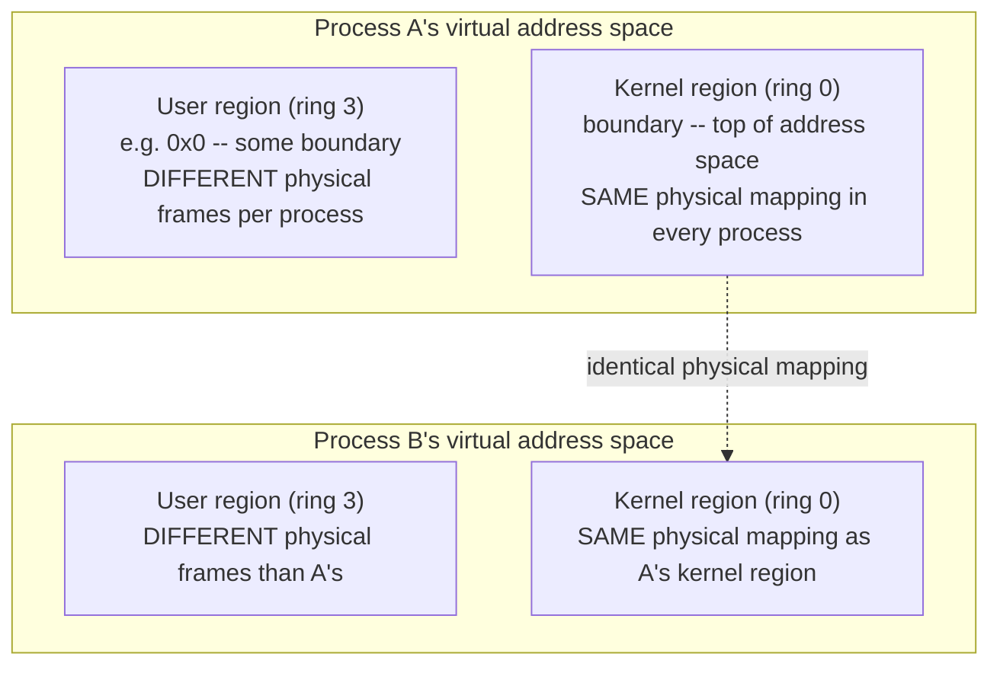

# PART 2 — Linux Process + Kernel Foundations

## Chapter 2.5 — Kernel Space

### 🧠 One-Sentence Mental Model
> Kernel space is the exact same physical CPU and RAM as user space — just running at ring 0 instead of ring 3, and (for real efficiency reasons) mapped into every single process's address space simultaneously, invisible and inaccessible from ring 3 until a syscall raises the privilege level.

### 🧒 Explain Like I'm Five
Imagine the museum from the last chapter has a back office that exists, physically, behind every single exhibit room's wall — the same back office, reachable from anywhere in the building, but there's no door from the exhibit side, only from a special connecting passage staff can use. Visitors are always technically "right next to" the back office, separated by nothing but a wall, but they can never get in unless a guard (a syscall) specifically escorts them through the one real doorway.

### 🌍 Real-World Analogy
Think of a shared apartment building where every single unit has, hidden behind a locked panel in the same spot in every unit, access to the building's central utility room — plumbing, electrical, elevator controls. It's not that each apartment has its *own* utility room; there's genuinely just one, but it's positioned identically, reachable the identical way, from every single apartment — for the simple practical reason that maintenance staff need consistent, fast access from anywhere in the building, without walking all the way to one central location every time.

### ❓ The Problem
Chapter 2.4 established *that* a hard privilege boundary exists. This chapter answers a question that boundary alone doesn't resolve: **when a program needs the kernel's help (Chapter 2.6, next), how does control actually get from "running in ring 3, using process A's address space" to "running in ring 0, doing privileged kernel work" — fast, on the very same thread, without some enormously expensive full context switch to an entirely different process just to service one request?**

### 🔥 Why This Problem Matters
If crossing into the kernel required switching to a completely different address space (Chapter 2.3) — reloading `CR3`, flushing TLB entries (Part 1's Flow 1, Chapter 2.7's cost story) — every single syscall, even a trivial one, would pay the full cost of a cross-process context switch. Given how often real programs make syscalls (every file read, every network operation, every memory allocation past a certain size), that cost would be prohibitive. The design choice this chapter describes is what keeps syscalls fast enough to be usable at all.

### 🕰 Historical Context
Early kernel designs had to solve this same problem in various ways — some used entirely separate address spaces for kernel and user code, paying a real cost on every transition; the now-dominant approach on Linux and similar systems is to carve out a portion of *every* process's virtual address space and map it, identically, to the one true kernel address space — so that entering the kernel never requires an address-space switch at all, only a privilege-level switch, which is far cheaper.

### 💡 The Naive Solution
Give the kernel its own, completely separate address space, and require every syscall to fully switch address spaces (à la Chapter 2.7's cross-process context switch) to get there and back.

### ❌ Why the Naive Solution Fails
Every syscall would then pay the same cost Chapter 2.7 will describe for switching between two *different processes* — a `CR3` reload, and the resulting burst of TLB misses (Part 1's Flow 1) as the new address space's translations get re-populated from scratch. Given that ordinary programs make syscalls extremely frequently (Chapter 2.6 will show numbers), this overhead, paid on *every single syscall*, would make the kernel interface far too slow for practical use.

### ✅ The Better Solution
Reserve a fixed region of virtual address space — say, the upper portion of the address range — in **every** process's page table, and map that region, in every single process, to the *exact same* physical kernel memory. Crossing into the kernel then only requires a privilege-level change (cheap, a hardware mode switch) and a stack switch (Chapter 2.6), never a `CR3` reload.

### 🧠 Core Concept
> **The same fixed region of kernel code and data is mapped into every process's page table simultaneously — invisible and inaccessible from ring 3 (Chapter 2.4's boundary enforces that), but already present in the page tables, ready the instant a syscall raises the privilege level to ring 0. This is why entering the kernel is cheap: no address-space switch is needed, only a privilege switch.**

### 📐 Deep Technical Explanation

**What actually lives in kernel space:** every mechanism Part 1 built by name — the scheduler (Chapter 2.8), the page-fault handler (Part 1's Flow 1/2), device drivers (Part 1 Chapter 1.6), the network stack, the file system/page-cache manager (Part 1's Flow 3/4), interrupt handlers and softirqs (Part 1 Chapter 1.8-1.9). All of it is, mechanically, just ordinary compiled code — nothing about the *instructions themselves* makes them "the kernel." The **only** thing that makes this code special is that it executes with the CPU's current privilege level set to ring 0, giving it access to privileged instructions and hardware that ring-3 code cannot reach (Chapter 2.4).

**The shared mapping, precisely:**

**How to read this diagram:** the lower boxes (user regions) genuinely differ between processes — that's Chapter 2.3's isolation guarantee, unchanged. The upper boxes (kernel regions) are drawn separately per process here only because each process's page table technically has its own set of entries for that range — but every one of those entries, in every process, points at the *exact same physical kernel memory*. The dotted line makes this explicit: there is only one real kernel, mapped redundantly into every process's page table for access-speed reasons, not duplicated in physical RAM.

**Why this specific design choice pays off, mechanically:** when a syscall (Chapter 2.6) fires, the CPU only needs to (a) flip the privilege-level bit from 3 to 0, and (b) switch to a per-thread *kernel stack* (a small, separate stack region, distinct from the user stack, that every thread has reserved specifically for when it's executing kernel code) — it does **not** need to touch `CR3` at all, because the kernel's mappings were already present in the current process's page table the whole time, just inaccessible from ring 3 until the privilege check (Chapter 2.4) passes. No `CR3` reload means no TLB flush, no burst of page-table walks (Part 1's Flow 1) — the fast path Chapter 2.7 will contrast directly against a true cross-process context switch.

### ❌ Common Misconceptions
- ❌ **"The kernel runs in a separate, dedicated address space from every user process."** — On Linux's actual design, the kernel's mapping is present, identically, inside *every* process's own page table — there's no separate "kernel process" with its own distinct address space that the CPU switches into.
- ❌ **"Kernel code is fundamentally different, at the instruction level, from user code."** — It's ordinary compiled machine code; the only distinguishing factor is the CPU's privilege level while it executes, which determines what instructions and hardware it's permitted to touch (Chapter 2.4).
- ❌ **"Since the kernel mapping is present in every process, any process could just read it directly."** — Chapter 2.4's privilege-ring check specifically prevents ring-3 code from accessing pages marked as kernel-only, even though those pages are technically present in the same page table — presence in the table and permission to access are separate, both-enforced conditions.
- ❌ **"Mapping the kernel into every process has no real security implications."** — It does; this exact design is what the Meltdown vulnerability (below) directly exploited, which is why more recent kernels partially retreat from full sharing via KPTI, at a real performance cost.

### 🔐 Security Considerations
This shared kernel mapping is precisely what the **Meltdown** CPU vulnerability (publicly disclosed 2018) exploited. Modern CPUs speculatively execute instructions ahead of confirming permissions, for performance; Meltdown abused a gap where speculative execution could briefly access data from the technically-present-but-supposed-to-be-inaccessible kernel mapping *before* the privilege check fully completed, leaking its contents through a side channel (cache-timing effects, directly related to Part 1 Chapter 1.3's cache mechanics). The mitigation, **KPTI (Kernel Page Table Isolation)**, largely un-shares this mapping — switching to a much more minimal kernel mapping in user-mode page tables, and doing a fuller switch on syscall entry — trading back some of this chapter's performance benefit for closing the vulnerability. This is a genuine, concrete example of a real security fix directly costing a real, measurable performance optimization described earlier in this same chapter.

### 🧙 Wizard Insight
Understanding *why* the kernel is mapped into every process (cheap syscalls, no `CR3` reload) is exactly what makes Meltdown and KPTI comprehensible rather than mysterious — the vulnerability and its fix are both direct, mechanical consequences of the specific design trade-off this chapter describes. When you read about KPTI's measurable performance cost on syscall-heavy workloads in production systems, you now know precisely which optimization got partially rolled back, and why it existed in the first place. This is a recurring shape in real systems engineering: understanding a design's benefit is usually the fastest route to understanding its associated risk.

### 🧠 Quiz
**Q1.** Why doesn't entering the kernel via a syscall require a `CR3` reload?

Answer
Because the kernel's code and data are already mapped into the CURRENT process's page table (identically in every process) — a syscall only needs to change the privilege level and switch to a per-thread kernel stack, not switch address spaces.

**Q2.** What, specifically, makes kernel code "kernel code" rather than ordinary code?

Answer
Nothing about the instructions themselves — it's the CPU's privilege level (ring 0) while that code executes that grants it access to privileged instructions and hardware; the same bytes of machine code would be inert or refused if somehow executed at ring 3.

**Q3.** What did the Meltdown vulnerability exploit, and what design choice from this chapter made it possible?

Answer
It exploited speculative execution briefly accessing the kernel's mapping (present in every process's page table for syscall-speed reasons) before the privilege check fully completed, leaking data via a cache-timing side channel. It was possible specifically because the kernel is mapped into every process's address space, the exact design choice this chapter explains the benefit of.

### 📌 Short Notes (Quick Reference)
- Kernel space = same CPU/RAM as user space, running at ring 0, with a fixed region mapped identically into EVERY process's page table.
- This shared mapping is why syscalls are cheap: only a privilege-level switch + kernel-stack switch is needed, no `CR3` reload, no TLB flush (contrast with Chapter 2.7's cross-process switch cost).
- Kernel code is ordinary machine code — its only special property is executing at ring 0, which the hardware (Chapter 2.4) uses to gate access to privileged instructions/hardware.
- Meltdown exploited this exact shared mapping via speculative execution; KPTI's fix trades back some of this chapter's performance benefit for security.

### 🔗 What This Connects To Next
**Previous:** Part 2, Chapter 2.4 — User Space
**Current:** Part 2, Chapter 2.5 — Kernel Space
**Next:** Part 2, Chapter 2.6 — System Calls (the actual mechanism that performs this ring 3 → ring 0 crossing, start to finish)
