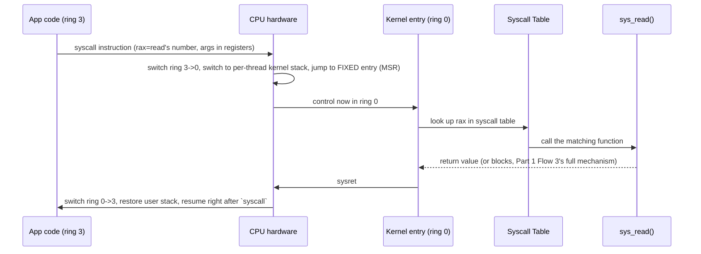

# PART 2 — Linux Process + Kernel Foundations

## Chapter 2.6 — System Calls

*(Referenced constantly since Chapter 0.1 — this chapter is where the mechanism finally gets built, start to finish, using every piece Chapters 2.4 and 2.5 just put in place.)*

### 🧠 One-Sentence Mental Model
> A syscall is a single, deliberately-designed CPU instruction whose entire purpose is safely and efficiently crossing the ring 3 → ring 0 boundary — the one sanctioned door between user space and kernel space, and genuinely more expensive than an ordinary function call because it does real, physical privilege-transition work.

### 🧒 Explain Like I'm Five
Remember the museum with the electrified rope around the restricted areas? A syscall is like pressing a special, official "request staff assistance" button mounted right at the rope line. Pressing it doesn't teleport you past the rope yourself — it summons an actual staff member (the kernel) who is allowed past the rope, tells them exactly what you need done, waits while they go do it on your behalf, and then they come back and report the result to you, still standing on the visitor side the whole time.

### 🌍 Real-World Analogy
It's like calling a bank's customer service line instead of walking into the vault yourself. You (user-space code) dial a specific, well-known number (the `syscall` instruction) and state your request in a very particular format (arguments in specific registers, by convention). The person who answers (the kernel's syscall entry code) looks up which specific department handles your kind of request (the syscall table), routes you there, that department does the actual privileged work (accessing the vault, i.e., privileged kernel operations), and then the call ends and you're back to your ordinary day, with the result of your request in hand.

### ❓ The Problem
Chapter 2.4 established the hard privilege boundary. Chapter 2.5 established that kernel code is already mapped into every process, ready to go. Neither chapter, on its own, explains the actual *mechanism* — what specific action does a C++ program take, and what does the CPU hardware specifically do in response, to get from "I want the kernel to read this file for me" to "the kernel is now actually running, in ring 0, doing that work"?

### 🔥 Why This Problem Matters
Every single I/O operation this entire course cares about — `read()`, `write()`, `send()`, `recv()`, `open()`, `mmap()` — ultimately goes through exactly this mechanism. Understanding its real cost (not "it's basically free," not "it's incredibly slow," but a specific, measurable overhead) is the direct, numeric justification for one of the biggest ideas later in this course: io_uring's entire reason for existing (Part 14) is reducing how many times this expensive mechanism has to be invoked for a given amount of I/O work.

### 🕰 Historical Context
Older x86 systems used a software interrupt instruction (`int 0x80`) to trigger the ring transition — a general-purpose interrupt mechanism (Part 1 Chapter 1.8's machinery) repurposed for this specific job, which worked but wasn't optimized for it. Later x86-64 systems introduced dedicated `syscall`/`sysret` instructions, purpose-built for exactly this transition, using a special CPU register (an MSR, Model-Specific Register) configured once at boot to point directly at the kernel's syscall entry point — skipping the more general (and slower) interrupt-descriptor-table lookup that `int 0x80` required for every single call.

### 💡 The Naive Solution
Imagine syscalls could just be ordinary function calls — the CPU jumps to kernel code the same way it jumps to any library function, no privilege change involved.

### ❌ Why the Naive Solution Fails
If entering "kernel code" were just an ordinary jump, with no hardware privilege check, then Chapter 2.4's entire safety guarantee would be fiction — any code could "call" its way into privileged operations by jumping to the right address, with nothing stopping it. The privilege transition has to be a *real*, hardware-verified event, not something that trusts the calling code's intentions.

### ✅ The Better Solution
A dedicated instruction, specifically designed to atomically raise the privilege level, switch to a safe kernel-controlled stack, and jump to a *fixed, kernel-chosen* entry point — never an address the calling code gets to choose. This is exactly what `syscall` does.

### 🧠 Core Concept
> **`read()`, `write()`, and every other "system call" your C++ code invokes is a thin library wrapper that places arguments into specific registers and executes ONE hardware instruction (`syscall`), which atomically transitions privilege level, switches to a per-thread kernel stack, and jumps to a fixed kernel entry point — never an address user code controls.**

### 📐 Deep Technical Explanation

**The full mechanism, step by step:**

```c
// your C++ code:
ssize_t n = read(fd, buf, len);
```

```
1. read() is a thin libc WRAPPER -- it does not do the real file-reading
   work itself. It places arguments into specific registers, per the
   OS's defined calling convention (on x86-64 Linux: syscall NUMBER
   in rax, arguments in rdi, rsi, rdx, r10, r8, r9 in order), then
   executes exactly ONE special instruction: `syscall`.

2. [HARDWARE] The `syscall` instruction is purpose-built to:
   a. atomically switch the CPU's privilege level from ring 3 to ring 0
      (Chapter 2.4's boundary, crossed through the one sanctioned door)
   b. switch from the CURRENT USER STACK to a PER-THREAD KERNEL STACK
      (every thread has TWO stacks: one used while executing user-space
       code, one reserved purely for when it's executing kernel code --
       this separation matters because the kernel cannot safely trust
       the user stack's contents or even its validity)
   c. jump to a FIXED kernel entry point, read from a special MSR
      register configured ONCE at boot time -- NOT looked up per-call,
      and critically, NOT an address the calling user code specifies
      (this is exactly what prevents user code from directing execution
       to an arbitrary, attacker-chosen kernel address)

3. [SOFTWARE, kernel, now running at ring 0] the kernel's syscall entry
   code reads rax (the syscall NUMBER the wrapper placed there) and
   looks it up in the SYSCALL TABLE -- an array of function pointers,
   one per syscall, built into the kernel at compile time.

4. The corresponding kernel function (sys_read(), matching Part 1's
   Flow 3 exactly, including its full page-cache-check and possible
   blocking behavior) runs, with full ring-0 privilege -- it can now
   touch device registers, other privileged state, whatever the
   specific operation requires.

5. When sys_read() returns, a `sysret` instruction reverses the whole
   transition: switch back to ring 3, restore the user stack, and
   resume the ORIGINAL user code at the exact instruction right after
   the `syscall` instruction -- with the return value placed in rax
   for the calling code (via read()'s wrapper) to pick up.
```



**Why the fixed entry point matters as a security property, not just an implementation detail:** if user code could specify *where* execution jumps to upon entering ring 0, it could potentially jump into the middle of arbitrary kernel code, skipping safety checks entirely. By making the entry point a single, fixed address the kernel itself configured at boot (via that MSR), every single syscall — regardless of which one, regardless of what arguments it carries — is forced through the *same* controlled entry logic first (argument validation, syscall-number lookup), with no way for user code to bypass that gate.

### 💰 Why This Is Expensive Relative to a Normal Function Call

A normal C++ function call is a handful of CPU cycles — push return address, jump, done. A syscall involves genuine, physical privilege-level-transition work: the ring switch itself, the stack switch, and (per Chapter 2.5's security note) additional Meltdown-era mitigation work on modern kernels (KPTI's extra page-table juggling on the transition). Measured in real systems, this typically lands in the **hundreds of nanoseconds** range — not the single-digit-nanosecond range of a plain function call, and not the microsecond-plus range of a full cross-process context switch (Chapter 2.7) either. It's a distinct, intermediate cost tier, and it's paid **every single time** any of `read()`, `write()`, `send()`, `recv()`, or dozens of other common operations is invoked.

**The direct, numeric link to Part 14:** if a program needs to perform, say, 10,000 small I/O operations, and each one requires its own separate syscall, that's 10,000 × (hundreds of nanoseconds) purely in transition overhead — before any actual I/O work happens. This is precisely the arithmetic behind io_uring's core design idea (Part 14): batch many operations into a *single* syscall's worth of submission, amortizing this chapter's fixed transition cost across many operations at once, rather than paying it per operation — the exact same batching principle Part 1 Chapter 1.6 already introduced at the hardware level (many descriptors, one doorbell), now appearing again at the software/syscall layer.

### ❌ Common Misconceptions
- ❌ **"`read()`, `write()`, etc. ARE the syscalls."** — They're thin libc *wrappers* around the actual syscall mechanism; the real work is the `syscall` instruction plus the kernel function it invokes. The wrapper's job is just correctly placing arguments in the right registers and executing that one instruction.
- ❌ **"A syscall is basically as cheap as calling any other function."** — It's meaningfully more expensive due to the real, physical privilege-transition and stack-switch work involved — hundreds of nanoseconds is a real, non-trivial cost at scale, which is exactly why syscall-heavy code paths are a legitimate performance concern worth engineering around (Part 14's entire premise).
- ❌ **"The kernel entry point for a syscall is determined by what the user-space code passes in."** — It's fixed, configured once at boot by the kernel itself via a special register — user code never gets to choose *where* in the kernel execution begins; it only chooses, via the syscall number, *which* pre-registered kernel function eventually gets called after entry.
- ❌ **"Syscalls and interrupts are the same mechanism."** — They're mechanically related (older x86 syscalls literally used the interrupt mechanism, `int 0x80`) but modern `syscall`/`sysret` is a purpose-built, more efficient instruction pair, distinct from the general interrupt-handling path Part 1 Chapter 1.8 described for device-triggered interrupts — both cross into ring 0, but via different specific hardware mechanisms optimized for their different triggering conditions (a deliberate program request vs. an asynchronous hardware event).

### 🧙 Wizard Insight
Every time you see a performance discussion about "syscall overhead" or "why does this I/O-heavy program spend so much time in the kernel," it is, underneath, a conversation about this exact chapter's mechanism, paid over and over. The single most impactful optimization technique for syscall-heavy workloads isn't "make each syscall faster" (there's limited room — the hardware transition cost is what it is) — it's **make fewer of them for the same amount of work**, via batching (`readv`/`writev`, Part 18; `io_uring`, Part 14) or via checking a cache first so the syscall isn't even needed at all (Part 1's page-cache check in Flow 3, which is itself *inside* a syscall, but avoids the even more expensive device round-trip). Recognizing "this is fundamentally a syscall-count problem" rather than "this syscall is slow" is the actual diagnostic skill this chapter is building toward.

### 🧠 Quiz
**Q1.** What does the `read()` function in your C++ code actually do, mechanically, before any real file-reading happens?
<details><summary>Answer</summary>It's a thin libc wrapper that places the syscall number and arguments into specific registers per the calling convention, then executes exactly one `syscall` instruction — it does not perform the file read itself.</details>

**Q2.** Why is the kernel's syscall entry point fixed (set once at boot via an MSR) rather than something user code specifies?
<details><summary>Answer</summary>Security: if user code could choose where execution jumps to upon entering ring 0, it could potentially skip the kernel's own validation/dispatch logic and jump into arbitrary privileged code. A single, kernel-controlled fixed entry point forces every syscall through the same controlled gate first.</details>

**Q3.** Roughly how does syscall cost compare to a normal function call, and why does that difference matter for Part 14 later in this course?
<details><summary>Answer</summary>A syscall costs roughly hundreds of nanoseconds (real privilege-transition and stack-switch work) versus single-digit nanoseconds for an ordinary function call. This matters because performing many small I/O operations as many separate syscalls multiplies that fixed cost — exactly the problem io_uring's batched-submission design (Part 14) exists to solve.</details>

### 📌 Short Notes (Quick Reference)
- A syscall = one hardware instruction (`syscall`) that atomically: switches ring 3→0, switches to a per-thread kernel stack, jumps to a FIXED kernel entry point (set once at boot, never user-chosen).
- Library functions like `read()`/`write()` are thin wrappers — they set up registers (syscall number + args) and execute `syscall`; the kernel then looks the number up in a syscall table and calls the matching function.
- Cost is real: roughly hundreds of nanoseconds per syscall — more than a function call, less than a full cross-process context switch (Chapter 2.7) — the direct numeric justification for io_uring's batching (Part 14).
- The fixed entry point is a security property, not just an implementation detail — it forces every syscall through the same controlled dispatch logic, preventing user code from jumping into arbitrary kernel code.

### 🔗 What This Connects To Next
**Previous:** Part 2, Chapter 2.5 — Kernel Space
**Current:** Part 2, Chapter 2.6 — System Calls
**Next:** Part 2, Chapter 2.7 — Context Switch (what happens when the kernel, now running, decides to hand the CPU to a completely different thread instead of returning to the caller)
