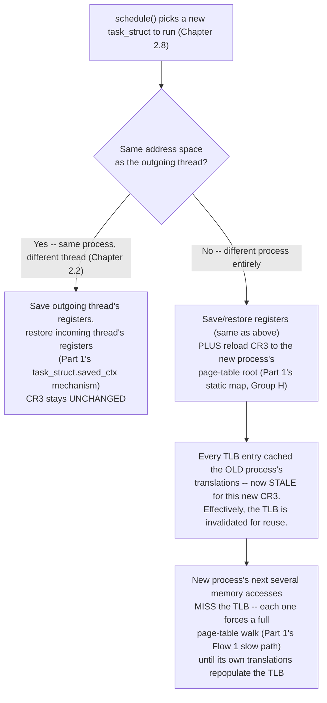

# PART 2 — Linux Process + Kernel Foundations

## Chapter 2.7 — Context Switch

*(Part 1 fully built the register-save/restore mechanism itself, using it repeatedly in Flow 3/4. This chapter adds the piece Part 1 deliberately deferred: the difference between switching to a thread in the SAME process versus a thread in a DIFFERENT process — and precisely why that difference matters, in real, measurable terms.)*

### 🧠 One-Sentence Mental Model
> Switching between two threads of the *same* process is cheap — save and restore registers, nothing more. Switching to a thread of a *different* process is meaningfully more expensive, because it also has to reload `CR3` (Chapter 2.3's page-table root), which invalidates the CPU's cached address translations and forces a burst of expensive re-translation work afterward.

### 🧒 Explain Like I'm Five
Imagine you're a teacher rotating attention between students in the *same* classroom (threads in the same process) — you just turn your head, no big deal, the whole room's already familiar. Now imagine instead you have to walk to a *different school building entirely* (a different process) — you have to physically travel there, and once you arrive, you don't have any of your usual classroom's materials laid out and ready; you have to relocate everything you need from scratch before you can really get to work, even though the "switching your attention" part felt conceptually similar both times.

### 🌍 Real-World Analogy
It's like the difference between switching which browser tab you're looking at (same computer, same browser, instant) versus switching to an entirely different physical computer at a different desk (you have to walk over, and once there, none of your open windows or cached data from the first computer are there — everything has to load fresh). Both are "switching what you're looking at," but one is nearly free and the other has real, physical relocation cost.

### ❓ The Problem
Part 1 showed the *mechanics* of saving and restoring a thread's registers via its `task_struct.saved_ctx` field, used it in the interrupt-driven wake-up chain (Flow 3/4), and even flagged in passing that switching to a different process "also reloads CR3" (Part 1's static map, Group H). But it never explained precisely *why* that extra step is expensive, or what happens as a direct mechanical consequence. This chapter closes that gap.

### 🔥 Why This Problem Matters
"Threads are cheaper than processes for concurrency" is a claim this course has made since Chapter 2.1-2.2, but so far only in terms of *creation* cost. This chapter reveals the *second* half of that story: threads within the same process are also cheaper to **switch between**, repeatedly, for the entire lifetime of a running program — and this repeated, ongoing cost (paid potentially thousands of times per second under heavy scheduling activity) often matters more in aggregate than the one-time creation cost Chapter 2.1-2.2 discussed.

### 🕰 Historical Context
As soon as kernels supported multiple processes sharing a CPU via preemptive scheduling, the cost of switching between them became a real, measured engineering concern — early systems with only process-level concurrency paid this full cost (including address-space switching) on *every* context switch, since there was no cheaper "same address space, different thread" case to distinguish. The introduction of native kernel threads (Chapter 2.2's historical note) specifically created this cheaper switching case as a new possibility — before threads existed as a first-class kernel concept, there was no "same address space" switch to optimize for at all.

### 💡 The Naive Solution
Treat every context switch as fundamentally the same operation, regardless of whether the incoming thread belongs to the same process as the outgoing one or a different one entirely.

### ❌ Why the Naive Solution Fails
It hides a real, and large, cost asymmetry. If you reason about "how many context switches can my system afford per second" without distinguishing same-process from cross-process switches, you'll badly mis-estimate real-world scheduling overhead — a workload dominated by same-process thread switches can sustain a far higher switching rate than one dominated by cross-process switches, for reasons that have nothing to do with how "important" or "large" the work itself is.

### ✅ The Better Solution
Always ask, for any context switch: same address space, or different? The register save/restore cost is identical either way (Part 1's mechanism) — the *additional* cost only appears in the cross-process case, and it's substantial enough to name and reason about explicitly.

### 🧠 Core Concept
> **Every context switch saves and restores registers (Part 1's `task_struct.saved_ctx` mechanism, unconditionally). A context switch to a thread in a DIFFERENT process additionally reloads `CR3` — and because every cached TLB translation (Part 1's Flow 1) was valid only for the OLD address space, this reload effectively invalidates the TLB, forcing the newly-scheduled process to pay for a burst of full page-table walks on its next several memory accesses, until its own translations repopulate the TLB.**

### 📐 Deep Technical Explanation

**The two cases, precisely separated:**

**Why a `CR3` reload specifically breaks the TLB, mechanically:** recall Part 1's Flow 1 — a TLB entry stores a cached translation from a **virtual page number** to a **physical page number**. That translation is only valid *for the address space it was cached under* — process A's virtual address `0x1000` and process B's virtual address `0x1000` are, per Chapter 2.3, completely different physical addresses. The instant `CR3` changes to point at a different process's page table, every existing TLB entry becomes potentially wrong (same virtual number, different actual mapping) — so the hardware treats them as invalid for the new context, and each of them has to be re-derived from scratch, one full page-table walk at a time, the next time each respective virtual address is touched.

**The concrete cost cascade:** this isn't just "one slow operation" — it's a *burst* of slow operations spread across the newly-scheduled process's next several memory accesses, each individually paying Part 1's Flow 1 "TLB miss" cost (a full 4-level page-table walk, up to 4 extra RAM reads, per Part 1's numbers) instead of the fast TLB-hit path. This is precisely why cross-process context switches show up as measurably worse for overall system throughput than same-process thread switches, even though the *register* save/restore step (Part 1's actual mechanism) is identical in both cases — the difference lives entirely in this TLB-invalidation cascade.

**PCID — the modern hardware mitigation:** contemporary CPUs support **Process-Context Identifiers (PCID)** — a small tag attached to each TLB entry recording *which address space* it belongs to. With PCID, switching `CR3` doesn't have to discard the entire TLB — entries tagged for the old process simply stop being *used* (since the CPU now filters by the new PCID), but they remain present and can become valid again instantly if that same process is scheduled back in later, without needing to be re-walked from RAM. This softens the cross-process switching cost described above, but does not eliminate the underlying asymmetry — same-process thread switches still touch no `CR3`/PCID machinery at all, remaining the cheaper case.

### ❌ Common Misconceptions
- ❌ **"All context switches cost the same, since they all 'just' save and restore registers."** — The register save/restore is identical, but a cross-process switch additionally reloads `CR3`, which triggers a real, measurable TLB-invalidation cascade that a same-process thread switch never incurs.
- ❌ **"PCID eliminates the cost difference between thread and process switches."** — It reduces the *TLB-flush* penalty specifically, by avoiding a full discard, but a cross-process switch still involves genuinely more hardware state change than a same-process switch — PCID softens, it doesn't erase, the asymmetry this chapter describes.
- ❌ **"The extra cost of a cross-process switch is paid immediately, during the switch itself."** — Most of it is actually paid *afterward*, spread across the newly-running process's next several memory accesses as they individually hit TLB misses and pay for page-table walks — the switch operation itself is quick; the consequence lingers.
- ❌ **"Context switch cost is purely about CPU cycles spent switching, with no effect on cache behavior."** — Beyond the TLB effect described here, a context switch to genuinely different code/data also tends to evict useful cache lines (Part 1 Chapter 1.3) that the outgoing thread had warmed up, adding yet another layer of "cold start" cost the incoming thread pays — this is sometimes called cache pollution from context switching, a related but distinct cost from the TLB-specific story this chapter focuses on.

### 🧙 Wizard Insight
This chapter is the mechanical, numeric answer to a question every systems engineer eventually asks: "why does my thread-per-connection server handle more connections smoothly than my process-per-connection design, even accounting for the extra memory processes use?" Part of the answer is Chapter 2.1's creation cost — but a large, *ongoing* part of the answer is this chapter's switching cost, paid continuously, every single time the scheduler (Chapter 2.8) rotates between connections. A wizard evaluating any highly-concurrent system design asks not just "how many threads/processes am I creating" but "how often is the scheduler going to be forced into the expensive, cross-process branch of this chapter's diagram, and can I restructure the work to stay in the cheap, same-process branch instead?"

### 🧠 Quiz
**Q1.** What's identical between a same-process thread switch and a cross-process switch, and what's different?

Answer
Identical: saving and restoring the outgoing/incoming thread's registers (Part 1's task_struct.saved_ctx mechanism). Different: a cross-process switch additionally reloads CR3, which invalidates cached TLB translations for the old address space.

**Q2.** Why does reloading `CR3` invalidate TLB entries, mechanically?

Answer
Each TLB entry caches a virtual-to-physical translation valid only for a specific address space. When CR3 changes to a different process's page table, the same virtual addresses now map to entirely different physical frames, so the old cached translations are no longer valid and must be treated as stale.

**Q3.** What does PCID do, and what does it NOT do?

Answer
PCID tags TLB entries with which address space they belong to, so a CR3 switch doesn't require discarding the entire TLB -- entries for other processes just become temporarily unused rather than invalid, and can become valid again instantly if that process is rescheduled. It does NOT eliminate the underlying cost asymmetry between same-process and cross-process switches -- same-process switches still avoid this machinery entirely.

### 📌 Short Notes (Quick Reference)
- Every context switch saves/restores registers via `task_struct.saved_ctx` (Part 1) — this part is identical regardless of same- vs cross-process.
- A cross-process switch ADDITIONALLY reloads `CR3` — this invalidates cached TLB translations from the old address space, forcing a burst of full page-table walks (Part 1's Flow 1 slow path) on the newly-scheduled process's next several memory accesses.
- This is the mechanical, numeric reason "process switches cost more than thread switches" is a real engineering fact, not folklore — and it's a *recurring*, ongoing cost, not just a one-time creation cost (Chapter 2.1-2.2).
- **PCID** tags TLB entries by address space, softening (not eliminating) the cross-process switch penalty by avoiding a full TLB discard.
- Context switching to different code/data also tends to evict useful cache lines (Part 1 Ch 1.3) — a related "cold start" cost beyond the TLB-specific story here.

### 🔗 What This Connects To Next
**Previous:** Part 2, Chapter 2.6 — System Calls
**Current:** Part 2, Chapter 2.7 — Context Switch
**Next:** Part 2, Chapter 2.8 — Scheduler (who actually decides WHEN a context switch happens and WHICH thread gets picked, by what policy)
