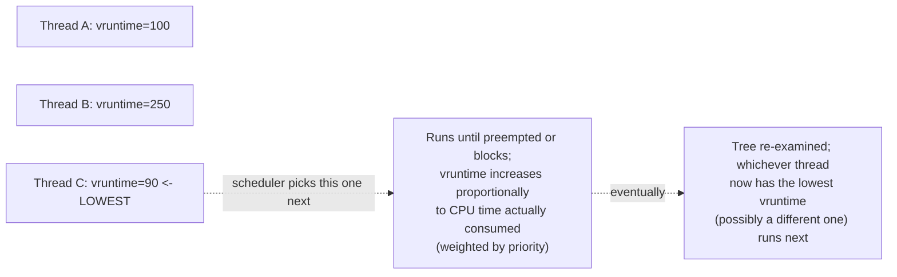

# PART 2 — Linux Process + Kernel Foundations

## Chapter 2.8 — Scheduler

### 🧠 One-Sentence Mental Model
> The scheduler answers exactly one question, over and over, many times per second: "of everything currently READY to run, what runs next, on which core, for how long?" — and Linux's modern default answer is built around continuous fairness (least CPU time received so far), not fixed round-robin time slices or simple priority queues.

### 🧒 Explain Like I'm Five
Imagine a teacher with 30 students all raising their hands at once, wanting attention. A naive teacher might just go in a fixed order every time (round robin), or always pick whoever raised their hand loudest (priority). A genuinely *fair* teacher instead keeps a running mental tally of exactly how much attention each student has already received today, and always calls on whoever has received the *least* so far — constantly rebalancing, never favoring the same kid twice in a row just because they happened to be loud or first in line.

### 🌍 Real-World Analogy
Think of a single checkout lane at a store with a "most-deserving-customer-next" policy instead of strict first-come-first-served: the store clerk keeps a running total of how long each waiting customer has already been served today (across multiple visits), and always serves whoever has the *least* cumulative service time so far. Someone who's barely been served gets bumped to the front even if they arrived later than someone who's already gotten plenty of attention earlier. This constant rebalancing is annoying to describe with a simple queue, but it produces a genuinely fair long-run outcome for everyone.

### ❓ The Problem
Chapter 2.7 explained *how* a context switch physically happens once the decision to switch is made. This chapter answers the question that decision depends on: **given many threads simultaneously READY (Chapter 2.1's state diagram), which one actually gets the CPU next, and for how long, before being interrupted again?**

### 🔥 Why This Problem Matters
Every concurrency strategy in Parts 4-14 ultimately depends on the scheduler's behavior to actually deliver on its promises. A thread-per-connection server (Part 4.8) is only as responsive as the scheduler's fairness across potentially thousands of ready threads. Part 1's entire "Decision 3" nuance (a woken thread is only *eligible*, not *running*) is meaningless without understanding what actual policy governs when that eligible thread finally gets picked — this chapter is where that policy gets named and explained.

### 🕰 Historical Context
Early Unix schedulers used relatively simple priority-based, multi-level feedback queue designs — reasonably effective, but with known fairness pathologies (certain workloads could starve others, or receive disproportionate CPU share under specific patterns). Linux's **Completely Fair Scheduler (CFS)**, introduced in the mid-2000s, reframed the entire problem: instead of managing discrete priority queues and time slices, track each thread's *accumulated* CPU time (weighted by priority) as a single continuously-updated number, and always run whoever's number is lowest. This reframing directly eliminated many of the older fairness pathologies by construction, at the cost of a more complex-sounding (but actually simpler to reason about) core mechanism. (As of very recent kernels, CFS is itself being superseded by **EEVDF**, an evolution of the same fairness-by-accumulated-time idea with refined handling of latency-sensitive threads — the core principle described in this chapter remains the right mental model for either.)

### 💡 The Naive Solution
Give every ready thread a fixed time slice, and rotate through them in a strict, unchanging order (classic round-robin), regardless of priority or how much CPU time each has already consumed.

### ❌ Why the Naive Solution Fails
Pure round-robin treats every thread as equally important, providing no way to express "this thread matters more, give it proportionally more CPU" (priority) — and it doesn't naturally adapt when threads block and unblock at different rates; a thread that blocks frequently (spends little actual CPU time per turn) and a thread that never blocks (uses its full slice every turn) end up rotating through the same fixed schedule despite consuming wildly different amounts of real CPU time over any given period.

### ✅ The Better Solution
Track *actual accumulated CPU time received*, weighted by priority, as a single running number per thread — and always schedule whoever's number is lowest. This adapts automatically: a thread that blocks often naturally accumulates time slowly and gets prioritized when it does become ready again; threads correctly receive CPU proportional to their priority weight over any sufficiently long window, without needing separate bookkeeping for "how long has it been since this thread ran."

### 🧠 Core Concept
> **CFS gives every runnable thread a `vruntime` (virtual runtime) — accumulated CPU time received, weighted by priority — and its scheduling rule is almost embarrassingly simple: always run the READY thread with the LOWEST vruntime.** This single rule, applied continuously, produces long-run fairness without needing fixed time slices or explicit round-robin bookkeeping.

### 📐 Deep Technical Explanation

**The core data structure: per-CPU run queues.** Each CPU core maintains its **own** run queue (Part 1's `RUNQ` from the static map — genuinely one per core in a real multi-core system) rather than one global queue every core would contend for on every scheduling decision:

```c
struct rq {                      // simplified, one per CPU core
    struct task_struct *current; // what's running on THIS core right now
    struct rb_tree ready_tasks;  // CFS: a red-black tree, ordered by vruntime
};
```

The choice of a **red-black tree** (a self-balancing binary search tree) specifically enables "find the thread with the lowest vruntime" to be a fast, `O(log n)` operation, even with a large number of ready threads — this directly echoes Part 1's recurring "O(1) vs O(N) vs O(ready)" theme (first introduced conceptually all the way back in the original course prompt's motivation for epoll over select/poll) — here applied to scheduler internals rather than I/O readiness notification, but the same underlying algorithmic concern.



**How to read this diagram:** at any given instant, the scheduler doesn't need any concept of "whose turn is it in the rotation" — it just asks the tree "who has the lowest vruntime right now" and runs them. As that thread runs, its own vruntime climbs (it's receiving CPU time), so eventually some *other* thread's already-lower vruntime makes them the new answer to that same question. Priority is implemented as a *weight* on how fast vruntime climbs — a higher-priority thread's vruntime climbs more slowly per unit of real CPU time received, meaning it can "afford" to run more often (in real wall-clock terms) before its vruntime catches up to lower-priority threads' — exactly the mechanism that makes "higher priority = proportionally more CPU share" fall naturally out of one simple comparison rule.

**Preemption — the three distinct ways a running thread stops running:**
1. **Voluntary:** the thread itself calls a blocking operation (Chapter 0.5, Part 1's Flow 3/4) — it invokes `schedule()` as part of that blocking syscall's own code path, deliberately giving up the CPU because it has nothing useful to do until some event occurs.
2. **Involuntary, timer-driven:** a hardware timer device fires a periodic interrupt (this is, mechanically, exactly Part 1 Chapter 1.8's interrupt machinery — the exact same MSI/IDT/ISR sequence Part 1 traced for a NIC or SSD, just sourced from a timer device instead). The kernel's timer interrupt handler checks whether the currently-running thread has consumed enough of its fair share relative to others waiting, and if so, marks it for preemption at the next safe opportunity.
3. **Priority/wakeup-driven:** a higher-priority (or, under CFS, simply now-lower-vruntime) thread just transitioned to READY — for instance, via `wake_up()` in Part 1's Flow 3 interrupt chain — and the scheduler's policy decides this newly-ready thread should preempt whatever's currently running immediately, rather than waiting for the next timer tick.

**The direct connection back to Part 1's "Decision 3":** Part 1's interrupt-chain trace flagged that after `wake_up()` marks a thread READY, *when* it actually resumes running is "a real policy decision" — this chapter is where that policy is finally named: it's precisely this vruntime comparison (plus priority-driven immediate preemption in case 3 above). A thread that was just woken doesn't automatically jump the queue — unless its priority/vruntime genuinely warrants immediate preemption under the rules just described.

### ❌ Common Misconceptions
- ❌ **"CFS uses fixed time slices, like classic round-robin."** — It doesn't allocate fixed time slices at all; it continuously compares accumulated (weighted) vruntime and always favors whoever has received the least so far — the "how long until the next decision" emerges from this comparison dynamically, not from a pre-set slice length.
- ❌ **"Higher `nice` priority means a thread gets scheduled MORE often in a fixed rotation."** — Priority is implemented as a *weight* on how fast vruntime accumulates; a higher-priority thread's vruntime grows more slowly per unit of real CPU time, which — through the same "lowest vruntime wins" rule — naturally results in it receiving a larger proportional CPU share over time, without any separate rotation-frequency mechanism.
- ❌ **"A thread that just got `wake_up()`'d always runs immediately."** — It becomes READY (eligible), full stop; whether it actually preempts the current thread immediately or waits depends on the scheduler's real policy (its vruntime/priority relative to what's currently running) — exactly Part 1's "Decision 3" nuance, now explained.
- ❌ **"The scheduler uses one single global queue for the whole machine."** — Modern Linux uses per-CPU-core run queues specifically to avoid the lock contention a single global queue would create under heavy multi-core scheduling activity; load balancing between cores' queues is a separate, additional mechanism layered on top.

### 🔐 Real-Time Scheduling Classes — Stepping Outside CFS Entirely
For genuinely latency-critical work, Linux offers scheduling classes (`SCHED_FIFO`, `SCHED_RR`) that exist **outside** CFS's fairness system entirely — any thread in one of these classes always preempts any ordinary CFS thread, regardless of vruntime, the instant it becomes ready. This is the concrete mechanism behind systems engineering advice like "use real-time priority for latency-sensitive threads" — it's not a suggestion to the fairness algorithm, it's a genuinely different scheduling policy that bypasses vruntime comparison altogether for that thread.

### 🧙 Wizard Insight
The moment you internalize "the scheduler always runs whoever has received the least weighted CPU time so far," a lot of Linux scheduling behavior that looks mysterious from the outside becomes predictable from first principles. Why does a CPU-bound thread that's been running for a while suddenly get interrupted even without blocking? Its vruntime caught up to and passed some other ready thread's. Why does `nice`-ing a process actually change its real-world CPU share smoothly, rather than in discrete jumps? Because priority is a continuous weight on vruntime accumulation, not a discrete queue-position change. And why doesn't a freshly-woken thread from Part 1's interrupt chain always preempt instantly? Because "eligible" (READY) and "scheduled now" are governed by this chapter's comparison rule, not by the interrupt itself.

### 🧠 Quiz
**Q1.** What is `vruntime`, and what's the scheduler's core rule regarding it?
<details><summary>Answer</summary>Vruntime is a thread's accumulated CPU time received, weighted by priority. The scheduler's core rule: always run the READY thread with the lowest vruntime.</details>

**Q2.** How does thread priority (`nice` value) actually influence scheduling under CFS, mechanically?
<details><summary>Answer</summary>Priority acts as a weight on how fast a thread's vruntime accumulates as it runs -- a higher-priority thread's vruntime grows more slowly per unit of real CPU time, so under the "lowest vruntime wins" rule it naturally ends up scheduled proportionally more often over time.</details>

**Q3.** Name the three distinct ways a running thread stops running (preemption sources).
<details><summary>Answer</summary>Voluntary (the thread blocks and calls schedule() itself), involuntary/timer-driven (a periodic timer interrupt triggers a fairness check), and priority/wakeup-driven (a newly-READY thread's priority/vruntime warrants immediate preemption of the currently-running thread).</details>

### 📌 Short Notes (Quick Reference)
- Scheduler's core CFS rule: always run the READY thread with the **lowest vruntime** (accumulated, priority-weighted CPU time received) — fairness by construction, not fixed time slices or round-robin.
- Per-CPU-core run queues (a red-black tree, ordered by vruntime) avoid global-lock contention; "find lowest vruntime" is O(log n).
- Priority = a weight on how fast vruntime accumulates, not a separate rotation-frequency mechanism — higher priority naturally yields more CPU share over time via the same one comparison rule.
- Three preemption sources: voluntary (blocking), timer-driven (periodic interrupt, same MSI/IDT/ISR machinery as Part 1's device interrupts), priority/wakeup-driven.
- This chapter is the direct answer to Part 1's "Decision 3" nuance: a `wake_up()`'d thread is only READY; whether/when it actually runs is this exact vruntime/priority policy.
- Real-time classes (`SCHED_FIFO`/`SCHED_RR`) bypass CFS's fairness system entirely for latency-critical threads.

### 🔗 What This Connects To Next
**Previous:** Part 2, Chapter 2.7 — Context Switch
**Current:** Part 2, Chapter 2.8 — Scheduler
**Next:** Part 2, Chapter 2.9 — Sleeping and Waking (the two distinct KINDS of "blocked," and why one of them can survive even `SIGKILL`)
