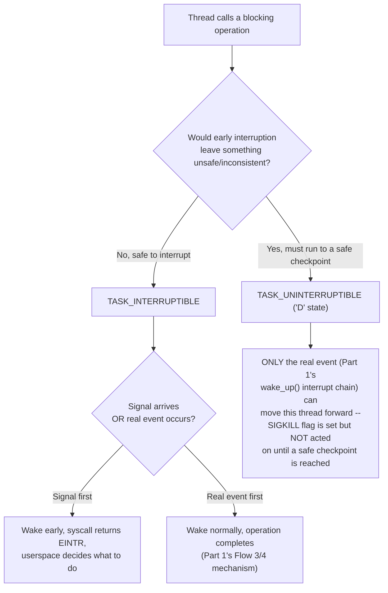

# PART 2 — Linux Process + Kernel Foundations

## Chapter 2.9 — Sleeping and Waking

*(Part 1 fully built the mechanism — `task_struct.state`, wait queues, `wake_up()` — and used it repeatedly in Flow 3/4. This chapter adds the one piece deliberately left out until now: not all "blocked" is the same kind of blocked.)*

### 🧠 One-Sentence Mental Model
> A blocked thread can be in one of two meaningfully different states: one that a signal (like Ctrl-C) can interrupt early, and one that deliberately cannot be interrupted at all — because letting it be interrupted mid-operation would leave kernel data structures in a broken, inconsistent state.

### 🧒 Explain Like I'm Five
Imagine two kids waiting for something. One kid is just waiting for a friend to call — if their mom calls them for dinner in the meantime, they can drop what they're doing and go, no harm done (interruptible). The other kid is in the middle of carefully balancing a tall tower of blocks — if you yank them away mid-balance, the whole tower crashes and now there's a mess to clean up that's worse than if you'd just waited (uninterruptible). Both kids are "waiting," but only one of them can safely be pulled away early.

### 🌍 Real-World Analogy
Think of a surgeon mid-operation versus a receptionist waiting for the phone to ring. The receptionist can be pulled away for something urgent at almost any moment with no real consequence — they'll just pick back up where they left off. The surgeon, mid-incision, absolutely cannot be pulled away the instant something else seems urgent — stopping partway through a delicate step could be actively harmful, worse than whatever the interruption was for. Hospitals design around this: certain phases of certain procedures are treated as genuinely uninterruptible, full stop, regardless of how urgent the outside request seems.

### ❓ The Problem
Part 1's Chapter 0.5 and every Flow 3/4 trace used `TASK_BLOCKED` as if it were one single, uniform state. It isn't. Real kernels need a way to distinguish "this thread is waiting for something and can safely be woken early by an unrelated event, like a signal" from "this thread is mid-operation on something where early wakeup would be actively dangerous to correctness" — and without that distinction, either *all* blocking operations would be un-interruptible (making Ctrl-C occasionally impossible even when it should obviously work) or *all* of them would be interruptible (making certain low-level operations unsafe to abandon partway through).

### 🔥 Why This Problem Matters
This is the exact mechanism behind one of the most confusing, frequently-Googled Linux symptoms: a process that `kill -9` (SIGKILL — supposedly "the unstoppable kill signal") simply refuses to die, sitting in `D` state in `top` forever. Understanding this chapter is the difference between panicking at that symptom and recognizing it immediately as expected, explainable kernel behavior.

### 🕰 Historical Context
Early Unix systems needed a principled way to let interactive users interrupt long-running or hung foreground processes (Ctrl-C, signal delivery) without compromising the kernel's own internal consistency guarantees during operations that genuinely couldn't be safely abandoned partway through — particularly certain disk and (later) network filesystem operations, where a partially-completed low-level operation could leave on-disk or in-kernel state corrupted if abandoned mid-way. The two-state distinction this chapter describes is the direct, still-current answer to that original tension.

### 💡 The Naive Solution
Give every blocked thread exactly one kind of "blocked" state, always interruptible by any pending signal.

### ❌ Why the Naive Solution Fails
Some kernel-level operations are structured as a sequence of steps that assume they'll run to completion once started — abandoning them partway through (because a signal arrived) could leave a device, a buffer, or an on-disk structure in a state the kernel has no defined way to safely unwind from. Making *everything* interruptible would force either unsafe abandonment in these cases, or enormous additional engineering complexity to make every single kernel operation safely resumable/abortable from any point — impractical for operations that are supposed to be brief anyway.

### ✅ The Better Solution
Give the kernel two distinct sleep states, chosen deliberately per operation based on whether early interruption is actually safe for that specific operation.

### 🧠 Core Concept
> **`TASK_INTERRUPTIBLE` is the sleep state most blocking I/O uses — a pending signal CAN wake the thread early, before the real event it was waiting for. `TASK_UNINTERRUPTIBLE` is used specifically when early interruption would be unsafe — this is exactly the "D state" visible in `ps`/`top`, and it cannot be woken by ANY signal, including `SIGKILL`, until the thread reaches a safe point on its own.**

### 📐 Deep Technical Explanation

```c
current->state = TASK_INTERRUPTIBLE;     // most blocking I/O calls use this
// -- while blocked here, if a signal arrives, the kernel CAN wake this
//    thread early, even though the real event (data arriving, Part 1's
//    Flow 3) hasn't happened yet --
// -- the syscall then typically returns EINTR (a specific errno value
//    meaning "interrupted before completion, not a real error") --
// -- userspace code is expected to check for EINTR and decide whether
//    to retry the operation or treat the interruption as meaningful --

current->state = TASK_UNINTERRUPTIBLE;   // used when interruption would be unsafe
// -- e.g., mid-way through a low-level disk I/O operation whose
//    on-disk or in-kernel-buffer state can't be safely abandoned
//    partway through --
// -- NO signal, including SIGKILL, can move this thread out of
//    TASK_BLOCKED early -- it will ONLY transition when the real
//    event (Part 1's wake_up(), Flow 3/4's interrupt-driven chain)
//    actually occurs --
// -- this is EXACTLY the "D state" (uninterruptible sleep, disk wait)
//    visible in `ps`/`top` output --
```

**Why `TASK_UNINTERRUPTIBLE` genuinely refuses even `SIGKILL`, mechanically:** `SIGKILL` is delivered by the kernel setting a flag on the target thread and, for an *interruptible* sleep, actively waking it early specifically so it can notice the pending signal and terminate. For an *uninterruptible* sleep, the kernel doesn't perform that early wake at all — the thread's code path literally never checks for pending signals until it reaches whatever point in its kernel-level operation was designed to be a safe checkpoint. `SIGKILL`'s flag gets set and simply waits, unacted-upon, until that thread naturally reaches a point where it checks — which, if the underlying operation the thread is waiting on (Part 1's Flow 3's SSD interrupt chain, for instance) never completes (a genuinely hung disk, a dead NFS server), can mean the thread waits forever, un-killable, until that underlying condition resolves or the machine reboots.



### ❌ Common Misconceptions
- ❌ **"`kill -9` (`SIGKILL`) can always terminate any process immediately."** — It cannot forcibly wake a thread currently in `TASK_UNINTERRUPTIBLE` sleep; the signal is recorded but not acted upon until that thread's own kernel-level operation reaches a safe checkpoint on its own, which in pathological cases (a genuinely hung device, a dead network filesystem server) may never happen without external intervention.
- ❌ **"A process stuck in `D` state is a bug in the application's own code."** — It's the kernel deliberately refusing early wakeup during a kernel-level operation it has judged unsafe to abandon partway through — the application code itself is typically just blocked on an ordinary-looking syscall, unaware of (and not responsible for) the kernel's internal safety decision.
- ❌ **"`TASK_INTERRUPTIBLE` and `TASK_UNINTERRUPTIBLE` differ only in how 'urgent' the wait is."** — The distinction is about *safety of early abandonment*, not urgency or expected duration — a very brief operation can still be marked uninterruptible if abandoning it partway through would be unsafe, and a very long wait can remain interruptible if there's genuinely nothing unsafe about walking away from it early.
- ❌ **"EINTR means something actually went wrong."** — It specifically means "this blocking call was interrupted by a signal before its real event occurred" — not a failure of the underlying operation itself; well-written code checks for it and typically just retries the call.

### 🧙 Wizard Insight
The very first time most engineers encounter a `D`-state, un-killable process, it feels like a bug or a mystery — "how can a process just ignore `SIGKILL`?!" Once you know this chapter's mechanism, it stops being mysterious and becomes an actual diagnostic lead: a process stuck in `D` state is telling you, directly, that some underlying kernel-level operation (very often disk I/O or a network filesystem like NFS) hasn't completed and the kernel has judged it unsafe to abandon. The correct next step isn't to keep trying `kill -9` harder — it's to investigate *what that thread is actually waiting on* (often visible via `/proc/<pid>/stack` or similar tools), because the real problem lives one layer down, in whatever device or remote server that operation depends on.

### 🧠 Quiz
**Q1.** Why can't `SIGKILL` interrupt a thread in `TASK_UNINTERRUPTIBLE` sleep?
<details><summary>Answer</summary>The kernel doesn't perform an early wake-up check for uninterruptible sleep at all -- the thread's kernel code path only checks for pending signals once it reaches a designated safe checkpoint in its own operation. SIGKILL's flag is set but sits unacted-upon until that checkpoint is naturally reached.</details>

**Q2.** What does `EINTR` mean, and what's the typical correct response to it in application code?
<details><summary>Answer</summary>It means a blocking syscall was interrupted by a signal before its real event occurred -- not a genuine failure. The typical correct response is to check for it and retry the call (or treat the interruption as meaningful, depending on the application's needs).</details>

**Q3.** Is the choice between INTERRUPTIBLE and UNINTERRUPTIBLE based on how long an operation is expected to take?
<details><summary>Answer</summary>No -- it's based on whether early abandonment would leave something unsafe or inconsistent. Duration is unrelated; a brief operation can be uninterruptible if unsafe to abandon, and a long wait can remain interruptible if there's nothing unsafe about walking away early.</details>

### 📌 Short Notes (Quick Reference)
- `TASK_INTERRUPTIBLE`: most blocking I/O — a signal CAN wake the thread early; syscall returns `EINTR`, userspace decides to retry or not.
- `TASK_UNINTERRUPTIBLE` (`D` state): used when early interruption would be unsafe (mid-operation on something that can't be safely abandoned) — cannot be woken by ANY signal, including `SIGKILL`, until the thread reaches a safe checkpoint on its own.
- `SIGKILL` on a `D`-state thread sets a flag that simply isn't checked until that safe checkpoint — if the underlying wait never resolves (hung disk, dead NFS server), the thread can be un-killable indefinitely.
- A `D`-state process is not an application bug — it's a real diagnostic signal pointing at an underlying device/kernel-level operation that hasn't completed; investigate what it's actually waiting on, not the process itself.

### 🔗 What This Connects To Next
**Previous:** Part 2, Chapter 2.8 — Scheduler
**Current:** Part 2, Chapter 2.9 — Sleeping and Waking
**Next:** Part 2, Chapter 2.10 — Wait Queues (the formal data structure underneath all of this, and the thundering-herd problem waking too many threads at once can cause)
