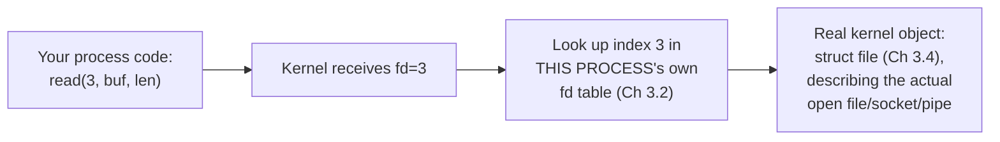

# PART 3 — File Descriptors

## Chapter 3.1 — What Is a File Descriptor?

### 🧠 One-Sentence Mental Model
> A file descriptor is not a file, not a socket, not a pipe — it's a small integer, meaningless outside your process, that your process hands to the kernel as shorthand for "the open thing I mean, the one you gave me a number for earlier."

### 🧒 Explain Like I'm Five
Imagine a coat check at a theater. You hand over your coat (open a file), and instead of giving you your coat back to carry around, they give you a small numbered ticket — "42." That number means nothing on its own; it's not your coat, it doesn't describe your coat. But when you show ticket 42 back to *this specific coat check counter*, they know exactly which coat to hand you. A file descriptor is exactly that ticket — a number your process holds, meaningful only when handed back to the kernel that issued it.

### 🌍 Real-World Analogy
Think of a hotel room key card that just says "Room: 7" with no other information printed on it. The card itself doesn't contain the room, doesn't describe the room's contents — it's a reference the front desk (the kernel) can look up to find out everything about the actual room (the actual open file, socket, or pipe). Two different hotels could both have a "Room 7" — the number by itself is meaningless without knowing *which hotel's* front desk issued it, exactly as a file descriptor "3" in your process means something completely different from file descriptor "3" in someone else's process.

### ❓ The Problem
Every single I/O call this course has used since Chapter 0.1 — `read(fd, ...)`, `write(fd, ...)`, `recv(fd, ...)` — takes this mysterious integer `fd` as its very first argument, and until now this course has simply trusted you to accept it as "the thing representing an open file." That trust ends here: what, precisely, IS that integer, where does it live, and what does the kernel actually do when it sees you pass it into a syscall?

### 🔥 Why This Problem Matters
Nearly every mechanism in the rest of this entire course — blocking I/O (Part 4), select/poll/epoll (Parts 6-8), io_uring (Part 14) — operates *on* file descriptors as its fundamental unit of "the thing I'm waiting on" or "the thing I'm reading/writing." If your mental model of what a file descriptor actually is stays fuzzy, every one of those later mechanisms will feel like it's manipulating a black box instead of a well-understood, traceable piece of kernel bookkeeping.

### 🕰 Historical Context
Early Unix made a deliberate, famous design choice: "everything is a file" — files, devices, pipes, and (later) sockets would all be accessed through the *same* small set of operations (`open`, `read`, `write`, `close`), rather than each kind of resource needing its own bespoke API. File descriptors are the mechanism that makes this uniformity possible: by handing back a plain integer regardless of what's actually open behind it, the kernel lets `read()` and `write()` be written once and work identically whether the fd refers to a regular file, a network socket, a pipe, or a terminal — a design decision Chapter 3.5 (VFS) will explain the full mechanics of.

### 💡 The Naive Solution
Imagine `read(fd, buf, len)` instead required a real pointer to the open file's actual kernel data structure, directly exposed to your userspace code.

### ❌ Why the Naive Solution Fails
This would immediately violate Chapter 2.4's entire privilege boundary — kernel data structures live in kernel memory, and user-space code cannot be handed raw pointers into kernel space (there's no valid, safe translation for user code to dereference them, and doing so would expose real kernel memory layout, a serious security problem). It would also make every open file a fixed, un-relocatable kernel object your process depended on directly, with no clean way to say "this number means something different after I `close()` and `open()` again."

### ✅ The Better Solution
Give the kernel the real data structure (Chapters 3.3-3.4 build this), and give userspace only a small integer — an *opaque handle* — that means nothing except "look this number up in my process's own private table." This is a file descriptor.

### 🧠 Core Concept
> **A file descriptor is an index into your process's own private file descriptor table (Chapter 3.2) — a small integer with zero information content on its own, useful only as a lookup key the kernel resolves back into real kernel state every time you pass it into a syscall.**

### 📐 Deep Technical Explanation

**What actually happens when you call `open()`:**
```
1. Your process calls open("data.bin", O_RDONLY) -- a syscall (Ch 2.6)
2. Kernel, now at ring 0, does the real work: locates the file, sets up
   the kernel-side bookkeeping for "this file is now open" (Ch 3.3/3.4)
3. Kernel picks the LOWEST currently-unused integer in YOUR process's
   fd table (Ch 3.2) -- NOT a global number, NOT tied to the file itself
4. Kernel writes an entry into YOUR process's fd table at that index,
   pointing at the real kernel structure it just built
5. The syscall returns that integer to you -- e.g., 3
   (0, 1, 2 are conventionally already taken -- stdin, stdout, stderr)
```

**Why the SAME integer can mean completely different things in different processes:** because each process has its *own* file descriptor table (Chapter 3.2 formalizes this fully) — fd `3` in your process might point at `data.bin`, while fd `3` in an entirely different, unrelated process might point at a network socket, or nothing at all. There is no global registry mapping "3" to one specific thing system-wide; the number is only ever meaningful in combination with *which process's table* you're looking it up in.



**How to read this diagram:** the integer `3` traveling from your code into the kernel carries no information by itself — everything useful happens at the "Look up" step, which is entirely process-specific. This is the precise mechanical reason file descriptors are called *opaque* handles: their only valid use is being handed back to the same kernel/process context that issued them.

### ❌ Common Misconceptions
- ❌ **"A file descriptor IS the open file."** — It's an index/handle *referring to* kernel state that describes the open file; the file descriptor itself is just a small integer with no inherent meaning outside your process.
- ❌ **"File descriptor numbers are unique across the whole system."** — They're only unique *within one process* — fd 3 in process A and fd 3 in process B are completely independent, potentially referring to entirely different things.
- ❌ **"Only regular files get file descriptors."** — Sockets, pipes, terminals, and many other kernel objects are all referenced via file descriptors too — this is the direct consequence of Unix's "everything is a file" design (Chapter 3.5 explains the mechanism enabling this uniformity).
- ❌ **"A low fd number means 'more important' or 'opened first, always.'"** — The kernel simply picks the lowest *currently unused* number in your process's table; if you close fd 3 and then open something new, the new thing may well also get 3 — the number reflects table slot availability, not any inherent property of what's open.

### 🧙 Wizard Insight
The instant you see a file descriptor as "just an opaque integer key into a per-process lookup table," an enormous amount of Unix I/O behavior stops looking arbitrary. Why does `dup2()` let you make fd 1 (stdout) secretly point at a file instead of the terminal, with zero code changes needed in the program using fd 1? Because it's just rewriting one table entry (Chapter 3.2) to point at a different underlying kernel object — the number itself, and everything that uses it, doesn't need to know or care. Why can a forked child process keep using the exact same fd numbers as its parent for the same open files? Because `fork()` (Chapter 2.1) copies the fd table itself, preserving the same numbers pointing at genuinely shared underlying kernel state (Chapter 3.3 explains exactly what's shared here). Every one of these behaviors is a direct, mechanical consequence of this one chapter's core concept.

### 🧠 Quiz
**Q1.** Why can fd 3 in one process and fd 3 in a completely different process refer to entirely different things?
<details><summary>Answer</summary>Because file descriptor numbers are indices into each process's OWN private file descriptor table (Chapter 3.2) -- there's no global, system-wide mapping from a number to a specific open file; the number is only meaningful relative to which process's table it's looked up in.</details>

**Q2.** Why doesn't `read(fd, ...)` take a direct pointer to the kernel's internal file structure instead of a small integer?
<details><summary>Answer</summary>Because user-space code cannot be safely handed raw pointers into kernel memory (Chapter 2.4's privilege boundary) -- doing so would violate the isolation guarantee and expose kernel memory layout. An opaque integer, looked up server-side by the kernel, avoids this entirely.</details>

**Q3.** How does the kernel decide which integer to hand back when you call `open()`?
<details><summary>Answer</summary>It picks the LOWEST currently-unused index in the calling process's own file descriptor table -- not a global counter, not anything related to the file being opened.</details>

### 📌 Short Notes (Quick Reference)
- A file descriptor is an opaque integer — an index into your process's OWN private file descriptor table, meaningless outside that process.
- The kernel picks the lowest unused number in that table on `open()` — not a global identifier, not tied to the file itself.
- The uniformity of "everything is a file" (sockets, pipes, terminals all get fds too) is enabled by this exact indirection — Chapter 3.5 (VFS) explains the mechanism that makes `read()`/`write()` work identically regardless of what's actually behind the fd.
- Behaviors like `dup2()` and fd-table inheritance across `fork()` are direct, simple consequences of fds being table indices, not the objects themselves.

### 🔗 What This Connects To Next
**Previous:** Part 2 (all of it — this chapter is where "the fd you've been passing to syscalls since Chapter 0.1" finally gets defined precisely)
**Current:** Part 3, Chapter 3.1 — What Is a File Descriptor?
**Next:** Part 3, Chapter 3.2 — File Descriptor Table (the actual per-process table this chapter kept referencing, built out fully)
