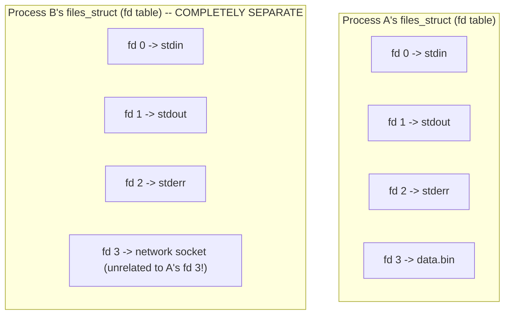

# PART 3 — File Descriptors

## Chapter 3.2 — File Descriptor Table

### 🧠 One-Sentence Mental Model
> The file descriptor table is the actual per-process array Chapter 3.1 kept referencing — a small, private lookup table, one per process, mapping each open integer to a pointer at real kernel state, and understanding its exact scope (per-process, inherited on fork, NOT shared with unrelated processes) resolves nearly every "why does my fd behave this way" confusion.

### 🧒 Explain Like I'm Five
Picture a small personal notebook that every office worker keeps in their own desk drawer, listing "ticket number → which coat this actually is" (from Chapter 3.1's coat-check analogy). Every worker has their OWN notebook — worker A's entry for ticket 3 says nothing about worker B's ticket 3, because they're two completely separate notebooks, sitting in two completely separate drawers.

### 🌍 Real-World Analogy
Think of each hotel guest's personal key-card wallet, which lists "Room 7 → which physical door this actually opens" for THAT guest's current stay only. If a new guest checks in later and is also handed a "Room 7" keycard for their entirely different stay, their wallet's entry for "Room 7" is completely independent of the previous guest's — different wallets, different validity, even with the identical label printed on the card.

### ❓ The Problem
Chapter 3.1 asserted that file descriptors are "indices into your process's own table" without ever showing what that table actually looks like, what it contains per entry, or what happens to it during events like `fork()` — this chapter builds that table out precisely.

### 🔥 Why This Problem Matters
Nearly every practical Unix I/O trick — redirecting stdout to a file, sharing an open socket between a parent and forked child worker processes, `dup2()`-based redirection in shells — is a direct manipulation of this exact table. Without a concrete picture of it, these tricks look like unrelated syntax to memorize rather than obvious consequences of one simple data structure.

### 🕰 Historical Context
The decision to make file descriptor tables strictly per-process (rather than, say, one shared system-wide table with permission bits) was part of the same isolation philosophy behind virtual memory (Chapter 2.3) — every process gets its own private view of "what's open," and the kernel enforces that a process can never accidentally (or maliciously) use a raw fd number to reach into another, unrelated process's open files. This per-process scoping is precisely what makes fd numbers safe to reuse freely across unrelated programs without any coordination between them.

### 💡 The Naive Solution
Imagine a single, global, system-wide table mapping fd numbers directly to open files, shared by every process on the machine.

### ❌ Why the Naive Solution Fails
It would mean every process needs to negotiate for unique numbers against every *other* process on the entire system — two unrelated programs both wanting "fd 3" would collide. It would also mean any process, given a number, could potentially reach another unrelated process's open files just by guessing or trying numbers — a severe isolation violation, directly undermining Chapter 2.4's entire privilege/isolation model.

### ✅ The Better Solution
Give every process its own private table, starting fresh (with only stdin/stdout/stderr pre-populated) each time a new process is created — exactly mirroring the per-process isolation philosophy Chapter 2.3 already established for memory.

### 🧠 Core Concept
> **Each process has exactly one file descriptor table — conceptually an array, indexed by the small integers `read()`/`write()`/etc. take — where each occupied slot holds a pointer to a shared kernel structure called an open file description (Chapter 3.3). The table itself, and the numbers used as its indices, are entirely private per process.**

### 📐 Deep Technical Explanation

```c
// GREATLY simplified conceptual view of what's inside task_struct (Part 1/2.1)
struct files_struct {
    struct file *fd_array[MAX_FDS];   // index = fd number, value = pointer
                                        // to the REAL kernel object (Ch 3.3/3.4)
    // (real kernel uses a more sophisticated resizable structure,
    //  but the conceptual shape is exactly this: an array of pointers)
};
```

**Where this table lives:** it's part of the per-process state referenced from every thread's `task_struct` (Part 1/Chapter 2.1) — and, critically, per Chapter 2.2's shared/private split, this table is one of the things **shared** by every thread within the same process (alongside the heap and address space), but private to, and completely independent between, different processes.



**How to read this diagram:** both processes happen to have an occupied slot at index 3 — pure coincidence of table-slot availability (Chapter 3.1's "lowest unused number" rule), not any relationship between what those two slots actually point at. There is no arrow, no connection, no shared meaning between `ProcA`'s fd 3 and `ProcB`'s fd 3 whatsoever.

**What `fork()` does to this table, precisely:** Chapter 2.1 established that `fork()` uses Copy-On-Write for the *address space*. The file descriptor table follows a related but distinct rule: the child gets its own **copy** of the parent's fd table (the array of pointers itself is duplicated), but each entry in that copy points at the *exact same* underlying open file description (Chapter 3.3) as the parent's corresponding entry — meaning the parent and child, immediately after `fork()`, share access to the same open files, at the same file offset, through independently-numbered-but-identically-populated tables.

```c
// after fork():
pid_t pid = fork();
// parent's fd 3 and child's fd 3 both point at the SAME open file
// description (Ch 3.3) -- e.g., reading in one process advances the
// file offset that the OTHER process's reads will also see, because
// they share that underlying state, not just the same fd NUMBER
```

**`dup2()` — directly manipulating a single table entry:**
```c
int fd = open("output.log", O_WRONLY | O_CREAT, 0644);
dup2(fd, 1);   // make fd table slot 1 (stdout) point at the SAME open
               // file description that `fd` points at -- any code
               // later writing to fd 1 (e.g., printf, std::cout via
               // fd 1) now writes into output.log instead of the
               // terminal, with ZERO changes needed in that code
close(fd);     // the ORIGINAL fd can be closed -- slot 1 still holds
               // its own reference to the same open file description
```

This is the exact mechanism behind shell output redirection (`command > file.txt`) — the shell, before running `command`, does precisely this `dup2()` dance on its own fd table before `exec()`-ing the target program (Chapter 2.1's `execve()`), which inherits the already-redirected table.

### ❌ Common Misconceptions
- ❌ **"The fd table is shared across all processes on the system."** — It's strictly per-process; two unrelated processes' tables have zero connection to each other, even at matching index numbers.
- ❌ **"`fork()` gives the child completely independent open files, unrelated to the parent's."** — The child gets its own copy of the *table* (the array of pointers), but each entry still points at the SAME underlying open file description as the parent — they share file offset and other state (Chapter 3.3 details exactly what).
- ❌ **"`dup2()` copies the contents of a file."** — It only rewrites one table entry (a pointer) to reference the same underlying open file description another entry already points at — no file content is touched at all.
- ❌ **"Closing one fd number automatically closes 'the file' everywhere it's referenced."** — Since `fork()` and `dup2()` can leave multiple table entries (possibly in different processes) pointing at the same open file description, closing one fd only removes *that one table entry* — the underlying open file description persists as long as at least one reference to it remains (Chapter 3.10 formalizes this reference-counting lifecycle fully).

### 🧙 Wizard Insight
Once the fd table is a concrete picture in your head — an array of pointers, private per process, duplicated (not deep-copied) on `fork()` — an enormous swath of shell scripting, process supervision, and systems-programming idioms stop being memorized incantations and become obvious applications of one data structure. Redirecting a child process's stdout to a log file before `exec()`-ing it, sharing a listening socket between a parent and several pre-forked worker processes (Part 4.9's territory), inheriting or deliberately closing specific fds across `fork()`/`exec()` boundaries (the `close-on-exec` flag, Chapter 3.10) — all of these are just different, deliberate arrangements of pointers within this one per-process table.

### 🧠 Quiz
**Q1.** If two unrelated processes both have something open at fd number 5, does that imply any relationship between what's open in each?
<details><summary>Answer</summary>No -- each process has its own independent file descriptor table; matching index numbers are pure coincidence of table-slot availability, with zero connection between what the two processes actually have open.</details>

**Q2.** After `fork()`, do the parent and child share the same open file description for a file both inherited, or does the child get an independent copy?
<details><summary>Answer</summary>They share the SAME underlying open file description (Chapter 3.3) -- the child's fd table is its own copy (an independently duplicated array of pointers), but each entry points at the identical shared kernel object the parent's corresponding entry points at, including shared file offset.</details>

**Q3.** What does `dup2(fd, 1)` actually do, mechanically?
<details><summary>Answer</summary>It rewrites table slot 1 (stdout) to point at the same underlying open file description that `fd` currently points at -- no data is copied, just a pointer in the fd table is overwritten.</details>

### 📌 Short Notes (Quick Reference)
- The fd table is a per-process array of pointers (conceptually `fd_array[N] -> struct file`), part of `task_struct`'s shared-within-process state (Ch 2.2).
- Two different processes' tables are completely independent — matching fd numbers imply nothing about a relationship.
- `fork()` duplicates the table itself (the array), but each entry still points at the SAME underlying open file description as the parent — shared file offset and state, independent numbering.
- `dup2()` directly rewrites one table entry to alias another — the mechanism behind shell redirection, with zero file content ever touched.

### 🔗 What This Connects To Next
**Previous:** Part 3, Chapter 3.1 — What Is a File Descriptor?
**Current:** Part 3, Chapter 3.2 — File Descriptor Table
**Next:** Part 3, Chapter 3.3 — Open File Description (the shared kernel object every fd table entry actually points at — what it holds, and precisely what gets shared across `fork()`/`dup2()`)
