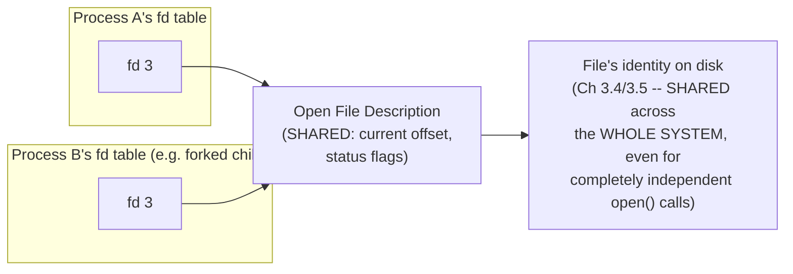

# PART 3 — File Descriptors

## Chapter 3.3 — Open File Description

### 🧠 One-Sentence Mental Model
> An open file description is the real kernel object that a file descriptor table entry actually points at — it holds the stuff that gets SHARED across `fork()`/`dup2()` (like the current read/write position), which is exactly why two file descriptors that trace back to the same open file description can mysteriously "see" each other's seeks.

### 🧒 Explain Like I'm Five
Imagine two friends who were both handed a copy of the same library card for the same book (via Chapter 3.2's `fork()`/`dup2()` sharing). The book itself has a single bookmark in it. If one friend reads ahead and moves the bookmark, the OTHER friend, using their own separate library card copy, will find the bookmark has already moved when they next open the book — because there's really only ONE bookmark, shared, even though there are two separate cards.

### 🌍 Real-World Analogy
Think of a shared Google Doc where two people each have their own separate "tab open" (their own fd table entry), but the document's actual current scroll position, if it were a single shared cursor rather than per-viewer, would move for both of them together. An open file description is like that single shared cursor/scroll-state object — several different tabs (fd table entries, possibly in different processes) can point at the SAME open file description, and changes to its shared state (like current read position) are visible through all of them.

### ❓ The Problem
Chapter 3.2 revealed that `fork()` and `dup2()` create *multiple* fd table entries pointing at the *same* underlying kernel object — without yet explaining precisely what that shared object contains, or why the current file offset specifically ends up shared rather than independent per fd.

### 🔥 Why This Problem Matters
This is the exact mechanism behind a real, commonly-encountered surprise: two processes (or two fds within one process) that you might expect to read independently through the same file instead interfere with each other's position — one process's `read()` silently advances the position the OTHER will read from next. Understanding *why* requires knowing precisely what's shared here and what isn't.

### 🕰 Historical Context
POSIX deliberately specifies this two-layer design — a file descriptor (Chapter 3.1) referencing an open file description, which in turn references the actual file's identity on disk (Chapter 3.4's `struct file`/inode territory) — specifically to support exactly the `fork()`-sharing and `dup2()`-aliasing behaviors real Unix programs have relied on since the earliest shells needed to implement I/O redirection and pipelines. The layering isn't incidental complexity; it's the minimum structure needed to make those behaviors both possible and precisely defined.

### 💡 The Naive Solution
Imagine each file descriptor directly and independently tracked its own read/write position, with no shared state at all between different fds, even ones created via `dup2()` or inherited via `fork()`.

### ❌ Why the Naive Solution Fails
It would make `dup2()`-based redirection subtly wrong for real use cases: a shell setting up a pipeline where a parent and forked child both write to the same redirected output file would, under this naive model, potentially have both processes' writes start from the same initial offset and overwrite each other, rather than each write correctly advancing a shared position so output accumulates in the order it was actually written. Independent, unlinked-across-`fork()` offsets would break the append-like guarantees real programs depend on.

### ✅ The Better Solution
Introduce a distinct layer — the open file description — that specifically holds the shared, mutable state (current offset, file status flags like `O_APPEND`) separately from the private, per-process-table-entry integer (the fd number itself). Multiple fd table entries, across multiple processes, can then point at one shared open file description, correctly sharing exactly the state that needs sharing.

### 🧠 Core Concept
> **An open file description holds the current read/write offset and file status flags — state that is SHARED by every fd table entry (in any process) that points at it, via `fork()` or `dup2()`. It is distinct from, and sits between, the fd number (Chapter 3.1, private per process) and the file's actual identity on disk (Chapter 3.4, shared by the whole system regardless of how many times it's independently opened).**

### 📐 Deep Technical Explanation

```c
// GREATLY simplified conceptual view
struct open_file_description {
    off_t   current_offset;    // SHARED across every fd pointing here
    int     status_flags;      // O_APPEND, O_NONBLOCK, etc -- also SHARED
    struct  inode *inode;      // pointer to the file's actual identity (Ch 3.4)
    // ... more real kernel bookkeeping ...
};
```

**The three-layer picture, made precise:**



**How to read this diagram:** three distinct layers, each with a different scope of sharing. The fd number (leftmost boxes) is private per process (Chapter 3.2). The open file description (middle) is shared exactly among fds that trace back to a common `fork()` or `dup2()` ancestry. The file's underlying identity (rightmost) is shared even *more* broadly — completely unrelated processes independently calling `open()` on the same path get *different* open file descriptions (each with its own independent offset), but both ultimately reference the *same* underlying file identity for things like permission checks and actual data.

**Two genuinely different scenarios, precisely distinguished:**

```c
// SCENARIO A: two INDEPENDENT open() calls on the same file
int fdA = open("log.txt", O_WRONLY);   // creates a NEW open file description, offset=0
int fdB = open("log.txt", O_WRONLY);   // creates ANOTHER NEW one, ALSO offset=0
write(fdA, "hello", 5);   // fdA's offset advances to 5; fdB's offset is STILL 0
write(fdB, "world", 5);   // likely OVERWRITES the first 5 bytes -- independent offsets!

// SCENARIO B: dup2() or fork()-derived fds from ONE open() call
int fd = open("log.txt", O_WRONLY);
int fd2 = dup(fd);         // fd2 shares the SAME open file description as fd
write(fd, "hello", 5);     // shared offset advances to 5
write(fd2, "world", 5);    // continues from offset 5 -- "helloworld", not overwritten
```

This is precisely the mechanical distinction behind a subtle but real class of bugs: code that assumes "two file descriptors to the same path always behave like Scenario B" will be surprised when it's actually Scenario A (two truly independent `open()` calls) — the sharing is about *how the fd was obtained* (derived from a common open file description vs. independently opened), not merely about referring to "the same file."

### ❌ Common Misconceptions
- ❌ **"Two file descriptors pointing at the same file always share the same read/write offset."** — Only true if they trace back to a common open file description (via `dup()`/`dup2()`/`fork()`) — two independent `open()` calls on the identical path create two separate open file descriptions, each with its own independent offset.
- ❌ **"The open file description IS the file."** — It's a per-open-session object holding shared, mutable session state (offset, flags); the file's actual identity and content live one layer further down (Chapter 3.4/3.5).
- ❌ **"`O_APPEND` behavior is per-fd-number."** — It's a status flag stored on the open file description, so it follows the sharing rules of that layer — fds derived from the same `open()` call via `dup()`/`fork()` share the SAME `O_APPEND` setting, while independently-`open()`ed fds to the same path have independently-set flags.
- ❌ **"Closing one fd that shares an open file description with another destroys that shared state immediately."** — The open file description persists as long as at least one fd (in any process) still references it — Chapter 3.10 formalizes this reference-counted lifecycle precisely.

### 🧙 Wizard Insight
This three-layer design (fd number → open file description → file identity) is the precise, principled answer to a question that trips up nearly everyone learning Unix I/O: "why does forking a process that has a file open sometimes 'share' behavior with the child, and sometimes not?" The answer is never vague — it's always resolvable by asking, specifically, "do these two fds trace back to a common open() call (sharing an open file description) or are they from independent open() calls (independent open file descriptions, same underlying file identity)?" Every seemingly-surprising sharing (or non-sharing) behavior you'll ever encounter reduces to this one, precise question.

### 🧠 Quiz
**Q1.** Two processes each independently call `open("data.txt", O_RDONLY)` on the same path. Do their reads share a current offset?
<details><summary>Answer</summary>No -- each independent open() call creates its own separate open file description, each with its own independent offset, even though both refer to the same underlying file identity.</details>

**Q2.** A parent process opens a file, then `fork()`s. Do the parent's and child's fds for that file share the same offset?
<details><summary>Answer</summary>Yes -- fork() duplicates the fd table entries (Chapter 3.2), but both entries continue pointing at the SAME open file description the parent originally created, so the offset (and O_APPEND flag, etc.) is shared between parent and child.</details>

**Q3.** What specific kind of state lives in the open file description, as opposed to the fd number or the file's on-disk identity?
<details><summary>Answer</summary>The current read/write offset and file status flags (like O_APPEND, O_NONBLOCK) -- mutable, per-open-session state that needs to be shared exactly among fds derived from a common open() call.</details>

### 📌 Short Notes (Quick Reference)
- Open file description = the real kernel object an fd table entry points at; holds the current offset and status flags (`O_APPEND`, etc.) — state SHARED by every fd tracing back to a common `open()` call via `fork()`/`dup()`/`dup2()`.
- Two independent `open()` calls on the same path create two SEPARATE open file descriptions, each with its own independent offset — no sharing.
- Three-layer structure: fd number (private per process) → open file description (shared per open-session ancestry) → file identity (shared system-wide, Chapter 3.4).
- The deciding question for "will these two fds share offset/flags?" is always: do they trace back to the same `open()` call, or were they opened independently?

### 🔗 What This Connects To Next
**Previous:** Part 3, Chapter 3.2 — File Descriptor Table
**Current:** Part 3, Chapter 3.3 — Open File Description
**Next:** Part 3, Chapter 3.4 — `struct file` (the concrete kernel structure implementing everything this chapter described, and its link down to the file's actual identity)
