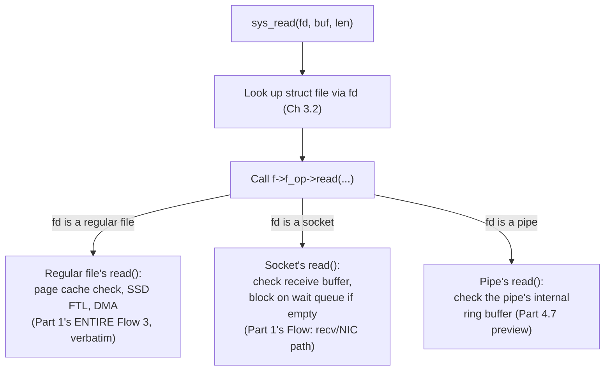

# PART 3 — File Descriptors

## Chapter 3.4 — `struct file`

### 🧠 One-Sentence Mental Model
> `struct file` is the real, concrete Linux kernel structure that implements Chapter 3.3's "open file description" — and its single most important field, for this entire course, is a table of function pointers that lets `read()`/`write()` work identically whether the fd refers to a disk file, a socket, or a pipe.

### 🧒 Explain Like I'm Five
Imagine a universal remote control that works identically for a TV, a stereo, and a DVD player — you press "power," and the remote figures out, internally, which specific device it's currently pointed at and sends the correct signal for THAT device. `struct file` is like that remote's internal logic: it holds a reference to whichever specific device (regular file, socket, pipe) is "currently selected," plus a lookup table of "what does 'power' actually mean for THIS specific device" — so the button itself (the `read()` syscall) never needs its own device-specific logic.

### 🌍 Real-World Analogy
Think of a translator earpiece used at a UN meeting — delegates all press the same "listen" button regardless of which language booth they're actually tuned to, and the earpiece's internal wiring routes that single button-press to whichever specific translation feed is currently selected. `struct file` plays exactly this role for I/O operations: `read()` is the one universal "listen" button, and `struct file` is the wiring that routes it to the correct, type-specific implementation.

### ❓ The Problem
Chapter 3.3 described "the open file description" in the abstract — offset, flags, a link to the file's identity. This chapter names its actual, concrete Linux implementation and reveals the piece that makes the entire "everything is a file" philosophy (Chapter 3.1's historical note) actually work mechanically: how does the SAME `read()` syscall correctly do completely different things depending on whether the fd is a disk file, a network socket, or a pipe?

### 🔥 Why This Problem Matters
This is the direct mechanical answer to something this course has assumed since Chapter 0.1: that `read()` and `write()` are uniform, general-purpose operations regardless of what's on the other end. Without understanding `struct file`'s function-pointer table, that uniformity looks like a coincidence or a simplification for teaching purposes. It isn't — it's a specific, deliberate kernel design pattern, and it's the exact same pattern (a table of function pointers dispatched to based on type) you'll recognize again when Part 3.5 covers the VFS layer built on top of it.

### 🕰 Historical Context
As Unix-like systems grew to support increasingly different kinds of "things you can read and write" — regular files, then pipes, then devices, then (much later) network sockets — hard-coding `read()`'s implementation to check "is this a file? Is this a socket?" via a growing chain of special cases would have made the kernel's I/O code increasingly unmaintainable. The function-pointer-table pattern `struct file` uses was the answer: let each *type* of thing register its own implementations once, and have the generic `read()`/`write()` syscalls simply call through whichever table is attached to the specific fd in question, with zero type-checking logic of their own.

### 💡 The Naive Solution
Imagine the kernel's `sys_read()` function contained an explicit chain of checks: "if this fd is a regular file, do X; else if it's a socket, do Y; else if it's a pipe, do Z."

### ❌ Why the Naive Solution Fails
Every single new kind of "readable thing" ever added to the kernel (and there have been many, over decades) would require modifying this one central, shared function — a maintenance nightmare, and a real risk of one new type's special case accidentally breaking behavior for existing types. It also couples the generic read/write syscall machinery tightly to the full list of every type that will ever exist, which is fundamentally unknowable in advance.

### ✅ The Better Solution
Give every type its own self-contained table of "here's how I implement `read`, here's how I implement `write`, here's how I implement `close`," and have the generic syscall layer simply follow a pointer to whichever table is relevant, with zero awareness of how many types exist or what they are.

### 🧠 Core Concept
> **`struct file` bundles the open file description's state (Chapter 3.3: offset, flags) together with a pointer to a `file_operations` table — a struct of function pointers (`.read`, `.write`, `.open`, `.close`, ...) specific to whatever TYPE of thing this file descriptor actually refers to. The generic `sys_read()` never contains type-specific logic; it just calls through this pointer.**

### 📐 Deep Technical Explanation

```c
// GREATLY simplified conceptual view of the real kernel structures

struct file_operations {
    ssize_t (*read)(struct file *, char *buf, size_t len, loff_t *offset);
    ssize_t (*write)(struct file *, const char *buf, size_t len, loff_t *offset);
    int     (*open)(struct inode *, struct file *);
    int     (*release)(struct inode *, struct file *);   // close
    // ... many more operations ...
};

struct file {
    loff_t   f_pos;              // current offset (Ch 3.3's shared offset)
    int      f_flags;            // O_APPEND, O_NONBLOCK, etc (Ch 3.3)
    struct file_operations *f_op; // <-- THE KEY FIELD: type-specific dispatch table
    struct inode *f_inode;        // the file's identity (Ch 3.5)
    void    *private_data;        // type-specific extra state (e.g. socket internals)
};
```

**What actually happens inside `sys_read()`, made completely concrete:**

```c
// this IS, mechanically, what Part 1's Flow 3 "sys_read()" was really doing --
// now shown with the type-dispatch machinery made explicit
ssize_t sys_read(int fd, char *buf, size_t len) {
    struct file *f = current->files->fd_array[fd];   // Ch 3.2's table lookup
    return f->f_op->read(f, buf, len, &f->f_pos);     // call THROUGH the type's
                                                        // own read implementation
                                                        // -- generic code has
                                                        // ZERO idea what kind
                                                        // of file this is
}
```

**Three different types, three different `file_operations` tables, same `sys_read()` calling all of them identically:**



**How to read this diagram:** the top two boxes (`sys_read`, the lookup, the dispatch call) are executed identically, with literally the same instructions, regardless of what kind of fd was passed in. Only once the dispatch happens does the code path diverge — and critically, that divergence happens via a **function pointer call**, not an `if`/`else` chain the generic syscall code has to maintain. This is precisely why Part 1's entire Flow 3 trace (page cache, SSD descriptor rings, DMA, interrupts) is specifically what happens *inside* a regular file's `.read` implementation — it was never part of `sys_read()`'s own generic logic at all.

**Why `f_pos` (the offset) lives here rather than in the fd table entry itself:** this is the concrete, structural answer to Chapter 3.3's sharing question — because `struct file` IS the open file description, and multiple fd table entries (across `fork()`/`dup2()`) point at the *same* `struct file` instance, they're all reading and writing the *same* `f_pos` field — which is exactly why those fds share an offset, mechanically, not by any special-case rule, just by pointing at the same piece of memory.

### ❌ Common Misconceptions
- ❌ **"`read()` contains logic to check what kind of file it's reading."** — The generic syscall layer contains zero type-specific logic; it calls through a function pointer (`f_op->read`) that was set up when the file was opened, based on its type — dispatch, not branching.
- ❌ **"`struct file` and `struct inode` are the same thing."** — `struct file` represents one open *session* (Chapter 3.3's open file description, with its own offset); `struct inode` (Chapter 3.5) represents the underlying file's persistent identity, shared by every session that opens it, however many times.
- ❌ **"Adding support for a new kind of readable thing to the kernel requires modifying `sys_read()`."** — It only requires writing a new `file_operations` table with that type's own `.read`/`.write` implementations — the generic syscall code is completely untouched, exactly the point of this design.
- ❌ **"Every file type's `.read` implementation does roughly the same thing, just against different hardware."** — They can be structurally very different — a regular file's read may check a page cache and trigger DMA (Part 1's Flow 3); a socket's read blocks on a receive buffer's wait queue; a pipe's read reads from an in-memory ring buffer with no device involved at all (Part 4.7).

### 🧙 Wizard Insight
The `file_operations` function-pointer-table pattern is not a one-off trick specific to file I/O — it's a general design idiom (closely related to what other languages would call an interface or virtual dispatch table) that recurs constantly throughout the Linux kernel: device drivers, filesystems, network protocols, and more all plug themselves into generic kernel machinery via exactly this shape — a struct of function pointers the generic code calls through, never needing to know how many implementations exist. Once you recognize this pattern here, you'll see it again and again for the rest of this course (and in the VFS layer, Chapter 3.5, taking it one level further) — it's one of the most important organizing ideas in kernel design generally, not just an I/O detail.

### 🧠 Quiz
**Q1.** When `sys_read()` is called on a socket fd versus a regular file fd, does the generic syscall code branch differently based on the type?
<details><summary>Answer</summary>No -- it executes identical code (look up struct file, call f->f_op->read(...)); the divergence happens entirely inside the function pointer call itself, which resolves to a different, type-specific implementation depending on what f_op was set to when the file was opened.</details>

**Q2.** Why do fds derived from the same `open()` call via `fork()`/`dup2()` share the same current offset, mechanically?
<details><summary>Answer</summary>Because they all point at the SAME struct file instance, and the offset (f_pos) is a field stored directly inside that one shared struct -- there's no separate per-fd offset copy anywhere.</details>

**Q3.** What's the practical benefit of dispatching through a `file_operations` function-pointer table instead of an if/else chain inside `sys_read()`?
<details><summary>Answer</summary>New file/device types can be added by writing a new file_operations table with their own implementations, with ZERO changes needed to the generic sys_read()/sys_write() code -- avoiding a growing, unmaintainable chain of special cases in shared kernel code.</details>

### 📌 Short Notes (Quick Reference)
- `struct file` is the concrete kernel implementation of Chapter 3.3's "open file description" — holds `f_pos` (offset), `f_flags`, and critically `f_op` (a `file_operations` function-pointer table).
- `sys_read()`/`sys_write()` are generic and type-agnostic — they just call through `f->f_op->read(...)`/`.write(...)`, with zero branching logic of their own.
- Different types (regular file, socket, pipe) each supply their own `file_operations` table — this is exactly what makes Part 1's Flow 3 (page cache, SSD DMA) specific to REGULAR FILES, not something `read()` itself does generically.
- Fds sharing an offset (Chapter 3.3) is mechanically explained here: they point at the same `struct file`, hence the same `f_pos` field.
- This function-pointer-table dispatch pattern recurs throughout the kernel (drivers, filesystems, protocols) — not a one-off I/O trick.

### 🔗 What This Connects To Next
**Previous:** Part 3, Chapter 3.3 — Open File Description
**Current:** Part 3, Chapter 3.4 — `struct file`
**Next:** Part 3, Chapter 3.5 — VFS (the layer one level up that makes an entire FILESYSTEM, not just one open file, pluggable the same way)
