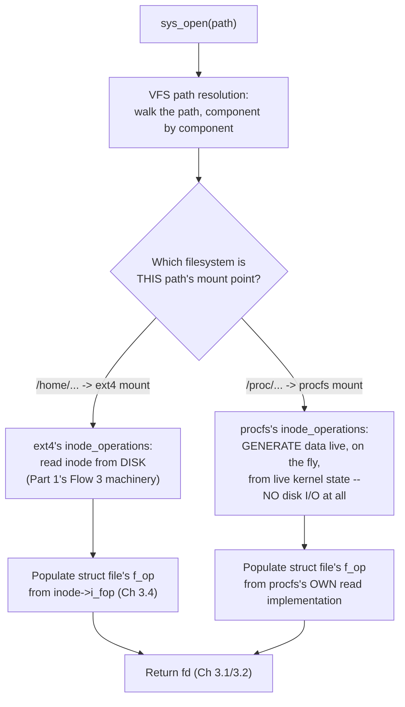

# PART 3 — File Descriptors

## Chapter 3.5 — VFS (Virtual File System)

### 🧠 One-Sentence Mental Model
> The VFS is Chapter 3.4's function-pointer-dispatch trick, applied one level up — not just to individual open files, but to entire FILESYSTEMS — which is precisely how `ext4`, `NFS`, `/proc`, and a dozen other wildly different storage backends all answer to the identical `open()`/`read()`/`write()` API without the kernel needing to know or care which one it's talking to.

### 🧒 Explain Like I'm Five
Imagine a single universal power outlet adapter that works in every country — not because every country secretly uses the same plug shape, but because the adapter has swappable inserts, one per country, and you just click in whichever insert matches where you are. The VFS is that adapter shell: `open()`/`read()`/`write()` are the universal plug shape every program uses, and each filesystem type (ext4, NFS, /proc, tmpfs) is a different insert, translating the universal request into whatever that specific storage system actually needs.

### 🌍 Real-World Analogy
Think of a international shipping company's single tracking-number lookup system — you type in one tracking number in one universal format, and the system internally knows to route your query to FedEx's system, or UPS's system, or a regional courier's completely different internal database, depending on which carrier actually has your package. You never interact with each carrier's own bespoke system directly; one uniform interface routes to wildly different backends transparently.

### ❓ The Problem
Chapter 3.4 showed how `struct file`'s function-pointer table lets one `read()` syscall behave correctly whether the fd is a regular file, socket, or pipe. But it left an unanswered question specific to regular files: when you `open("/some/path")`, how does the kernel know whether that path lives on an `ext4` disk partition, an `NFS` network mount, an in-memory `tmpfs`, or the special `/proc` pseudo-filesystem — and route the actual work to the correct, wildly different backend implementation?

### 🔥 Why This Problem Matters
This is the mechanism that makes Linux's famous "everything is a file" philosophy extend all the way to things that clearly aren't files in any traditional sense — `/proc/cpuinfo` isn't a file on a disk at all; reading it triggers kernel code that formats live system information on demand. Without VFS, every program would need to know, in advance, which specific filesystem backend a given path lives on and call different, incompatible APIs accordingly — exactly the maintainability disaster Chapter 3.4 already showed the function-pointer pattern solving at the single-file level.

### 🕰 Historical Context
As Unix systems grew to support not just local disk filesystems but network filesystems (NFS), and later a proliferation of specialized and pseudo-filesystems (`/proc` for process information, `/sys` for device/kernel state, `tmpfs` for RAM-backed storage), hard-coding path-handling logic for each one directly into the kernel's core file-handling code would have created exactly the same unmaintainable special-case explosion Chapter 3.4 described for individual file types — except now at the scale of entire storage backends. The Virtual File System layer is the historical, deliberate generalization of Chapter 3.4's pattern to solve this at the filesystem level.

### 💡 The Naive Solution
Imagine the kernel's path-resolution and `open()` code contained explicit logic: "if this path is under `/mnt/nfs`, do NFS-specific things; if it's under `/proc`, do proc-specific things; otherwise assume a local disk filesystem."

### ❌ Why the Naive Solution Fails
Every new filesystem type ever added — and there have been dozens over Linux's history — would require modifying this shared, central path-handling code, with the same maintenance and safety risks Chapter 3.4 already established for individual file-type dispatch, now at a much larger and more consequential scale (path resolution touches essentially everything).

### ✅ The Better Solution
Generalize Chapter 3.4's function-pointer-table pattern one level up: let each filesystem TYPE register its own table of operations (how to look up a path, how to create a `struct file` for something opened within it, and so on), and have the kernel's generic path-resolution and `open()` code simply dispatch through whichever filesystem's table is relevant for a given mount point — with zero awareness, in the generic code, of how many filesystem types exist.

### 🧠 Core Concept
> **The VFS is a layer of abstraction sitting above individual filesystem implementations, using the identical function-pointer-dispatch idiom Chapter 3.4 introduced at the `struct file` level, now applied to entire filesystem TYPES via `struct inode_operations` and `struct super_block` — this is precisely what lets `ext4`, `NFS`, `/proc`, and `tmpfs` all satisfy the same `open()`/`read()`/`write()` calls with completely different underlying implementations.**

### 📐 Deep Technical Explanation

**The key structures, conceptually:**

```c
// GREATLY simplified conceptual view

struct inode {                          // represents a file's IDENTITY
    unsigned long i_ino;                 // inode number (unique per filesystem)
    struct inode_operations *i_op;       // filesystem-specific: lookup, create, etc.
    struct file_operations  *i_fop;      // used to populate struct file's f_op
                                          // when this inode is opened (Ch 3.4's link!)
};

struct super_block {                     // represents one MOUNTED filesystem instance
    struct super_operations *s_op;       // how THIS filesystem type handles
                                          // mounting, unmounting, allocating inodes
    // ... filesystem-type-specific state ...
};
```

**How `open("/proc/cpuinfo")` and `open("/home/user/data.bin")` both work through the exact same generic kernel code, yet end up completely different:**



**How to read this diagram:** the top box (`sys_open`) and the path-resolution logic immediately below it are completely generic — the SAME code runs regardless of what kind of path was given. The divergence happens entirely at the "Which filesystem" decision, which is resolved by looking up which filesystem TYPE is mounted at that point in the path — from there, each filesystem type's own `inode_operations`/`super_operations` tables (Chapter 3.4's exact pattern, one level up) take over, doing whatever is appropriate for that backend: real disk I/O for `ext4` (Part 1's entire Flow 3 trace), or live, on-the-fly data generation with zero disk involvement at all for `/proc`.

**The direct link back to Chapter 3.4:** once VFS has resolved which filesystem type owns a path and found (or, for something like `/proc`, generated on demand) the corresponding `inode`, it populates a brand-new `struct file`'s `f_op` pointer from that inode's `i_fop` field — this is the literal, mechanical connection between VFS (this chapter) and `struct file` (Chapter 3.4): VFS is responsible for figuring out *which* `file_operations` table a given path should use; `struct file` is what carries that table forward for every subsequent `read()`/`write()` on the resulting fd.

**Why `/proc` is the clearest possible illustration of this entire chapter:** `/proc/cpuinfo` looks, from userspace, exactly like an ordinary file — you can `open()` it, `read()` it, `cat` it in a shell. But there is no disk block anywhere containing "cpuinfo" — procfs's `inode_operations`/`file_operations` implementations generate that text live, by querying actual kernel/hardware state, every time it's read. The entire VFS machinery is what makes this indistinguishable, from the calling program's perspective, from reading a genuine file off disk — the uniformity is real, not superficial.

### ❌ Common Misconceptions
- ❌ **"VFS is a specific filesystem, like ext4 or NFS."** — It's not a filesystem at all; it's the abstraction LAYER that lets many different, actual filesystem implementations (ext4, NFS, procfs, tmpfs, and others) all be accessed through one uniform API.
- ❌ **"Reading `/proc/cpuinfo` reads a real file from disk."** — It triggers kernel code that generates that content live, on demand, from actual live kernel/hardware state — there's no persistent on-disk representation of that content at all.
- ❌ **"Every filesystem type must be built into the kernel at compile time, with no way to add new ones."** — The whole point of VFS's function-pointer-table design (identical in spirit to Chapter 3.4's) is that new filesystem types can register their own operations tables, including as loadable kernel modules, without modifying VFS's own generic code.
- ❌ **"VFS and `struct file` are solving the same problem at the same layer."** — They're related but distinct: `struct file`/`file_operations` (Chapter 3.4) governs dispatch for an already-open file's read/write/close operations; VFS governs the earlier, separate problem of resolving a PATH to the correct filesystem type and inode in the first place.

### 🧙 Wizard Insight
Once you see VFS as "Chapter 3.4's function-pointer dispatch pattern, generalized from individual files to entire filesystem types," an enormous amount of Linux's apparent flexibility stops looking like magic. Mounting a USB drive, a network share, and a RAM disk, and having `ls`, `cat`, and every other ordinary tool work identically on all three without any special-casing? That's VFS. Containers using bind-mounts and overlay filesystems to present a customized view of a filesystem to a process? Also VFS, using the exact same dispatch mechanism this chapter describes, just with more creative `super_block`/`inode_operations` implementations underneath. Recognizing "this is VFS's dispatch pattern again" is a genuinely transferable skill for understanding a large fraction of how Linux storage flexibility actually works under the hood.

### 🧠 Quiz
**Q1.** When you `open()` a path, what decides whether the resulting operations touch a real disk or generate data live?
<details><summary>Answer</summary>Which filesystem type is mounted at that point in the path -- VFS resolves this during path resolution, then dispatches to that filesystem type's own inode_operations/file_operations, which may do real disk I/O (ext4) or generate content on the fly from live kernel state (procfs), transparently to the calling program.</details>

**Q2.** What's the mechanical link between VFS (this chapter) and `struct file` (Chapter 3.4)?
<details><summary>Answer</summary>VFS resolves a path to the correct filesystem type and inode, then populates a new struct file's f_op field from that inode's i_fop -- VFS decides WHICH file_operations table to use; struct file carries that table forward for subsequent read()/write() calls on the resulting fd.</details>

**Q3.** Why can new filesystem types be added to Linux without modifying VFS's own core code?
<details><summary>Answer</summary>Because VFS uses the same function-pointer-table dispatch pattern as Chapter 3.4 -- a new filesystem type just needs to supply its own inode_operations/super_operations tables; the generic VFS path-resolution and open() code calls through whichever table is relevant, with no built-in knowledge of how many filesystem types exist.</details>

### 📌 Short Notes (Quick Reference)
- VFS = the abstraction layer that lets many different filesystem implementations (ext4, NFS, procfs, tmpfs, ...) all satisfy the same `open()`/`read()`/`write()` API — it is not itself a filesystem.
- Uses the exact same function-pointer-dispatch idiom as `struct file`/`file_operations` (Chapter 3.4), applied one level up via `inode_operations` and `super_block`/`super_operations`.
- Path resolution is generic; the moment VFS determines which filesystem type owns a path's mount point, it dispatches to that type's own operations tables — real disk I/O for ext4, live generation for procfs, etc.
- The direct link to Chapter 3.4: VFS populates a new `struct file`'s `f_op` from the resolved inode's `i_fop` — VFS decides WHICH table; `struct file` carries it forward.
- New filesystem types plug in without modifying VFS's core code — the same maintainability benefit Chapter 3.4 established at the single-file level, now at the filesystem-type level.

### 🔗 What This Connects To Next
**Previous:** Part 3, Chapter 3.4 — `struct file`
**Current:** Part 3, Chapter 3.5 — VFS
**Next:** Part 3, Chapter 3.6 — Regular Files (the first concrete instance of "a thing behind a file descriptor" — where Part 1's entire Flow 3/4 trace fits into everything built so far)
