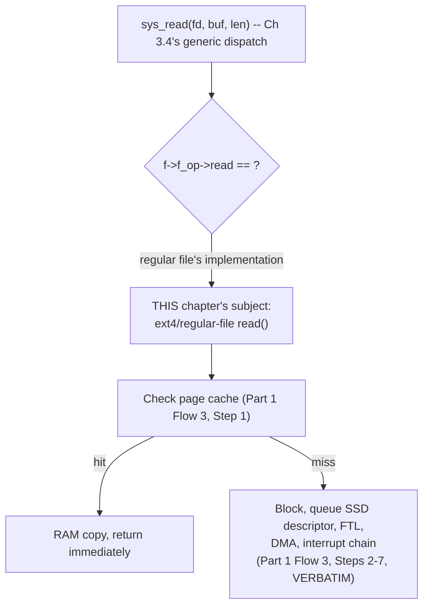

# PART 3 — File Descriptors

## Chapter 3.6 — Regular Files

### 🧠 One-Sentence Mental Model
> A "regular file" is simply the specific `file_operations`/`inode_operations` implementation (Chapters 3.4-3.5) that backs actual, persistent, byte-addressable data on a real storage device — and every mechanism Part 1 built in exhaustive detail (page cache, SSD descriptor rings, DMA, interrupts) is, precisely, what lives inside THIS ONE implementation's function-pointer table, not something `read()`/`write()` do generically.

### 🧒 Explain Like I'm Five
Remember the universal remote from Chapter 3.4? A "regular file" is what happens when that remote is pointed at an actual physical DVD player — pressing "play" genuinely spins a disc, reads real data off it, and takes real, measurable time. That's different from pointing the same remote at, say, a streaming app that just generates video on the fly. Both respond to the same "play" button, but only one of them is doing genuine physical-media I/O — that one is our "regular file."

### 🌍 Real-World Analogy
Think of a specific courier company within the international shipping analogy from Chapter 3.5 — say, the one that handles actual physical warehouse pickups and truck deliveries, as opposed to a "virtual" courier that just generates a tracking confirmation instantly with nothing physically moving. "Regular file" is the label for the genuinely-physical-warehouse courier — the one whose operations really do involve trucks, loading docks, and real transit time, mapped in our world onto disk seeks, the page cache, and DMA transfers.

### ❓ The Problem
Chapters 3.1-3.5 built the entire abstract machinery — fd, fd table, open file description, `struct file`, VFS — without ever concretely saying "and HERE is where a normal file, the kind everyone thinks of first when they hear 'file,' fits into all of this." This chapter closes that loop, and crucially, reveals that Part 1's entire Flow 3/4 trace (page cache check, SSD FTL, DMA, interrupts) was never generic `read()`/`write()` behavior — it was always specifically the regular-file `file_operations` implementation.

### 🔥 Why This Problem Matters
Without this chapter's precise placement, it's easy to walk away from Part 1 thinking "that's just what `read()` does" — which becomes actively confusing the moment you later read from a socket or a pipe (Chapters 3.7-3.8) and discover the mechanism is completely different. Pinning down exactly which layer Part 1's trace belongs to is what lets the rest of Part 3 make sense as "here are OTHER file types, with OTHER, genuinely different, implementations behind the exact same fd/read/write interface."

### 🕰 Historical Context
"Regular file" is a specific, formal POSIX classification (`S_ISREG` in the stat interface) distinguishing it from directories, device files, sockets, pipes, and symbolic links — all of which are also, in the Unix philosophy, accessed via file descriptors, but represent fundamentally different kinds of underlying things. This formal distinction exists precisely because programs sometimes genuinely need to know whether a given fd represents real, persistent, seekable data on disk versus something else entirely — the classification is load-bearing, not just descriptive trivia.

### 💡 The Naive Solution
Assume every read from a file descriptor behaves identically, taking roughly the same code path, regardless of what's actually behind it.

### ❌ Why the Naive Solution Fails
It obscures genuinely important behavioral differences: regular files support random-access seeking (`lseek()`) to any byte offset — sockets and pipes fundamentally do not, because they represent a stream, not addressable, persistent storage. Regular files have a well-defined size you can query — a socket's "size" is a meaningless concept. Regular files' data survives process exit — a pipe's data, unread, is simply lost when both ends close. Treating all fds as behaviorally identical means missing all of these real, consequential differences.

### ✅ The Better Solution
Recognize "regular file" as one specific, well-defined implementation among several (Chapters 3.7-3.9 cover the others), precisely characterized by: persistent, byte-addressable, seekable storage, backed by Part 1's full disk/page-cache/DMA machinery.

### 🧠 Core Concept
> **A regular file's `file_operations` and `inode_operations` implementations (Chapters 3.4-3.5) are precisely what Part 1's Flow 3 (`read()`) and Flow 4 (`write()`) traced in full mechanical detail: the page-cache check, the SSD descriptor-ring submission, the FTL translation, the DMA transfer, and the interrupt-driven wakeup chain. None of that machinery is generic `read()`/`write()` behavior — all of it is specifically what a regular file's implementation does when called through `struct file`'s dispatch.**

### 📐 Deep Technical Explanation

**The precise placement, made explicit:**



**How to read this diagram:** everything below "regular file's implementation" is Part 1's Flow 3, reproduced exactly — this chapter isn't introducing new mechanism, it's placing a precise label on mechanism you already fully understand, confirming that it belongs specifically here and not to `read()` in general.

**What specifically characterizes a regular file, behaviorally, versus other fd types (previewed fully in Chapters 3.7-3.9):**

```c
int fd = open("data.bin", O_RDONLY);

off_t pos = lseek(fd, 100, SEEK_SET);   // jump to byte 100 -- MEANINGFUL for
                                          // a regular file (random access to
                                          // persistent, addressable storage);
                                          // lseek() on a socket or pipe fd
                                          // fails with ESPIPE -- "illegal seek"

struct stat st;
fstat(fd, &st);
printf("size: %ld\n", st.st_size);       // a regular file has a well-defined
                                          // SIZE -- this concept doesn't apply
                                          // to a socket or pipe at all
```

**Why seekability is the deepest behavioral distinction, mechanically:** a regular file's data is genuinely, persistently addressable — byte 100 of `data.bin` means something concrete and stable, sitting at a specific (FTL-translated, Part 1 Chapter 1.6/1.10) location that can be reached again identically tomorrow. A socket's "stream" has no such persistent addressing — byte 100 of data received on a TCP connection isn't "stored" anywhere waiting to be re-requested; once read (or lost), it's gone from the kernel's perspective. This is a fundamental property difference, not just an API restriction — `lseek()` failing on a socket isn't an arbitrary limitation, it's because the underlying concept genuinely doesn't apply.

### ❌ Common Misconceptions
- ❌ **"The page cache, DMA, and interrupt machinery from Part 1 is what `read()` does in general."** — It's specifically what a REGULAR FILE's `file_operations.read` implementation does; sockets and pipes (Chapters 3.7-3.8) use entirely different mechanisms behind the identical `read()` call.
- ❌ **"Any file descriptor can be `lseek()`'d to an arbitrary position."** — Only types backed by genuinely persistent, addressable storage (regular files) support this meaningfully; sockets and pipes represent streams with no persistent addressing, and `lseek()` on them fails.
- ❌ **"A file's 'size' is a universal concept for any fd."** — It's meaningful specifically for regular files (and a few other seekable types); it doesn't apply to sockets or pipes, which have no fixed, queryable total size — only a current amount of buffered, unread data.
- ❌ **"'Regular file' just means 'not a directory.'"** — It's a specific, formal classification distinguishing it from directories AND from device files, sockets, pipes, and symbolic links — all of which are also accessible via file descriptors but represent genuinely different underlying implementations.

### 🧙 Wizard Insight
This chapter's real payoff is retroactive: it reframes everything Part 1 taught as a specific, well-scoped case rather than universal truth. The moment you internalize "Part 1's Flow 3/4 was always specifically about regular files," you're fully prepared for the genuine surprise of Chapters 3.7-3.8: that reading from a socket or a pipe involves almost none of that machinery — no page cache check in the same sense, no SSD descriptor rings, no FTL — while still being invoked through the exact same `read(fd, buf, len)` call. Recognizing which specific implementation you're dealing with, rather than assuming uniform behavior, is the practical skill this entire triad of chapters (3.6-3.8) is building.

### 🧠 Quiz
**Q1.** Was the page-cache-check-then-SSD-DMA machinery from Part 1's Flow 3 something `read()` does for every file descriptor, or something specific?
<details><summary>Answer</summary>Specific -- it's precisely the regular-file file_operations.read implementation. Other fd types (sockets, pipes) reach the same read() syscall entry point but dispatch to completely different implementations.</details>

**Q2.** Why does `lseek()` fail on a socket fd but succeed on a regular file fd?
<details><summary>Answer</summary>A regular file represents genuinely persistent, byte-addressable storage where "byte 100" is a stable, meaningful concept. A socket represents a stream with no persistent addressing -- once data is read or lost, there's nothing to seek back to, so the underlying concept of seeking doesn't apply, not just the API.</details>

**Q3.** What formal POSIX classification distinguishes a regular file from other fd-accessible things?
<details><summary>Answer</summary>S_ISREG (checked via stat()) -- distinguishing it from directories, device files, sockets, pipes, and symbolic links, all of which are also accessed via file descriptors but represent different underlying implementations.</details>

### 📌 Short Notes (Quick Reference)
- "Regular file" = the specific `file_operations`/`inode_operations` implementation for persistent, byte-addressable, seekable storage on a real device.
- Part 1's ENTIRE Flow 3/4 trace (page cache, SSD descriptor rings, FTL, DMA, interrupt chain) is precisely this implementation's behavior — never generic `read()`/`write()` machinery.
- Seekability (`lseek()`) and a well-defined size are the deepest behavioral markers of a regular file — both fail/don't apply for streams like sockets and pipes, because the underlying persistent-addressing concept genuinely doesn't exist for them.
- Chapters 3.7-3.9 cover the OTHER implementations behind the identical fd/read/write interface — expect genuinely different mechanisms, not variations on this chapter's.

### 🔗 What This Connects To Next
**Previous:** Part 3, Chapter 3.5 — VFS
**Current:** Part 3, Chapter 3.6 — Regular Files
**Next:** Part 3, Chapter 3.7 — Pipes (the first genuinely different implementation: no disk, no page cache, no DMA — just an in-kernel ring buffer)
