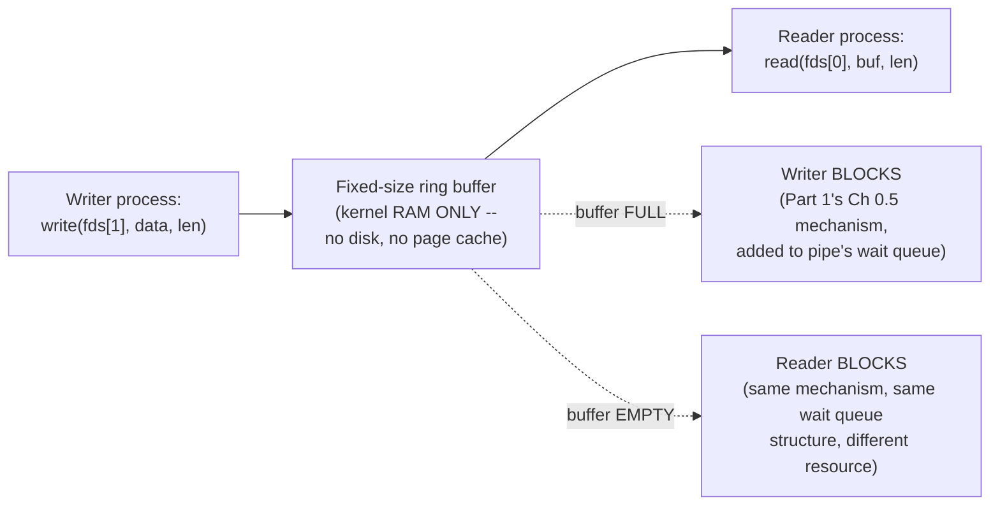

# PART 3 — File Descriptors

## Chapter 3.7 — Pipes

### 🧠 One-Sentence Mental Model
> A pipe is a fixed-size, in-kernel-RAM-only ring buffer with two file descriptors attached to it (one for writing in, one for reading out) — no disk, no page cache, no DMA, no device at all — proving concretely that Chapter 3.6's regular-file machinery was never a universal requirement for something to be accessed via `read()`/`write()`.

### 🧒 Explain Like I'm Five
Imagine a short, fixed-length pneumatic tube connecting two rooms — one person can post messages into one end, another person pulls messages out the other end, in the exact order they were posted. If the tube fills up completely, the poster has to wait until the puller takes something out before posting more. If the puller reaches in and the tube's empty, they wait until something's posted. There's no filing cabinet, no permanent storage anywhere — if a message sits fully un-pulled when both ends of the tube are sealed shut forever, it's simply gone.

### 🌍 Real-World Analogy
Think of a small dumbwaiter between a restaurant kitchen and the dining room — food goes in one side, comes out the other, strictly in order, with a hard physical size limit (it can only hold so many dishes at once before the kitchen staff have to wait for the dining room to clear space by taking dishes out). Nothing about a dumbwaiter involves a warehouse or long-term storage — it's pure, bounded, in-transit capacity between exactly two connected points.

### ❓ The Problem
Chapter 3.6 showed that regular files involve an entire stack of persistent-storage machinery — page cache, SSD descriptor rings, FTL, DMA. This chapter asks: is any of that actually *required* for something to be a valid, `read()`/`write()`-able file descriptor? Pipes are the clean, minimal counter-example that proves the answer is no.

### 🔥 Why This Problem Matters
Pipes are the literal connective tissue behind one of Unix's most iconic and heavily-used features — shell pipelines (`cmd1 | cmd2 | cmd3`) — and they're also the conceptual bridge to Part 26's producer/consumer patterns and bounded queues, which recur constantly in real concurrent system design well beyond shell scripting. Understanding pipes precisely, as a specific, minimal kernel object, demystifies both.

### 🕰 Historical Context
Pipes were part of Unix from remarkably early on, specifically to enable the shell's `|` operator — the philosophy of small, single-purpose programs that could be freely chained together depended entirely on having a cheap, kernel-provided mechanism for one program's stdout to become another's stdin without either program needing to know anything special about how the connection was implemented. This is precisely why pipes are accessed via the exact same `read()`/`write()`/file-descriptor interface as everything else in this part — the uniform API is what let pipe-connected programs be written with zero pipe-specific code inside them at all.

### 💡 The Naive Solution
Imagine implementing inter-process communication (getting bytes from one program to another) by having the writing program write to a temporary file on disk, and the reading program poll that file for new content.

### ❌ Why the Naive Solution Fails
This would involve real disk I/O (or at best page-cache-mediated RAM I/O with real disk-write semantics, Chapter 3.6's full machinery) for what's fundamentally a transient, in-memory handoff between two processes that are both alive and running *right now* — vastly more overhead than necessary, plus awkward cleanup semantics (when is it safe to delete the temp file?) and no natural backpressure (Chapter 0.4's concept: what stops the writer from getting arbitrarily far ahead of the reader?).

### ✅ The Better Solution
A dedicated kernel object: a small, fixed-size buffer living purely in kernel RAM, with built-in backpressure (a full buffer blocks the writer; an empty buffer blocks the reader) and automatic cleanup (the buffer is freed the moment both ends are closed) — no disk, no filesystem, no page cache involved at all.

### 🧠 Core Concept
> **A pipe's `file_operations` implementation reads from and writes to a fixed-size, in-kernel ring buffer (typically 64KB by default on Linux) — writing blocks (via a wait queue, Part 1's exact mechanism) when the buffer is full; reading blocks when it's empty. There is no disk, no page cache, no DMA engine, no interrupt chain anywhere in this implementation — it is pure, direct kernel-memory-to-kernel-memory handoff between two processes.**

### 📐 Deep Technical Explanation

**The structure, conceptually:**

```c
// GREATLY simplified conceptual view
struct pipe_inode_info {
    char    buffer[PIPE_BUF_SIZE];  // fixed-size ring buffer, IN KERNEL RAM ONLY
    size_t  read_pos, write_pos;    // ring buffer head/tail
    wait_queue_head_t wait;         // Part 1's EXACT wait queue mechanism,
                                     // reused here for a totally different purpose
};
```

**Creating and using a pipe:**

```c
int fds[2];
pipe(fds);              // fds[0] = read end, fds[1] = write end
                         // BOTH are file descriptors (Ch 3.1), but their
                         // file_operations tables (Ch 3.4) are the PIPE
                         // implementation, not the regular-file one

// in a child process (after fork(), Ch 2.1):
write(fds[1], "hello", 5);   // copies bytes DIRECTLY into the ring buffer
                              // -- no disk, no page cache, no DMA --
                              // if the buffer is full: BLOCK (Part 1's Ch 0.5
                              // mechanism, task_struct saved, added to
                              // the pipe's wait queue, EXACTLY as in Flow 3)

// in the parent process:
read(fds[0], buf, 5);        // copies bytes DIRECTLY out of the ring buffer
                              // if the buffer is empty: BLOCK, same mechanism
```



**How to read this diagram:** compare this directly to Part 1's Flow 3 diagram for a regular file — the blocking mechanism itself (save registers, add to wait queue, `wake_up()` on the relevant event) is **identical**, because Chapter 2.10's wait-queue machinery is genuinely general-purpose, used here for an entirely different kind of resource (buffer space) than a page-cache miss. What's different is everything *below* that shared mechanism: there's no interrupt chain here, no DMA, no device at all — when the reader consumes some bytes, freeing buffer space, the kernel's `write()` implementation directly calls `wake_up()` on the writer's wait queue **from ordinary kernel code**, not from an interrupt handler, because there's no hardware device involved in a pipe at all.

**The shell pipeline connection, made concrete:**

```c
// approximately what a shell does to implement:  cmd1 | cmd2
int fds[2];
pipe(fds);

if (fork() == 0) {              // child A will run cmd1
    dup2(fds[1], 1);            // Ch 3.2's dup2(): cmd1's stdout -> pipe's write end
    close(fds[0]); close(fds[1]);
    execve("cmd1", ...);        // cmd1 writes to fd 1, unaware it's a pipe at all
}
if (fork() == 0) {              // child B will run cmd2
    dup2(fds[0], 0);            // cmd2's stdin -> pipe's read end
    close(fds[0]); close(fds[1]);
    execve("cmd2", ...);        // cmd2 reads from fd 0, unaware it's a pipe at all
}
```

Neither `cmd1` nor `cmd2` contains a single line of pipe-specific code — they just read from fd 0 and write to fd 1 like any well-behaved Unix program. The entire "connection" is built purely out of Chapter 3.2's `dup2()` table manipulation plus this chapter's pipe object — a direct, concrete payoff of every mechanism Part 3 has built so far, working together.

### ❌ Common Misconceptions
- ❌ **"A pipe's data is buffered somewhere on disk in case the machine loses power."** — It exists ONLY in kernel RAM, with no persistence guarantee whatsoever; data sitting unread in a pipe when both ends close (or the machine crashes) is simply gone.
- ❌ **"You can `lseek()` on a pipe to re-read earlier data."** — Pipes are pure streams with no persistent addressing, exactly like sockets (Chapter 3.6's distinction) — `lseek()` fails with `ESPIPE`.
- ❌ **"A pipe has unlimited capacity — writers never block."** — It has a fixed size (commonly 64KB on Linux, tunable); a writer that outpaces the reader WILL block once the buffer fills, which is precisely the backpressure mechanism (Chapter 0.4's concept) that prevents a fast producer from consuming unbounded memory.
- ❌ **"Pipe blocking uses some special pipe-specific mechanism, different from regular file blocking."** — It uses the exact same wait-queue/`task_struct`/`wake_up()` machinery from Part 1/Chapter 2.10 — the mechanism is genuinely general-purpose; only the specific event being waited for (buffer space vs. a page-cache miss) differs.

### 🧙 Wizard Insight
Pipes are the cleanest possible proof that Part 1's Flow 3/4 machinery (page cache, DMA, interrupts) was never a prerequisite for "being a valid file descriptor" — they demonstrate that the truly universal, load-bearing mechanism underneath ALL of Part 3's file types is actually much smaller: a `struct file` with a `file_operations` table (Chapter 3.4), and, whenever blocking is needed, the wait-queue mechanism from Part 1/Chapter 2.10. Everything else — disks, DMA, network protocols — is optional, type-specific machinery bolted onto that same small, universal core. Recognizing this small universal core is what will make Chapter 3.8's sockets, and even Part 4's earliest server code, feel like familiar variations rather than new territory.

### 🧠 Quiz
**Q1.** What happens, mechanically, to data written into a pipe that's never read before both ends are closed?
<details><summary>Answer</summary>It's simply lost -- a pipe's buffer exists only in kernel RAM with no persistence guarantee; there's no disk backing, no page cache, nothing to recover it from once both ends close.</details>

**Q2.** Why does a shell pipeline (`cmd1 | cmd2`) require zero pipe-specific code inside either `cmd1` or `cmd2`?
<details><summary>Answer</summary>Because the shell uses dup2() (Chapter 3.2) to make the pipe's write end fd 1 (stdout) for cmd1 and the read end fd 0 (stdin) for cmd2 BEFORE exec()-ing them -- both programs just read/write their standard fds normally, unaware anything special is connected to them.</details>

**Q3.** When a pipe's buffer is full and the writer blocks, is this a fundamentally different blocking mechanism than a regular file's page-cache-miss blocking?
<details><summary>Answer</summary>No -- it's the identical wait-queue/task_struct/wake_up() mechanism from Part 1 and Chapter 2.10, just applied to a different resource (buffer space rather than a page-cache miss) and woken by ordinary kernel code (the reader consuming bytes) rather than a hardware interrupt.</details>

### 📌 Short Notes (Quick Reference)
- A pipe is a fixed-size (commonly 64KB), in-kernel-RAM-only ring buffer with two fds attached — no disk, no page cache, no DMA, no device.
- Full buffer blocks the writer; empty buffer blocks the reader — real backpressure (Ch 0.4), using the EXACT SAME wait-queue mechanism as Part 1's regular-file blocking (Ch 2.10), just for a different resource and woken by ordinary kernel code instead of an interrupt.
- `lseek()` fails on a pipe — pure stream, no persistent addressing, same reason as sockets (Ch 3.6).
- Shell pipelines (`cmd1 | cmd2`) are built purely from `pipe()` + `dup2()` (Ch 3.2) — neither connected program contains any pipe-specific code.
- Pipes prove that Part 1's disk/DMA/interrupt machinery is NOT a universal requirement for valid fd-based I/O — the true universal core is just `struct file`/`file_operations` + the wait-queue mechanism.

### 🔗 What This Connects To Next
**Previous:** Part 3, Chapter 3.6 — Regular Files
**Current:** Part 3, Chapter 3.7 — Pipes
**Next:** Part 3, Chapter 3.8 — Sockets (the fd type this ENTIRE course's Part 4 onward is really about — combining pipe-like in-kernel buffering with real network-device I/O)
