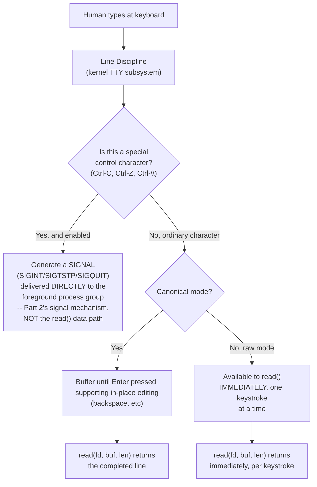

# PART 3 — File Descriptors

## Chapter 3.9 — Terminals

### 🧠 One-Sentence Mental Model
> A terminal (TTY) file descriptor is yet another distinct `file_operations` implementation — one built around a human typing at a keyboard rather than a device or another process — and its most distinctive feature, line discipline, is a configurable layer that can buffer input by whole lines and translate specific keystrokes (like Ctrl-C) into actual signals sent to your process, something no other fd type in this part does.

### 🧒 Explain Like I'm Five
Imagine a real, live telegraph operator sitting between you and the "read" button — instead of every single keystroke you type going straight through immediately, this operator waits until you've finished a whole sentence (pressed Enter) before passing anything along, AND has standing instructions that if you ever tap out a specific special signal (like Ctrl-C), they should immediately run and alert the recipient directly, urgently, bypassing the normal message queue entirely. A terminal fd has exactly this kind of "operator" sitting in the middle, called the line discipline.

### 🌍 Real-World Analogy
Think of a customer service chat window that only sends your message to the support agent once you hit "send" (buffering by line), but ALSO has a special "emergency escalate" button that, if pressed, immediately alerts a supervisor through an entirely separate urgent channel, interrupting whatever the agent was doing — rather than just adding another line to the normal chat queue. A terminal's Ctrl-C handling works exactly like that escalate button: it doesn't arrive as ordinary input data at all; it's translated into a signal (Part 2's territory) delivered directly to your process.

### ❓ The Problem
Chapters 3.6-3.8 covered three `file_operations` implementations, each progressively less like traditional "file" storage (regular file → pipe → socket). This chapter covers a fourth, whose defining characteristic is neither storage nor network transmission, but interactivity with a live human — and specifically asks: how does typing Ctrl-C in a terminal actually stop a running program, when nothing about `read()`/`write()` as covered so far has anything to do with signals at all?

### 🔥 Why This Problem Matters
Every time you've run any program from a shell throughout learning any of the prior chapters, its stdin/stdout/stderr (Chapter 3.2's pre-populated fds 0/1/2) have very likely been connected to a terminal — this chapter is where that everyday, constant background fact finally gets its own precise explanation, including why terminal-connected programs behave subtly differently (line-buffered input, Ctrl-C actually working) than the same programs run with input/output redirected to files or pipes.

### 🕰 Historical Context
Terminals trace back to literal physical hardware — teletype machines, later video display terminals — connected to early Unix systems over serial lines, where a human was directly, physically present, typing in real time. The kernel-level abstraction handling this (the TTY subsystem, including line discipline) was built specifically to handle the genuinely different requirements of live human interaction: the ability to edit a line before submitting it (backspace working sensibly), and the ability to send an urgent, out-of-band interrupt (Ctrl-C) that bypasses normal buffered input entirely. Modern terminal emulator windows still go through this exact same subsystem, decades later, for compatibility with the enormous ecosystem of software written against it.

### 💡 The Naive Solution
Imagine a terminal fd worked exactly like a pipe (Chapter 3.7) — every keystroke immediately available to `read()` the instant it's typed, with no special handling of any particular key.

### ❌ Why the Naive Solution Fails
Without line buffering, every single program reading from a terminal would need to implement its own backspace/line-editing logic from scratch — genuinely painful, duplicated work across virtually every terminal program ever written. Without special Ctrl-C handling, there would be no reliable way for a user to interrupt a program that's stuck in a tight loop or otherwise not currently checking its input at all — ordinary buffered data sitting unread in a pipe-like buffer wouldn't reach a program that isn't actively reading right now, but a signal (Part 2's mechanism) can interrupt a running program regardless of what it's currently doing.

### ✅ The Better Solution
Insert a configurable intermediate layer — the **line discipline** — between the raw keyboard input and the reading program: by default, buffer input by whole lines (supporting in-place editing before Enter is pressed) and translate specific designated keystrokes into signals delivered directly and immediately to the foreground process, entirely separate from the normal `read()` data path.

### 🧠 Core Concept
> **A terminal fd's default behavior (canonical/cooked mode) buffers input line-by-line via the line discipline, only making a full line available to `read()` once Enter is pressed — and separately, specific control characters (Ctrl-C, Ctrl-Z, Ctrl-\\) are intercepted by the line discipline and converted into signals (SIGINT, SIGTSTP, SIGQUIT) sent directly to the foreground process group, never appearing as ordinary data in the `read()` stream at all.**

### 📐 Deep Technical Explanation

**The two modes, precisely:**

```c
// CANONICAL (cooked) mode -- the DEFAULT for an interactive terminal
// -- read() blocks until an entire LINE is available (Enter pressed)
// -- backspace, line editing handled BY THE LINE DISCIPLINE, before
//    your program ever sees the data
// -- Ctrl-C does NOT appear in the data your read() call returns --
//    it's intercepted and converted into SIGINT instead

// RAW mode -- explicitly requested (many interactive programs, like
// text editors, request this) via termios settings
// -- read() returns individual keystrokes IMMEDIATELY, no line buffering
// -- Ctrl-C's special signal-generating behavior can ALSO be disabled,
//    letting the program see the raw Ctrl-C byte itself if it wants to
//    (this is how a program like vim can use Ctrl-C for its own purposes)
```



**How to read this diagram:** the critical fork is the "special control character" check — this is what makes terminals genuinely different from every other fd type in this part. Regular files, pipes, and sockets have no equivalent concept: nothing about their `read()`/`write()` implementation ever inspects the *content* of data flowing through to trigger a side effect like signal delivery — this behavior is unique to terminals' line discipline layer.

**Why Ctrl-C works even when a program is stuck in an infinite loop, never calling `read()`:** because the interception happens in the kernel's line discipline, entirely independent of whether the target program is currently blocked in a `read()` call or busy doing something else entirely (a tight compute loop, for instance). The kernel delivers `SIGINT` to the foreground process group directly — this is Part 2's signal-delivery mechanism, genuinely separate machinery from the blocking-I/O wait-queue mechanism this entire part has otherwise focused on. A program doesn't need to be "listening" via `read()` for Ctrl-C to reach it; signal delivery is a different channel entirely.

```c
// why `cat` (no special handling) behaves differently from a text editor:
// cat, run interactively, uses default canonical mode + default signal
// handling -- Ctrl-C sends SIGINT, which (with no custom handler installed)
// terminates cat immediately, per the DEFAULT action of SIGINT (Part 2)

// vim, on startup, explicitly puts the terminal into RAW mode and
// typically installs a custom SIGINT handler (or disables Ctrl-C's
// signal-generating behavior entirely) -- letting it use Ctrl-C (or any
// key) for its own editing purposes, seeing the raw byte via read()
// instead of being killed by the default SIGINT behavior
```

### ❌ Common Misconceptions
- ❌ **"Ctrl-C sends its byte value through the normal `read()` data stream, and it's up to the program to notice it and quit."** — In default canonical mode, Ctrl-C never appears in `read()`'s data at all — it's intercepted by the line discipline and converted directly into a `SIGINT` signal, a completely separate delivery mechanism (Part 2).
- ❌ **"A program has to be actively calling `read()` for Ctrl-C to interrupt it."** — Signal delivery (Part 2's mechanism) is independent of whether the target process is currently blocked in a syscall or doing anything else — this is precisely why Ctrl-C can interrupt a program stuck in a tight, non-I/O compute loop.
- ❌ **"All terminal-connected programs buffer input line-by-line."** — Canonical (line-buffered) mode is the DEFAULT, but interactive programs like text editors explicitly switch to raw mode via `termios` settings specifically to get immediate, per-keystroke input and often custom control over what would otherwise be signal-generating characters.
- ❌ **"Terminal behavior (line buffering, Ctrl-C) is something every fd type has, just less commonly used."** — It's genuinely unique to terminals' line discipline layer — regular files, pipes, and sockets have no equivalent content-inspecting, signal-generating mechanism at all.

### 🧙 Wizard Insight
Understanding the line discipline is what finally explains a whole category of "why does my program behave differently when I redirect its input/output vs. running it interactively" observations that every programmer eventually notices but rarely investigates precisely. A program reading from a terminal gets line-buffered, editable input and Ctrl-C-interruptibility "for free," courtesy of the line discipline — the SAME program, with its stdin redirected from a file or a pipe (Chapters 3.6-3.7, neither of which has a line discipline at all), loses all of that behavior instantly, because there's no line discipline layer sitting in front of a file or pipe's data. This single fact explains a large fraction of "it worked when I ran it directly but broke when I piped it into something else" debugging sessions.

### 🧠 Quiz
**Q1.** Does Ctrl-C's SIGINT delivery go through the same `read()` data path as ordinary typed characters?
<details><summary>Answer</summary>No -- in default canonical mode, the line discipline intercepts Ctrl-C BEFORE it would reach read()'s data stream, converting it directly into a SIGINT signal delivered to the foreground process group -- a completely separate delivery mechanism from the read()/write() data path.</details>

**Q2.** Why can Ctrl-C interrupt a program that's stuck in an infinite compute loop and never calls `read()`?
<details><summary>Answer</summary>Because signal delivery (Part 2's mechanism) is independent of whether the target process is currently blocked in any particular syscall -- the kernel delivers SIGINT to the foreground process group directly, regardless of what the process is currently doing.</details>

**Q3.** Why does a text editor like vim typically switch the terminal into raw mode?
<details><summary>Answer</summary>To get immediate, per-keystroke input (rather than waiting for a full line) and to gain the ability to see and handle keys like Ctrl-C itself, rather than having them intercepted by the line discipline and converted into a SIGINT that would otherwise terminate the program via its default signal action.</details>

### 📌 Short Notes (Quick Reference)
- A terminal fd's `file_operations` implementation is built around a configurable **line discipline** layer, unique among the fd types in this part.
- Default (canonical) mode: buffers input by whole line, supports in-place editing (backspace) before `read()` ever sees it.
- Special control characters (Ctrl-C, Ctrl-Z, Ctrl-\\) are intercepted by the line discipline and converted into SIGNALS (SIGINT, SIGTSTP, SIGQUIT — Part 2's mechanism), never appearing as ordinary data in `read()`'s stream.
- This is why Ctrl-C can interrupt a program even when it's not currently calling `read()` at all — signal delivery is a separate channel from the blocking-I/O data path.
- Raw mode (explicitly requested via `termios`, used by interactive programs like text editors) disables line buffering and can disable Ctrl-C's signal-generating behavior, exposing the raw byte to the program instead.
- No other fd type (regular file, pipe, socket) has an equivalent content-inspecting, signal-generating layer — this behavior is genuinely unique to terminals.

### 🔗 What This Connects To Next
**Previous:** Part 3, Chapter 3.8 — Sockets
**Current:** Part 3, Chapter 3.9 — Terminals
**Next:** Part 3, Chapter 3.10 — fd Lifecycle (tying every fd type in this part together: exactly when an fd is created, duplicated, inherited, and finally, truly closed)
