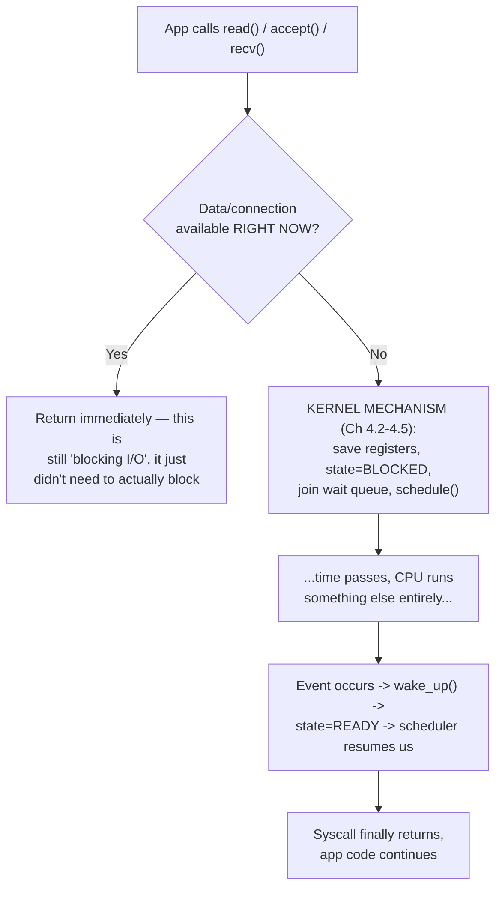

# PART 4 — Blocking I/O

## Chapter 4.1 — Blocking

### 🧠 One-Sentence Mental Model
> Blocking means a specific thread's instruction pointer simply stops advancing until an event happens — the thread is physically removed from the CPU and re-added later, exactly as traced in Part 1's Flow 3 and formalized in Part 2's Chapter 2.9, and Part 4's entire job is to look at that one mechanism from every angle until it's completely unmysterious.

### 🧒 Explain Like I'm Five
You already built every piece of this machine in Parts 1–3: a CPU that fetches-decodes-executes, a scheduler that can pause and resume threads, and file descriptors that dispatch to different kinds of "wait for this." Blocking I/O is simply what happens when you call `read()` or `accept()` and there's nothing ready yet — the thread you're running on gets set aside, like a paused video game, and something else runs on the CPU until your data shows up.

### 🌍 Real-World Analogy
Ordering food at a sit-down restaurant with no buzzer system: you tell the waiter your order, then you simply sit and do nothing else until the food arrives — you can't leave, check your phone for other tasks, or serve yourself in the meantime. That's blocking: total, exclusive commitment of this one "thread" (you) to this one pending event (food arriving), for however long it takes.

### ❓ The Problem
Part 0 established that I/O timing is decoupled from CPU timing (Chapter 0.1) and gave hard numbers for how large that gap can be (Chapter 0.2). Something has to happen to the CPU during that gap. Part 4 is entirely about the simplest possible answer: **the calling thread itself just stops**, and picks up exactly where it left off once the answer arrives.

### 🔥 Why This Problem Matters
Blocking is not a "beginner mistake" to be immediately replaced — it is the correct, cheapest-possible mechanism for the extremely common case of "this thread has exactly one thing to do right now, and nothing else useful to do while waiting." Every later Part in this course (nonblocking, select, poll, epoll, io_uring) exists specifically to handle the cases where blocking's one weakness — *tying up an entire thread per outstanding operation* — becomes unaffordable. Understanding blocking precisely is the baseline against which every later mechanism's benefit is measured.

### 🕰 Historical Context
Blocking I/O predates almost everything else in this course — it's how the very first timesharing Unix systems worked in the 1970s, because the alternative (busy-polling) wastes the exact resource (CPU time) that timesharing exists to share fairly among users. The Unix scheduler's ability to run *someone else* while one process blocks is arguably the single most important idea in the entire OS's design, and it is inherited completely unchanged into 2020s Linux: the mechanism you traced in Part 1's Flow 3 (`task_struct`, wait queues, `wake_up()`) is architecturally the same one running today.

### 💡 The Naive Solution
There isn't a "more naive" solution than blocking itself for the single-thing-at-a-time case — it *is* the naive-but-correct baseline. The naivety shows up one level higher: naively reaching for blocking calls when you actually need to handle many concurrent operations (Chapters 4.8–4.9, and the failure this forces, motivate Part 5 onward).

### ❌ Why the Naive Solution (Eventually) Fails
A single blocked thread costs nothing extra while it's idle — but a thread itself is not free to create or keep around (a fixed-size stack, kernel scheduling bookkeeping, a `task_struct`, Chapter 2.1). The moment you need **N concurrent outstanding operations**, the thread-per-operation model (Chapters 4.8–4.9) needs N threads or processes, and N doesn't scale gracefully past a few thousand on real hardware — this is the concrete failure mode Part 4's final chapters walk you into on purpose, so Part 5's motivation is earned, not assumed.

### ✅ The Better Solution (Preview Only)
Give one thread the ability to be "interested in" many pending operations at once, instead of needing one whole thread per operation (nonblocking + select/poll/epoll, Parts 5–8), or hand the *entire* operation to the kernel and only be notified on completion (io_uring, Part 14). Part 4 is not solving this yet — it is making sure the thing being replaced is fully, mechanically understood first.

### 🧠 Core Concept
> **"Blocking" is not a property of an I/O device or a file — it is a property of a specific syscall's behavior when its data isn't immediately available: the kernel changes the calling thread's `task_struct.state`, removes it from the scheduler's run queue, and does not restore it until the awaited event occurs.** Chapters 4.2–4.5 unpack this sentence phrase by phrase.

### 📐 Deep Technical Explanation

**The three logically distinct things people conflate under "blocking":**

| Layer | What actually happens |
|---|---|
| **API contract** | The function (`read()`, `accept()`, `recv()`) is *documented* to not return until it has a result or an error — this is a promise about the interface, not a mechanism. |
| **Kernel mechanism** | The specific implementation of "not returning yet" is: save this thread's registers, mark it `TASK_INTERRUPTIBLE` or `TASK_UNINTERRUPTIBLE` (Chapter 2.9), add it to a wait queue tied to the resource (Chapter 2.10), call `schedule()`. |
| **Hardware reality** | While blocked, this thread's instructions genuinely do not exist anywhere on any CPU core — Part 1's exact phrase — until some *other* event (an interrupt, another thread's `wake_up()` call) makes the scheduler eligible to restore it. |

**How to read this diagram:** the crucial, often-missed point is the top decision diamond — **blocking I/O does not mean "always blocks."** A blocking `read()` call that happens to find data already buffered returns instantly, taking the left branch every time; only when nothing's ready does the expensive right-hand mechanism from Parts 1–2 actually engage. "Blocking" describes what the API is *allowed* to do when it must wait, not a guarantee that it always will.

### ❌ Common Misconceptions
- ❌ **"Blocking I/O always takes a long time."** — Most blocking calls in a healthy system return almost immediately (cache hits, already-buffered data); blocking is a *contingency*, not a promise of delay.
- ❌ **"Blocking wastes CPU."** — A properly blocked thread consumes ~0% CPU (Chapter 0.1's quiz) — the opposite failure mode, *busy-polling*, is what actually wastes CPU (Part 5).
- ❌ **"Blocking is obsolete/bad practice."** — It's the correct, simplest, cheapest mechanism for the single-operation-at-a-time case; it only becomes wrong at high *concurrency*, not by itself.
- ❌ **"Every syscall can block."** — Whether a given call can block is specific to the call and the file type (Part 3's `file_operations` dispatch) — some operations (like most `write()`s to a pipe with space available) essentially never block in practice.
- ❌ **"Nonblocking I/O is strictly better than blocking I/O."** — It trades one cost (a tied-up thread) for another (application-level complexity, potential busy-waiting) — Part 29's decision framework treats this as a genuine trade-off, not a strict improvement.

### 🧙 Wizard Insight
Every "which I/O model should I use?" decision in real systems engineering ultimately reduces to a single question this chapter poses precisely: **how many operations do you realistically need outstanding at once, and is a whole OS thread an acceptable cost per outstanding operation?** If the answer is "a handful," blocking I/O with a thread or two is not a compromise — it is the *correct* engineering choice, full stop, and reaching for epoll or io_uring there is needless complexity. Wizards reach for the fancier mechanisms because the *concurrency number* demands it, never by default.

### 🧠 Quiz
**Q1.** Does a blocking `read()` call always suspend the calling thread?

Answer
No — if data is already available (e.g., already sitting in a buffer), it returns immediately without ever invoking the block/wait-queue/schedule() mechanism.

**Q2.** What real, measurable resource does the thread-per-operation model consume that eventually limits its scalability?

Answer
Threads themselves — each has a fixed-size stack (commonly 1-8MB virtual, though only touched pages cost real RAM), a task_struct, and real scheduler bookkeeping weight; thousands of them strain the OS well before any single blocking call's cost becomes the bottleneck.

**Q3.** Is blocking I/O "worse" than nonblocking I/O in general?

Answer
No — it's a trade-off, not a strict ordering: blocking is simpler and cheaper per-operation at low concurrency; nonblocking/multiplexed models trade that simplicity for the ability to handle far higher concurrency per thread.

### 📌 Short Notes (Quick Reference)
- Blocking = a specific thread's execution pauses (removed from the CPU entirely) until an awaited event occurs — the mechanism traced fully in Part 1 Flow 3 and formalized in Part 2 Ch 2.9-2.10.
- It's an API *contract* ("may not return immediately"), backed by a kernel *mechanism* (save state, wait queue, `schedule()`), which has a hardware *reality* (the thread's instructions exist nowhere on any CPU while blocked).
- Blocking calls often DON'T block in practice — only when the data/resource genuinely isn't ready yet.
- Blocking is cheap on CPU but costs one whole thread per outstanding operation — the sole reason it eventually stops scaling (Chapters 4.8-4.9).
- Not "bad" — the correct default for low concurrency; the rest of this course exists only for when concurrency gets large.

### 🔗 What This Connects To Next
**Previous:** Part 3, Chapter 3.10 — fd Lifecycle
**Current:** Part 4, Chapter 4.1 — Blocking
**Next:** Part 4, Chapter 4.2 — What Does "Blocked" Actually Mean? (we open up the exact `task_struct` state machine and wait-queue mechanics behind the word "blocked," reusing and cross-referencing Part 1/Part 2's exact diagrams)
