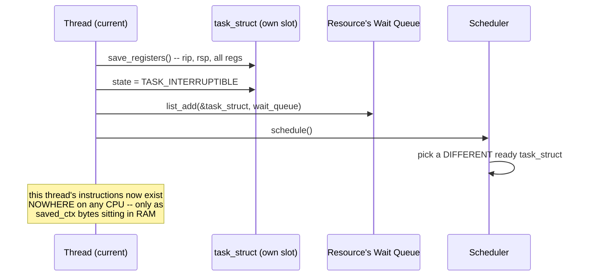

# PART 4 — Blocking I/O

## Chapter 4.2 — What Does "Blocked" Actually Mean?

### 🧠 One-Sentence Mental Model
> "Blocked" is a precise, four-part kernel event — register save, state-flag change, wait-queue insertion, and `schedule()` — not a vague synonym for "paused," and every one of those four parts was already fully traced in Part 1's Flow 3 and Part 2's Chapters 2.9-2.10; this chapter's only job is to point at each part explicitly, with nothing new invented.

### 🧒 Explain Like I'm Five
Saying a thread is "blocked" is like saying a video game is "paused" — but you should be able to answer: paused *where, exactly*? What happened to the screen? Who's allowed to un-pause it? For a thread, the precise answers are: its exact register values (including the instruction it's mid-way through) get written into its own `task_struct`, a status flag flips, its "name" gets written onto a specific waiting-list, and the CPU immediately moves on to something else.

### 🌍 Real-World Analogy
A hospital patient being put under general anesthesia mid-surgery isn't just "asleep" in some generic sense — there's a precise chart entry (vitals, exact drug dosage, exact time), a specific ward they're wheeled to, and a specific trigger (surgeon's signal) that starts the waking-up process. "Blocked" deserves exactly that same precision: a specific data structure holds the state, a specific list holds the "waiting for" record, and a specific event triggers resumption.

### ❓ The Problem
Chapter 4.1 used the word "blocked" freely, the way most explanations do, without pinning down what changes, where, and who reads it later. Without that precision, "the interrupt handler wakes the thread up" (a common but imprecise phrase) sounds mysterious. This chapter removes the mystery by naming the exact fields and structures involved — all of which you've already seen in Parts 1-2, just not assembled into one focused answer to "what does blocked actually mean?"

### 🔥 Why This Problem Matters
Every bug category from "why is my server hanging," to "why did that thread never wake up," to entire classes of production incidents involving stuck D-state processes (Chapter 2.9) traces back to a precise, mechanical failure in one of these four steps. You cannot debug what you cannot name precisely.

### 🕰 Historical Context
The specific data structure names (`task_struct`, wait queues) are Linux-specific implementation details, but the *four-step shape* — save state, mark unrunnable, record what you're waiting for, yield the CPU — is universal across essentially every general-purpose OS ever built, because it falls directly out of the physical constraint from Part 0: a CPU core can only execute one instruction stream at a time, so "pausing" one stream to run another has always required *somewhere* to put the paused stream's exact state.

### 💡 The Naive Solution
Treat "blocked" as a black box: "the kernel handles it." This is explicitly the failure mode Part 1's `# DO NOT HIDE COMPLEXITY` principle was written to prevent.

### ❌ Why the Naive Solution Fails
"The kernel handles it" gives you no way to reason about *when* a blocked thread will resume, why a D-state process resists `SIGKILL` (Chapter 2.9), or how two different resources (a page cache miss vs. an empty pipe, Chapter 3.7) can use "the same mechanism" while waking up through completely different trigger paths.

### ✅ The Better Solution
Name and trace all four steps explicitly, every time, using the exact structures already built in Parts 1-2 — no new machinery needed here.

### 🧠 Core Concept
> **Blocking a thread is: (1) save its full register context into `task_struct.saved_ctx`; (2) set `task_struct.state` to `TASK_INTERRUPTIBLE` or `TASK_UNINTERRUPTIBLE`; (3) add a pointer to this `task_struct` onto the specific resource's wait queue; (4) call `schedule()` to hand the CPU to a different runnable thread.**

### 📐 Deep Technical Explanation

**The four steps, code-level, exactly as first shown in Part 1's Flow 3:**

```c
// step 1 -- SAVE REGISTERS (Part 1, Ch 1.2's context-switch mechanism)
current->saved_ctx.rip = /* exact instruction we're paused at */;
current->saved_ctx.rsp = /* current stack pointer */;
current->saved_ctx.rax /* ...every general register... */;

// step 2 -- MARK UNRUNNABLE (Ch 2.9)
current->state = TASK_INTERRUPTIBLE;   // or TASK_UNINTERRUPTIBLE

// step 3 -- JOIN THE SPECIFIC RESOURCE'S WAIT QUEUE (Ch 2.10)
list_add(&current->wait_link, &resource->wait_queue);  // NOT a global list

// step 4 -- YIELD THE CPU
schedule();   // picks a DIFFERENT ready task_struct, restores ITS saved_ctx
```



**How to read this diagram:** every arrow above is ordinary kernel *code* running ON the CPU, right up until `schedule()` actually switches away — there's no separate "blocking hardware," it's the same fetch-decode-execute cycle from Chapter 1.1, just running the specific kernel function that happens to do this bookkeeping. The instant after `schedule()` restores a *different* thread's context, the paused thread's existence is purely data — the exact phrase used in Part 1's confusion-resolution section.

**Why the wait queue is per-resource, not global (recap from Part 3's expanded note):** if there were one giant system-wide wait list, waking ANY event would require scanning every sleeping thread to check "is this one of mine?" — an O(n) scan on every single wakeup. Attaching the wait queue directly to the resource (`socket->wait_queue`, `page->wait_queue`, `pipe->wait_queue`) makes waking O(waiters-on-this-resource) instead — this is precisely why Chapter 2.10 emphasized "a specific resource," not "a global sleep list."

**The two flavors, and why the distinction is load-bearing here:**

| State | Can a signal interrupt it? | Typical use |
|---|---|---|
| `TASK_INTERRUPTIBLE` | Yes — a pending signal wakes it early, syscall returns `EINTR` | Almost all blocking I/O: `read()`, `recv()`, `accept()` |
| `TASK_UNINTERRUPTIBLE` (D-state) | No — not even `SIGKILL` | Short, must-complete kernel-internal waits (e.g., mid-way through a low-level disk operation) |

This is exactly Chapter 2.9's distinction, now placed precisely into the four-step sequence above: step 2 is *where* this choice is made, and it's chosen by the specific kernel code path doing the blocking, not by your application.

### ❌ Common Misconceptions
- ❌ **"'Blocked' and 'sleeping' are different things."** — In this context they're the same event described two ways; some kernel documentation uses "sleeping" for the same `TASK_INTERRUPTIBLE`/`TASK_UNINTERRUPTIBLE` states.
- ❌ **"The thread's stack/local variables disappear while blocked."** — Only the *registers* are saved elsewhere; the stack itself is ordinary process memory (Chapter 2.3's address space) and is untouched, still sitting exactly where it was — the saved `rsp` register just points back to it on resume.
- ❌ **"Any thread can be woken by any wake_up() call."** — Only `wake_up()` on the SPECIFIC wait queue this thread joined in step 3 affects it — this is exactly why the resource-specific wait queue from Chapter 2.10 matters.
- ❌ **"A blocked thread is still 'a little bit running.'"** — No — per Part 1's precise phrasing, its instructions exist nowhere on any CPU at all during this period; it is purely a data record (`task_struct` + its wait-queue entry) until resumed.
- ❌ **"schedule() is only called when blocking."** — `schedule()` is the general-purpose "run something else now" function, also called on preemption (Chapter 2.8) and voluntary yields — blocking is just one of several reasons it's invoked.

### 🧙 Wizard Insight
The precision this chapter insists on — four named steps, not a vague "it pauses" — is exactly what lets you correctly answer questions like "can I `Ctrl-C` a thread stuck reading from a slow NFS mount?" The answer hinges entirely on which of the two state flavors (interruptible vs. uninterruptible) that specific blocking code path chose in step 2 — a detail invisible unless you insist on this level of mechanical precision every time the word "blocked" comes up.

### 🧠 Quiz
**Q1.** Name, in order, the four things that happen when a thread blocks.
<details><summary>Answer</summary>(1) Save registers into task_struct.saved_ctx, (2) set task_struct.state to TASK_INTERRUPTIBLE/UNINTERRUPTIBLE, (3) add the task_struct to the specific resource's wait queue, (4) call schedule().</details>

**Q2.** Why is the wait queue attached to the specific resource rather than being one global list?
<details><summary>Answer</summary>So that waking one event only has to walk the (usually short) list of threads waiting on THAT resource, rather than scanning every sleeping thread system-wide to check relevance -- O(waiters-here) instead of O(all sleeping threads).</details>

**Q3.** What happens to a thread's stack while it's blocked?
<details><summary>Answer</summary>Nothing -- the stack is ordinary process memory and is untouched; only the register values (including the stack pointer itself) are saved into the task_struct, and restoring them on wakeup naturally points back at the same, unchanged stack.</details>

### 📌 Short Notes (Quick Reference)
- "Blocked" = 4 precise steps: save registers → set state (INTERRUPTIBLE/UNINTERRUPTIBLE) → join the resource's wait queue → schedule().
- All four steps are ordinary kernel CODE running on the CPU, right up until schedule() switches away.
- Wait queues are per-RESOURCE (a socket, a page, a pipe) — never a global list — so wakeups stay cheap.
- TASK_INTERRUPTIBLE can be woken early by a signal (EINTR); TASK_UNINTERRUPTIBLE (D-state) cannot, not even by SIGKILL.
- The thread's stack and local variables are untouched while blocked — only registers move, into its own task_struct.

### 🔗 What This Connects To Next
**Previous:** Part 4, Chapter 4.1 — Blocking
**Current:** Part 4, Chapter 4.2 — What Does "Blocked" Actually Mean?
**Next:** Part 4, Chapter 4.3 — Thread Sleeps (we zoom into step 4's other half — what "removed from the CPU" concretely means for the run queue and the scheduler's bookkeeping)
