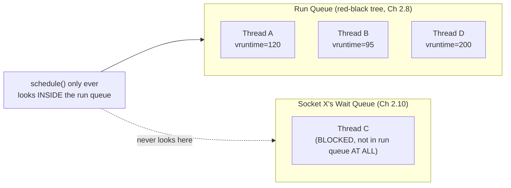

# PART 4 — Blocking I/O

## Chapter 4.3 — Thread Sleeps

### 🧠 One-Sentence Mental Model
> "The thread sleeps" means the scheduler's run queue (Chapter 2.8's red-black tree of runnable threads) no longer contains this thread at all — it isn't "waiting its turn," it has been entirely removed from consideration until something explicitly re-adds it via `wake_up()`.

### 🧒 Explain Like I'm Five
Imagine a classroom roll-call list the teacher uses to decide who to call on next. A "sleeping" student isn't quietly sitting in their seat waiting to be called — their name has been physically crossed off the roll-call list entirely. The teacher literally cannot call on them, not because they're being skipped, but because they're not on the list at all. Someone else has to physically add their name back before they can be called on again.

### 🌍 Real-World Analogy
A restaurant's active order queue only lists dishes currently being prepared or ready to serve — a dish that's "on hold" waiting for a special ingredient isn't sitting in that queue taking up a slot; it's moved to a separate holding area entirely, and only re-enters the active queue once the ingredient arrives. The chef (scheduler) never wastes a glance on held dishes while deciding what to cook next.

### ❓ The Problem
Chapter 4.2 named `schedule()` as step 4 of blocking, but didn't detail what "removed from the CPU" means structurally. This chapter makes precise what "sleeping" costs and doesn't cost the scheduler.

### 🔥 Why This Problem Matters
Understanding that a sleeping thread is *removed*, not merely deprioritized, explains why having thousands of blocked threads doesn't slow down scheduling decisions for the threads that ARE runnable — the run queue's size is exactly "currently runnable threads," never "all threads that exist." This is the precise mechanical reason blocking scales fine in *scheduler cost* even when it doesn't scale in *memory/thread-count* cost (Chapter 4.1's real limitation).

### 🕰 Historical Context
Early, primitive schedulers sometimes did scan a full process table including non-runnable entries, which is part of why old Unix systems showed measurable slowdowns as total process count grew, independent of how many were actually runnable. Modern schedulers (Linux's CFS, Chapter 2.8) deliberately maintain the run queue as a data structure containing ONLY runnable threads specifically to avoid this — an explicit design lesson learned from that history.

### 💡 The Naive Solution
Model "sleeping" as the thread just sitting in the run queue with some "please skip me" flag set, checked on every scheduling decision.

### ❌ Why the Naive Solution Fails
That would make every scheduling decision cost O(all threads that have ever been created), not O(runnable threads) — under high concurrency with mostly-idle connections (exactly the workload Part 8's epoll targets), this would be catastrophic, scaling with total connection count rather than active connection count.

### ✅ The Better Solution
Physically remove the `task_struct` from the run queue's data structure on block, and physically re-insert it only on `wake_up()` — exactly what Chapters 2.8 and 2.10 already built.

### 🧠 Core Concept
> **The run queue (Chapter 2.8's per-CPU red-black tree, ordered by vruntime) contains ONLY threads in the `TASK_RUNNING` state. Blocking removes a thread from this structure entirely; it is not "in the queue but skipped" — it is not present in the queue's data structure at all until re-inserted.**

### 📐 Deep Technical Explanation



**How to read this diagram:** Thread C physically does not exist inside the structure `schedule()` searches — it lives, for now, only as an entry on socket X's wait queue. This is the concrete reason a scheduling decision's cost depends only on the *number of currently runnable* threads (the size of the RQ box), completely independent of how many additional threads are parked in various wait queues elsewhere in the system.

**What "sleeping" costs, precisely:**
- **Memory:** the `task_struct` itself still exists (fixed-size kernel structure, Chapter 2.1) — sleeping doesn't free it, since it needs to be resumable.
- **Scheduler CPU time:** effectively zero — it's simply absent from every scheduling decision until re-inserted.
- **What it doesn't cost:** no polling, no periodic checking "is this one ready yet?" from the scheduler's side — that would defeat the entire purpose (this exact anti-pattern is what Chapter 5.6, busy polling, is built to warn against).

```cpp
// illustrative timing: measuring that a blocked thread costs ~0 scheduler time
#include <thread>
#include <chrono>
#include <iostream>

int main() {
    // spawn 1000 threads that immediately block forever on a condition variable
    std::mutex m;
    std::condition_variable cv;
    bool ready = false;

    std::vector<std::thread> sleepers;
    for (int i = 0; i < 1000; i++) {
        sleepers.emplace_back([&] {
            std::unique_lock<std::mutex> lock(m);
            cv.wait(lock, [&]{ return ready; });   // blocks -- removed from run queue
        });
    }

    // meanwhile, time how fast an UNRELATED runnable thread gets scheduled
    auto start = std::chrono::steady_clock::now();
    std::thread busy([]{ for (volatile int i = 0; i < 100000000; i++) {} });
    busy.join();
    auto elapsed = std::chrono::steady_clock::now() - start;
    std::cout << "busy thread finished in "
              << std::chrono::duration<double, std::milli>(elapsed).count()
              << " ms, DESPITE 1000 sleeping threads existing\n";

    { std::lock_guard<std::mutex> lock(m); ready = true; }
    cv.notify_all();
    for (auto& t : sleepers) t.join();
}
```

**Predict before running:** does the presence of 1000 sleeping threads meaningfully slow down the unrelated `busy` thread's execution time?

<details><summary>Click to reveal the answer</summary>

No — you should observe essentially the same timing as if those 1000 sleeping threads didn't exist at all (modulo small, fixed memory overhead for their `task_struct`s). This is the direct, measurable proof of this chapter's Core Concept: sleeping threads are absent from the run queue the scheduler actually searches, so their count doesn't factor into scheduling decision cost for runnable threads. (Real numbers vary by machine and OS load — the point is the *shape*: no growth with sleeper count, not a specific millisecond value.)
</details>

### ❌ Common Misconceptions
- ❌ **"Sleeping threads slow down the scheduler."** — They cost effectively zero scheduling-decision time precisely because they're absent from the run queue, not merely deprioritized within it.
- ❌ **"A sleeping thread's task_struct is freed."** — It persists (this is *why* it can be resumed later) — only its presence in the *run queue* structure is removed, not its existence.
- ❌ **"The scheduler periodically checks sleeping threads to see if they're ready."** — No polling happens from the scheduler's side at all; re-insertion is driven entirely by an explicit `wake_up()` call from whatever event makes the thread ready (Chapter 4.5).
- ❌ **"More sleeping threads = more RAM pressure on active workloads."** — A modest, fixed cost per `task_struct` exists, but it's small and constant per thread — the real limiting resource at high thread counts is usually stack memory and kernel scheduling *metadata* growth, not run-queue search cost.

### 🧙 Wizard Insight
This chapter's distinction — "removed from the queue" vs. "present but skipped" — is exactly why a server with 50,000 idle-but-connected clients (all blocked in `read()`) can still schedule its handful of actively-busy worker threads with zero measurable scheduling overhead from those 50,000 sleepers. The bottleneck at that scale, when it appears, is thread/stack memory and per-connection kernel bookkeeping — never scheduler search time. Knowing exactly which resource is and isn't affected is what separates a wizard's diagnosis from a guess.

### 🧠 Quiz
**Q1.** Is a blocked thread present in the run queue with a "skip me" flag, or absent from it entirely?
<details><summary>Answer</summary>Absent entirely -- it's removed from the run queue's data structure and only re-inserted on wake_up().</details>

**Q2.** Does the number of sleeping threads affect how long it takes the scheduler to pick the next runnable thread?
<details><summary>Answer</summary>No -- scheduling decision cost depends only on the number of currently RUNNABLE threads in the run queue, which sleeping threads are not part of.</details>

**Q3.** What DOES persist for a sleeping thread, and why must it?
<details><summary>Answer</summary>Its task_struct (including saved_ctx, the saved registers) persists, because it must be resumable later -- without it, there would be nothing to restore when the thread wakes up.</details>

### 📌 Short Notes (Quick Reference)
- "Sleeping" = physically removed from the scheduler's run queue (Ch 2.8's red-black tree), not present-but-skipped.
- Scheduling-decision cost scales with RUNNABLE thread count only — sleeping threads cost ~0 scheduler time, however many exist.
- The task_struct itself persists while sleeping (needed for resumption) — only its run-queue membership is removed.
- No polling happens from the scheduler's side while a thread sleeps — resumption is entirely event-driven via wake_up() (Ch 4.5).
- This is precisely why high idle-connection-count servers don't pay a scheduling tax for those idle connections — the real cost at scale is thread/stack memory, not scheduler search time.

### 🔗 What This Connects To Next
**Previous:** Part 4, Chapter 4.2 — What Does "Blocked" Actually Mean?
**Current:** Part 4, Chapter 4.3 — Thread Sleeps
**Next:** Part 4, Chapter 4.4 — Scheduler Interaction (what the scheduler does with the CPU core THIS thread just vacated — pick another ready thread, or truly idle)
