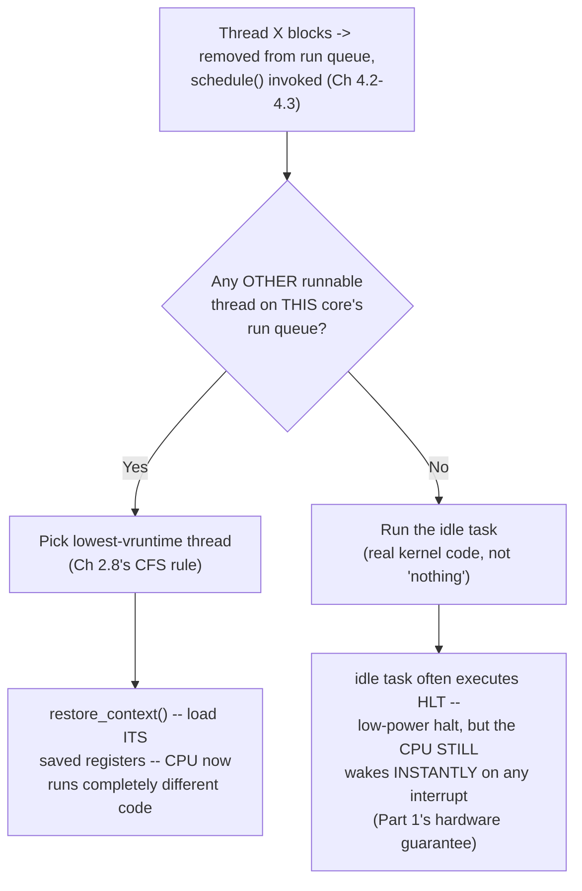

# PART 4 — Blocking I/O

## Chapter 4.4 — Scheduler Interaction

### 🧠 One-Sentence Mental Model
> The instant a thread blocks and vacates a CPU core, `schedule()` (Chapter 2.8's CFS picker) immediately looks for the runnable thread with the lowest `vruntime` on that core's run queue — and if there genuinely isn't one, the core runs the `idle` task, a real, ordinary piece of kernel code, not "nothing."

### 🧒 Explain Like I'm Five
When one cashier at a store finishes serving a customer who then walks away to think about a purchase (blocking), the cashier doesn't just stand frozen — they immediately look at the line and call the next waiting customer. If nobody's in line at all, the cashier doesn't disappear either; they do a real, specific "no customers right now" routine (restocking, standing at the ready) until someone new arrives.

### 🌍 Real-World Analogy
An air traffic controller handing off a runway the instant one plane taxis away: the very next queued plane is cleared immediately, using an explicit priority rule (who's been waiting longest, who's most urgent). If no plane is queued, the controller doesn't leave the tower — they run their well-defined "runway idle" checklist, a genuine task, not an absence of one.

### ❓ The Problem
Chapter 4.3 established that a blocking thread vanishes from the run queue. This chapter asks the immediate next question: what happens on that CPU core in the very next instant?

### 🔥 Why This Problem Matters
This is the entire payoff of the "let something else run while this thing waits" idea traced all the way back to Chapter 0.1's historical context — a core never sits wasted because of ONE thread's block, as long as there's other runnable work anywhere in the system. Getting this right is what makes a single machine able to serve many concurrent slow I/O operations using far fewer CPU cores than operations.

### 🕰 Historical Context
Before multiprogramming (Chapter 0.1), a blocked program genuinely did freeze the whole machine — there was nothing else registered as "also runnable" for the hardware to fall back to. The entire concept of a "run queue" containing multiple candidate threads is the direct historical answer to exactly this waste, first appearing in 1960s timesharing systems and refined ever since into today's CFS (Chapter 2.8).

### 💡 The Naive Solution
Have the CPU literally halt/freeze whenever the one thread it was running blocks, resuming only when that same thread becomes ready again.

### ❌ Why the Naive Solution Fails
This throws away every bit of Part 0-3's careful machinery — a CPU core sitting idle while OTHER runnable work exists elsewhere is exactly the waste multiprogramming was invented to eliminate; it would make blocking as costly as it was in pre-multiprogramming computers.

### ✅ The Better Solution
`schedule()` always checks for other runnable work FIRST, falling back to a genuine "idle" task only when nothing else is runnable anywhere on that core.

### 🧠 Core Concept
> **`schedule()`'s job, every single time it's invoked (whether from a block, a preemption, or a voluntary yield), is: look at this core's run queue, pick the thread with the lowest accumulated `vruntime` (Chapter 2.8's fairness metric), restore ITS saved context, and hand it the CPU. If the run queue is empty, run the `idle` task instead — genuine kernel code, often executing `HLT` (Part 1's exact instruction) to put the core into a low-power state, while STILL guaranteed to wake instantly on any interrupt.**

### 📐 Deep Technical Explanation

**How to read this diagram:** the left branch is the common, "happy path" case in a busy system — some other useful work almost always exists to fill the gap. The right branch is what a genuinely idle machine does, and it is worth internalizing precisely because it directly answers Part 1's "is the kernel ever truly asleep?" confusion: even the idle task is real, scheduled, ordinary code, and the CPU hardware's interrupt-checking (Chapter 1.8) works completely independently of whether idle or busy code happens to be running at any given moment.

**Why vruntime-lowest, specifically (tying back to Chapter 2.8):** CFS's whole design goal is fairness — a thread that has run the LEAST accumulated virtual time gets priority for the next slot, which is exactly why a thread that just spent a long time blocked (and thus accumulated zero additional vruntime while sleeping) tends to get scheduled promptly once it wakes — it "looks" like it deserves CPU time under the fairness metric, a small but real interaction between blocking and scheduling priority worth knowing.

**Multi-core nuance:** each CPU core typically has its own run queue (Chapter 2.8); a thread blocking on core 0 only triggers `schedule()` on core 0 — cores 1-N continue running whatever they were already running, completely unaffected. Load balancing across cores is a separate scheduler concern, not triggered directly by any single block/wake event.

### ❌ Common Misconceptions
- ❌ **"The CPU does nothing while idle."** — The idle task is genuine, scheduled kernel code — often executing `HLT` for power savings, but it is not an absence of execution, and it's guaranteed to be interrupted instantly by any pending hardware event.
- ❌ **"schedule() is only called when something blocks."** — It's also invoked on preemption (a time-slice expiring, Chapter 2.8) and voluntary yields — blocking is one of several distinct triggers for the same function.
- ❌ **"A blocked thread's core sits wasted until that specific thread wakes."** — Only true if there's truly no other runnable work anywhere on that core; in any moderately busy system, some other thread almost always fills the gap immediately.
- ❌ **"vruntime priority means a woken thread always jumps the queue."** — It gets a fairness *advantage* proportional to how little it's run recently, not an absolute override of every other consideration (real-time scheduling classes, Chapter 2.8, can still take precedence).

### 🧙 Wizard Insight
Watching CPU utilization sit near 0% on a machine that is, in fact, extremely busy serving thousands of blocked-on-I/O connections is not a paradox once this chapter's mechanism is internalized — it is the SUCCESS case working exactly as designed: cores fall back to the idle task the instant there's genuinely nothing runnable, and jump back out of it instantly the moment an interrupt (Part 1) makes something ready. A wizard reads "low CPU, high connection count, all healthy" as evidence the blocking/scheduling machinery is doing its job, not as a sign something's wrong.

### 🧠 Quiz
**Q1.** What does schedule() do first, immediately after a thread blocks and vacates a core?

Answer
It checks that core's run queue for other runnable threads and, if any exist, picks the one with the lowest vruntime and restores its context.

**Q2.** Is the "idle task" the absence of code execution?

Answer
No -- it's real, scheduled kernel code (often executing HLT for power savings) that runs specifically when nothing else is runnable, and it's still guaranteed to be interrupted instantly by any hardware event.

**Q3.** Does one thread blocking on core 0 affect scheduling on core 1?

Answer
Not directly -- each core typically has its own run queue, and a block/schedule() event on one core only affects that core's own scheduling decision.

### 📌 Short Notes (Quick Reference)
- schedule() runs immediately when a thread blocks (or preempts/yields) — it checks for OTHER runnable work on that core FIRST.
- Picks the lowest-vruntime runnable thread (CFS fairness, Ch 2.8) if one exists on that core's run queue.
- If none exists, runs the real "idle" task — often HLT, but genuine code, always instantly interruptible (Part 1's hardware guarantee).
- Each core generally has its own run queue — one thread blocking on core 0 doesn't affect scheduling on core 1.
- Low CPU utilization with many blocked connections is the SUCCESS case of this whole mechanism, not a red flag.

### 🔗 What This Connects To Next
**Previous:** Part 4, Chapter 4.3 — Thread Sleeps
**Current:** Part 4, Chapter 4.4 — Scheduler Interaction
**Next:** Part 4, Chapter 4.5 — Wakeup (the other half of the story: what actually makes a blocked thread eligible to be picked by schedule() again)
